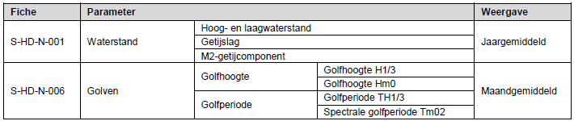
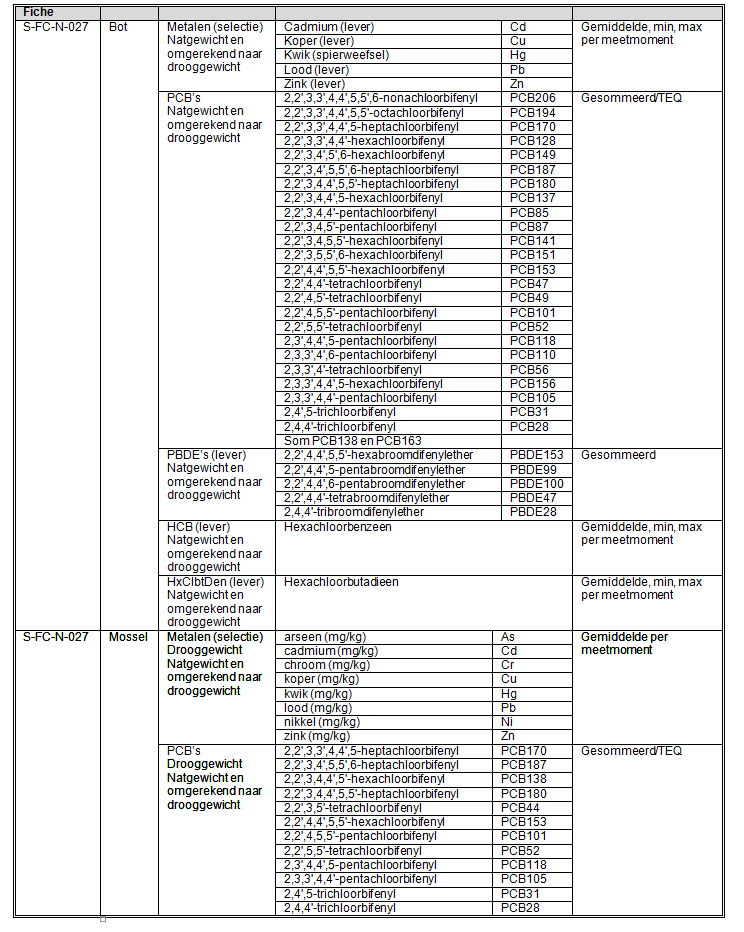

```{r setupBijlage, include=FALSE}

knitr::opts_chunk$set(
	out.width = "85%"
)
```

```{r}
# Load function to write Latex table structure to R 
source("R/tex2Rtable.R")

```

# References

<div id="refs"></div>

# (APPENDIX) Appendix {-} 

# Overzicht gebruikte data {#BijlageA-overzicht-data}

Alle gegevens in dit rapport is geleverd door Rijkswaterstaat aan Scheldemonitor. Voor de rapportage zijn alle gegevens via scripts uit de Scheldemonitor gehaald.  

## Gemeten data {#BijlageA-gemeten-data}

Deze rapportage bevat de beschikbare hydrodynamische, fysisch-chemische en biologische data in de periode 1996 - `r dataJaar` voor de Westerschelde en de monding. Bepaalde data wordt (al enige tijd) niet meer gemeten en opgenomen in de rapportage. Dit betreft:

* Continu meting; opgenomen in rapportages tot en met 2016
  + Eerstelijnsrapportage Westerschelde 2015
  + Eerstelijnsrapportage Westerschelde 2014
  + Eerstelijnsrapportage Westerschelde 2013
  + Eerstelijnsrapportage Westerschelde 2012

* Golfrichting; opgenomen in rapportages tot en met 2015
  + Eerstelijnsrapportage Westerschelde 2014
  + Eerstelijnsrapportage Westerschelde 2013
  + Eerstelijnsrapportage Westerschelde 2012
  + Eerstelijnsrapportage Westerschelde 2010

## Hydrodynamiek {#BijlageA-hydrodynamiek}

```{r bijlageAHydroFig}

```

## Fysisch-chemische parameters {#BijlageA-fysisch}

### Oppervlaktewater (compartiment 10) {#BijlageA-fysisch-oppwater}

```{r bijlageAFysischOppwaterFig}
knitr::include_graphics("Figuren/Tabellen/water.png")
```

### Zwevend stof (compartiment 50) {#BijlageA-fysisch-zwevend}

```{r bijlageAFysischZwevendFig}
knitr::include_graphics("Figuren/Tabellen/zwevend.png")
```

### Bodem (compartiment 40) {#BijlageA-fysisch-bodem}

```{r bijlageAFysischBodemFig}
knitr::include_graphics("Figuren/Tabellen/bodem.png")
```

### Biota (compartiment 60) {#BijlageA-fysisch-biota}

```{r bijlageAFysischBiotaFig}

```

# Meetdichtheidmatrices {#BijlageB-meetdichtheid}

## Oppervlaktewater {#BijlageB-meetdichtheid-oppwater}

### Schaar van Ouden Doel {#BijlageB-meetdichtheid-oppwater-schaar}

```{r meetdichtheidOppwaterSchaar}
dt <- tex2dt("Figuren/Meetdichtheid/schaar_opp.tex")
kableExtra::kbl(dt, col.names = c("Parameter","08","09","10","11","12","13","14","15","16","17","18","19"),
             caption = "Meetdichtheidsmatrices voor metingen in het oppervlaktewater bij Schaar van Ouden Doel met hierin  het aantal metingen per parameter en per jaar.") %>%
   kableExtra::kable_styling(latex_options = "scale_down")
```

### Hansweert geul {#BijlageB-meetdichtheid-oppwater-hansweertgeul}

```{r meetdichtheidOppwaterHans}
dt <- tex2dt("Figuren/Meetdichtheid/hans_opp.tex")
kableExtra::kbl(dt, col.names = c("Parameter","08","09","10","11","12","13","14","15","16","17","18","19"),
             caption = "Meetdichtheidsmatrices voor metingen in het oppervlaktewater bij Hansweert geul met hierin  het aantal metingen per parameter en per jaar.") %>%
   kableExtra::kable_styling(latex_options = "scale_down")
```

### Terneuzen boei 20 {#BijlageB-meetdichtheid-oppwater-terneuzen}

```{r meetdichtheidOppwaterTerneuzen}
dt <- tex2dt("Figuren/Meetdichtheid/tern_opp.tex")
kableExtra::kbl(dt, col.names = c("Parameter","08","09","10","11","12","13","14","15","16","17","18","19"),
             caption = "Meetdichtheidsmatrices voor metingen in het oppervlaktewater bij Terneuzen boei 20 met hierin  het aantal metingen per parameter en per jaar.") %>%
   kableExtra::kable_styling(latex_options = "scale_down")
```

### Vlissingen boei SSVH {#BijlageB-meetdichtheid-oppwater-vlissingen}


```{r meetdichtheidOppwaterVlissingen}
dt <- tex2dt("Figuren/Meetdichtheid/vlis_opp.tex")
kableExtra::kbl(dt, col.names = c("Parameter","08","09","10","11","12","13","14","15","16","17","18","19"),
             caption = "Meetdichtheidsmatrices voor metingen in het oppervlaktewater bij Vlissingen boei SSVH met hierin  het aantal metingen per parameter en per jaar.") %>%
   kableExtra::kable_styling(latex_options = "scale_down")
```

### Walcheren 2 km uit de kust {#BijlageB-meetdichtheid-oppwater-walcheren2km}

```{r meetdichtheidOppwaterWal2km}
dt <- tex2dt("Figuren/Meetdichtheid/w2_opp.tex")
kableExtra::kbl(dt, col.names = c("Parameter","08","09","10","11","12","13","14","15","16","17","18","19"),
             caption = "Meetdichtheidsmatrices voor metingen in het oppervlaktewater bij Walcheren 2 km uit de kust met hierin  het aantal metingen per parameter en per jaar.") %>%
   kableExtra::kable_styling(latex_options = "scale_down")
```

### Walcheren 20 km uit de kust {#BijlageB-meetdichtheid-oppwater-walcheren20km}

```{r meetdichtheidOppwaterWal20km}
dt <- tex2dt("Figuren/Meetdichtheid/w20_opp.tex")
kableExtra::kbl(dt, col.names = c("Parameter","08","09","10","11","12","13","14","15","16","17","18","19"),
             caption = "Meetdichtheidsmatrices voor metingen in het oppervlaktewater bij Walcheren 20 km uit de kust met hierin  het aantal metingen per parameter en per jaar.") %>%
   kableExtra::kable_styling(latex_options = "scale_down")
```

## Zwevende stof {#BijlageB-meetdichtheid-zwevend}

### Schaar van Ouden Doel {#BijlageB-meetdichtheid-zwevend-schaar}

```{r meetdichtheidZwevendSchaar}
dt <- tex2dt("Figuren/Meetdichtheid/schaar_zwevend.tex")
kableExtra::kbl(dt, col.names = c("Parameter","08","09","10","11","12","13","14","15","16","17","18","19"),
             caption = "Meetdichtheidsmatrices voor metingen in het zwevende stof bij Schaar van Ouden Doel met hierin  het aantal metingen per parameter en per jaar.") %>%
   kableExtra::kable_styling(latex_options = "scale_down")
```

### Vlissingen boei SSVH {#BijlageB-meetdichtheid-zwevend-vlissingen}

```{r meetdichtheidZwevendVlissingen}
dt <- tex2dt("Figuren/Meetdichtheid/vlis_zwevend.tex")
kableExtra::kbl(dt, col.names = c("Parameter","08","09","10","11","12","13","14","15","16","17","18","19"),
             caption = "Meetdichtheidsmatrices voor metingen in het zwevende stof bij Vlissingen boei SSVH met hierin  het aantal metingen per parameter en per jaar.") %>%
   kableExtra::kable_styling(latex_options = "scale_down")
```

## Biota {#BijlageB-meetdichtheid-biota}

### Bot {#BijlageB-meetdichtheid-biota-bot}

```{r meetdichtheidBiotaBot}
dt <- tex2dt("Figuren/Meetdichtheid/bot.tex")
kableExtra::kbl(dt, col.names = c("Parameter","08","09","10","11","12","13","14","15","16","17","18","19"),
             caption = "Meetdichtheidsmatrices voor metingen biota bot bij Middelgat met hierin het aantal metingen per parameter en per jaar.") %>%
   kableExtra::kable_styling(latex_options = "scale_down")
```

### Mosselen {#BijlageB-meetdichtheid-biota-mossel}

#### Metaal - natgewicht {#BijlageB-meetdichtheid-biota-mossel-metaal-nat}

```{r meetdichtheidBiotaMosselMetaal1a}
dt <- tex2dt("Figuren/Meetdichtheid/metaal_1a.tex")
kableExtra::kbl(dt, col.names = c("Parameter","08","09","10","11","12","13","14","15","16","17","18","19"),
             caption = "Meetdichtheidsmatrices voor metingen biota mosselen metaal bij Hoedekenskerke boei 4 met hierin het aantal metingen per parameter en per jaar.") %>%
   kableExtra::kable_styling(latex_options = "scale_down")
```

```{r meetdichtheidBiotaMosselMetaal2a}
dt <- tex2dt("Figuren/Meetdichtheid/metaal_2a.tex")
kableExtra::kbl(dt, col.names = c("Parameter","08","09","10","11","12","13","14","15","16","17","18","19"),
             caption = "Meetdichtheidsmatrices voor metingen biota mosselen metaal bij Hooge Platen met hierin het aantal metingen per parameter en per jaar.") %>%
   kableExtra::kable_styling(latex_options = "scale_down")
```

```{r meetdichtheidBiotaMosselMetaal3a}
dt <- tex2dt("Figuren/Meetdichtheid/metaal_3a.tex")
kableExtra::kbl(dt, col.names = c("Parameter","08","09","10","11","12","13","14","15","16","17","18","19"),
             caption = "Meetdichtheidsmatrices voor metingen biota mosselen metaal bij Knuitershoek met hierin het aantal metingen per parameter en per jaar.") %>%
   kableExtra::kable_styling(latex_options = "scale_down")
```

#### Metaal - drooggewicht {#BijlageB-meetdichtheid-biota-mossel-metaal-droog}


```{r meetdichtheidBiotaMosselMetaal1b}
dt <- tex2dt("Figuren/Meetdichtheid/metaal_1b.tex")
kableExtra::kbl(dt, col.names = c("Parameter","08","09","10","11","12","13","14","15","16","17","18","19"),
             caption = "Meetdichtheidsmatrices voor metingen biota mosselen metaal bij Hansweert boei OHMG met hierin het aantal metingen per parameter en per jaar.") %>%
   kableExtra::kable_styling(latex_options = "scale_down")
```

```{r meetdichtheidBiotaMosselMetaal2b}
dt <- tex2dt("Figuren/Meetdichtheid/metaal_2b.tex")
kableExtra::kbl(dt, col.names = c("Parameter","08","09","10","11","12","13","14","15","16","17","18","19"),
             caption = "Meetdichtheidsmatrices voor metingen biota mosselen metaal bij Vlissingen boei SSVH met hierin het aantal metingen per parameter en per jaar.") %>%
   kableExtra::kable_styling(latex_options = "scale_down")
```

#### PAK en PCB - drooggewicht {#BijlageB-meetdichtheid-biota-mossel-PAK-PCB-droog}

```{r meetdichtheidBiotaMosselPCBdroog1}
dt <- tex2dt("Figuren/Meetdichtheid/droog_1.tex")
kableExtra::kbl(dt, col.names = c("Parameter","08","09","10","11","12","13","14","15","16","17","18","19"),
             caption = "Meetdichtheidsmatrices voor metingen biota mosselen PAK en PCB bij Hansweert boei OHMG met hierin het aantal metingen per parameter en per jaar.") %>%
   kableExtra::kable_styling(latex_options = "scale_down")
```

```{r meetdichtheidBiotaMosselPCBdroog2}
dt <- tex2dt("Figuren/Meetdichtheid/droog_2.tex")
kableExtra::kbl(dt, col.names = c("Parameter","08","09","10","11","12","13","14","15","16","17","18","19"),
             caption = "Meetdichtheidsmatrices voor metingen biota mosselen PAK en PCB bij Vlissingen boei SSVH met hierin het aantal metingen per parameter en per jaar.") %>%
   kableExtra::kable_styling(latex_options = "scale_down")
```

#### PAK en PCB - natgewicht {#BijlageB-meetdichtheid-biota-mossel-PAK-PCB-nat}

```{r meetdichtheidBiotaMosselPCBnat1}
dt <- tex2dt("Figuren/Meetdichtheid/nat_1.tex")
kableExtra::kbl(dt, col.names = c("Parameter","08","09","10","11","12","13","14","15","16","17","18","19"),
             caption = "Meetdichtheidsmatrices voor metingen biota mosselen PCB en PBDEs bij Knuitershoek met hierin het aantal metingen per parameter en per jaar.") %>%
   kableExtra::kable_styling(latex_options = "scale_down")
```

#### Overige {#BijlageB-meetdichtheid-biota-mossel-overig}

```{r meetdichtheidBiotaMosseloverig}
dt <- tex2dt("Figuren/Meetdichtheid/overige_1.tex")
kableExtra::kbl(dt, col.names = c("Parameter","08","09","10","11","12","13","14","15","16","17","18","19"),
             caption = "Meetdichtheidsmatrices voor metingen biota mosselen overige bij Knuitershoek met hierin het aantal metingen per parameter en per jaar.") %>%
   kableExtra::kable_styling(latex_options = "scale_down")
```

# Indeling fytoplankton {#BijlageC-fytoplankton}

```{r indelingFytoplanktonBijlage}
dt <- tex2dt("Figuren/Tabellen/fytoplankton.tex")
kableExtra::kbl(dt, col.names = c("Naam","Code","BTX","AphiaID","Trofie","Groep"),
             caption = "Indeling van fytoplankton in trofies en groepen.") %>%
   kableExtra::kable_styling(latex_options = "scale_down")
```

