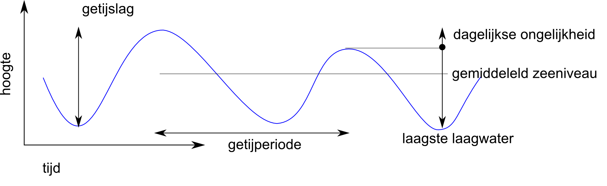
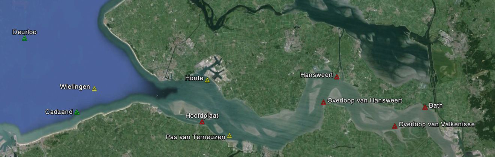
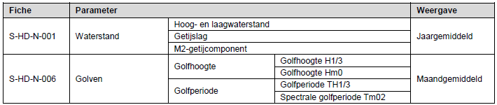
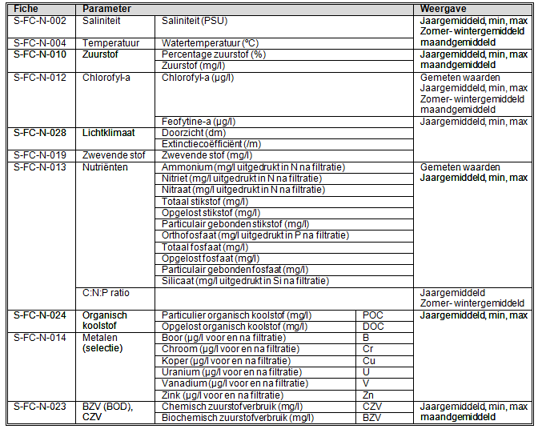
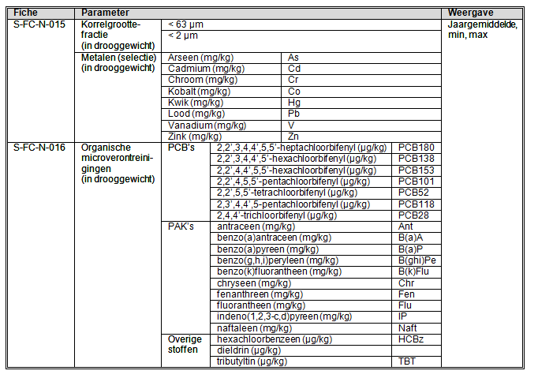
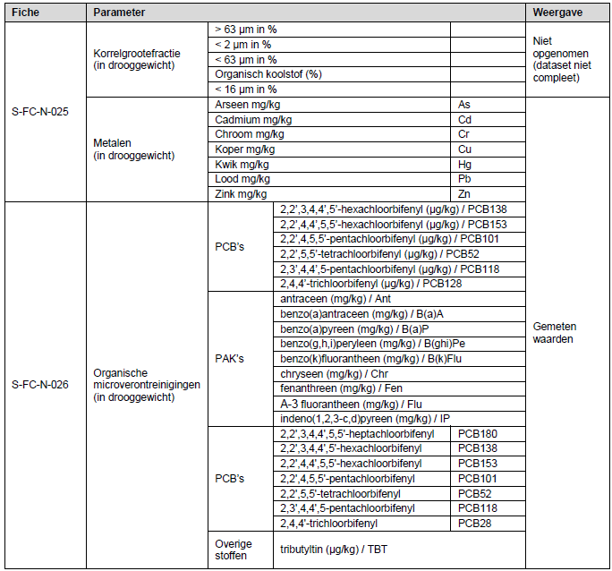
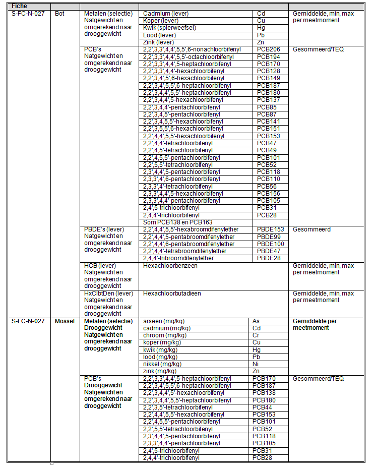

```{r include=FALSE, cache=FALSE}
# example R options set globally
options(width = 60)

source("r/functions.R")
library(smwfs)

rapportversie = "draft"

# year for reporting (last data year)
dataJaar <- 2022

# path to frozen datafiles (downloads from Scheldemonitor that are assoiated with report version)
localDatapath <- "" # local

# saving path only works from within Deltares. Saved files come available via datapath. 
datapath <- file.path("https://watersysteemdata.deltares.nl/thredds/fileServer/watersysteemdata/Westerschelde/Scheldemonitor", dataJaar + 1)
savepath <- file.path("p:/11202493--systeemrap-grevelingen/1_data/", "Westerschelde/Scheldemonitor", dataJaar + 1)
# chunk options set globally

knitr::opts_chunk$set(
  comment = "#>",
  collapse = TRUE,
  echo = FALSE,
  message = FALSE,
  warning = FALSE,
  out.width = "100%",
  fig.align='center',
  fig.width = 7,
  cache = FALSE
)

options(bookdown.render.verbose = TRUE)

screenshot.opts= list(delay = 5)

select <- dplyr::select
addLegend <- leaflet::addLegend


# bibliographybib <- bibtex::read.bib("bib/library.bib")

# bibliographybib2 <- bibtex::read.bib("bib/westerscheldewillem.bib")
# bibliographybib2 <- bibtex::read.bib("bib/westerscheldewillem.bib")

```

# Voorwoord {.unnumbered}

```{r, message=FALSE, warning=FALSE, include=FALSE}
# options(tinytex.verbose = TRUE)
knitr::opts_chunk$set(echo = FALSE,	message = FALSE, warning = FALSE)

```

<!-- De informatie op deze website is op dit moment onder constructie en bedoeld voor een beperkt publiek. Niets van deze website mag worden gebruikt door derden. -->

<!-- This website is under construction. Nothing from this website may be used. -->

Deze eerstelijnsrapportage is gemaakt door Deltares in opdracht van Rijkswaterstaat voor de Vlaams Nederlandse Scheldecommissie (VNSC) en bevat gegevens die in opdracht van Rijkswaterstaat zijn verzameld in het kader van het MWTL programma t/m `r dataJaar`. Het verwerken, analyseren en toevoegen van de gegevens uit `r dataJaar` in dit rapport is gedaan door dr. W. Stolte en J. Rienstra. Aan eerdere rapportages (vanaf 2010) hebben vele anderen gewerkt. De voorliggende rapportage is opgebouwd met scripts vanuit de gegevens in Scheldemonitor.

<!-- ```{asis, echo = knitr::is_html_output()} -->

## Samenvatting {.unnumbered}

Deze rapportage is opgemaakt met door RWS in de Scheldemonitor beschikbaar gemaakte hydrodynamische, fysisch-chemische en biologische gegevens (alleen fytoplankton). De rapportage gaat over gegevens verzameld in de periode 1996 tot en met `r dataJaar` voor de Westerschelde en de monding. De gegevens zijn verkregen in het kader van de Nederlandse MWTL monitoring. Het is een eerste weergave van de beschikbare data en heeft als doel om enkel te beschrijven ‘wat men in de meetresultaten ziet’. Het bevat een korte interpretatie van de gegevens op basis van een eenvoudige analyse. 

De rapportage is opgesteld in het kader van de OntwikkelingsSchets 2010 en vormt een van de bouwstenen voor de vergunningverlening van de derde verdieping van het Schelde-estuarium. 

De verdere duiding van deze en Vlaamse gegevens wordt gedaan in de 6-jarige cyclus van analyse- en eveluatierapportage, de zogenaamde T-rapportages. Aangezien deze analyse- en evaluaties een vastgestelde methodiek volgen van waaruit verdere gevolgtrekkingen wordt gedaan, wordt in deze eerstelijnsrapportage verder geen duiding gegeven aan de resultaten. 

<!-- ``` -->


## Versie {.unnumbered #rapportversie}

```{asis, echo = rapportversie == "draft"}
Deze rapportage is een conceptversie. Niets mag geciteerd worden zonder toestemming van de makers.  
```

Eerstelijnsrapportages worden elk jaar gemaakt. Hieronder is informatie over de datum van deze rapportage, en tot welk jaar de gegevens zijn verwerkt. 

```{asis, echo = knitr::is_html_output()}
Dit is de webversie van de eerstelijnsrapportage. De webversie kan in details afwijken van de eens per jaar geproduceerde rapportage die als pdf beschikbaar is op [Scheldemonitor](https://www.scheldemonitor.org/nl). 
```


* Eindversie 22-02-2023: bevat data t/m `r dataJaar`, missend in deze versie is:
  + Hoog en laagwaterstanden 2022 ontbreken nog


<!--chapter:end:index.Rmd-->

```{r include=FALSE, cache=FALSE}
# example R options set globally
options(width = 60)

source("r/functions.R")
library(smwfs)

rapportversie = "draft"

# year for reporting (last data year)
dataJaar <- 2022

# path to frozen datafiles (downloads from Scheldemonitor that are assoiated with report version)
localDatapath <- "" # local

# saving path only works from within Deltares. Saved files come available via datapath. 
datapath <- file.path("https://watersysteemdata.deltares.nl/thredds/fileServer/watersysteemdata/Westerschelde/Scheldemonitor", dataJaar + 1)
savepath <- file.path("p:/11202493--systeemrap-grevelingen/1_data/", "Westerschelde/Scheldemonitor", dataJaar + 1)
# chunk options set globally

knitr::opts_chunk$set(
  comment = "#>",
  collapse = TRUE,
  echo = FALSE,
  message = FALSE,
  warning = FALSE,
  out.width = "100%",
  fig.align='center',
  fig.width = 7,
  cache = FALSE
)

options(bookdown.render.verbose = TRUE)

screenshot.opts= list(delay = 5)

select <- dplyr::select
addLegend <- leaflet::addLegend


# bibliographybib <- bibtex::read.bib("bib/library.bib")

# bibliographybib2 <- bibtex::read.bib("bib/westerscheldewillem.bib")
# bibliographybib2 <- bibtex::read.bib("bib/westerscheldewillem.bib")

```
<!-- TO DO:
- add table missing data
-->

```{r setupInleiding, include=FALSE}

require(smwfs)
require(tidyverse)
require(lubridate)
require(sf)
require(leaflet)

```

```{r}

# Set year for use in the report

```

# Inleiding {#inleiding}

## Achtergrond {#achtergrond}

De projecten die in het kader van de OntwikkelingsSchets 2010 (OS2010) zijn uitgevoerd hebben als doel verschillende veranderingen in het Schelde-estuarium te bewerkstelligen. Het betreft verruiming van de vaargeul, aanleg van gebieden met gedempt getij en ontpolderingen. Het doel van deze projecten is verbetering van de toegankelijkheid (scheepvaart), vergroting van de veiligheid tegen overstromingen en verbetering van de natuurwaarde en natuurlijkheid van het systeem.

Deze projecten kunnen ook niet+gewenste neveneffecten hebben op het functioneren van het estuarium. De resultaten van deze projecten worden gemonitord via geïntegreerde systeemmonitoring. Naast OS2010 zijn er nog andere programma’s die invloed hebben op de kwaliteiten van het systeem, zoals maatregelen ten behoeve van de Kaderrichtlijn Water (KRW) en emissievergunningen (e.g. de rioolwaterzuiveringen in Vlaanderen). 

Voor de monitoring en de ontwikkelingen rond de derde verruiming in het kader van de Ontwikkelingsschets 2010 (OS2010) dienen gevalideerde gegevens en gegevensrapporten geleverd te worden. Deze gegevensrapportage betreft de zogenaamde eerstelijnsrapportage van de monitoring van de Westerschelde en de monding. Elk jaar wordt er een nieuwe eerstelijnsrapportage opgeleverd (@ELR2010, @ELR2011, @ELR2012, @ELR2013, @ELR2014, @ELR2015, @ERL2016, @ERL2017). Dit is de negende eerstelijnsrapportage. 

## Doelstelling {#doelstelling}

De eerstelijnsrapportage is een eerste weergave van de beschikbare gegevens uit de Nederlandse monitoring in de Westerschelde en de monding en beschrijft enkel ‘wat men in de meetresultaten ziet’. Het bevat een interpretatie van de gegevens op basis van een eenvoudige analyse. Er worden geen oorzaak-gevolg relaties geanalyseerd. 

## Verwerkte gegevens

In deze eerstelijnsrapportage zijn gegevens die gemeten zijn in de periode 1996 t/m `r dataJaar` voor de Westerschelde en de monding weergegeven. De gegevens zijn opgedeeld in drie hoofdgroepen: hydrodynamische, fysisch-chemische en biologische variabelen. Niet alle beschikbare variabelen in deze groepen zijn weergegeven, maar er is in overleg met RWS-WVL een selectie gemaakt. Er zijn hierbij variabelen geselecteerd die nog niet in een ander kader gerapporteerd worden en die belangrijk zijn voor het functioneren van het estuarium.

Naast deze gegevensrapportage worden er aparte rapportages uitgevoerd voor o.a. macrofauna, vissen, kustbroedvogels, hoogwatervogeltellingen en zeehonden. Daarnaast worden enkele variabelen uitgewerkt door andere instanties. Dit geldt o.a. voor de geomorfologie, primaire productie en vegetatie-ecotopenkaarten. Deze gegevens zijn daarom niet in deze rapportage opgenomen.

Een groot aantal van de fysisch-chemische en biologische variabelen in de Westerschelde wordt gemeten in het kader van de  ‘Monitoring Waterstaatkundige Toestand des Lands' (i.e. MWTL). Deze variabelen kennen de volgende onderverdeling: oppervlaktewater (compartiment 10), zwevende stof (compartiment 50), bodem (compartiment 40; iedere 3 jaar gemeten) en biota (compartiment 60).

Bodemgegevens worden iedere 3 jaar gemeten en gerapporteerd.  De meest recente bodemgegevens komen uit 2019, en zijn opgenomen in deze Eerstelijnsrapportage. 

Daarnaast zijn er enkele variabelen die voorheen wel werden gemeten en nu niet meer. Tot en met 2015 werden er continu metingen uitgevoerd om saliniteit, temperatuur, zuurstofgehalte, troebelheid, lichtstraling en fluorescentie te bepalen. Sinds 2016 zijn deze niet meer gemeten. Golfrichting is tot en met 2014 gemeten en gerapporteerd. Daarna zijn deze metingen niet meer uitgevoerd. Een overzicht is te vinden in bijlage \@ref(BijlageA-overzicht-data).

Om de gegevens inzichtelijker te maken zijn voor veel variabelen de parameters mediaan, 90-percentiel en 10-percentiel geschat Wanneer er wordt gesproken over een mediane waarde tijdens de zomer- en winterperiode wordt respectievelijk gesproken over april tot en met september en oktober tot en met maart. Daarnaast is de trend en bijhorende p-waarde berekend. De p-waarde ($p$) vervangt de correlatiecoëfficiënt ($R$) die in de Eerstelijnsrapportage 2015 werd gepresenteerd. De p-waarde is de kans dat de gevonden trend op toeval berust. Dit wordt ook wel de significantie van de correlatie genoemd. De correlatie wordt over het algemeen significant gevonden bij $p \leq 0.05$. 

Het schatten van deze parameters (i.e. medianen, trend en p) is altijd gedaan vanaf 2000 zodat deze niet direct worden beïnvloedt door de tweede verruiming in 1997-1998. De trend wordt weergegeven in een eenheid per jaar en kan zowel negatief (-) als positief zijn (+).
<!-- Indien er een significante correlatie is geconstateerd, worden de trend en correlatiecoëfficiënt dikgedrukt weergegeven in de tabel. -->

In de figuren met een kaart wordt gebruik gemaakt van coördinaten in het stelsel van de Rijksdriehoeksmeting of kortweg Rijksdriehoekscoördinaten (ook wel: RD-coördinaten of EPSG:28992). Hierdoor staat er op de x-as de afkorting RDx [m] en op de y-as RDy [m]. Dit betekent de respectievelijke x- en y-as uitgezet in meters in Rijksdriehoekscoördinaten.

### Ontbrekende gegevens {#ontbrekende-data}

Bij het samenstellen van deze rapportage is ook gelet op compleetheid van gegevens. In bijlage \@ref:BijlageB-meetdichtheid is in zogenaamde meetdichtheidsmatrices weergegeven welke gegevens uit de Scheldemonitor zijn gehaald. In Tabel \@ref(tab:missingDatatab) staat een overzicht van de ontbrekende gegevens. Het ontbreken van gegevens kan de resultaten beïnvloeden, vooral als er gemiddelden uit berekend worden. In voorkomende gevallen is een opmerking bij de figuur toegevoegd.


```{r missingDatatab}

tribble(
~parameter,  ~stations, ~jaar,
"Waterhoogte", "alle stations", "2022",
) %>%
  knitr::kable(caption = "Gegevens die wel verwacht werden, maar niet via Scheldemonitor gedownloadt konden worden.")


```

## Leeswijzer

Hoofdstuk \@ref(hydro) beschrijft de hydrodynamiek. Op een groot aantal stations in de Westerschelde, de monding en de Noordzee worden hoog- en laagwaterstanden gepresenteerd over de periode 1950 tot heden. Ook de getijslag en de M2, M4 en S2-componenten van het getij worden weergegeven. Voor de golven wordt de golfhoogte en golfperiode getoond op meerdere stations in de Westerschelde en de monding. Voor een tweetal stations (Cadzand en Deurloo) in de monding wordt ook de golfrichting weergegeven. 
<!-- % update: ontbrekende data! -->

Hoofdstuk \@ref(fysisch-oppwater) beschrijft de fysisch-chemische variabelen die gemeten zijn in het oppervlaktewater in het kader van MWTL (Monitoring Waterstaatskundige Toestand des Lands) vaartochten. 
<!-- % update: ontbrekende data! -->

Hoofdstuk \@ref(zwevend-stof) beschrijft de fysisch-chemische monitoring in het zwevende stof. Zwevende stof wordt ook in het kader van MWTL-vaartochten gemeten. De data wordt gepresenteerd voor twee stations te weten Vlissingen boei SSVH en Schaar van Ouden Doel.
<!-- % update: ontbrekende data! -->

Hoofdstuk \@ref(bodem) beschrijft de driejaarlijkse fysisch-chemische monitoring van de bodem in het kader van MWTL. Dit hoofdstuk wordt elke drie jaar geactualiseerd met nieuwe gegevens. De laatste bodemmonsters zijn genomen in `r dataJaar` en geanalyseerd in het laboratorium. De resultaten van deze fysisch-chemische monitoring in de bodem zijn opgenomen in dit hoofdstuk.
<!-- % update: ontbrekende data! -->

Het hoofdstuk over verontreinigingen in biota (MWTL) is dit jaar niet opgenomen. De reden is dat er op dit moment niet genoeg gegevens voorhanden zijn in de Scheldemonitor om dit hoofdstuk op een goede manier op te nemen. De bedoeling is om deze gegevens in volgende rapportages weer mee te nemen. 

<!-- % Hoofdstuk \@ref(biota) betreft de biota. Voor de biota zijn de metingen in bot (*Platichthys flesus*) en mossel (*Mytilus edulis*) opgenomen. Het monitoringsplan is in 2000 aangepast waarbij er bij twee stations in plaats van drie stations in de Westerschelde biota verzameld worden.  -->
<!-- % update: ontbrekende data! -->

De resultaten van fytoplankton zijn opgenomen in Hoofdstuk \@ref(fytoplankton). Fytoplankton wordt bepaald in het kader van het MWTL programma bij vijf stations in de Westerschelde sinds 1996. Hoofstuk \@ref(fytoplankton) en Bijlage \@ref(BijlageC-fytoplankton) geven een overzicht van de gehanteerde indeling.

<!--chapter:end:01_inleiding.Rmd-->

```{r include=FALSE, cache=FALSE}
# example R options set globally
options(width = 60)

source("r/functions.R")
library(smwfs)

rapportversie = "draft"

# year for reporting (last data year)
dataJaar <- 2022

# path to frozen datafiles (downloads from Scheldemonitor that are assoiated with report version)
localDatapath <- "" # local

# saving path only works from within Deltares. Saved files come available via datapath. 
datapath <- file.path("https://watersysteemdata.deltares.nl/thredds/fileServer/watersysteemdata/Westerschelde/Scheldemonitor", dataJaar + 1)
savepath <- file.path("p:/11202493--systeemrap-grevelingen/1_data/", "Westerschelde/Scheldemonitor", dataJaar + 1)
# chunk options set globally

knitr::opts_chunk$set(
  comment = "#>",
  collapse = TRUE,
  echo = FALSE,
  message = FALSE,
  warning = FALSE,
  out.width = "100%",
  fig.align='center',
  fig.width = 7,
  cache = FALSE
)

options(bookdown.render.verbose = TRUE)

screenshot.opts= list(delay = 5)

select <- dplyr::select
addLegend <- leaflet::addLegend


# bibliographybib <- bibtex::read.bib("bib/library.bib")

# bibliographybib2 <- bibtex::read.bib("bib/westerscheldewillem.bib")
# bibliographybib2 <- bibtex::read.bib("bib/westerscheldewillem.bib")

```


```{r setupHydro, include=FALSE}

require(smwfs)
require(tidyverse)
require(lubridate)
require(sf)
require(viridis)
require(plotly)

source("r/functions.R")

refreshWaterstanden = FALSE
refreshGolven = FALSE

```

```{r downloadHydro, include = T}

frozendatapath <- file.path(datapath, paste0("Data_Hydro_waterstanden_all_", ".csv"))

# this step can at the moment only be done at Deltares because of access to the fileserver. 
if(refreshWaterstanden){
  source("r/refresh_data.R")
  refresh_waterstanden(datajaar = dataJaar)
} 

trendstations <- c("Europlatform","Vlakte van de Raan","Cadzand","Westkapelle","Breskens Veerhaven","Vlissingen","Gat van Borssele","Overloop van Hansweert", "Terneuzen", "Hansweert", "Walsoorden", "Baalhoek", "Schaar van de Noord", "Bath")

df_waterstanden <- read_delim(frozendatapath, delim = ",", guess_max = 200000) %>%
  mutate(stationname = ifelse(
    stationname == "Euro Platform", "Europlatform", stationname)
  ) %>%
  filter(stationname %in% trendstations) %>%
  mutate(stationname = factor(stationname, levels = trendstations)) #%>%
  # repair_limits() #%>%
  # group_by(parametername, stationname) #%>%
  # mutate(across(value, remove_outliers))
```

# Hydrodynamiek {#hydro}

Dit hoofdstuk betreft metingen van de waterbeweging in de Westerschelde en de monding. De rapportage wordt hierbij beperkt tot waterstanden en golven. De waterstanden zijn opgenomen als jaargemiddelde hoog- en laagwaterstanden en de gemiddelde getijslag. Daarnaast zijn de belangrijkste componenten van het getij (M2, S2 en M4-component) weergegeven. Voor golven worden maandgemiddelden en -maxima van de golfhoogte en -periode gepresenteerd.

## Waterstanden {#waterstanden}

(ref:getijgolf) Weergave van een getijgolf met aanduiding hoogwater, laagwater, getijslag en dagelijkse ongelijkheid op basis van @VanRijn1994a.

```{r getijgolf, fig.cap='(ref:getijgolf)'}

```

De waterstanden in de Westerschelde worden voor het grootste deel bepaald door het getij. Het getij ontstaat door de aantrekkende kracht van de maan en de zon op de aarde. De variaties in het getij ontstaan door de draaiing van de aarde en de positie van de aarde t.o.v. de maan en de zon en doordat de maan en de aarde zich in een baan rond de zon bewegen. Daarnaast wordt het getij vervormd door de bodemligging van zeeën en oceanen. Wiskundig gezien is het getij een combinatie van een groot aantal sinusvormige golven: de getijcomponenten. De hoofdcomponent van het getij is de M2-component, die wordt veroorzaakt door de aantrekkingskracht van de maan op de aarde en een periode heeft van ongeveer 12 uur en 25 minuten. De S2 component is een soortgelijke component (een periode van ongeveer 12 uur) maar is gegenereerd door de aantrekkingskracht van de zon op de aarde. De S2-component is samen met M2 verantwoordelijk voor de springtij-doodtij variatie. Hogere harmonische getijcomponenten (zoals M4) worden vaak als 'overtides' aangeduid. M4 is het eerste overtide en is gegenereerd door eerste orde niet-lineaire processen. M4 is de eerste hogere harmonische component en is samen met M2 van belang voor sedimenttransport. De belangrijkste periodieke variaties in het getij zorgen voor de zogeheten dagelijkse ongelijkheid (Figuur \@ref(fig:getijgolf)), de springtij-doodtij cyclus en de 18,6-jarige cyclus. De 18,6-jarige cyclus wordt veroorzaakt door de afwijking van het baanvlak van de maan ten opzichte van het baanvlak van de aarde (de knopen- of drakencyclus). De invloed van de knopencyclus is sinus-vormig en geeft een verhoging of verlaging van de zeespiegel in een willekeurig jaar van maximaal 13 mm. De langjarige trend wordt niet beïnvloed door deze cyclus. Zie Paragraaf \@ref(hydroGetijcomponenten) voor meer informatie over de getijden. 

Het getij wordt verder vervormd in het estuarium. Vanaf de monding dringt het tij als een langgerekte golf het estuarium binnen. De geringer wordende diepte en vernauwing van de bedding vervormen het getij. Door die versmalling ondergaat het vloedwater een opstuwing; de hoogwaters worden hoger naarmate ze het estuarium dieper binnendringen. Energieverliezen ten gevolge van wrijving doen de verhoging door de opstuwing gedeeltelijk weer teniet. Dit zorgt ervoor dat de symmetrische getijkromme in de monding van de Westerschelde vervormd. Dit wordt getijasymmetrie genoemd. Hierdoor ontstaat er dus een verschil tussen de maximale eb- en vloed snelheid in het esturaium. 

Het gemeten waterstandssignaal kan geanalyseerd worden met een getijanalyse. Hierbij wordt het waterstandssignaal ontleed in verschillende harmonische componenten: sinussen met een zekere amplitude, frequentie en fase. De amplitude en fase van een component verschillen per positie op aarde, de frequentie is altijd gelijk. De amplitude is de uitwijking van de getijcomponent ten opzichte van de middenstand. De fase van de getijcomponent wordt weergegeven ten opzichte van Midden Europese Tijd (MET). Verandering in de fase van een getijcomponent kan van belang zijn voor de interactie met andere getijcomponenten, maar ook voor de looptijd van het getij in het estuarium. Bijvoorbeeld het samenvallen van getijcomponenten zorgt ervoor dat het getij hoger wordt omdat er de krachten elkaar versterken op dat moment. De amplituden en fases van de M2, M4 en S2 componenten worden weergegeven in Figuur \@ref(fig:hydroHarmoM2amp) tot en met \@ref(fig:hydroHarmoS2fase) en in Tabel \@ref(tab:hydroHarmoTab).

Tot slot zijn er nog de weersinvloeden zoals wind en luchtdruk. De verschillen in wind en luchtdruk zorgen voor variaties in de waterstanden van jaar op jaar. Waterstanden zijn hoger in stormsituaties waar de windsnelheden toenemen. De windrichting is hierbij van belang. Wind vanaf de Noordzee stuwt het water op het estuarium in. Wind vanaf land stuwt het water het estuarium uit. Dit zorgt ervoor dat de waterstanden bij eb- en vloed hoger of lager worden. In jaren met veel stormen op de Noordzee zal de gemiddelde waterstand dus hoger zijn dan in rustige jaren.


### Informatie over de metingen {#hydroInfoMeting}

De waterstand in de Westerschelde wordt tegenwoordig continu gemeten op meerdere vaste stations in de Westerschelde. Van deze continue meting wordt een 10-minuten gemiddelde bepaald. Deze meetreeks wordt gebruikt om o.a. de getijcomponenten te bepalen. Daarnaast worden de maximale hoog- en laagwaterstanden geregistreerd, wat betekent dat ongeveer elke 6 uur een waarde wordt geregistreerd.

De stations zijn zowel landelijke als regionale meetpunten (zie Figuur \@ref(fig:metingenWaterstanden) en Tabel \@ref(tab:metingenWaterstandenTab)), waarvan de meetdata beschikbaar zijn gesteld door het VLIZ (Vlaams Instituut voor de Zee). Alleen voor de landelijke meetpunten wordt een getijanalyse uitgevoerd en daarom worden voor deze stations de getijcomponenten M2, M4 en S2 gerapporteerd.

In Paragraaf \@ref(hydroHWLW) zijn de jaargemiddelde hoog- en laagwaterstanden per station weergegeven. Het verschil tussen de hoog- en laagwaterstanden geeft de gemiddelde getijslag, zie Paragraaf \@ref(hydroGetijslag). De meetgegevens zijn *niet* gecorrigeerd voor de 18,6-jarige cyclus. Tot slot wordt voor de landelijke meetpunten de amplitude en fase van de M2, M4 en S2 getijcomponenten weergegeven in Paragraaf \@ref(hydroGetijcomponenten).

Om trends in de waterstanden te kunnen herkennen, wordt de data over een lange periode weergegeven: vanaf 1950 tot heden. Sommige stations zijn pas na 1950 in werking getreden. Vanzelfsprekend wordt voor deze stations de gehele beschikbare meetperiode weergegeven. Het waterstandsmeetpunt Schaar van de Noord is van 9 juli 2013 tot 25 juni 2015 niet in gebruik geweest.

```{r metingenWaterstanden, fig.width=8, fig.cap="Ligging van de meetstations voor de waterstanden"}
# knitr::include_graphics("Figuren/Meetstations_waterstanden.png")

plotLocations(df_waterstanden, nudge__y = -1000, nudge__x = 1000, angle = 20) +
  coord_sf(xlim = c(0, 85000), ylim = c(370000, 410000), datum=28992) +
  theme_void()
```

```{r metingenWaterstandenTab}
dt <- data.frame(
  col1 = c("Bath","Hansweert","Terneuzen","Vlissingen","Cadzand","Westkapelle","Europlatform"),
  col2 = c("1957-heden","1880*-heden","1878*-heden","1881*-heden","1966-heden","1954-heden","1983-heden"),
  col3 = c("Baalhoek","Gat van Borssele","Breskens voorhaven","Overloop van Hansweert","Vlakte van de Raan","Schaar van de Noord","Walsoorden"),
  col4 = c("1996-heden","1996, 1998-heden","1996, 1998-2016","1996, 1998-2004, 2008-heden","1996, 1998-heden","1996-2013, 2015-heden","1996, 1998-heden")
)
knitr::kable(dt, col.names = c("Landelijk meetstation","Meetperiode","Regionaal meetstation","Meetperiode"), caption = "Overzicht meetperiode van de waterstand per meetstation. Een asterisk (*) betekent dat data vanaf 1950 is gebruikt.")
```

<!-- %CHECK: -->

<!-- %Het waterstandsmeetpunt Schaar van de Noord is sinds 2014 niet meer in gebruik en daarom is in deze Eerstelijnsrapportage dit meetpunt niet (meer) opgenomen. Voor metingen tot en met 2013 wordt er verwezen naar de Eerstelijnsrapportage 2013. -->

### Jaargemiddelde hoog- en laagwaterstanden {#hydroHWLW}

In de grafieken (Figuur \@ref(fig:hydroJaarEuro) tot en met Figuur \@ref(fig:hydroJaarBath)) onderstaand en op de volgende pagina's zijn de hoog- en laagwaterstanden ten opzichte van NAP per jaar gemiddeld en uitgezet in de tijd. Gemiddelde hoogwaterstanden in blauw corresponderen met de blauwe y-as (links) en gemiddelde laagwaterstanden zijn weergegeven in rood en corresponderen met de rode y-as (rechts). Voor jaren met missende data voor twee of meer maanden worden de gemiddeldes met dunnere en transparante kleuren weergegeven. Aan deze gemiddeldes kan minder waarde gehecht worden. De volgorde waarin de stations zijn weergegeven is stroomopwaarts: vanaf het Europlatform in de Noordzee tot de Belgische grens.

Het station Schaar van de Noord heeft voor 2014 geen data. In 2013 is alleen data beschikbaar tot juli 2013, dus slechts ongeveer een half jaar. Het jaar 2013 lijkt voor Schaar van de Noord een lagere waarde te geven (zie Figuur \@ref(fig:hydroJaarSvdn)), maar het kan zijn dat de lengte van de dataset van 2013 dit gemiddelde beïnvloedt. De laatste twee jaren geven waardes die in het verlengde liggen van de jaren voor 2013.

*Let op: de y-assen van de figuur van het Europlatform verschillen van de y-assen van de andere stations.*

```{r hydroJaarEuro, eval=T, fig.cap="Jaargemiddelde hoog- en laagwaterstanden bij het Europlatform"}
# knitr::include_graphics("Figuren/Hydro/Waterstanden/HWLW/euro.png")

plotTrendsWaterstand(df_waterstanden, parname = c("Hoogwater in cm+MSL","Laagwater in cm+MSL"), locname = "Europlatform")

```

```{r hydroJaarRaan,fig.cap="Jaargemiddelde hoog- en laagwaterstanden bij de Vlakte van de Raan"}
#knitr::include_graphics("Figuren/Hydro/Waterstanden/HWLW/raan.png")

plotTrendsWaterstand(df_waterstanden, c("Hoogwater in cm+NAP","Laagwater in cm+NAP"), "Vlakte van de Raan")+
   scale_y_continuous(expand = expansion(mult = .000001, add = 20))
```

```{r hydroJaarCadz, fig.cap="Jaargemiddelde hoog- en laagwaterstanden bij Cadzand"}
#knitr::include_graphics("Figuren/Hydro/Waterstanden/HWLW/cadz.png")

plotTrendsWaterstand(df_waterstanden, c("Hoogwater in cm+NAP","Laagwater in cm+NAP"), "Cadzand")
```

```{r hydroJaarWkap, fig.cap="Jaargemiddelde hoog- en laagwaterstanden bij Westkapelle"}
#knitr::include_graphics("Figuren/Hydro/Waterstanden/HWLW/wkap.png")

plotTrendsWaterstand(df_waterstanden, c("Hoogwater in cm+NAP","Laagwater in cm+NAP"), "Westkapelle")
```

```{r hydroJaarBres, fig.cap="Jaargemiddelde hoog- en laagwaterstanden bij Breskens veerhaven"}
#knitr::include_graphics("Figuren/Hydro/Waterstanden/HWLW/bres.png")

plotTrendsWaterstand(df_waterstanden, c("Hoogwater in cm+NAP","Laagwater in cm+NAP"), "Breskens Veerhaven")
```

```{r hydroJaarVlis, fig.cap="Jaargemiddelde hoog- en laagwaterstanden bij Vlissingen"}
#knitr::include_graphics("Figuren/Hydro/Waterstanden/HWLW/vlis.png")

plotTrendsWaterstand(df_waterstanden, c("Hoogwater in cm+NAP","Laagwater in cm+NAP"), "Vlissingen")
```

```{r hydroJaarBors, fig.cap="Jaargemiddelde hoog- en laagwaterstanden bij Gat van Borssele"}
#knitr::include_graphics("Figuren/Hydro/Waterstanden/HWLW/bors.png")

plotTrendsWaterstand(df_waterstanden, c("Hoogwater in cm+NAP","Laagwater in cm+NAP"), "Gat van Borssele")
```

```{r hydroJaarOvlh, fig.cap="Jaargemiddelde hoog- en laagwaterstanden bij Overloop van Hansweert"}
#knitr::include_graphics("Figuren/Hydro/Waterstanden/HWLW/ovlh.png")

plotTrendsWaterstand(df_waterstanden, c("Hoogwater in cm+NAP","Laagwater in cm+NAP"), "Overloop van Hansweert")
```

```{r hydroJaarTern, fig.cap="Jaargemiddelde hoog- en laagwaterstanden bij Terneuzen"}
#knitr::include_graphics("Figuren/Hydro/Waterstanden/HWLW/tern.png")

plotTrendsWaterstand(df_waterstanden, c("Hoogwater in cm+NAP","Laagwater in cm+NAP"), "Terneuzen")
```

```{r hydroJaarHans, fig.cap="Jaargemiddelde hoog- en laagwaterstanden bij Hansweert"}
#knitr::include_graphics("Figuren/Hydro/Waterstanden/HWLW/hans.png")

plotTrendsWaterstand(df_waterstanden, c("Hoogwater in cm+NAP","Laagwater in cm+NAP"), "Hansweert")
```

```{r hydroJaarWals, fig.cap="Jaargemiddelde hoog- en laagwaterstanden bij Walsoorden"}
#knitr::include_graphics("Figuren/Hydro/Waterstanden/HWLW/wals.png")

plotTrendsWaterstand(df_waterstanden, c("Hoogwater in cm+NAP","Laagwater in cm+NAP"), "Walsoorden")
```

```{r hydroJaarBaal, fig.cap="Jaargemiddelde hoog- en laagwaterstanden bij Baalhoek"}
#knitr::include_graphics("Figuren/Hydro/Waterstanden/HWLW/baal.png")

plotTrendsWaterstand(df_waterstanden, c("Hoogwater in cm+NAP","Laagwater in cm+NAP"), "Baalhoek")
```

```{r hydroJaarSvdn, fig.cap="Jaargemiddelde hoog- en laagwaterstanden bij Schaar van de Noord"}
#knitr::include_graphics("Figuren/Hydro/Waterstanden/HWLW/svdn.png")

plotTrendsWaterstand(df_waterstanden, c("Hoogwater in cm+NAP","Laagwater in cm+NAP"), "Schaar van de Noord")
```

```{r hydroJaarBath, fig.cap="Jaargemiddelde hoog- en laagwaterstanden bij Bath"}
#knitr::include_graphics("Figuren/Hydro/Waterstanden/HWLW/bath.png")

plotTrendsWaterstand(df_waterstanden, c("Hoogwater in cm+NAP","Laagwater in cm+NAP"), "Bath")

```

Het Europlatform dient als referentiestation. Door de ligging in de Noordzee zijn de geregistreerde waterstanden bij dit station niet beïnvloed door vorm van het estuarium en de ligging in het estuarium. Bij het Europlatform bedraagt de gemiddelde hoogwaterstand tussen +0.9 en +1 m NAP. Laagwaterstanden bereiken gemiddeld een waarde van tussen de -0,75 en -0.65 m NAP.

De gemiddelde hoog- en laagwaterstand in de westelijke meetstations (vanaf de Vlakte van de Raan tot het Gat van Borssele) is ongeveer gelijk gedurende de gehele meetperiode. Vanaf de Vlakte van de Raan in oostwaartse richting zakt de gemiddelde laagwaterstand van circa -1,50 m NAP tot circa -1,80 m NAP bij Gat van Borssele. De hoogwaterstand neemt in die richting licht toe, van circa +1,75 m NAP bij de Vlakte van de Raan tot circa +2,25 m NAP bij Gat van Borssele. Hoewel Westkapelle en Cadzand ongeveer even ver in de monding liggen, is de getijslag bij Westkapelle minder groot dan bij Cadzand. Dit komt door de vervorming van het getij in de Noordzee, waardoor de getijslag in de Noordzee niet overal gelijk is.

Vanaf Terneuzen geven de stations zowel in stroomopwaartse richting als in tijd een stijgende trend in hoogwaterstanden: van circa +2,0 m NAP tot circa +2,25 m NAP in Terneuzen en van circa +2,50 m NAP tot circa +2,75 m NAP in Bath. Deze stijging vond plaats over de periode 1950 $-$ 1980 bij Terneuzen en lijkt bij Bath nog voort te duren tot ca. 2000. De laagwaterstanden in Bath zijn in de jaren '70 afgenomen van circa -2,0 m NAP tot circa -2,25 m NAP. Voor de andere stations in de Westerschelde lijkt er sinds 2007 een lichte afname te zitten in de laagwaterstanden en een lichte toename in de hoogwaterstanden. Dit is waarschijnlijk de invloed van de 18,6-jarige cyclus, zoals ook duidelijk te zien is in de getijslag (Figuur \@ref(fig:hydroGetijslag)). Bij de getijslag is dit effect duidelijker te zien, omdat dan de hoog- en laagwaterstand bij elkaar worden opgeteld waardoor het effect twee keer wordt meegeteld.

Daarnaast constateren we een toename van gemiddeld hoogwater en een afname van gemiddeld laagwater naarmate men meer stroomopwaarts (i.e. oostelijke richting) van de Westerschelde komt, zoals te zien in Figuur \@ref(fig:hydroGemiddeldLW) en Figuur \@ref(fig:hydroGemiddeldHW).

```{r hydroGemiddeldLW, fig.cap="Mediaan van laagwater per station berekend op alle beschikbare data vanaf 1950."}

#knitr::include_graphics("Figuren/Hydro/Waterstanden/gemiddeld_LW.png")

plotMedianMap(df_waterstanden, "Laagwater in cm+NAP") + theme_void()

```

```{r hydroGemiddeldHW, fig.cap="Mediaan van hoogwater per station berekend op alle beschikbare data vanaf 1950"}

# knitr::include_graphics("Figuren/Hydro/Waterstanden/gemiddeld_HW.png")

plotMedianMap(df_waterstanden, "Hoogwater in cm+NAP") + theme_void()

```

### Jaargemiddelde getijslag {#hydroGetijslag}

De getijslag is voor alle meetstations bepaald aan de hand van het verschil tussen de jaargemiddelde hoog- en laagwaterstanden. Op de Noordzee bij het Europlatform bedraagt de getijslag ongeveer 1,65 m en is weinig variatie in de getijslag te zien. In de monding is de getijslag al toegenomen tot 3 à 3,5 m. Verder stroomopwaarts de Westerschelde op blijft de getijslag toenemen tot aan Schaar van de Noord. Daar is de getijslag met een waarde van bijna 5 m het grootst, zie Figuur \@ref(fig:hydroGetijslag), Figuur \@ref(fig:hydroGetijslagGemiddeld) en Tabel \@ref(tab:hydroGemiddeldeHWLWGetij).

```{r hydroGemiddeldeHWLWGetij}

dt <- df_waterstanden %>% 
  filter(grepl("hoogwater", parametername, ignore.case = T) | grepl("laagwater", parametername, ignore.case = T)) %>%
  tidyr::separate(parametername, c("parametername", "reference"), sep = "\\+") %>%
  group_by(stationname, parametername) %>%
  summarize(
    median = median(value, na.rm = T)
  ) %>%
  pivot_wider(c(stationname), names_from = parametername, values_from = median) %>%
  mutate(Getijslag = `Hoogwater in cm` - `Laagwater in cm`) %>%
  rename(Station = stationname
  ) %>% 
  arrange(Getijslag)

knitr::kable(dt, 
             align = 'lccc',
             caption = "Jaarlijks mediaan van hoogwater, laagwater en getijslag (cm) van de Westerschelde en de monding berekend op alle beschikbare data vanaf 1996. Hoog- en Laagwater is t.o.v. NAP, behalve voor Europlatform (t.o.v. MSL).")


```

```{r hydroGetijslag, fig.cap="De mediaan van getijslag over tijd op de Noordzee, in de monding en in de Westerschelde. Dunnere en transparante kleuren geven jaarlijkse gemiddeldes aan met twee of meer maanden met missende data."}

#knitr::include_graphics("Figuren/Hydro/Waterstanden/Getijslag.png")

df_getijslag <- df_waterstanden %>%
  mutate(parametername2 = str_replace(parametername, pattern = "[+]...", replacement = "")) %>%
  # filter(HL == "L") %>%
  mutate(jaar = year(datetime)) %>%
  # filter(jaar != 2021 & jaar > 1970) %>%
  group_by(stationname, jaar, parametername2, latitude, longitude) %>%
  summarise(median = median(value, na.rm = T)) %>% ungroup() %>%
  pivot_wider(id_cols = c(stationname, jaar, latitude, longitude), names_from = parametername2, values_from = median) %>%
  mutate(`Getijslag in cm` = `Hoogwater in cm` - `Laagwater in cm`) %>% 
  select(stationname, latitude, longitude, jaar,`Getijslag in cm`) %>% 
  pivot_longer(cols = c(`Getijslag in cm`),
               names_to = 'parametername', values_to = 'value') %>%
  arrange(value) %>%
  mutate(
    stationname = factor(
      stationname, levels = c(
        'Bath',
        'Schaar van de Noord',
        'Baalhoek',
        'Walsoorden',
        'Hansweert',
        'Overloop van Hansweert',
        'Terneuzen',
        'Gat van Borssele',
        'Breskens Veerhaven',
        'Vlissingen',
        'Cadzand',
        'Westkapelle',
        'Vlakte van de Raan',
        'Europlatform')
    )
  )

p <- plotTrendsByLocation(df_getijslag, "Getijslag in cm")
p$layers[[2]] <- NULL # remove dots
if(knitr::is_html_output()){
  ggplotly(p)
} else p
```

De 18,6-jarige getijdencyclus heeft een grote invloed op de resultaten en is duidelijk zichtbaar in de figuren. De 18,6-jarige cyclus zorgt voor een periodieke toe- en afname van de waterstand en getijslag en is maximaal rond 1960, 1979, 1997 en 2014. Dit geldt voor stations zowel binnen als buiten de Westerschelde. De getijslag wordt groter stroomopwaarts. De versterking in de stroomopwaartse richting wordt voornamelijk veroorzaakt door de vorm van het estuarium (ondieper en smaller in stroomopwaartse richting). Daarnaast is er in de jaren '70 vooral bij Bath een sterke toename te zien in de getijslag, die waarschijnlijk het gevolg is van de ingrepen in het kader van de 'eerste verruiming'.

```{r hydroGetijslagGemiddeld, fig.cap="Mediaan van getijslag per station berekend op alle beschikbare data vanaf 1950"}
#knitr::include_graphics("Figuren/Hydro/Waterstanden/gemiddelde_getijslag.png")

parname = "Getijslag in cm"

df_getijslag %>% #st_drop_geometry() %>%
  filter(parametername == parname) %>%
  filter(jaar >= 2000) %>%
  group_by(stationname) %>% 
  summarize(median = median(value, na.rm = T), latitude = mean(latitude, na.rm = T), longitude = mean(longitude, na.rm = T)) %>%
  select(stationname,
         Mediaan = median,
         latitude,
         longitude
  ) %>% 
  st_as_sf(coords = c("longitude", "latitude"), crs = 4326) %>%
  st_transform(28992) %>%
  ggplot(aes()) +
  geom_sf(data = backgroundmap, aes(), fill = "lightgrey", alpha = 0.5) +
  geom_sf_label(aes(label = stationname), nudge_y = -3000, size = 3)  +
  geom_sf(aes(color = Mediaan), size = 6) +
  labs(subtitle = parname) +
  coord_sf(datum=28992)  +
  scale_color_viridis() +
  theme(axis.title = element_blank(),
        axis.text = element_blank()) +
  guides(fill = "none") +
  mapplotstyle +
  theme_void() +
  theme(panel.background=element_blank(),
        panel.spacing = unit(c(0, 0, 0, 0), "cm"),       
        plot.background = element_rect(fill = "white",colour = NA),
        plot.margin = unit(c(0, 0, 0, 0), "null"),  # Edited code
        legend.position = 'none')

```

In 2013 en 2014 werd de licht stijgende trend in de getijslag sinds 2007 doorgezet, conform de 18,6-jarige cyclus. Sinds 2015 neemt de getijslag juist weer licht af (figuur \@ref(fig:hydroGetijslag)), wat strookt met het idee dat de 18,6-jarige cyclus de dominante oorzaak is van de trend in de getijslag. Dit wordt ook door de licht dalende trend in 2017 bevestigd. Dit lijkt niet op te gaan voor Breskens dat nog wel een stijgende lijn laat zien in 2016 ten opzichte van 2015, maar voor de periode na september 2016 zijn voor Breskens geen gegevens beschikbaar en kan de trend hierdoor niet worden bevestigd. In 2018 stijgt de getijslag ten opzichte van 2017 bij bijna alle stations. Terwijl in 2019 de getijslag t.o.v. 2018 weer daalt. Hierdoor lijkt de trend zich weer voort te zetten.

### Getijcomponenten {#hydroGetijcomponenten}

Het gemeten waterstandssignaal kan geanalyseerd worden met een getijanalyse. Hierbij wordt het waterstandssignaal ontleed in verschillende harmonische componenten: sinussen met een zekere amplitude, frequentie en fase. De amplituden en fases van de M2, M4 en S2 componenten worden weergegeven in Figuur \@ref(fig:hydroHarmoM2amp) tot en met \@ref(fig:hydroHarmoS2fase) en in Tabel \@ref(tab:hydroHarmoTab).

```{css, echo = FALSE}
.verysmall .table{
  font-size: 8px;
}
```
    
```{r hydroHarmoTab}
#dt <- tex2dt("Figuren/Hydro/Waterstanden/Harmonisch/meanvalues.tex")
#knitr::kable(dt, col.names = c("Station","M2","M4","S2"),
#             caption = "Gemiddelde waardes van de drie belangrijkste getijcomponenten voor de landelijke meetstations voor de getoonde periode. Waardes gepresenteerd zijn de amplitude in centimeter. De waarde tussen haken is de fase in graden.")

M2_amp = stationMeanClass(df_waterstanden, "Amplitude in cm", "COMP 65 M2")
M4_amp = stationMeanClass(df_waterstanden, "Amplitude in cm", "COMP 113 M4")
S2_amp = stationMeanClass(df_waterstanden, "Amplitude in cm", "COMP 77 S2")
M2_fase = stationMeanClass(df_waterstanden, "Fase (g) in graden tov MET", "COMP 65 M2")
M4_fase = stationMeanClass(df_waterstanden, "Fase (g) in graden tov MET", "COMP 113 M4")
S2_fase = stationMeanClass(df_waterstanden, "Fase (g) in graden tov MET", "COMP 77 S2")
dt <- data.frame("Station" = M2_amp$Station, "M2 ampl" = M2_amp$Gemiddelde, "M4 ampl" = M4_amp$Gemiddelde, "S2 ampl" = S2_amp$Gemiddelde, "M2 fase" = M2_fase$Gemiddelde, "M4 fase" = M4_fase$Gemiddelde, "S2 fase" = S2_fase$Gemiddelde) %>%
  mutate(across(where(is.double), function(x) {signif(x,2)}))
         
knitr::kable(dt, 
             align = 'lcccccc',
             caption = "Gemiddelde waardes van de drie belangrijkste getijcomponenten voor de landelijke meetstations voor de gehele periode. Amplitude in cm. Fase in graden.")
```

De amplitude van de M2-component neemt toe in stroomopwaartse richting: de trechtervorm van het estuarium veroorzaakt een opslingering van het getij. In de tijd zien we in de oostelijkere stations, en vooral bij Bath, een toename van de amplitude. Dit komt overeen met het beeld uit de hoog- en laagwaterstanden. De laatste jaren lijkt de amplitude van de M2-component een licht dalende trend te volgen (met name voor de meer oostelijke stations) met wat kleinere schommelingen. De M2 Bath in 2017 is ongeveer 5cm kleiner dan in 2014.

De fase van de M2-component lijkt voor de westelijke stations weinig te veranderen. Bij Hansweert is de fase in de jaren '50 en '60 afgenomen (ook voor M4-component). Ook in Bath is de fase veranderd, en is de fase afgenomen over de periode 1970-2000. Dit betekent dat de looptijd van het getij, d.w.z. de tijd die zit tussen het moment van hoogwater in Vlissingen en het moment van hoogwater in Bath, is afgenomen.

De amplitude van de M4-component laat een tegenovergestelde ruimtelijke relatie als de M2-component zien. Hiermee wordt bedoeld dat de M4 afneemt voor oostelijkere stations. De S2-component gedraagt zich vergelijkbaar met de M2-component. De amplitude van de S2- en M4-componenten varieert slechts beperkt over de tijd.

De fase van de M4-component neemt af bij Hansweert en is abrupt. Bij Bath neem de fase van M4 toe is geleidelijker in vergelijking van de verandering bij Hansweert.

```{r hydroHarmoM2amp, fig.cap="Amplitude van de M2-getijcomponent voor de landelijke meetstations."}
#knitr::include_graphics("Figuren/Hydro/Waterstanden/Harmonisch/M2_amplitude.png")

p <- plotTrendsByLocationClass(df_waterstanden, "Amplitude in cm", "COMP 65 M2")
p$layers[[2]] <- NULL # remove dots
if(knitr::is_html_output()){
  ggplotly(p)
} else p
```

```{r hydroHarmoM4amp, fig.cap="Amplitude van de M4-getijcomponent voor de landelijke meetstations."}
#knitr::include_graphics("Figuren/Hydro/Waterstanden/Harmonisch/M4_amplitude.png")

p <- plotTrendsByLocationClass(df_waterstanden, "Amplitude in cm", "COMP 113 M4")
p$layers[[2]] <- NULL # remove dots
if(knitr::is_html_output()){
  ggplotly(p)
} else p
```

```{r hydroHarmoS2amp, fig.cap="Amplitude van de S2-getijcomponent voor de landelijke meetstations."}
#knitr::include_graphics("Figuren/Hydro/Waterstanden/Harmonisch/S2_amplitude.png")

p <- plotTrendsByLocationClass(df_waterstanden, "Amplitude in cm", "COMP 77 S2")
p$layers[[2]] <- NULL # remove dots
if(knitr::is_html_output()){
  ggplotly(p)
}else p
```

```{r hydroHarmoM2fase, fig.cap="Fase van de M2-getijcomponent voor de landelijke meetstations."}
#knitr::include_graphics("Figuren/Hydro/Waterstanden/Harmonisch/M2_fase.png")

p <- plotTrendsByLocationClass(df_waterstanden, "Fase (g) in graden tov MET", "COMP 65 M2")
p$layers[[2]] <- NULL # remove dots
if(knitr::is_html_output()){
  ggplotly(p)
}else p
```

```{r hydroHarmoM4fase, fig.cap="Fase van de M4-getijcomponent voor de landelijke meetstations."}
#knitr::include_graphics("Figuren/Hydro/Waterstanden/Harmonisch/M4_fase.png")

p <- plotTrendsByLocationClass(df_waterstanden, "Fase (g) in graden tov MET", "COMP 113 M4")
p$layers[[2]] <- NULL # remove dots
if(knitr::is_html_output()){
ggplotly(p)
}else p
```

```{r hydroHarmoS2fase, fig.cap="Fase van de S2-getijcomponent voor de landelijke meetstations."}
#knitr::include_graphics("Figuren/Hydro/Waterstanden/Harmonisch/S2_fase.png")

p <- plotTrendsByLocationClass(df_waterstanden, "Fase (g) in graden tov MET", "COMP 77 S2")
p$layers[[2]] <- NULL # remove dots
if(knitr::is_html_output()){
ggplotly(p)
}else p
```

## Golven {#golven}

```{r golfspectrum, fig.cap="Voorbeeld van een geschematiseerd golfspectrum op zee (naar: www.infrawiki.nl)."}
knitr::include_graphics("Figuren/Inscape/spectrum.png")
```

```{r golfTrendstations}
trendstations <- c("Bath (BAT2)","Hansweert (HAWI)","Cadzand (CAWI)","Cadzand (CADW)","Overloop van Hansweert (OVHW)","Deurloo (DEUR)","Honte (HNTE)","Hoofdplaat (HFPL)","Overloop van Valkenisse (OVVA)","Pas van Terneuzen (PVT)","Wielingen (WIEL)")

frozendatapath <- file.path(datapath, paste0("Data_Hydro_golven_all_", dataJaar, ".csv"))

if(refreshGolven){
  source("r/refresh_data.R") 
  refresh_golven(datajaar = dataJaar)
}
```

```{r importHydroGolven}
# df_golven <- read_delim(frozendatapath, delim = ",", guess_max = 200000) %>% 
df_golven <- read_delim("https://watersysteemdata.deltares.nl/thredds/fileServer/watersysteemdata/Westerschelde/Scheldemonitor/2023/Data_Hydro_golven_all.csv", delim = ",", guess_max = 200000) %>% 
  filter(stationname %in% trendstations) %>%
  mutate(stationname = factor(stationname, levels = trendstations)) %>%
  mutate(value = case_when(
    str_detect(parametername, "TH3") ~ value / 10,
    str_detect(parametername, "H3") ~ value,
    str_detect(parametername, "TM02") ~ value / 10,
    str_detect(parametername, "Hm0") ~ value,
  )) %>%
  mutate(value_max = case_when(
    str_detect(parametername, "TH3") ~ value_max / 10,
    str_detect(parametername, "H3") ~ value_max,
    str_detect(parametername, "TM02") ~ value_max / 10,
    str_detect(parametername, "Hm0") ~ value_max,
  )) %>%
  mutate(parametername = case_when(
    str_detect(parametername, "TH3") ~ "TH3: Gemiddelde periode van de golven waaruit H3 bepaald is in s",
    str_detect(parametername, "H3") ~ "H3: Gemiddelde hoogte van het 1/3 deel hoogste golven in cm",
    str_detect(parametername, "TM02") ~ "TM02: Golfperiode berekend uit het spectrum in s",
    str_detect(parametername, "Hm0") ~ "Hm0: Significante golfhoogte uit 10mHz spectrum in cm"))
```

Golven die voorkomen op de Noordzee en in de Westerschelde hebben steeds verschillende golfhoogte, -periode en richting. Dit is afhankelijk van de wind (kracht, duur, richting, strijklengte), de waterdiepte en de golfvoortplanting. Van golfmetingen wordt meestal per 15 minuten een spectrum afgeleid, waarin golven met verschillende golfhoogte en -periode (in de vorm van een frequentie = 1 / periode) zijn opgenomen, zie Figuur \@ref(fig:golfspectrum). De golven die in deze paragraaf worden meegenomen bevinden zich aan de rechterkant van het in Figuur \@ref(fig:golfspectrum) weergegeven spectrum en zijn aangeduid met deining en wind. Deining wordt veroorzaakt door golfvoortplanting van golven die verder weg zijn opgewekt. Windgolven zijn lokaal opgewekte golven.

Een belangrijke golfkarakteristiek is de significante golfhoogte. De significante golfhoogte kan op twee verschillende manieren berekend worden: als het gemiddelde van het hoogste 1/3 deel van de golven in een tijdsbestek van 10 minuten ($H_{1/3}$) of uit het energiedichtheidsspectrum ($H_{m0}$) op basis van viermaal de standaardafwijking. Hoewel beide methodes een andere berekeningswijze hebben (de eerste gaat uit van de hoogte van individuele golven, de tweede wordt berekend uit het energiedichtheidsspectrum), komt het resultaat in hoge mate overeen. De significante golfhoogte komt goed overeen met de op het oog geschatte golfhoogte (@Holthuijsen2007). Vroeger werden golven op die manier gemeten (o.a. vanaf schepen), waardoor het een belangrijke parameter is geworden in de golfstatistiek.

In deze rapportage wordt steeds het maandelijkse gemiddelde en het maandelijkse maximum van de significante golfhoogte weergegeven. Het maximum van de significante golfhoogte per maand betreft dus geen maximum van alle individuele golven in die maand, maar het maximum van het gemiddelde 1/3 hoogste deel in een periode van 10 minuten of het maximum van de significante golfhoogte uit het spectrum.

Naast de golfhoogte wordt ook de golfperiode gerapporteerd, zowel de gemiddelde periode van het hoogste 1/3 deel van de golven ($T_{H,1/3}$), als de gemiddelde golfperiode van alle golven berekend uit het spectrum ($T_{m02}$). $T_{m02}$ wordt bepaald uit het spectrale gemiddelde van het kwadraat van de frequentie en is daarom in het algemeen lager dan $T_{H,1/3}$. $T_{m02}$ is dus niet direct gerelateerd aan $H_{m0}$.

Op verzoek van RWS worden de golfrozen sinds de Eerstelijnsrapportage 2015 niet meer weergegeven. Dit heeft te maken met kleine wijzigingen in rekenparameters in de Evaluatiesystematiek (update 2014). Echter zijn golfrichting metingen van belang voor bijvoorbeeld aanvallen op de kust. Daarom is het verstandig om in de volgende rapportage deze metingen weer op te nemen.

### Informatie over de metingen {#golvenInfoMeting}

Golven worden in de Westerschelde en in de monding op een aantal stations (zie Figuur \@ref(fig:meetstationsGolven)) gemeten. Niet op alle stations wordt met dezelfde instrumenten gemeten. Ook in de tijd heeft er een verschuiving plaatsgevonden in het frequentiebereik van de metingen. Het frequentiebereik wordt van tevoren ingesteld aan de hand van de te verwachten golfperioden op de betreffende locatie. Het frequentiebereik is aangeduid als:

-   GSO2 met een frequentiebereik van 0 tot 700 mHz
-   GHr2 met een frequentiebereik van 0 tot 1000 mHz
-   GDr2 met een frequentiebereik van 0 tot 500 mHz

De parameters die uit het spectrum worden bepaald, de significante golfhoogte $H_{m0}$ en periodeparameter $T_{m02}$, zijn berekend uit het deel van het spectrum van 30 mHz tot de bovengrens (700, 1000 en 500 mHz). Voor GSO2 is geen significante golfhoogte uit het spectrum bepaald. In Tabel \@ref(tab:golfstations) zijn de verschillende aanduidingen en meetinstrumenten per station en per meetperiode gegeven. Gemiddelde, minimale en maximale waardes in bijgevoegde tabellen zijn gebaseerd over de tijdsperiode weergegeven in de figuren. In Tabel \@ref(tab:golfstations) is te zien dat voor Hoofdplaat sinds januari 2016 geen nieuwe data beschikbaar is.

```{r meetstationsGolven, fig.cap="Ligging van de meetstations voor de golfhoogte en -periode."}
# 
plotLocations(df_golven) + theme_void()
```

```{r golfstations}
dt <- data.frame(
  col1 = c("Bath","Cadzand","Deurloo","Hansweert","Honte","Hoofdplaat","Overloop van Hansweert","Overloop van Valkenisse","Pas van Terneuzen","Wielingen"),
  col2 = c("BAT2","CADW","DEUR","HAWI","HNTE","HFPL","OVHW","OVVA","PVT","WIEL"),
  col3 = c("jan '98-dec '11, jan '12-heden","jan '97-dec '11, jan '12-heden","jan ’97-jul ’98, jul’98-mrt ’02, mrt’02-dec’02, jan’03-mrt ’03, mrt’03-dec ’11, jan’12-heden","jan’98-dec ’11, jan’12-heden","jan’12-heden","jan’98-dec ’11, jan’12-jan’16","jan’12-heden","jan’13-heden","jan’10-jan’15, jan’16-heden","jan’97-jul ’98, jul’98-dec ’11, jan’12-heden"),
  col4 = c("Golfbraak","Directional waverider","Directional waverider","Golfbraak","Boei","Golfbraak","Golfbraak","Golfbraak","Waverider","Waverider")
)

knitr::kable(dt, col.names = c("Meetstation","Code","Meetperiode","Meetinstrument"), caption = "Golfspectrum per meetperiode en locatie en meetinstrument in 2018.")
```

Voor de metingen van golven worden verschillende meetinstrumenten gebruikt. Hieronder een uitleg over de instrumenten:

**Directional waverider** De directional waverider is een boei die de verticale versnellingen en horizontale plaatsen, 'pitch', 'roll' en 'heave' meet. Bovendien is de boei uitgerust met twee vaste versnellingsmeters, een kompas en een richtingsmeter. Het golffrequentiebereik van de directional waverider wordt verschillend ingesteld afhankelijk van de ligging van de boei en de daarvoor te verwachte golfperioden. Op de Noordzee en de Delta is het golffrequentiebereik van directional waverider ingesteld op 0,03 Hz -- 0,5 Hz (GDr2). Omdat in de Westerschelde de golven over het algemeen korter zijn (kleinere periode dus een grotere frequentie) is het golffrequentiebereik hoger ingesteld namelijk: 0,03 Hz -- 1,0 Hz (GHr2). De bemonsteringsfrequentie van de directional waverider is 1,28 Hz.

**Waverider** De waverider is een bolvormige boei. Deze boei meet de versnellingen in verticale richting, die worden veroorzaakt door de golfkrachten op de boei. Hieruit kunnen de hoogteveranderingen van het zeeoppervlak worden berekend en daaruit kunnen weer golfkarakteristieken worden bepaald. Het golffrequentiebereik van de waverider wordt verschillend ingesteld afhankelijk van de ligging van de boei en de daarvoor te verwachte golfperioden. Op de Noordzee en de Delta is het golffrequentiebereik van waverider ingesteld op 0,03 Hz -- 0,5 Hz (GDr2). Omdat in de Westerschelde de golven over het algemeen korter zijn (kleinere periode dus een grotere frequentie) is het golffrequentiebereik hoger ingesteld namelijk: 0,03 Hz -- 1,0 Hz (GHr2). De bemonsteringsfrequentie is 2,56 Hz.

**Golfbraak** Een golfbraak is een verticaal gemonteerde kunststofbuis, waaraan op regelmatige afstanden van 5 cm elektroden zijn bevestigd aan de hand waarvan continue wordt gemeten wat de hoogste elektrode is die zich nog onder water bevindt. Daarmee worden de veranderingen van het zeeoppervlak in de tijd vastgelegd en daaruit worden karakteristieken van de golfbeweging bepaald. De golfbraak is gemonteerd aan een platform of een meetpaal. De bemonsteringsfrequentie is 2,56 Hz.

### Golfhoogte {#golvenHoogte}

De maandelijkse gemiddelden en maandelijkse maxima van de significante golfhoogte zijn weergegeven in Figuur \@ref(fig:hydroHsDeurloo) t/m Figuur \@ref(fig:hydroHsBath) voor $H_{1/3}$ (telkens bovenste figuur) en $H_{m0}$ (telkens onderste figuur). De meetstations zijn gerangschikt in stroomopwaartse richting. Voor maanden met een kwart of meer aan missende data worden de gemiddeldes met dunnere en transparante kleuren weergegeven. Aan deze gemiddeldes kan minder waarde gehecht worden.

De significante golfhoogte, $H_{1/3}$, komt voor windgolven goed overeen met de significante golfhoogte die bepaald is uit het spectrum, $H_{m0}$. Op basis van de tijdseries per station constateren we geen trend in toe of afname van de golfhoogtes.

Zoals te verwachten zijn de golven in de monding (Deurloo, Cadzand, Wielingen) het hoogste, met gemiddelden van \~0.6 t/m 0.9 m en maxima net boven de 1.6 m bij Deurloo, zie ook Figuur \@ref(fig:gemiddeldeHs). Niet al deze golven propageren de Westerschelde in. Alleen de golven die naar het (zuid)oosten bewegen propageren de Westerschelde in. Een deel van de golfenergie die wel richting de Westerschelde propageert, wordt verder gedissipeerd op de ondiepe delen in de monding en de Westerschelde. In de Westerschelde zijn de gemiddelde significante golfhoogtes daardoor een stuk lager, rond 20 cm, met maxima verschillend van 0.2 t/m 0.6 m. De meeste golven in de Westerschelde zijn lokaal opgewekte golven (door de wind, maar deels ook door schepen), waarbij de noordelijke boeien (Honte, Hansweert en Bath) een grotere golfhoogte laten zien dan de zuidelijke (Hoofdplaat en Pas van Terneuzen). Dit heeft waarschijnlijk te maken met een overheersende zuidwestenwind, waardoor de strijklengte van de noordelijke stations groter is.

Maximale significante golfhoogtes voor windgolven worden in de Westerschelde geschat op 1.5 meter op basis van @BreugemHolt2006. Dit is gebaseerd op een strijklengte van 10 kilometer met een wind snelheid van 22 m/s. Golfhoogtes groter dan 1.5 meter zijn daarom te wijten aan schepen en/of meetfouten. Maximale golfhoogtes op de Noordzee zijn in de orde grootte van meerdere meters (e.g. $H_s$ \> 5 meter tijdens een grotere storm). Figuur \@ref(fig:cdfplotHs) laat de empirische distributie van golfhoogte op basis van alle beschikbare data zien. Hierin constateren we dat de mediaan van de significante golfhoogte in de Westerschelde tussen de 10 en 75 centimeter ligt. Voor stations verder vanaf de monding is minder dan 10% groter dan 25 centimeter, terwijl in Deurloo dit 4x zo hoog is (i.e. 100 centimeter). Al met al lijkt de golfhoogte in de Westerschelde veelal lager dan 25 cm, terwijl de golfhoogte in de monding (i.e. Cadzand, Deurloo en Wielingen) tussen de 50 en 75 cm ligt. Voor sommige locaties treedt wel eens een groot verschil tussen $H_{1/3}$ en $H_{m0}$ op. Dit wijst erop dat het scheepsgolven of meetfouten betreft en geen windgolven.

```{r hydroGolfHs}
#dt <- tex2dt("Figuren/Hydro/Golven/meanvalues_Hs.tex")
#knitr::kable(dt, col.names = c("Station","$H_{1/3,gem}$","$H_{1/3,max}$","$H_{m0,gem}$","$H_{m0,max}$"),
#             caption = "Gemiddelde en maximale waardes voor de golfhoogtes in cm (zowel $H_{1/3}$ als  $H_{m0}$) voor alle stations.")

GGH <- stationWeightedMean(df_golven, "Hm0: Significante golfhoogte uit 10mHz spectrum in cm") %>%
  select(Station, `Hm0 med` = Gemiddelde)
GGHmax <- stationMax(df_golven, "Hm0: Significante golfhoogte uit 10mHz spectrum in cm") %>%
  select(Station, `Hm0 max` = Max)
H3 <- stationWeightedMean(df_golven, "H3: Gemiddelde hoogte van het 1/3 deel hoogste golven in cm") %>%
  select(Station, `H1/3 med` = Gemiddelde)
H3max <- stationMax(df_golven, "H3: Gemiddelde hoogte van het 1/3 deel hoogste golven in cm") %>%
  select(Station, `H1/3 max` = Max)
dt = full_join(GGH, GGHmax) %>% full_join(H3) %>% full_join(H3max) %>%
  mutate(across(where(is.double), function(x) {signif(x,2)}))

knitr::kable(dt, 
             align = 'lcccc',
             caption = "Gewogen gemiddelde en maximale waardes voor de golfhoogte in cm (zowel $H_{1/3}$ als  $H_{m0}$) voor alle stations.")
```

```{r gemiddeldeHs, fig.cap="Gewogen gemiddelde significante golfhoogte per station berekend op basis van het spectrum voor alle beschikbare data vanaf 1998."}
#knitr::include_graphics("Figuren/Hydro/Golven/gemiddelde_hm0.png")

#plotMedianMap(df_golven, "Hm0: Significante golfhoogte uit 10mHz spectrum in cm")
plotWeightedMeanMap(df_golven, "H3: Gemiddelde hoogte van het 1/3 deel hoogste golven in cm")
```

```{r cdfplotHs, fig.cap="Empirische distributiefunctie voor de significante golfhoogte berekend op basis van het spectrum voor alle beschikbare data vanaf 1998.", fig.height=7, fig.width=7}
#knitr::include_graphics("Figuren/Hydro/Golven/cdfplot_Hs.png")

# plotCDF(df_golven, "Hm0: Significante golfhoogte uit 10mHz spectrum in cm")
plotCDF(df_golven, "H3: Gemiddelde hoogte van het 1/3 deel hoogste golven in cm")

```

```{r hydroHsDeurloo, fig.cap="Maandelijks gemiddelde en maximum van de significante golfhoogte $H_{1/3}$ (boven) en $H_{m0}$ (onder) voor station Deurloo."}
#knitr::include_graphics("Figuren/Hydro/Golven/H_Deurloo.png")

plotTrendsGolven(df_golven, c("H3: Gemiddelde hoogte van het 1/3 deel hoogste golven in cm","Hm0: Significante golfhoogte uit 10mHz spectrum in cm"), "Deurloo (DEUR)")
```

```{r hydroHsCadzand, fig.cap="Maandelijks gemiddelde en maximum van de significante golfhoogte $H_{1/3}$ (boven) en $H_{m0}$ (onder) voor station Cadzand"}
#knitr::include_graphics("Figuren/Hydro/Golven/H_Cadw.png")

plotTrendsGolven(df_golven, c("H3: Gemiddelde hoogte van het 1/3 deel hoogste golven in cm","Hm0: Significante golfhoogte uit 10mHz spectrum in cm"), "Cadzand (CADW)")
```

```{r hydroHsWielingen, fig.cap="Maandelijks gemiddelde en maximum van de significante golfhoogte $H_{1/3}$ (boven) en $H_{m0}$ (onder) voor station Wielingen"}
#knitr::include_graphics("Figuren/Hydro/Golven/H_Wiel.png")

plotTrendsGolven(df_golven, c("H3: Gemiddelde hoogte van het 1/3 deel hoogste golven in cm","Hm0: Significante golfhoogte uit 10mHz spectrum in cm"), "Wielingen (WIEL)")
```

```{r hydroHsHoofdplaat, fig.cap="Maandelijks gemiddelde en maximum van de significante golfhoogte $H_{1/3}$ (boven) en $H_{m0}$ (onder) voor station Hoofdplaat."}
#knitr::include_graphics("Figuren/Hydro/Golven/H_HFPL.png")

plotTrendsGolven(df_golven, c("H3: Gemiddelde hoogte van het 1/3 deel hoogste golven in cm","Hm0: Significante golfhoogte uit 10mHz spectrum in cm"), "Hoofdplaat (HFPL)")
```

```{r hydroHsHonte, fig.cap="Maandelijks gemiddelde en maximum van de significante golfhoogte $H_{1/3}$ (boven) en $H_{m0}$ (onder) voor station Honte."}
#knitr::include_graphics("Figuren/Hydro/Golven/H_HNTE.png")

plotTrendsGolven(df_golven, c("H3: Gemiddelde hoogte van het 1/3 deel hoogste golven in cm","Hm0: Significante golfhoogte uit 10mHz spectrum in cm"), "Honte (HNTE)")
```

```{r hydroHsPVT, fig.cap="Maandelijks gemiddelde en maximum van de significante golfhoogte $H_{1/3}$ (boven) en $H_{m0}$ (onder) voor station Pas van Terneuzen."}
#knitr::include_graphics("Figuren/Hydro/Golven/H_PVT.png")

plotTrendsGolven(df_golven, c("H3: Gemiddelde hoogte van het 1/3 deel hoogste golven in cm","Hm0: Significante golfhoogte uit 10mHz spectrum in cm"), "Pas van Terneuzen (PVT)")
```

```{r hydroHsOVHW, fig.cap="Maandelijks gemiddelde en maximum van de significante golfhoogte $H_{m0}$ voor station Overloop van Hansweert (Hier is geen H3 beschikbaar). ", fig.height=2.5, fig.width=8}
#knitr::include_graphics("Figuren/Hydro/Golven/H_OVHW.png")

plotTrendsGolven(df_golven, c("H3: Gemiddelde hoogte van het 1/3 deel hoogste golven in cm","Hm0: Significante golfhoogte uit 10mHz spectrum in cm"), "Overloop van Hansweert (OVHW)")
```

```{r hydroHsHansweert, fig.cap="Maandelijks gemiddelde en maximum van de significante golfhoogte $H_{1/3}$ (boven) en $H_{m0}$ (onder) voor station Hansweert."}
#knitr::include_graphics("Figuren/Hydro/Golven/H_HAWI.png")

plotTrendsGolven(df_golven, c("H3: Gemiddelde hoogte van het 1/3 deel hoogste golven in cm","Hm0: Significante golfhoogte uit 10mHz spectrum in cm"), "Hansweert (HAWI)")
```

```{r hydroHsOVVA, fig.cap="Maandelijks gemiddelde en maximum van de significante golfhoogte $H_{1/3}$ voor station Overloop van Valkenisse (Hm0 is hier niet beschikbaar.", fig.height=2.5}
#knitr::include_graphics("Figuren/Hydro/Golven/H_OVVA.png")

plotTrendsGolven(df_golven, c("H3: Gemiddelde hoogte van het 1/3 deel hoogste golven in cm","Hm0: Significante golfhoogte uit 10mHz spectrum in cm"), "Overloop van Valkenisse (OVVA)")
```

```{r hydroHsBath, fig.cap="Maandelijks gemiddelde en maximum van de significante golfhoogte $H_{1/3}$ (boven) en $H_{m0}$ (onder) voor station Bath."}
#knitr::include_graphics("Figuren/Hydro/Golven/H_BAT2.png")

plotTrendsGolven(df_golven, c("H3: Gemiddelde hoogte van het 1/3 deel hoogste golven in cm","Hm0: Significante golfhoogte uit 10mHz spectrum in cm"), "Bath (BAT2)")
```

### Golfperiode {#golvenPeriode}

De golfperiode wordt weergegeven met twee parameters: $T_{H,1/3}$ (de gemiddelde periode van de golven behorende bij de significante golfhoogte $H_{1/3}$) en $T_{m02}$ (de gemiddelde periode van alle golven). De maandelijkse gemiddelden en maandelijkse maxima van de golfperiode zijn weergegeven in Figuur \@ref(fig:hydroTDeurloo) t/m Figuur \@ref(fig:hydroTBath) voor $T_{H,1/3}$ (telkens bovenste figuur) en $T_{m02}$ (telkens onderste figuur). De meetstations zijn gerangschikt in stroomopwaartse richting. Voor maanden met een kwart of meer aan missende data worden de gemiddeldes met dunnere en transparante kleuren weergegeven. Aan deze gemiddeldes kan minder waarde gehecht worden.

De golfperiode $T_{H,1/3}$ laat bij Hansweert en Bath een paar breuken in de meetreeksen zien, dit is waarschijnlijk te wijten aan meetgaten of $-$fouten. Op basis van de tijdseries per station constateren we geen trend in toe- of afname van de golfperiode. Wel opvallend dat de golfperiode $T_{H,1/3}$ sinds 2015 voor de meeste stations langer is dan in 2014. Er is geen voor de hand liggende verklaring voor deze observatie.

De gemiddelde golfperiode behorende bij het hoogste 1/3 deel van de golven is duidelijk anders dan de gemiddelde golfperiode uit het spectrum, waarbij het spectrale gemiddelde van het kwadraat van de frequentie van alle golven is bepaald. %alle golven worden meegenomen. Hogere golven hebben een langere periode, zoals blijkt het verschil tussen $T_{H,1/3}$ en $T_{m02}$. Vooral in de Westerschelde is het verschil tussen de twee periodeparameters groot. Mogelijk speelt een rol dat $T_{H,1/3}$ gedomineerd wordt door niet-lokaal opgewekte golven, en $T_{m02}$ door kortere lokaal opgewekte golven. Er is geen voor de hand liggende reden hiervoor te noemen. Voor beide periodeparameters geldt dat de golven in de monding de langste periode hebben, zoals te zien in Figuur \@ref(fig:gemiddeldeTm02). De maximale gemiddelde golfperiode van lokaal opgewekte golven in de Westerschelde wordt, op basis van @BreugemHolt2006, geschat op 4,3 seconden. Dit is gebaseerd op een strijklengte van 10 kilometer met een wind snelheid van 22 m/s. Voor stations op de Noordzee loopt de maximale golfperiode op tot +/- 18 seconden (e.g. swell condities). Langere golfperiodes hoeven niet noodzakelijkerwijs incorrect te zijn, maar het is twijfelachtig dat golfperiodes van meer dan 15 s en soms zelfs 30 s aan windgolven toe te schrijven, zeker als die op slechts op één locatie tegelijk optreden. Het is goed mogelijk dat de waarnemingen als bij Hansweert (Figuur \@ref(fig:hydroTHansweert)) samenhangen met scheepsgolven of met effect van een schip dat voorbij komt.

Figuur \@ref(fig:cdfplotTmo2) laat de empirische distributie van gemiddelde golfperiode op basis van alle beschikbare data zien. Hierin constateren we dat de mediaan van de golfperiode in de Westerschelde tussen de 3 en 4,5 seconden ligt. Algemeen geldt dat golven in de monding golfperiodes van 3-4 seconden hebben. In de Westerschelde neemt dit af en zijn er golf periodes van 1,5 tot 3 seconden. Opvallend is dat verschillende curves suggereren dat er een duidelijke knik zit bij ongeveer 3.5-4 seconden. Dit suggereert dat het mogelijk moet zijn, via spectrale filtering, om de scheepsgolven en de windgolven van elkaar te scheiden. Dat zou interessante informatie zijn, bijvoorbeeld bij het bepalen van de dijkhoogtes (er zijn geen scheepsgolven bij maatgevende condities).

```{r hydroGolfTp}
#dt <- tex2dt("Figuren/Hydro/Golven/meanvalues_Tp.tex")
#knitr::kable(dt, col.names = c("Station","$T_{H1/3,gem}$","$T_{H1/3,max}$","$T_{m0,gem}$","$T_{m0,max}$"),
#             caption = "Gemiddelde en maximale waardes voor de golfperiodes in s (zowel $T_{H,1/3}$ als $T_{m02}$) voor alle stations.")

TH3 <- stationWeightedMean(df_golven, "TH3: Gemiddelde periode van de golven waaruit H3 bepaald is in s") %>%
  select(Station, `Th3 med` = Gemiddelde)
TH3max <- stationMax(df_golven, "TH3: Gemiddelde periode van de golven waaruit H3 bepaald is in s") %>%
  select(Station, `Th3 max` = Max)
TM02 <- stationWeightedMean(df_golven, "TM02: Golfperiode berekend uit het spectrum in s") %>%
  select(Station, `Tm02 med` = Gemiddelde)
TM02max <- stationMax(df_golven, "TM02: Golfperiode berekend uit het spectrum in s") %>%
  select(Station, `Tm02 max` = Max)

dt = full_join(TH3, TH3max) %>% full_join(TM02) %>% full_join(TM02max) %>%
  mutate(across(where(is.double), signif, 2))


knitr::kable(dt, 
             align = 'lcccc',
             caption = "Gewogen gemiddelde en maximale waardes voor de golfperiode in s (zowel $T_{H,1/3}$ als $T_{m02}$) voor alle stations.") #%>%
  # kableExtra::kable_styling(bootstrap_options = c("striped", "hover", "condensed"))
```

```{r gemiddeldeTm02, fig.cap="Gewogen gemiddelde significante golfperiode per station berekend op basis van het spectrum voor alle beschikbare data vanaf 1998."}
#knitr::include_graphics("Figuren/Hydro/Golven/gemiddelde_tm02.png")

plotWeightedMeanMap(df_golven, "TH3: Gemiddelde periode van de golven waaruit H3 bepaald is in s")
```

```{r cdfplotTmo2, fig.height=7, fig.width=7, fig.cap="Empirische distributiefunctie voor de significante golfperiode berekend op basis van het spectrum voor alle beschikbare data vanaf 1998."}
#knitr::include_graphics("Figuren/Hydro/Golven/cdfplot_tm02.png")

# plotCDF(df_golven, "TM02: Golfperiode berekend uit het spectrum in s")
plotCDF(df_golven, "TH3: Gemiddelde periode van de golven waaruit H3 bepaald is in s")
```

```{r hydroTDeurloo, fig.cap="Maandelijks gemiddelde (rood) en maximum (blauw) van de golfperiode $T_{H 1/3}$ (boven) en $T_{M02}$ (onder) voor station Deurloo."}
#knitr::include_graphics("Figuren/Hydro/Golven/T_Deurloo.png")

plotTrendsGolven(df_golven, c("TH3: Gemiddelde periode van de golven waaruit H3 bepaald is in s","TM02: Golfperiode berekend uit het spectrum in s"), "Deurloo (DEUR)")
```

```{r hydroTCadzand, fig.cap="Maandelijks gemiddelde en maximum van de golfperiode $T_{H 1/3}$ (boven) en $T_{M02}$ (onder) voor station Cadzand."}
#knitr::include_graphics("Figuren/Hydro/Golven/T_Cadw.png")

plotTrendsGolven(df_golven, c("TH3: Gemiddelde periode van de golven waaruit H3 bepaald is in s","TM02: Golfperiode berekend uit het spectrum in s"), "Cadzand (CADW)")
```

```{r hydroTWiel, fig.cap="Maandelijks gemiddelde en maximum van de golfperiode $T_{H 1/3}$ (boven) en $T_{M02}$ (onder) voor station Wielingen."}
#knitr::include_graphics("Figuren/Hydro/Golven/T_Wiel.png")

plotTrendsGolven(df_golven, c("TH3: Gemiddelde periode van de golven waaruit H3 bepaald is in s","TM02: Golfperiode berekend uit het spectrum in s"), "Wielingen (WIEL)")
```

```{r hydroTHFPL, fig.cap="Maandelijks gemiddelde en maximum van de golfperiode $T_{H 1/3}$ (boven) en $T_{M02}$ (onder) voor station Hoofdplaat."}
#knitr::include_graphics("Figuren/Hydro/Golven/T_HFPL.png")

plotTrendsGolven(df_golven, c("TH3: Gemiddelde periode van de golven waaruit H3 bepaald is in s","TM02: Golfperiode berekend uit het spectrum in s"), "Hoofdplaat (HFPL)")
```

```{r hydroTHonte, fig.cap="Maandelijks gemiddelde en maximum van de golfperiode $T_{H 1/3}$ (boven) en $T_{M02}$ (onder) voor station Honte."}
#knitr::include_graphics("Figuren/Hydro/Golven/T_HNTE.png")

plotTrendsGolven(df_golven, c("TH3: Gemiddelde periode van de golven waaruit H3 bepaald is in s","TM02: Golfperiode berekend uit het spectrum in s"), "Honte (HNTE)")
```

```{r hydroTPVT, fig.height = 2.5, fig.cap="Maandelijks gemiddelde en maximum van de golfperiode $T_{H 1/3}$ (boven) en $T_{M02}$ (onder) voor station Pas van Terneuzen."}
#knitr::include_graphics("Figuren/Hydro/Golven/T_PVT.png")

plotTrendsGolven(df_golven, c("TH3: Gemiddelde periode van de golven waaruit H3 bepaald is in s","TM02: Golfperiode berekend uit het spectrum in s"), "Pas van Terneuzen (PVT)")
```

```{r hydroTOVHW, fig.cap="Maandelijks gemiddelde en maximum van de golfperiode $T_{H 1/3}$ (boven) en $T_{M02}$ (onder) voor station Overloop van Hansweert."}
#knitr::include_graphics("Figuren/Hydro/Golven/T_OVHW.png")

plotTrendsGolven(df_golven, c("TH3: Gemiddelde periode van de golven waaruit H3 bepaald is in s","TM02: Golfperiode berekend uit het spectrum in s"), "Overloop van Hansweert (OVHW)")
```

```{r hydroTHansweert, fig.cap="Maandelijks gemiddelde en maximum van de golfperiode $T_{H 1/3}$ (boven) en $T_{M02}$ (onder) voor station Hansweert."}
#knitr::include_graphics("Figuren/Hydro/Golven/T_HAWI.png")

plotTrendsGolven(df_golven, c("TH3: Gemiddelde periode van de golven waaruit H3 bepaald is in s","TM02: Golfperiode berekend uit het spectrum in s"), "Hansweert (HAWI)")
```

```{r hydroTOVVA, fig.cap="Maandelijks gemiddelde en maximum van de golfperiode $T_{H 1/3}$ (boven) en $T_{M02}$ (onder) voor station Overloop van Valkenisse."}
#knitr::include_graphics("Figuren/Hydro/Golven/T_OVVA.png")

plotTrendsGolven(df_golven, c("TH3: Gemiddelde periode van de golven waaruit H3 bepaald is in s","TM02: Golfperiode berekend uit het spectrum in s"), "Overloop van Valkenisse (OVVA)")
```

```{r hydroTBath, fig.cap="Maandelijks gemiddelde en maximum van de golfperiode $T_{H 1/3}$ (boven) en $T_{M02}$ (onder) voor station Bath."}
#knitr::include_graphics("Figuren/Hydro/Golven/T_BAT2.png")

plotTrendsGolven(df_golven, c("TH3: Gemiddelde periode van de golven waaruit H3 bepaald is in s","TM02: Golfperiode berekend uit het spectrum in s"), "Bath (BAT2)")
```

<!--chapter:end:02_hydro.Rmd-->

```{r include=FALSE, cache=FALSE}
# example R options set globally
options(width = 60)

source("r/functions.R")
library(smwfs)

rapportversie = "draft"

# year for reporting (last data year)
dataJaar <- 2022

# path to frozen datafiles (downloads from Scheldemonitor that are assoiated with report version)
localDatapath <- "" # local

# saving path only works from within Deltares. Saved files come available via datapath. 
datapath <- file.path("https://watersysteemdata.deltares.nl/thredds/fileServer/watersysteemdata/Westerschelde/Scheldemonitor", dataJaar + 1)
savepath <- file.path("p:/11202493--systeemrap-grevelingen/1_data/", "Westerschelde/Scheldemonitor", dataJaar + 1)
# chunk options set globally

knitr::opts_chunk$set(
  comment = "#>",
  collapse = TRUE,
  echo = FALSE,
  message = FALSE,
  warning = FALSE,
  out.width = "100%",
  fig.align='center',
  fig.width = 7,
  cache = FALSE
)

options(bookdown.render.verbose = TRUE)

screenshot.opts= list(delay = 5)

select <- dplyr::select
addLegend <- leaflet::addLegend


# bibliographybib <- bibtex::read.bib("bib/library.bib")

# bibliographybib2 <- bibtex::read.bib("bib/westerscheldewillem.bib")
# bibliographybib2 <- bibtex::read.bib("bib/westerscheldewillem.bib")

```


```{r setupOppwater, include=FALSE}

knitr::opts_chunk$set(
	fig.height = 7
)

require(smwfs)
require(tidyverse)
require(lubridate)
require(sf)
require(leaflet)
require(plotly)
require(data.table)

trendstations <- c("Schaar van Ouden Doel", "Hansweert geul", "Terneuzen boei 20",
"Vlissingen boei SSVH", "Walcheren 2 km uit de kust",
"Walcheren 20 km uit de kust")

extrastations <- c("Wielingen oost", "Hoedekenskerke boei 4")

verifyStations <- function(df) {
  if(df %>% filter(parametername == parname) %>% distinct(stationname) %>% right_join(tibble(stationname = trendstations))  %>% nrow() == 6){ 
    df2 <- df %>% 
      filter(stationname %in% c(trendstations)) %>% 
      mutate(stationname = factor(stationname, levels = trendstations)) %>%
      repair_limits() %>%
      group_by(parametername, stationname) %>%
      mutate(across(value, remove_outliers)) %>%
      ungroup()}
  else{
    df2 <- df %>% 
      filter(stationname %in% c(trendstations)) %>% 
      mutate(stationname = factor(stationname, levels = c(trendstations, extrastations))) %>%
      repair_limits() %>%
      group_by(parametername, stationname) %>%
      mutate(across(value, remove_outliers)) %>%
      ungroup()  
    return(df2)
  }
}
  
fysChemOppDataPath <- "Data_FysChem_opp.csv"
 
refreshData = F
if(refreshData){ 
  source("r/refresh_data.R") 
  refresh_fysischchemischoppwater(startyear = 1998, endyear = dataJaar) 
}
```

```{r downloadOppWaterdata, include = F}
# Set year for use in the report
# df <- data.table::fread(file.path(datapath, fysChemOppDataPath),  showProgress = T) #%>% select(-X1)
df <- readr::read_csv(file.path(datapath, fysChemOppDataPath)) #%>% select(-X1)

df <- df %>% 
  filter(stationname %in% c(trendstations)) %>% 
  mutate(stationname = factor(stationname, levels = c(trendstations))) %>%
  # repair_limits() %>%
  # group_by(parametername, stationname) %>%
  # mutate(across(value, remove_outliers)) %>%
  ungroup()

# rm(df)
```

# Oppervlaktewater - Fysisch-chemische parameters {#fysisch-oppwater}

Voor de bepaling van de fysisch-chemische parameters in het oppervlaktewater en in zwevend stof vinden in het kader van MWTL vaartochten plaats, waarbij op vaste punten monsters worden genomen op ca. 1.5 m onder het wateroppervlak. In dit hoofdstuk zijn de metingen in oppervlaktewater opgenomen. Naast de periodieke metingen die met de vaartochten worden uitgevoerd zijn er in de jaren 2012 t/m 2014 continue metingen uitgevoerd voorzien van een aantal parameters in het oppervlaktewater op de locatie Overloop van Hansweert. Deze continue metingen zijn niet opgenomen in dit rapport. <!-- In Paragraaf \ref{section_continu} worden de continue metingen en de resultaten beschreven.  --> <!-- LET OP: laatste zin weer aanzetten als continue metingen wel worden meegenomen -->

## Informatie over de metingen {#oppInfoMetingen}

In totaal zijn er drie verschillende vaartochten waarbij telkens op vaste locaties in de Westerschelde monsters worden genomen van het oppervlaktewater, zie Figuur \@ref(fig:meetstationsOppervlakte). De frequentie van de vaartochten hangt af van de plaats en het seizoen. Het meetprotocol voor 2015 is terug te vinden in het meetplan MWTL 2015 @Bogaart-Scholte2012. Voor zover bekend is het meetprotocol in `r dataJaar` onveranderd ten opzichte van de jaren daarvoor. Schaar van Ouden Doel valt hierbij onder zoete wateren en wordt elke twee weken bemonsterd (26 metingen per jaar). In de zomermaanden (maart t/m september) wordt vaartocht 11 (Hansweert geulen, Vlissingen boei SSVH) twee keer per maand uitgevoerd en buiten deze periode en voor Terneuzen boei 20 eens per maand. Vaartocht 11 wordt altijd op eenzelfde tijdstip ten opzichte van hoogwater uitgevoerd en start één uur voor hoogwater in Vlissingen. Vaartocht 16 (Walcheren 2 en 20 km uit de kust) wordt maandelijks uitgevoerd en vindt plaats op willekeurige tijdstippen. Wanneer er van een van de parameters geen waardes zijn ingewonnen bij deze stations is er getracht het aantal stations dat wordt gepresenteerd aan te vullen met of station Wielingen en/of Hoedekenskerke (zie Figuur \@ref(fig:meetstationsOppervlakte) voor de locaties).

```{r meetstationsOppervlakte, fig.cap="Ligging van de meetstations voor het oppervlaktewater."}
plotLocations(df, angle__ = 30, nudge__y = 1000, nudge__x = 2000)
```

De meetgegevens worden gepresenteerd door middel van medianen per jaar, en de 10- en 90-percentiele waarde die voor elk jaar gemeten is. Voor sommige parameters zijn deze waarden ook per maand of seizoen uitgedrukt. Bij het berekenen van deze waarden voor parameters over een bepaalde periode is de gegevensdichtheid van belang. Een overzicht van het aantal metingen per parameter, per station, per jaar is daarom opgenomen in Bijlage \@ref(BijlageB-meetdichtheid-oppwater).

Voor sommige parameters geldt dat de meetwaarde gelijk of lager is dan de detectiegrens van het meetinstrument. Indien dit het geval is, wordt dit beschreven in de begeleidende tekst en is de waarde omgezet naar 0.5 \* de detectiegrens meegenomen als meetwaarde. Daarnaast is meestal een trendlijn (Kendall non-parametrische test of Theil-Sen schatting) vanaf het jaar 2000 toegevoegd, zodat de trend niet direct beïnvloed wordt door de tweede verruiming in 1997-1998. Het geschaduwde gebied rond de trendlijn is het 95% predictieinterval van de trendlijn. Medianen, 10- en 90-percentielen in bijgevoegde tabellen zijn gebaseerd over de tijdsperiode weergegeven in de figuren. Voor de meeste parameters en stations betreft dit de periode 1998-heden, en voor kortere meetreeksen is de statistiek uitgevoerd over de beschikbare periode.

## Saliniteit {#saliniteit}

Metingen van geleidendheid en temperatuur kunnen worden omgerekend naar saliniteit. De saliniteit is een maat voor de zoutindringing in het estuarium en is afhankelijk van het getij en de zoetwaterafvoer vanaf de Zeeschelde. De meting wordt tegelijkertijd uitgevoerd met metingen van andere fysisch-chemische parameters in het oppervlaktewater, omdat deze parameters afhankelijk zijn van de saliniteit. Deze parameters kunnen op die manier plaats onafhankelijk worden gezien, als functie van de opgetreden saliniteit. De saliniteit geeft namelijk aan in hoeverre het oppervlaktewater al is vermengd met relatief schoon zeewater. De saliniteit varieert met de seizoenen en daarom zijn de statistieken over zowel jaar, seizoen, als maand weergegeven. De saliniteitswaarden die hier gegeven worden zijn dimensieloos, omdat deze het totale gewicht van organische zouten per gewichtseenheid water beschrijft. Vaak wordt dit ook uitgedrukt in gram per kilogram of, door het schaalverschil, promille. 

### Jaarlijkse waarden {#saliniteit-jaargemiddelde}

```{r fysischSaliniteit}

parname = "Saliniteit in DIMSLS in oppervlaktewater"
rounding = 3

df2 <- verifyStations(df)

dt <- statTable(df2, parname, rounding)
knitr::kable(dt, 
             align = 'lrrrrr', booktabs = TRUE,
             caption = "Statistiek voor saliniteit (DIMSLS) van het oppervlaktewater van de Westerschelde en de monding berekend op alle beschikbare gegevens vanaf 1998."
             )

```

Figuur \@ref(fig:fysischSaliJaar) toont de resultaten voor salinteit per jaar. De stations zijn gerangschikt in stroomafwaartse richting. Daarnaast zijn in Tabel \@ref(tab:fysischSaliniteit) deze waardes per station weergegeven.

De zoutgehaltes nemen af in stroomopwaartse richting zoals te zien in is in Figuur \@ref(fig:gemiddeldSali) ten gevolge van de zoetwaterafvoer van de Schelde. De saliniteit van de Noordzee is gemiddeld tussen de 34 en 35. Bij Walcheren 20km uit de kust, Walcheren 2km uit de kust en ook bij Vlissingen is het water vrij zout.  Bij Schaar van Ouden Doel is de saliniteit een stuk lager. De variabiliteit in saliniteit neemt toe in stroomopwaartse richting, zowel binnen een jaar, getuige de extreme waardes, als tussen de jaren. Uit de grafieken blijkt dat de jaarmediane saliniteit nabij Hansweert geul rond het jaar 2001 een minimum had. De jaren direct na 2001, tot ca. 2004, tonen een sterke stijging. Na 2004 is de stijging minder sterk. Bij Terneuzen boei 20 is eenzelfde patroon zichtbaar. In meer zeewaartse richting neemt de variatie in saliniteit af, door grotere invloed van het getij. Over alle beschikbare gegevens lijkt er een toename van de saliniteit, met name bij de stations verder stroomopwaarts wordt het water gemiddeld zouter.

De toenemende trend is significant bij alle stations behalve Walcheren 20km uit de kust. Over alle beschikbare gegevens hebben Schaar van Ouden Doel, Hansweert geul en Terneuzen een toename van de saliniteit van 0.29, 0.21 en 0.16 PSU per jaar, zie Tabel \@ref(tab:fysischSaliniteit). Om een duidelijk beeld te krijgen waardoor de ontwikkeling in de saliniteit wordt veroorzaakt zal naast de saliniteit ook de rivierafvoer en getijdoordringing bekeken moeten worden.

```{r fysischSaliJaar, fig.cap = "Tijdserie van saliniteit in de Westerschelde en in de monding. De blauwe lijn is een Kendall trendlijn met het 0.95 predictie-interval." }

plotTrends(df2, parname, statmethod = sen)

```

```{r gemiddeldSali, fig.cap="Mediaan saliniteit per station berekend op alle beschikbare gegevens vanaf 1998."}


plotMedianMap(df2, parname)

```

### Zomer- en winterwaarden {#saliniteit-winterzomer}

Figuur \@ref(fig:fysischSaliZomerWinter) toont de zomer- en wintermediaan van saliniteit per jaar voor de verschillende stations. Ook hier is te zien hoe de zoutgehaltes afnemen in stroomopwaartse richting. Het zoutgehalte in de zomer is ongeveer gelijk aan het zoutgehalte in de winter. Bij de bovenstroomse stations kunnen in de winter lagere zoutgehaltes optreden dan in de zomer doordat er in de winter doorgaans meer regen valt.

```{r fysischSaliZomerWinter, fig.height = 8, fig.cap="Resultaten voor saliniteit gedurende de zomer en de winter in het oppervlaktewater van de Westerschelde en de monding."}
#knitr::include_graphics("Figuren/Fysisch/Saliniteit/Zomer_winter.png")

plotTrendsSeizoen(df2, parname, sf = F)
```

### Maandelijkse waarden {#saliniteit-maandgemiddelde}

Figuur \@ref(fig:fysischSaliMaand) toont de maandelijkse medianen van de saliniteit per jaar voor de verschillende stations. Voor de wintermaanden is dit meestal maar één meetwaarde. Voor de zomermaanden zijn het voor Hansweert geul en Vlissingen boei SSVH twee à drie meetwaardes. De fluctuaties tussen de jaren zijn bij de meer bovenstroom gelegen stations gedurende de zomermaanden kleiner dan in de wintermaanden.

```{r fysischSaliMaand, fig.width=10, fig.height=10,  fig.cap="Maandgemiddelde saliniteit in het oppervlaktewater van de Westerschelde en de monding." , out.width = "100%"}
#knitr::include_graphics("Figuren/Fysisch/Saliniteit/Maand.png")

p <- plotTrendsMaand(df2, parname, sf = F)

# if(knitr::is_html_output()){
#   ggplotly(p) %>% 
#     layout(
#       legend = list(orientation = "h",   # show entries horizontally
#                     xanchor = "center",  # use center of legend as anchor
#                     x = 0.5, y = -0.05)             # put legend in center of x-axis
#     )
# } else
  p

  
```

## Watertemperatuur {#watertemp}

De watertemperatuur is vooral belangrijk in relatie tot biologische parameters. De watertemperatuur wordt ook gebruikt om samen met de geleidendheid de saliniteit te berekenen. Deze is 1 meter onder het wateroppervlak gemeten.

### Jaarlijkse waarden {#watertemp-jaargemiddelde}

```{r fysischTemp}

parname = "Temperatuur in graden celcius in oppervlaktewater"
rounding = 3
df2 <- verifyStations(df)

dt <- df2 %>%
  filter(year(datetime) >= 2000) %>% statTable(parname, rounding)
knitr::kable(dt, 
             align = 'lrrrrr',
             caption = "Statistiek voor temperatuur (oC) van het oppervlaktewater van de Westerschelde en de monding berekend op alle beschikbare gegevens vanaf 1998.")
```

Figuur \@ref(fig:fysischTempJaar) toont de jaarmediane watertemperatuur per station voor de periode vanaf 1998 t/m `r dataJaar`, samen met het 10- en 90-percentiel van de gemeten waarde per jaar. Daarnaast zijn in Tabel \@ref(tab:fysischTemp) deze waardes per station weergegeven samen met de trend.

De jaarmediane watertemperatuur vertoont over de weergegeven periode geen duidelijk zichtbare trends en ligt ongeveer tussen de 5 en 20 graden Celsius. De extreme waardes tonen dat in de zomer de watertemperatuur in het oostelijk deel van de Westerschelde kan pieken tot waardes boven de 20 graden Celsius. Aan de zeezijde van het estuarium wordt de temperatuur 's zomers meestal niet hoger dan 20 graden Celsius. In de winter kan de temperatuur tot een paar graden dalen.

De mediaantemperatuur is weergegeven in Figuur \@ref(fig:gemiddeldTemp) en ligt rond de 12 graden voor de Walcheren stations en Terneuzen. De temperatuur bij Vlissingen, Hansweert geul en Schaar van Ouden Doel is hoger dan bij Terneuzen en Walcheren. Er is geen significante trend in temperatuur. Voor verschillende stations is een licht dalende of stijgende trend waarneembaar. Deze verandering over de gehele periode is significant, maar zeer klein. 

```{r fysischTempJaar, fig.cap="Jaarlijkse Resultaten voor temperatuur in de Westerschelde en in de monding vanaf 1998. In 2015 zijn er bij Walcheren alleen metingen gedaan tussen september en december, hierdoor zijn de waarden lager dan in andere jaren."}
#knitr::include_graphics("Figuren/Fysisch/Temperatuur/jaar.png")

plotTrends(df2, parname)
```

```{r gemiddeldTemp, fig.cap="Mediaan voor de temperatuur per station berekend op alle beschikbare gegevens vanaf 2000"}
#knitr::include_graphics("Figuren/Fysisch/Temperatuur/gemiddelde_waardes.png")

df2 %>%
  filter(year(datetime) >= 2000) %>%
plotMedianMap(parname)

```

### Zomer- en de winterwaarden {#watertemp-winterzomer}

Figuur \@ref(fig:fysischTempZomerWinter) toont de zomer- en wintermediane watertemperatuur per jaar voor de verschillende stations. Wat betreft de ruimtelijke gradiënten valt op dat in de zomer de temperatuur afneemt in stroomafwaartse richting, omdat het zeewater relatief koel is ten opzichte van het water vanaf de Zeeschelde. In de winter is dit patroon minder duidelijk.

```{r fysischTempZomerWinter, fig.cap="Mediaantemperatuur gedurende de zomer en de winter in het oppervlaktewater van de Westerschelde en de monding."}
#knitr::include_graphics("Figuren/Fysisch/Temperatuur/Zomer_winter.png")

plotTrendsSeizoen(df2, parname, sf = F)
```

### Maandelijkse waarden {#watertemp-maandgemiddelde}

Figuur \@ref(fig:fysischTempMaand) toont de maandelijkse mediaanwaarden van de watertemperatuur per jaar voor de verschillende stations. Voor Terneuzen boei 20, Walcheren 2 km uit de kust en Walcheren 20 km uit de kust betreft dit meestal maar één meetwaarde, voor Schaar van Ouden Doel meestal twee en voor Hansweert geul en Vlissingen boei SSVH één à twee, afhankelijk van het seizoen. De maandelijkse waardes tonen grotere fluctuaties dan de seizoens- en jaarmedianen. Verder bevestigen zij het eerder geschetste beeld. De watertemperatuur in januari is sinds 2016, na uitzonderlijk hoge waarden in 2015, weer terug naar het niveau van eerdere jaren. Verder valt wederom op dat de temperatuur in de zomermaanden van 2016 wat hoger lag dan in 2015. Vooral in de maand september is een duidelijk stijging waargenomen, mogelijk te verklaren vanuit de uitzonderlijk hoge luchttemperaturen in september 2016. In 2017 is de temperatuur weer gezakt naar meer gemiddelde waardes voor september. In de maanden juni en juli is een stijgende trend zichtbaar vanaf 2015 voor alle stations.

```{r fysischTempMaand, fig.width=10, fig.cap="Maandelijkse mediaantemperatuur in het oppervlaktewater van de Westerschelde en de monding.", out.width = "100%"}
#knitr::include_graphics("Figuren/Fysisch/Temperatuur/Maand.png")

p <- plotTrendsMaand(df2, parname, sf = F)

if(knitr::is_html_output()){
ggplotly(p) %>% 
  layout(
    legend = list(orientation = "h",   # show entries horizontally
                  xanchor = "center",  # use center of legend as anchor
                  x = 0.5, y = -0.05)             # put legend in center of x-axis
)
} else
  p

```

## Zuurstof {#zuurstof}

Het zuurstofgehalte is van belang bij de beschouwing van biologische parameters. Het zuurstofgehalte wordt 1 meter onder het wateroppervlak gemeten, tegelijkertijd met de saliniteit en de temperatuur. De zuurstofgehaltes worden bepaald als een absoluut gehalte in mg/l en als een percentage van de verzadigingsconcentratie. We presenteren hier de resultaten van de laatste, percentage van de verzadigingsconcentratie.

De zuurstofverzadigingsconcentratie neemt af met toenemende temperatuur en toenemend zoutgehalte. Dit zorgt voor een seizoensmatige fluctuatie van het absolute zuurstofgehalte. Het verzadigingspercentage wordt hier niet door beïnvloed. Zuurstofgehaltes onder de verzadigingsconcentratie wijzen op de afbraak van organisch materiaal, terwijl waardes boven de verzadigingsconcentratie kunnen optreden als gevolg van primaire productie. Op zee (i.e. Walcheren 20 en 2 km uit de kust) is de concentratie tegen de 100 % en varieert tot boven de 110 %. Hansweert, Vlissingen en Terneuzen fluctueren rond de 95 %, terwijl Schaar van Ouden Doel rond de 70-80 % hangt, zie Figuur \@ref(fig:gemiddeldZuurstof). In het verleden zijn de zuurstofgehaltes in de Westerschelde erg laag geweest, op sommige plaatsen was zelfs sprake van een zuurstofloze situatie, als gevolg van lozingen van huishoudelijk en industrieel afvalwater. Inmiddels is de situatie sterk verbeterd.

### Jaarmediane verzadigingspercentage zuurstof {#zuurstof-jaar-verzadiging}

Figuur \@ref(fig:fysischZuurstofpercentageJaar) toont de jaarlijkse resultaten voor zuurstofverzadigingspercentage per station voor de periode vanaf 1998 t/m `r dataJaar`. Bij de stations uit de kust bij Walcheren wordt pas vanaf het jaar 2006 gemeten. Daarnaast zijn in Tabel \@ref(tab:fysischZuurstofpercentage) de resultaten over alle jaren per station weergegeven.

De resultaten laten een (sterke) onderverzadiging zien (waardes \< 100 %) op het station Schaar van Ouden Doel. Op dit station is wel een duidelijke positieve trend waarneembaar, die de laatste jaren wat lijkt af te vlakken. Het verzadigingspercentage bij Schaar van Ouden Doel is de afgelopen jaren toegenomen met 1.2 % per jaar en deze toename is statistisch significant. Dit kan verklaard worden door een verbetering van de algemene waterkwaliteit. In de rest van de Westerschelde is deze toename lager maar nog steeds significant. Op zee (Walcheren stations) was zuurstof over het algemeen oververzadigd (> 100%). Over de jaren is het verzadigingspercentage afgenomen met 1 tot 2 % per jaar. Ook deze afname is significant. 

```{r fysischZuurstofpercentage}

parname = 'Zuurstof in % in oppervlaktewater'
rounding = 3
dt <- statTable(df2, parname, rounding)
knitr::kable(dt, 
             align = 'lrrrrr',
             caption = "Statistiek voor zuurstof (\\%) van het oppervlaktewater van de Westerschelde en de monding berekend op alle beschikbare gegevens vanaf 1998.")
```

```{r fysischZuurstofpercentageJaar, fig.cap="Jaarlijkse Resultaten van het zuurstofverzadigingspercentage in het oppervlaktewater van de Westerschelde en de monding."}

#knitr::include_graphics("Figuren/Fysisch/Zuurstof_percentage/jaar.png")

plotTrends(df2, parname)
```

```{r gemiddeldZuurstof, fig.cap="Mediane verzadigingspercentage zuurstof per station berekend op alle beschikbare gegevens vanaf 1998."}
#knitr::include_graphics("Figuren/Fysisch/Zuurstof_percentage/gemiddelde_waardes.png")
parname = "Zuurstof in % in oppervlaktewater"

if(df %>% filter(parametername == parname) %>% distinct(stationname) %>% right_join(tibble(stationname = trendstations))  %>% nrow() == 6) df2 <- df %>% filter(stationname %in% trendstations) else{
df2 <- df}

plotMedianMap(df2, parname)
```

### Maandelijkse waarden verzadigingspercentage zuurstof {#zuurstof-maand-verzadiging}

Figuur \@ref(fig:fysischZuurstofpercentageMaand) toont de maandelijkse mediaanwaarden van de zuurstofverzadigingsconcentratie voor de verschillende stations. Voor Terneuzen boei 20, Walcheren 2 en 20 km uit de kust betreft dit meestal maar één meetwaarde, voor Schaar van Ouden Doel meestal twee en voor Hansweert geul en Vlissingen boei SSVH één à twee, afhankelijk van het seizoen.

De resultaten laten heel duidelijk zien dat het station Schaar van Ouden Doel de laagste zuurstofgehaltes heeft, gedurende het gehele jaar. Er is wel een positieve trend op dit station is duidelijk waarneembaar, waardoor huidige waardes voor de meeste maanden vergelijkbaar zijn met deze van andere stations. Gehaltes \> 100 %, die duiden op een oververzadiging als gevolg van primaire productie, treden in het estuarium vooral op in het voorjaar. Op zee zien we dit het hele jaar door. De bloei van phytoplankton kan leiden tot tijdelijk en plaatselijk (sterk) oververzadigde zuurstofgehalten. Bovendien is er een fluctuatie binnen de dag, met hoge gehalten overdag (als er gemeten wordt) en lage gehalten 's nachts. Hoge zuurstofgehalten (\> 15 mg/l, \> 150 % verzadiging) zijn daarom zeker niet onmogelijk, vooral niet als het een enkele meting betreft. Dit is met name te zien in april 2011 voor de stations Walcheren 2 en 20km uit de kust. Meetfouten kunnen echter niet uitgesloten worden.

```{r fysischZuurstofpercentageMaand, fig.width=10, fig.cap="Maandelijkse mediaan voor zuurstofverzadigingspercentage in het oppervlaktewater van de Westerschelde en de monding.", out.width = "100%"}
#knitr::include_graphics("Figuren/Fysisch/Zuurstof_percentage/maand.png")

parname = "Zuurstof in % in oppervlaktewater"
df2 <- verifyStations(df)

p <- plotTrendsMaand(df2, parname, sf = F)
if(knitr::is_html_output()){
  ggplotly(p) %>% 
  layout(
    legend = list(orientation = "h",   # show entries horizontally
                  xanchor = "center",  # use center of legend as anchor
                  x = 0.5, y = -0.05)             # put legend in center of x-axis
)
} else p
```

## Chlorofyl-a {#chlorofyl}

Voor de bepaling van de chlorofyl-a concentratie wordt een monster van het oppervlaktewater genomen dat meteen wordt gekoeld. Vervolgens wordt het naar het laboratorium gebracht voor verdere analyse. De chlorofyl-a concentratie is een maat voor de hoeveelheid algen in het water en vertoont daardoor vooral hoge waardes in het voorjaar, als algen beginnen te groeien. Chlorofyl-a heeft een hoge variabiliteit, doordat de hoeveelheid algen varieert in tijd, maar ook de hoeveelheid chlorofyl-a in algen variabel is afhankelijk van soort en fysiologische staat. Algengroei in de Westerschelde is zelf ook variabel, omdat het vooral wordt gestuurd door de hoeveelheid licht, wat van het weer afhangt, en de lichtbeschikbaarheid, wat grotendeels bepaald wordt door een sterk fluctuerende concentratie zwevend stof. Over het algemeen neemt de hoeveelheid chlorofyl-a toe naarmate men verder stroomopwaarts komt, zie Figuur \@ref(fig:gemiddeldchlorofyl).

Vanwege het feit dat fytoplankton en dus ook chlorofyl-a exponentiële groei vertoont onder gunstige omstandigheden, is de concentratie chlorofyl-a vaak niet normaal verdeeld. In de praktijk blijkt dat log-getransformatie van de waarden volstaat om een robuust gemiddelde te verkrijgen. Dit is in vorige rapportages zo uitgevoerd. Voor de berekening van percentielen (deze rapportage) is deze transformatie niet nodig. Voor een betere visualisatie zijn de mediane waarden wel op een exponentieel getranformeerde as uitgezet.

### Jaarlijkse waarden {#chlorofyl-jaar}

```{r fysischChlorofyl}

parname = "Chlorofyl a in ug/l in oppervlaktewater"
rounding = 3
dt <- statTable(df2, parname, rounding)
knitr::kable(dt, 
             align = 'lrrrrr',
             caption = "Statistiek voor chlorofyl-a (ug/l) van het oppervlaktewater van de Westerschelde en de monding berekend op alle beschikbare gegevens vanaf 2000")
```

Figuur \@ref(fig:fysischChlorofylJaar) toont het jaarmediane gehalte chlorofyl-a per station voor de periode 1998-2022, samen met de laagste en de hoogste gemeten waarde. Daarnaast zijn in Tabel \@ref(tab:fysischChlorofyl) de Resultaten waardes per station over de hele periode weergegeven.

De mediane waardes zijn relatief laag (ca. 2 - 5 $\mu g/l$) en schommelen wat over de tijd. De jaarlijkse 90-percentielen laten een grote variatie zien. Bij Schaar van Ouden Doel zijn de 90-percentielen in de periode 2007-2014 hoger dan in de andere jaren. Over de gehele gegevensset constateren we een significante statistische toenamen op stations Hansweert geul, Terneuzen boei en Vlissingen. Op de stations buiten Walcheren, net neme de verst gelegen van de kust is tussen 2019 en 2021 een sterke toename in chlorofyl te zien. In 2022 is deze waarde weer op het oude niveau. Een tegenovergesteld parton is zichtbaar bij Schaar van OUden Doel, waar tot 2021 juist een afname zichtbaar was. 

```{r fysischChlorofylJaar, fig.cap="Jaarlijkse Resultaten van chlorofyl-a in het oppervlaktewater van de Westerschelde en de monding. De y-as is log-getransformeerd."}
#knitr::include_graphics("Figuren/Fysisch/Chlorofyl/jaar.png")

df2 <- verifyStations(df)

plotLogTrends(df2, parname, trend = F)
```

```{r gemiddeldchlorofyl, fig.cap="Mediaan chlorofyl per station berekend op alle beschikbare gegevens vanaf 1997. Statistiek is uitgevoerd op log-getransformeerde gegevens. "}
#knitr::include_graphics("Figuren/Fysisch/Chlorofyl/gemiddelde_waardes.png")

parname = "Chlorofyl a in ug/l in oppervlaktewater"
df2 <- verifyStations(df)

plotLogMedianMap(df2, parname)
```

### Zomer- en winterwaardes {#chlorofyl-zomerwinter}

Figuur \@ref(fig:fysischChlorofylZomerWinter) toont het seizoensmediane gehalte chlorofyl-a per station voor de periode 1998-2022. De wintergehaltes zijn laag en vertonen weinig variatie, alleen Schaar van Ouden Doel laat zo nu en dan iets hogere waardes zien. In de zomer is de variatie groter met de hoogste waarden bij Vlissingen boei SSVH.

```{r fysischChlorofylZomerWinter, fig.cap="Gemiddeld waardes voor de chlorofyl-a gedurende de zomer en de winter in het oppervlaktewater van de Westerschelde en de monding. Statistiek is uitgevoerd op log-getransformeerde gegevens. De y-as is log-getransformeerd."}
#knitr::include_graphics("Figuren/Fysisch/Chlorofyl/Zomer_winter.png")

plotLogTrendsSeizoen(df2, parname, sf = F)
```

### Maandelijkse waarden {#chlorofyl-maand}

Figuur \@ref(fig:fysischChlorofylMaand) toont het maandelijkse mediane gehalte chlorofyl-a per station voor de periode 1998-2022. Voor Terneuzen boei 20, Walcheren 2 km uit de kust en Walcheren 20 km uit de kust betreft dit meestal maar één meetwaarde, voor Schaar van Ouden Doel meestal twee en voor Hansweert geul en Vlissingen boei SSVH één à twee, afhankelijk van het seizoen. Het typische seizoensmatige verloop (met een piek in het voorjaar) is voor de meeste stations goed herkenbaar kijkend naar de maandelijkse mediaanwaarden.

```{r fysischChlorofylMaand, fig.width=10, fig.cap="Maandgemiddelde chlorofyl-a in het oppervlaktewater van de Westerschelde en de monding. Statistiek is uitgevoerd op log-getransformeerde gegevens. De y-as is log-getransformeerd.", out.width = "100%"}
#knitr::include_graphics("Figuren/Fysisch/Chlorofyl/maand.png")

p <- plotLogTrendsMaand(df2, parname, sf = F)
if(knitr::is_html_output()){ggplotly(p) %>% 
    layout(
      legend = list(orientation = "h",   # show entries horizontally
                    xanchor = "center",  # use center of legend as anchor
                    x = 0.5, y = -0.05)             # put legend in center of x-axis
    )
} else p
```

## Feofytine-a {#feofytine}

```{r fysischFeofytine}
# dt <- tex2dt("Figuren/Fysisch/Feofytine/meanvalues.tex")
# knitr::kable(dt, col.names = c("Station","Gemiddelde","Maximum","Minimum"),
#              caption = "Resultaten waardes van feofytine in $\\mu$ g/L in het oppervlaktewater van de Westerschelde en de monding berekend op alle beschikbare gegevens vanaf 1998.")

parname = "Feofytine a in ug/l in oppervlaktewater"
rounding = 3
df2 <- verifyStations(df)

dt <- statTable(df2, parname, rounding)
knitr::kable(dt, 
             align = 'lrrrrr',
             caption = "Statistiek voor feofytine-a (ug/l) van het oppervlaktewater van de Westerschelde en de monding berekend op alle beschikbare gegevens vanaf 1998.")
```

Feofytine-a wordt gelijk met chlorofyl-a gemeten. Het is een afbraakproduct van chlorofyl-a, en wordt daarom gezien als een maat voor detritus (dood organisch materiaal). De gegevensset wordt in Figuur \@ref(fig:fysischFeofytineJaar) weergegeven als jaarmediane waardes, inclusief de 10- en 90-percentiele gemeten waardes. Daarnaast zijn in Tabel \@ref(tab:fysischFeofytine) zijn de Resultaten waardes per station weergegeven.

Voor het station Schaar van Ouden doel zijn in sommige jaren slechts enkele waarnemingen beschikbaar en dat station is daarom niet opgenomen in deze rapportage. De stations zijn gerangschikt in stroomafwaartse richting. In stroomafwaartse richting neemt de hoeveelheid feofytine-a af, zie Figuur \@ref(fig:gemiddeldfeofytine). Ook lijken op Hansweert en Terneuzen en bij Walcheren 2 km uit de kust de gehaltes feofytine-a licht af te nemen in de tijd. Op deze locaties neemt de hoeveelheid feofytine significant af met 0.002 $\mu$ g/L per jaar. 

```{r fysischFeofytineJaar, fig.cap="Jaarlijkse Resultaten van feofytine in het oppervlaktewater van de Westerschelde en de monding. Statistiek is uitgevoerd op log-getransformeerde gegevens. De y-as is log-getransformeerd."}
#knitr::include_graphics("Figuren/Fysisch/Feofytine/jaar.png")

plotLogTrends(df2, parname, trend = F)
```

```{r gemiddeldfeofytine, fig.cap="Medaan feofytine per station berekend op alle beschikbare gegevens vanaf 1997. Statistiek is uitgevoerd op log-getransformeerde gegevens."}
#knitr::include_graphics("Figuren/Fysisch/Feofytine/gemiddelde_waardes.png")

parname = "Feofytine a in ug/l in oppervlaktewater"
df2 <- verifyStations(df)

plotLogMedianMap(df2, parname)
```

## Chemisch en biochemisch zuurstofverbruik {#zuurstofverbruik}

Chemisch zuurstofverbruik (CZV) en biochemisch zuurstofverbruik (BZV) geeft de hoeveelheid zuurstof weer die nodig is voor de afbraak van respecitievelijk chemische en organische stoffen. Metingen van het CZV en BZV zijn voor de meetlocatie Schaar van Ouden Doel beschikbaar met een meetfrequentie van eens per maand. In april 2011 is ook gestart met de maandelijkse bemonstering van de stations Terneuzen en Vlissingen.

### Chemisch zuurstofgebruik {#chemisch-zuurstofgebruik}

De bepaling van CZV wordt sterk beïnvloed door chloride . Als vuistregel geldt dat een factor 100 moet worden aangehouden tussen chloridegehalte en de CVZ-waarde [bewerkt uit @VanderHolst2001]. Is de CZV-waarde lager dan het chloridegehalte (in mg/l / 100) dan ligt de CZV-waarde beneden de bepalingsgrens. Dit betekent dat de gepresenteerde waardes lager dan de bepalingsgrens niet dienen te worden geïnterpreteerd.

1.  De saliniteit bij Schaar van Ouden Doel varieert tussen de 5 en 10 PSU. De minimaal te meten CZV-waardes bij deze saliniteit is respectievelijk 28 tot 56 mg/l. De gemeten waardes liggen dus, rekening houdend met de seizoensvariërende saliniteit, rond de bepalingsgrens van de CZV-bepaling (tabel \@ref(tab:fysischChemischZuurstofverbruik)).
2.  De saliniteit bij Terneuzen is ongeveer 25 PSU. De minimale te meten CVZ-waarde wordt volgens eenzelfde berekening 138 mg/l. De gemeten CZV-waarde bedraagt hier minder dan 20 mg/l. Dit is dus ver beneden de bepalingsgrens.
3.  Bij Vlissingen bedraagt de saliniteit ongeveer 30 PSU. Dat komt overeen met een minimale CZV-waarde van 160 mg/l. Er worden echter waardes gemeten van ca. 20 mg/l. De gemeten waarde ligt dus ver beneden de bepalingsgrens.

```{r fysischChemischZuurstofverbruik}
# dt <- tex2dt("Figuren/Fysisch/Chemisch_zuurstof/meanvalues.tex")
# knitr::kable(dt, col.names = c("Station","Gemiddelde","Maximum","Minimum"),
#              caption = "Resultaten waardes van het chemisch zuurstofverbruik in mg/L in het oppervlaktewater van de Westerschelde en de monding berekend op alle beschikbare gegevens vanaf 1998.")

parname = "Chemisch zuurstofverbruik in mgO2/l in oppervlaktewater"
df2 <- verifyStations(df)
rounding = 3
dt <- statTable(df2, parname, rounding)
knitr::kable(dt, 
             align = 'lrrrrr',
             caption = "Statistiek voor chemisch zuurstofverbruik (mg/l) van het oppervlaktewater van de Westerschelde en de monding berekend op alle beschikbare gegevens vanaf 1998.")
```

Omdat het gemeten CZV over het algemeen niet boven de detectielimiet uitkomt (behalve bij Schaar van Ouden Doel in de winter) worden de overige resultaten niet getoond.

### Biochemisch zuurstofgebruik {#biochemisch-zuurstofgebruik}

#### Jaarlijkse waarden {#biochemisch-zuurstofgebruik-jaar}

De jaarmedianen, minima en maxima van het biochemisch zuurstofverbruik zijn weergegeven in Tabel \@ref(tab:fysischBiochemischZuurstofverbruik). Gemiddeld over de tijd zijn de waardes onder het bepalingsgrensniveau (2 mg/l). Om die reden worden verder geen resultaten getoond. 

```{r fysischBiochemischZuurstofverbruik}
# dt <- tex2dt("Figuren/Fysisch/Biochemisch_zuurstof/meanvalues.tex")
# knitr::kable(dt, col.names = c("Station","Gemiddelde","Maximum","Minimum","Trend","R"),
#              caption = "Resultaten waardes van het biochemisch zuurstofverbruik in mg/L in het oppervlaktewater van de Westerschelde en de monding berekend op alle beschikbare gegevens vanaf 1998.")

parname = "Biochemisch zuurstofverbruik met allylthio-ureum in mg/l in oppervlaktewater"
df2 <- verifyStations(df)
rounding = 3
dt <- statTable(df2, parname, rounding)
knitr::kable(dt, 
             align = 'lrrrrr',
             caption = "Statistiek voor biochemisch zuurstofverbruik (mg/l) van het oppervlaktewater van de Westerschelde en de monding berekend op alle beschikbare gegevens vanaf 1998.")
```


## Lichtklimaat {#lichtklimaat}

In deze paragraaf worden de metingen weergegeven van doorzicht en de extinctiecoëfficiënt. Beide parameters geven aan in welke mate zonlicht doordringt in de waterkolom.

Het doorzicht wordt gemeten met een Secchi-schijf. Deze visuele waarnemingen zijn enigszins subjectief, maar als onder juiste voorwaardes wordt gemeten blijft de subjectiviteit beperkt. Voor doorzicht heeft een filtering van de meetpunten plaatsgevonden aan de hand van werkdocument RIKZ/ZDE/2007.862.w @Spronk2008. Dit houdt in dat alleen de meetpunten in de zomerperiode (maart - september) in het tijdvenster 12 uur 's middag + of - 5 uur zijn meegenomen in de analyse (dus tussen 7u en 17 u). Daarnaast zijn alle metingen met een waarde 0 verwijderd. De resultaten van het doorzicht kunnen worden gevonden in Paragraaf \@ref(doorzicht).

De extinctiecoëfficiënt geeft aan in welke mate zonlicht uitdooft in de waterkolom. Hoe lager deze waarde, hoe meer het zonlicht doordringt in de waterkolom. De extinctiecoëfficiënt wordt bepaald aan de hand van de 'dynamische sferische cel'-methode, waarbij wordt gemeten met twee bolle lichtsensoren. De bepaling van de extinctie bestaat uit een serie metingen waarbij de onderlinge afstand tussen de sensoren varieert. Daarnaast wordt een dieptesensor gebruikt om vast te stellen op welke diepte onder het wateroppervlak de onderste sensor zich bevindt. De lichtintensiteit aan het wateroppervlak wordt gebruikt als referentie (I0) ten opzichte van de lichtintensiteit (I) bij de sensor op een bepaalde diepte (d). Vervolgens worden de meetpunten grafisch uitgezet: $-\ln(I/I_0) = E \times d$. De extinctiecoëfficiënt is dan de helling van de regressielijn door deze punten en door punt (0,0). De extinctiecoëfficiënt is een objectieve meting voor een lichtklimaat, in tegenstelling tot de meting van doorzicht met de Secchi-schijf. Voor de extinctiecoëfficiënt heeft niet dezelfde filtering van meetpunten plaatsgevonden als voor het doorzicht. De resultaten van de extinctiecoëfficiënt kunnen worden gevonden in Paragraaf \@ref(extinctiecoef).

### Doorzicht {#doorzicht}

```{r fysischDoorzichtTab}

df_doorzicht <- df %>%
  filter(
    parametername == c("Doorzicht in dm in oppervlaktewater"),
    value > 0, 
    month(datetime) %in% c(3:9), 
    hour(datetime) %in% c(7:17))

parname = "Doorzicht in dm in oppervlaktewater"

df_doorzicht2 <- verifyStations(df_doorzicht)

rounding = 3
dt <- statTable(df_doorzicht2, parname, rounding)
knitr::kable(dt, 
             align = 'lrrrrr',
             caption = "Statistiek voor doorzicht (dm) van het oppervlaktewater van de Westerschelde en de monding berekend op alle beschikbare gegevens vanaf 2000.")
```

In Figuur \@ref(fig:fysischDoorzicht) zijn de jaarmedianen over de periode maart - september in het genoemde tijdvenster van elk jaar weergegeven, samen met de 10- en 90-percentiele gemeten waardes.Van de twee Walcheren stations zijn sinds 2009 geen gegevens meer ontvangen. Daarnaast zijn in Tabel \@ref(tab:fysischDoorzichtTab) zijn de Resultaten waardes per station weergegeven. De stations zijn gerangschikt in stroomafwaartse richting. Het aantal beschikbare gegevens per station en jaar is in de figuur \@ref(fig:fysischExtinctiecoef) aangegeven als de grootte van de symbolen.

Bij het meetpunt Schaar van Ouden Doel is het doorzicht beduidend lager dan bij de andere meetpunten, zie ook Figuur \@ref(fig:gemiddeldedoorz). Het doorzicht bij Schaar van Ouden Doel toont ook weinig variatie. Dit in tegenstelling tot de andere meetpunten, waar het doorzicht over de beschouwde periode sterker varieert. Alleen bij Hansweert lijkt het doorzicht significant te verbeteren.

```{r fysischDoorzicht, fig.height=5, fig.cap="Jaarlijkse Resultaten van het doorzicht (dm) in het oppervlaktewater van de Westerschelde."}
#knitr::include_graphics("Figuren/Fysisch/Doorzicht/jaar.png")

plotTrendsLimits(df_doorzicht2, parname, trend = F)
```

### Extinctiecoefficient {#extinctiecoef}

In Figuur \@ref(fig:fysischExtinctiecoef) zijn de jaarmedianen over de periode maart - september in het genoemde tijdvenster van elk jaar weergegeven, samen met de 10- en 90-percentiele gemeten waardes. Daarnaast zijn in Tabel \@ref(tab:fysischExtinctiecoefTab) de Resultaten waardes per station weergegeven. Bij de stations Walcheren 2 en 20 km uit de kust zijn veel minder metingen beschikbaar dan bij de stations in de Westerschelde. Dit is in de figuur \@ref(fig:fysischExtinctiecoef) aangegeven als de grootte van de symbolen.

De extinctiecoëfficiënt neemt toe in stroomopwaartse richting, zie ook Figuur \@ref(fig:gemiddeldexti), wat betekent dat de mate van lichtdoordringing in de waterkolom afneemt in stroomopwaartse richting. Bij Schaar van Ouden Doel is de extinctiecoëfficiënt het hoogst en de mate van lichtdoordringing dus het laagst. Dit komt overeen met de meting van het doorzicht met de Secchi-schijf. De mate van variabiliteit neemt toe in stroomopwaartse richting en is bij Schaar van Ouden Doel het hoogst, in tegenstelling tot de variabiliteit van het doorzicht. De concentratie zwevende stof varieert bij Schaar van Ouden Doel ook meer dan bij de andere stations, wat overeenkomt met de variatie van de extinctiecoëfficiënt. Er is een significante afname van extinctiecoëfficiënt bij Vlissingen (het wordt minder troebel), en in mindere mate bij Walcheren 20.

```{r fysischExtinctiecoefTab}
# dt <- tex2dt("Figuren/Fysisch/Extinctiecoefficient/meanvalues.tex")
# knitr::kable(dt, col.names = c("Station","Gemiddelde","Maximum","Minimum"),
#              caption = "Resultaten waardes van de extinctiecoëfficiënt in $m^{-1}$ van het oppervlaktewater van de Westerschelde en de monding berekend op alle beschikbare gegevens vanaf 1998.")

parname = "Lichtextinctie in /m in oppervlaktewater"
df2 <- verifyStations(df)

rounding = 3
dt <- statTable(df2, parname, rounding)
knitr::kable(dt, 
             align = 'lrrrrr',
             caption = "Statistiek voor lichtextinctie (1/m) van het oppervlaktewater van de Westerschelde en de monding berekend op alle beschikbare gegevens vanaf 1998.")
```

```{r fysischExtinctiecoef, fig.cap="Jaarlijkse Resultaten van de extinctiecoefficiënt in het oppervlaktewater van de Westerschelde en de monding."}
#knitr::include_graphics("Figuren/Fysisch/Extinctiecoefficient/jaar.png")

plotTrendsLimits(df2, parname, trend = F)
```

```{r gemiddeldedoorz, fig.cap="Mediaan doorzicht per station berekend op alle beschikbare gegevens vanaf 1998."}
#knitr::include_graphics("Figuren/Fysisch/Doorzicht/gemiddelde_waardes.png")

parname = "Doorzicht in dm in oppervlaktewater"
plotMedianMap(df_doorzicht2, parname, reverse_scale = TRUE)
```

```{r gemiddeldexti, fig.cap="Mediane extinctiecoefficiënt per station berekend op alle beschikbare gegevens vanaf 1998."}
#knitr::include_graphics("Figuren/Fysisch/Extinctiecoefficient/gemiddelde_waardes.png")

parname = "Lichtextinctie in /m in oppervlaktewater"
plotMedianMap(df2, parname)
```

## Zwevende stof {#zwevende-stof}

De hoeveelheid zwevende stof is sterk bepalend voor de doordringing van licht in de waterkolom. Dit gehalte wordt 1 m onder het wateroppervlak bepaald, met een frequentie van tussen 1 en 3 keer per maand. Het verschilt per station en per jaar hoe vaak er is gemeten, zie ook Appendix \@ref(BijlageB-meetdichtheid-oppwater).

Net als voor chlorofyl-a is voor zwevend stof een logtransformatie toegepast voor het berekenen van de percentielen en het presenteren van de resultaten.

### Jaarlijkse waarden {#zwevende-stof-jaar}

```{r fysischZwevendeStofTab}
# dt <- tex2dt("Figuren/Fysisch/Zwevende_stof/meanvalues.tex")
# knitr::kable(dt, col.names = c("Station","Afkorting","Gemiddelde","Maximum","Minimum","Trend","R"),
#              caption = "Resultaten waardes van de hoeveelheid zwevende stof in mg/L in het het oppervlaktewater van de Westerschelde en de monding berekend op alle beschikbare gegevens vanaf 1998.")

parname = "Zwevend stof in mg/l in oppervlaktewater"
df2 <- verifyStations(df)
rounding = 3
dt <- statTable(df2, parname, rounding)
knitr::kable(dt, 
             align = 'lrrrrr',
             caption = "Statistiek voor zwevend stof (mg/l) van het oppervlaktewater van de Westerschelde en de monding berekend op alle beschikbare gegevens vanaf 1998.")
```

Figuur \@ref(fig:fysischZwevendeStof) toont de jaarmedianen van 1998 tot heden per station, samen met de 10- en 90-percentiele gemeten waardes per jaar. Daarnaast zijn in Tabel \@ref(tab:fysischZwevendeStofTab) de waardes per station weergegeven.

De stations in de Westerschelde laten mediane gehaltes rond de 40 mg/l zien, met een behoorlijke variatie van jaar tot jaar en tussen de stations. Bij meetpunt Schaar van Ouden Doel is dit hoger (meer dan 60 mg/l). De maximale gehaltes kunnen oplopen tot ruim boven de 100 mg/l. Verder op de zee zijn de gemiddelde gehaltes en de maximumwaardes lager (Walcheren 20 km uit de kust), zie ook Figuur \@ref(fig:gemiddeldezwevendestof). Bij station Schaar van Ouden Doel en Walcheren 2 km uit de kust is over de hele periode een significante stijging vast te stellen van gemiddeld 1,8 resp 0,3 mg/l per jaar. Bij Terneuzen boei is juist een lichte significante afname geregistreerd (1,2 mg/l per jaar). Voor de andere stations zijn er geen duidelijke trends in zwevend stof waarneembaar.

```{r fysischZwevendeStof, fig.cap="Jaarlijkse Resultaten van de hoeveelheid zwevende stof in het oppervlaktewater van de Westerschelde en de monding."}
#knitr::include_graphics("Figuren/Fysisch/Zwevende_stof/jaar.png")

plotLogTrends(df2, parname, trend = F)
```

```{r gemiddeldezwevendestof, fig.cap="Mediaan hoeveelheid zwevende stof per station berekend op alle beschikbare gegevens vanaf 1998."}
#knitr::include_graphics("Figuren/Fysisch/Zwevende_stof/gemiddelde_waardes.png")

plotLogMedianMap(df2, parname)
```

### Gemiddelde waardes in de zomer en de winter {#zwevende-stof-zomerwinter}

Figuur \@ref(fig:fysischZwevendZomerWinter) toont het seizoensgemiddelde gehalte zwevend stof per station voor de periode  van 1998 tot `r dataJaar`. De wintergehaltes zijn over het algemeen wat hoger dan de zomergehaltes. Het station met de meeste zwevende stof bij Schaar van Ouden Doel vertoont relatief weinig verschil tussen zomer en winter.

```{r fysischZwevendZomerWinter, fig.height = 6, fig.cap="Gemiddeld waardes voor de hoeveelheid zwevende stof gedurende de zomer en de winter in het oppervlaktewater van de Westerschelde en de monding."}
#knitr::include_graphics("Figuren/Fysisch/Zwevende_stof/Zomer_winter.png")

plotLogTrendsSeizoen(df2, parname, sf = F)
```

### Afwijking van het langjarig gemiddelde (anomalie)

Zwevend stof, wat grotendeels bestaat uit gesuspendeerd sediment, is erg variabel van jaar tot jaar. De variatie wordt bepaald door verschillende processen, maar er is geen verwachting dat deze op lange termijnb af- of toeneemt. Hierom is geen trend berekend voor het verloop van de concentratie zwevend stof. Voor een beter begrip van de achterliggende factoren kan het wel handig zijn om de variatie van zwevend stof uit te drukken als relatieve afwijking van het langjarig gemiddelde ter plaatse. Doordat de anomalieën per locatie genormaliseerd zijn zijn ze goed vergelijkbaar tussen locatie, en kunnen deze mogelijk gerelateerd worden aan onderliggende processen die in het hele estuarium spelen.

In figuur \@ref(fig:ZSrelatiefAnomalie) is dit weergegeven. Bij Schaar van Ouden Doel is een geleidelijke relatieve toename te zien, met de hoogste concentraties vanaf 2016. Bij Hansweert Geul, Terneuzen boei 20, en Vlissingen boei SSVH is deze trend niet waarneembaar, maar zijn relatief hoge waarden rond 2003. Bij Vlissingen en Walcheren 20 km uit de kust zijn hoge waarden te zien rond 2005 en 2012.

```{r ZSrelatiefAnomalie, fig.height=6, fig.cap="Anomalie van gesuspendeerd zwevend stof. De anomalie is berekend als relatieve afwijking (punten) en 13 maanden lopend gemiddelde (lijn) van deze afwijking ten opzichte van het (log-getransformeerde) langjarig gemiddelde."}
plotLogAnomalies(df2, parname, sf = F)
```

## Nutriënten {#nutrienten}

Nutriënten zijn vooral van belang voor de biologische activiteit in de Westerschelde. Stikstof (N) en fosfor (P) zijn van belang omdat het voedingsstoffen (nutriënten) zijn, die als gevolg van puntlozingen en diffuse bronnen in verhoogde concentraties aanwezig kunnen zijn, en aanleiding kunnen geven tot eutrofiëring.

Stikstof komt in het oppervlaktewater voor in verschillende vormen:

-   anorganisch:
    -   ammonium ($NH_4^+$)
    -   nitriet ($NO_2^-$)
    -   nitraat ($NO_3^-$)
-   organisch (meestal gemeten samen met ammonium als 'Kjeldahl-stikstof'):
    -   opgelost, bv. in de vorm van humuszuren;
    -   particulair, bv. materiaal afkomstig van lozingen of van algengroei.

De som van alle anorganische en organische vormen van stikstof duiden we aan als totaal stikstof. De som van alle vormen van anorganisch stikstof en opgelost organisch stikstof duiden we aan als opgelost stikstof. Particulair stikstof bestaat voor het overgrote deel uit organisch materiaal.

Ammonium wordt in het water door bacteriën omgezet in nitriet en vervolgens in nitraat. Omdat ammonium vaak aanwezig is in ongezuiverde of deels gezuiverde lozingen, en omdat de omzetting naar nitraat enige tijd in beslag neemt, is de aanwezigheid van ammonium meestal een aanwijzing voor de aanwezigheid van lozingen. Dit verschijnsel is sterker in de winter, omdat dan de omzettingen langzamer verlopen. Organisch stikstof kan in het water aanwezig zijn als gevolg van lozingen, maar ook als gevolg van de opname van anorganisch stikstof door algen.

Door de menging van relatief nutriëntenrijk zoet water en relatief nutriëntenarm zout water, zijn de concentraties van totaal stikstof in een estuarium als regel bovenstrooms hoger dan benedenstrooms. Voor andere specifieke deelparameters spelen verschillende biochemische processen een rol, die ertoe leiden dat er een minder directe relatie tussen het gemeten gehalte en de gemeten saliniteit kan bestaan. Door seizoensgebonden biochemische processen in de bovenloop laten veel rivieren in hun benedenloop en hun estuarium een seizoensmatige fluctuatie van het stikstofgehalte zien, met hoge gehaltes in de winter en lage gehaltes in de zomer. De opname door algen in het voorjaar kan dit beeld voor de anorganische fractie versterken.

Fosfor komt in het oppervlaktewater in de volgende vormen voor:

-   anorganisch
    -   orthofosfaat (opgelost, o-$PO_4^{3-}$)
    -   gebonden aan slib
-   organisch
    -   opgelost, bv. in de vorm van humuszuren;
    -   particulair, bv. materiaal afkomstig van lozingen of van algengroei.

De som van alle anorganische en organische vormen van fosfor duiden we aan als totaal fosfaat. De som van orthofosfaat en opgelost organisch fosfor duiden we aan als opgelost fosfaat. De som van aan slib gebonden anorganisch en organisch fosfor duiden we aan als particulair gebonden fosfaat.

Anorganisch fosfor is in significante mate gebonden aan slibdeeltjes. De bindingsvorm kan verschillen (adsorptie, precipitatie van fosforhoudende mineralen). Organisch fosfor kan in het water aanwezig zijn als gevolg van lozingen, maar ook als gevolg van de opname van anorganisch fosfor door algen.

Door de menging van relatief nutriëntenrijk zoet water en relatief nutriëntenarm zout water, zijn ook de concentraties van totaal fosfaat in principe bovenstrooms hoger dan benedenstrooms. De relatie met de saliniteit is minder eenduidig voor fosfaat dan voor stikstof, omdat een relatief grote fractie fosfaat particulair is. Deze particulaire fractie kan vanuit de bodem worden nageleverd. Met name de Zeeschelde bevat grote hoeveelheden fijn slib dat (net als andere antropogeen belaste rivieren) een grote hoeveelheid geadsorbeerde fosfaten bevat. Voor specifieke deelparameters spelen daarnaast verschillende biochemische processen een rol, die ertoe leiden dat er een minder directe relatie tussen het gemeten gehalte en de gemeten saliniteit kan bestaan.

Silicium is een relevante parameter omdat diatomeeën (kiezelwieren) opgelost anorganisch silicium (silicaat) opnemen bij hun groei. De beschikbaarheid van silicaat stuurt dus mede de algensoortensamenstelling en biomassa. Silicaat komt voor in rivierwater. De concentratie is voornamelijk afhankelijk van de geologische en hydrologische kenmerken van het stroomgebied. Veel minder dan bij stikstof en fosfor is er sprake van concentratieverhoging als gevolg van lozingen van afvalwater.

Door de menging van relatief silicaatrijk zoet water en relatief silicaatarm zout water, zijn de concentraties van silicaat in een estuarium als regel bovenstrooms hoger dan benedenstrooms. De opname van silicaat door diatomeeën in het voorjaar zorgt vaak voor een sterke seizoensvariatie in de concentratie van silicaat.

Net als in de andere Eerstelijnsrapportages sinds 2015 is ervoor gekozen om nutrienten in dit rapport te presenteren als jaarmediane (in plaats van tijdseries). De reden hiervoor is dat deze methode de lezer meer inzicht geeft in de temporele trends.

### Totaal opgelost stikstof {#stikstof}

Opgelost stikstof (DN) is de som van alle vormen van anorganisch stikstof (ammonium, nitriet, nitraat) en opgelost organisch stikstof. Figuur \@ref(fig:fysischStikstofFil) toont de jaarmedianen per station, samen met de 10- en 90-percentiele gemeten waardes per jaar. Daarnaast zijn in Tabel \@ref(tab:fysischStikstofFilTab) de Resultaten waardes per station weergegeven. In Schaar van Ouden Doel is het opgelost stikstofgehalte niet bepaald. De stations zijn gerangschikt in stroomafwaartse richting.

Deze resultaten laten zien dat de opgelost stikstofgehaltes sterk afnemen in stroomafwaartse richting, zie Figuur \@ref(fig:gemiddeldestikstoffil). Op de bovenstroomse stations zijn de gehaltes van opgelost stikstof immers hoger dan benedenstrooms. Daarnaast hebben alle stations een duidelijke seizoensvariatie (niet weergegeven). De hoeveelheden stikstof na filtratie zijn veel hoger dan particulair gebonden stikstof, wat betekent dat het merendeel van het stikstof in de Westerschelde is opgelost. Daarnaast is een dalende trend waarneembaar over de  gehele periode, vooral in het oostelijk deel van de Westerschelde door een afname in stikstof lozingen. Deze dalende trend is het grootst bij Hansweert (-0,07 mg/L per jaar) maar ook bij de andere meetlocatisch statistisch significant.

```{r fysischStikstofFilTab}
options(scipen=999)
parname = "Stikstof in mg/l na filtratie in oppervlaktewater"
df2 <- verifyStations(df)
rounding = 3
dt <- statTable(df2, parname, rounding)
knitr::kable(dt, 
             align = 'lrrrrr',
             caption = "Statistiek voor het opgelost stikstofgehalte in mg/L van het oppervlaktewater van de Westerschelde en de monding berekend op alle beschikbare gegevens vanaf 1998.")
```

```{r fysischStikstofFil, fig.cap="Resultaten voor het stikstofgehalte in het oppervlaktewater van de Westerschelde en de monding."}

parname = "Stikstof in mg/l na filtratie in oppervlaktewater"
plotTrends(df2, parname)
```

```{r gemiddeldestikstoffil, fig.cap="Mediaan stikstofgehalte na filtratie per station berekend op alle beschikbare gegevens vanaf 1998."}

parname = "Stikstof in mg/l na filtratie in oppervlaktewater"

plotMedianMap(df2, parname = parname)
```

### Particulair gebonden stikstof {#part-gebonden-stikstof}

Figuur \@ref(fig:fysischStikstofPar) toont de jaarmedianen per station, samen met de 10- en 90-percentiele gemeten waardes per jaar. Daarnaast zijn in Tabel \@ref(tab:fysischStikstofParTab) de Resultaten waardes per station weergegeven. In Schaar van Ouden Doel is het particulair gebonden stikstofgehalte niet bepaald. De stations zijn gerangschikt in stroomafwaartse richting.

De concentraties particulair stikstof tonen een totaal ander verloop dan opgelost stikstof. Er zijn geen duidelijke longitudinale of temporele gradiënten waarneembaar, zie Figuur \@ref(fig:gemiddeldestikstofpar). Net als voor zwevend stof fluctueert de concentratie sterk, en zijn de gehaltes op de meeste stations vergelijkbaar, behalve op Walcheren 20 km uit de kust, hier is het gehalte lager. De gehaltes particulair stikstof vormen maar een heel klein deel van de concentratie totaal stikstof. Op de stations Hansweert en Terneuzen is een significante afname van 0.002 mg/L zichtbaar. 

```{r fysischStikstofParTab}

parname = "Stikstof in mg/l particulair gebonden in oppervlaktewater"
df2 <- verifyStations(df)
dt <- statTable(df2, parname, rounding)
# dt <- tex2dt("Figuren/Fysisch/Stikstof_par/meanvalues.tex")
knitr::kable(dt, 
             # col.names = c("Station","Gemiddelde","Maximum","Minimum"),
             caption = "Statistiek voor het particulair stikstofgehalte in mg/L van het oppervlaktewater van de Westerschelde en de monding berekend op alle beschikbare gegevens vanaf 1998.")
```

```{r fysischStikstofPar, fig.cap="Resultaten voor het particulair stikstofgehalte in het oppervlaktewater van de Westerschelde en de monding."}
plotTrends(df2, parname)
```

```{r gemiddeldestikstofpar, fig.cap="Mediane hoeveelheid particulair stikstofgehalte na filtratie per station berekend op alle beschikbare gegevens vanaf 1998."}

plotMedianMap(df2, parname)
```

### Ammonium {#ammonium}

Figuur \@ref(fig:fysischAmmonium) toont de jaarlijkse mediane ammoniumconcentratie per station, samen met de 10- en 90-percentiele gemeten waardes per jaar. Daarnaast zijn in Tabel \@ref(tab:fysischAmmoniumTab) de Resultaten waardes per station weergegeven. De stations zijn gerangschikt in stroomafwaartse richting.

In benedenstroomse richting nemen de concentraties van ammonium af, zie Figuur \@ref(fig:gemiddeldeammonium). Vooral op het station Schaar van Ouden Doel zijn hoge pieken waarneembaar. Ook zijn bij Schaar van Ouden Doel en Hansweert de maxima over de periode 1998-2006 afgenomen. Sinds 2006 lijkt de situatie stabiel. Ammoniumconcentraties zijn relatief laag en hebben maar een klein aandeel in totaal stikstof. De minima liggen vaak tegen de detectielimiet (0.01 mg/L) waardoor trends moeilijker waar te nemen zijn. Oudere metingen bij Schaar van Ouden Doel zijn gekenmerkt door relatief korte hoge pieken, waardoor de mediaan dicht bij het 10-percentiel komt te liggen. Hier moet overwogen worden om niet de mediaan, maar bijv het gemiddelde te gebruiken voor een meer consistent beeld. 

Als gekeken wordt naar het verloop van de concentraties in de tijd voor de afzonderlijke maanden is er een duidelijk patroon dat ammoniumconcentraties bij Schaar van Ouden Doel in de winter en vroege voorjaar (januari - april) sterk zijn afgenomen (figuur \@ref(fig:fysischAmmoniumMaand)). Echter, het patroon in de overige maanden is minder duidelijk en zeer variabel. Dit verklaart dat er over de jaarlijkse mediaan geen significante trend zichtbaar is

*Let op: de y-assen van subfiguren van Figuur* \@ref(fig:fysischAmmonium) *verschillen.*

```{r fysischAmmoniumTab}
parname = "Ammonium in mgN/l na filtratie in oppervlaktewater"
df2 <- verifyStations(df)
dt <- statTable(df2, parname, 3)
knitr::kable(dt, 
             caption = "Resultaten voor het ammoniumgehalte in mg/L van het oppervlaktewater van de Westerschelde en de monding berekend op alle beschikbare gegevens vanaf 1998.")
```

```{r fysischAmmonium, fig.cap="Resultaten voor het ammoniumgehalte in het oppervlaktewater van de Westerschelde en de monding. De y-as schaal verschilt per subgrafiek. "}

plotTrends(df2, parname, trend = F) + coord_cartesian(ylim = c(0,NA))
```


```{r fysischAmmoniumMaand, fig.cap="Het verloop van de maandelijkse mediaanwaarden voor ammonium in de Westerschelde en de monding. "}

plotTrendsMaand(df2, parname) + coord_cartesian(ylim = c(0,NA))
```


```{r gemiddeldeammonium, fig.cap="Mediaan  ammoniumgehalte per station berekend op alle beschikbare gegevens vanaf 1998."}

parname = "Ammonium in mgN/l na filtratie in oppervlaktewater"
plotMedianMap(df2, parname)
```

### Nitriet {#nitriet}

Figuur \@ref(fig:fysischNitriet) toont de jaarmedianen nitriet per station, samen met de 10- en 90-percentiele gemeten waardes per jaar. Daarnaast zijn in Tabel \@ref(tab:fysischNitrietTab) de Resultaten waardes per station weergegeven.

In benedenstroomse richting nemen de concentraties van nitriet af, zie Figuur \@ref(fig:gemiddeldenitriet). Op het station Schaar van Ouden Doel zijn relatief hoge pieken waarneembaar. Bij Schaar van Ouden Doel, Hansweert, Terneuzen en Vlissingen daalt de concentratie nitriet significant over de hele period. Deze daling vlakt de laatste jaren af. Sinds 2006 wordt bij Schaar van Ouden Doel en de stations in de monding regelmatig de detectiegrens (0.01 mg/L) bereikt, waardoor de jaarmediane waardes beïnvloed worden. Overal is er in het estuarium een licht dalende trend waarneembaar, die het sterkst is bij Schaar van Oude doel.

```{r fysischNitrietTab}
parname = "Nitriet in mgN/l na filtratie in oppervlaktewater"
df2 <- verifyStations(df)
dt <- statTable(df2, parname, 3)
knitr::kable(dt,
             caption = "Resultaten voor het nitrietgehalte in mg/L van het oppervlaktewater van de Westerschelde en de monding berekend op alle beschikbare gegevens vanaf 1998.")
```

```{r fysischNitriet, fig.cap="Resultaten voor het nitrietgehalte in het oppervlaktewater van de Westerschelde en de monding."}

parname = "Nitriet in mgN/l na filtratie in oppervlaktewater"
plotTrends(df2, parname)
```

```{r gemiddeldenitriet, fig.cap="Mediaan  nitrietgehalte per station berekend op alle beschikbare gegevens vanaf 1998."}

parname = "Nitriet in mgN/l na filtratie in oppervlaktewater"
plotMedianMap(df2, parname)
```

### Nitraat {#nitraat}

Figuur \@ref(fig:fysischNitraat) toont de jaarmedianen per station, samen met de 10- en 90-percentiele gemeten waardes per jaar. Daarnaast zijn in Tabel \@ref(tab:fysischNitraatTab) de Resultaten waardes per station weergegeven.

Deze resultaten laten zien dat de nitraatgehaltes sterk afnemen in stroomafwaartse richting, zie ook Figuur \@ref(fig:gemiddeldenitraat). Daarnaast is een dalende trend waarneembaar, deze trend is statistisch significant voor alle stations. In vergelijking met nitriet, zijn de gehaltes nitraat relatief hoog. 

```{r fysischNitraatTab}

parname <- "Nitraat in mgN/l na filtratie in oppervlaktewater"
df2 <- verifyStations(df)
dt <- statTable(df2, parname, 3)
knitr::kable(dt, 
             caption = "Resultaten voor het nitraatfgehalte in mg/L van het oppervlaktewater van de Westerschelde en de monding berekend op alle beschikbare gegevens vanaf 1998.")
```

```{r fysischNitraat, fig.cap="Resultaten voor het nitraatgehalte in het oppervlaktewater van de Westerschelde en de monding."}

plotTrends(df2, parname) + coord_cartesian(ylim = c(0,6))
```

```{r gemiddeldenitraat, fig.cap="Mediaan  nitraatgehalte per station berekend op alle beschikbare gegevens vanaf 1998."}
plotMedianMap(df2, parname)
```

### Orthofosfaat {#orthofosfaat}

Figuur \@ref(fig:fysischOrthofosfaat) toont de jaarmedianen orthofosfaat per station, samen met de 10- en 90-percentiele gemeten waardes per jaar. Daarnaast zijn in Tabel \@ref(tab:fysischOrthofosfaatTab) de Resultaten waardes per station weergegeven. Voor deze variabele zijn er gegevens vanaf 1998 tot en met  `r dataJaar`.

De orthosfosfaatconcentraties na filtratie nemen af in stroomafwaartse richting, zie ook Figuur \@ref(fig:gemiddeldeorthofosfaat). De concentratie daalt licht (tot 0.003 mg/l per jaar) maar de trend is significant voor alle stations over de hele periode. Bij Schaar van Ouden Doel lijkt de concentratie zich vanaf ongeveer 2005 te stabiliseren.

```{r fysischOrthofosfaatTab}

parname <- "Orthofosfaat, gefiltreerd in mgP/l in oppervlaktewater" 
df2 <- verifyStations(df)
dt <- statTable(df2, parname, 3)
knitr::kable(dt, 
             caption = "Resultaten voor het orthofosfaatgehalte in mg/L van het oppervlaktewater van de Westerschelde en de monding berekend op alle beschikbare gegevens vanaf 1998")
```

```{r fysischOrthofosfaat, fig.cap="Resultaten voor het orthofosfaatgehalte in het oppervlaktewater van de Westerschelde en de monding."}

plotTrends(df2, parname) +
  coord_cartesian(ylim = c(0, 0.25))
```

```{r gemiddeldeorthofosfaat, fig.cap="Mediaan  orthofosfaatgehalte per station berekend op alle beschikbare gegevens vanaf 1998."}

plotMedianMap(df2, parname)
```

### Totaal opgelost fosfaat {#totaal-fosfaat}

Figuur \@ref(fig:fysischFosfaatFil) toont de jaarmedianen fosfaat na filtratie per station, samen met de 10- en 90-percentiele gemeten waardes per jaar. Daarnaast zijn in Tabel \@ref(tab:fysischFosfaatFilTab) de Resultaten waardes per station weergegeven. Bij Schaar van Ouden Doel wordt het fosfaat na filtratie niet bepaald. De stations zijn gerangschikt in stroomafwaartse richting.

De resultaten lijken op die van orthofosfaat, vooral op de bovenstroomse stations, zie ook Figuur \@ref(fig:gemiddeldefosfaatfil). Dit komt doordat fosfaat na filtratie de som is van orthofosfaat, hydrolysbaar fosfaat en opgelost organisch fosfor. Het gehalte opgelost organisch fosfor is dus blijkbaar laag. In de richting van de zee is de concentratie opgelost fosfaat een beetje hoger dan die van orthofosfaat. Dat verschil is de organische opgeloste fractie, die niet wordt gemeten in de orthofosfaatanalyse. Er is een dalende en significante trend voor alle stations tot 0.003 mg/L . De daling is groter bij de stroomopwaarts gelegen stations.

```{r fysischFosfaatFilTab}
parname <- "Fosfaat, totaal in mg/l na filtratie in oppervlaktewater"
df2 <- verifyStations(df)
dt <- statTable(df2, parname, 3)
knitr::kable(dt, 
             caption = "Resultaten voor het fosfaatgehalte na filtratie in mg/L van het oppervlaktewater van de Westerschelde en de monding berekend op alle beschikbare gegevens vanaf 1998.")
```

```{r fysischFosfaatFil, fig.cap="Resultaten voor het fosfaatgehalte in het oppervlaktewater van de Westerschelde en de monding."}
plotTrends(df2, parname) + coord_cartesian(ylim = c(0,0.25))
```

### Particulair gebonden fosfaat {#part-gebonden-fosfaat}

Figuur \@ref(fig:fysischFosfaatPar) toont de jaarmedianen particulair gebonden fosfaat per station, samen met de 10- en 90-percentiele gemeten waardes per jaar. Daarnaast zijn in Tabel \@ref(tab:fysischFosfaatParTab) de Resultaten waardes per station weergegeven. Bij Schaar van Ouden Doel wordt het particulair gebonden fosfaat niet bepaald. De stations zijn gerangschikt in stroomafwaartse richting.

De concentraties particulair gebonden fosfaat tonen geen duidelijke longitudinale gradiënt binnen de Westerschelde, zie Figuur \@ref(fig:gemiddeldefosfaatpar). Net als voor zwevend stof fluctueert de concentratie sterk, en zijn de gehaltes op de meeste stations vergelijkbaar, behalve op Walcheren 20 km uit de kust, waar de gemeten gehaltes een stuk lager zijn. Bij Hansweert  en Terneuzen dalen de gemiddelde concentraties particulair gebonden fosfaat licht. Bij de andere stations zijn geen duidelijke trends te zien.

```{r fysischFosfaatParTab}

parname = "Fosfaat, totaal in mg/l particulair gebonden in oppervlaktewater"
df2 <- verifyStations(df)
dt <- statTable(df2, parname, 3)
knitr::kable(dt,
             caption = "Resultaten voor het particulair gebonden fosfaatgehalte in mg/L van het oppervlaktewater van de Westerschelde en de monding berekend op alle beschikbare gegevens vanaf 1998.")
```

```{r fysischFosfaatPar, fig.cap="Resultaten voor het particulair gebonden fosfaatgehalte in het oppervlaktewater van de Westerschelde en de monding."}
plotTrends(df2, parname)
```

```{r gemiddeldefosfaatfil, fig.cap="Mediaan  fosfaatgehalte na filtratie per station berekend op alle beschikbare gegevens vanaf 1998."}

parname <- "Fosfaat, totaal in mg/l na filtratie in oppervlaktewater"
df2 <- verifyStations(df)
plotMedianMap(df2, parname)
```

```{r gemiddeldefosfaatpar, fig.cap="Mediaan  particulair gebonden fosfaatgehalte per station berekend op alle beschikbare gegevens vanaf 1998."}

parname = "Fosfaat, totaal in mg/l particulair gebonden in oppervlaktewater" 
df2 <- verifyStations(df)
plotMedianMap(df2, parname)
```

### Silicaat {#silicaat}

Figuur \@ref(fig:fysischSilicaat) toont de jaarmedianen silicaat per station, samen met de 10- en 90-percentiele gemeten waardes per jaar. Daarnaast zijn in Tabel \@ref(tab:fysischSilicaatTab) de Resultaten waardes per station weergegeven. De stations zijn gerangschikt in stroomafwaartse richting.

De resultaten laten duidelijk zien dat de concentraties afnemen in de richting van de zee, zie Figuur \@ref(fig:gemiddeldesilicaat). Het valt op dat voor station Schaar van Ouden Doel, Hansweert geul en Terneuzen boei 20 de minima vanaf ca. 2007 tot 2013 naar nul gingen, m.a.w. er trad destijds siliciumuitputting op.

Er is een lichte, maar significante afname van silicaat over de hele periode bij stations Terneuzen en Vlissingen en de stations uit de kust bij Walcheren. Overigens lijkt de cocentratie vanaf ongeveer 2005 op alle stations min of meer stabiel afgezien van de variatie tussen jaren.

```{r fysischSilicaatTab}

parname <- "Silicaat in mg/l uitgedrukt in silicium na filtratie in oppervlaktewater"
df2 <- verifyStations(df)
dt <- statTable(df2, parname, 3)
knitr::kable(dt, 
             caption = "Resultaten voor het silicaatgehalte in mg/L van het oppervlaktewater van de Westerschelde en de monding berekend op alle beschikbare gegevens vanaf 1998.")
```

```{r fysischSilicaat, fig.cap="Resultaten voor het silicaatgehalte in het oppervlaktewater van de Westerschelde en de monding."}

plotTrends(df2, parname)
```

```{r gemiddeldesilicaat, fig.cap="Mediaan  silicaatgehalte per station berekend op alle beschikbare gegevens vanaf 1998."}

plotMedianMap(df2, parname)
```

## Organisch koolstof {#organisch-koolstof}

In deze paragraaf worden de metingen weergegeven van particulair organisch koolstof (POC) en opgelost organisch koolstof (DOC). Dit is alle koolstof van organische oorsprong die particulair gebonden respectievelijk opgelost aanwezig is.

### Opgelost organisch koolstof {#opgelost-organisch-koolstof}

Figuur \@ref(fig:fysischKoolstofOpg) toont de jaarmedianen per station, samen met de 10- en 90-percentiele gemeten waardes per jaar. Daarnaast zijn in Tabel \@ref(tab:fysischKoolstofOpgTab) de Resultaten waardes per station weergegeven. De stations zijn gerangschikt in stroomafwaartse richting.

De gehaltes dalen in stroomafwaartse richting (met toenemende saliniteit), zie ook Figuur \@ref(fig:gemiddeldekoolstofopg). In het estuarium treedt een significant dalende trend op bij stations Schaar van Ouden Doel, Hansweert geul en Terneuzen boei 20 van 0.03 tot 0.08 mg/L per jaar. Deze afname wordt mogelijk verklaard door een afname in DOC lozingen. Voor de Walcheren locaties is een lichte stijging zichtbaar sinds 2015 die niet voor de overige stations wordt waargenomen. Bij Schaar van Ouden Doel heeft in 2020 een verhoging opgetreden, welke inmiddels weer teniet is gedaan.

```{r fysischKoolstofOpgTab}

parname <- "Opgelost organisch koolstof in mgC/l na filtratie in oppervlaktewater"
df2 <- verifyStations(df)
dt <- statTable(df2, parname, 3)
knitr::kable(dt, 
             caption = "Resultaten voor het opgelost koolstofgehalte in mg/L van het oppervlaktewater van de Westerschelde en de monding berekend op alle beschikbare gegevens vanaf 1998.")
```

```{r fysischKoolstofOpg, fig.cap="Resultaten voor het opgelost koolstofgehalte in het oppervlaktewater van de Westerschelde en de monding."}

plotTrends(df2, parname)
```

### Particulair gebonden organisch koolstof {#part-gebonden-organisch-koolstof}

#### Jaarlijkse waarden {#part-gebonden-organisch-koolstof-jaar}

Figuur \@ref(fig:gemiddeldekoolstofpart) toont de jaarmedianen particulair gebonden organisch koolstof per station, samen met de 10- en 90-percentiele gemeten waardes per jaar. Daarnaast zijn in Tabel \@ref(tab:fysischKoolstofPar) de Resultaten waardes per station weergegeven. Bij Schaar van Ouden Doel wordt het particulair organisch koolstof niet bepaald. De stations zijn gerangschikt in stroomafwaartse richting.

De hoeveelheid particulair organisch koolstof varieert sterk van jaar tot jaar. Ver uit de kust (Walcheren 20 km uit de kust) is de concentratie een stuk lager dan op de andere stations. De stroomopwaarts toenemende gradiënt is minder duidelijk dan bij het opgelost organisch koolstof, zie ook Figuur \@ref(fig:gemiddeldekoolstofpar).Bij station Hansweert geul neemt het particulair gebonden koolstof significant af, terwijl bij Vlissingen en de stations uit de kust bij Walcheren en statistisch significante toename zichtbaar is. 

```{r fysischKoolstofPar}

parname <- "Particulair organisch koolstof in mg/l particulair gebonden in oppervlaktewater"
df2 <- verifyStations(df)
dt <- statTable(df2, parname, 3)
knitr::kable(dt, 
             caption = "Resultaten voor het particulair koolstofhehalte in mg/L van het oppervlaktewater van de Westerschelde en de monding berekend op alle beschikbare gegevens vanaf 1998.")
```

```{r gemiddeldekoolstofpart, fig.cap="Resultaten voor het opgelost koolstofgehalte in het oppervlaktewater van de Westerschelde en de monding."}

plotTrends(df2, parname)
```

#### jaarmedianen per seizoen {#part-gebonden-organisch-koolstof-zomerwinter}

Figuur \@ref(fig:fysischKoolstofParZomerWinter) toont het seizoensgemiddelde gehalte particulaire koolstofgehalte per station voor de periode 1998-2022. Vooral stroomopwaarts is te zien dat particulair koolstof in de wintermaanden hoger is dan in de zomermaanden. Het effect van de fytoplanktonbloei valt hier waarschijnlijk weg tegen de achtergrondwaarden. Ook is de variatie per station beperkt.

```{r fysischKoolstofParZomerWinter, fig.cap="Gemiddeld waardes voor de hoeveelheid particulaire koolstofgehalte gedurende de zomer en de winter in het oppervlaktewater van de Westerschelde en de monding."}

# knitr::include_graphics("Figuren/Fysisch/Koolstof_par/Zomer_winter.png")

plotTrendsSeizoen(df2, parname, sf = F)

```

```{r gemiddeldekoolstofopg, fig.cap="Mediaan  opgeloste koolstofgehalte per station berekend op alle beschikbare gegevens vanaf 1998."}
# knitr::include_graphics("Figuren/Fysisch/Koolstof_opg/gemiddelde_waardes.png")
parname <- "Opgelost organisch koolstof in mgC/l na filtratie in oppervlaktewater"
plotMedianMap(df2, parname)
```

```{r gemiddeldekoolstofpar, fig.cap="Mediaan  particulaire koolstofgehalte per station berekend op alle beschikbare gegevens vanaf 1998."}
# knitr::include_graphics("Figuren/Fysisch/Koolstof_par/gemiddelde_waardes.png")

parname <- "Particulair organisch koolstof in mg/l particulair gebonden in oppervlaktewater"
plotMedianMap(df2, parname)
```

## C:N:P ratio's {#cnp-ratio}

De molaire C:N:P ratio's zijn berekend uit jaarmedianen van particulair organisch koolstof (POC), particulair gebonden stikstof (PN) en particulair gebonden fosfaat (PP). De N/C-ratio en de P/C-ratio zijn uitgedrukt ten opzichte van de zogenaamde Redfield-ratio (C:N:P = 106:16:1) mogelijk te maken. De Redfield ratio representeerd de gemiddelde ratio van deze elementen in particulair organisch  materiaal in de oceaan. We presenteren hier de genormaliseerde ratio's:

$$ \frac{N}{C}  = 16 * \frac{PN/14}{POC/12}$$

$$\frac{P}{C} = 106*\frac{{PP/31}}{{POC/12}}$$

$$ \frac{N}{P}  = \frac{N/C}{P/C}$$ In dit geval duidt een N/C ratio van \<1 een relatief gebrek aan stikstof, enzovoort.

De Redfield-ratio gaat over de verhoudingen van organisch C, N en P in particulair materiaal. Omdat totaal N en P in particulair materiaal gemeten zijn, zit er ook particulair anorganisch P (PAP) bij. Dit leidt tot een overschatting van de hoeveelheid P in de gegevens ten opzichte van de Redfield-ratio. Er is geen particulair anorganisch N.

Figuur \@ref(fig:fysischNJaar), Figuur \@ref(fig:fysischPJaar) en Figuur \@ref(fig:fysischNPJaar) tonen de jaarwaardes per station. De gemiddelde waardes in de zomer en winter kunnen worden gevonden in Figuur \@ref(fig:fysischNzw), Figuur \@ref(fig:fysischPPzw) en Figuur \@ref(fig:fysischNPzw). Daarnaast zijn in Tabel \@ref(tab:fysischNP) de gemiddelde waardes te vinden. De gemiddelde waardes uit Figuur \@ref(fig:fysischNJaar) en Figuur \@ref(fig:fysischPJaar) kunnen het best worden vergeleken met Tabel \@ref(tab:fysischNC) en \@ref(tab:fysischPC).

Bij Walcheren 20 km komen de hoogste stikstofratios voor en over het algemeen neemt de N-C-ratio toe naarmate men verder uit het estuarium gaat. Dit kan verklaard worden door een afname van terrestrisch materiaal (met lage N-C ratio) en toename van vers organisch materiaal (hoge N-C ratio) in stroomafwaartse richting. Een zelfde trend is zichtbaar voor de P-C-ratio's aangezien de laagste waarde wordt gevonden bij Walcheren 20 km en over het algemeen neemt de fosforratio toe naarmate men verder in het estuarium komt. Dit kan verklaard worden door een hogere bijdrage van anorganisch particulair P in stroomopwaartse richting. Bij Walcheren 20 km is de stoichiometrische verhouding ook het dichtst bij Redfield. Dit vertaalt zich ook in de N:P ratio die het hoogst is bij Walcheren 20 km en het laagst bij Hansweert Geul.

Ook over de tijd zijn significante trends te zien. De N-C en P-C ratios nemen bij alle stations significant af, waardoor ze inmiddels meer in de buurt komen van de Redfield ratio. Op de meeste stations neemt de N-P ratio significant toe.

De N-C-ratio (stikstof) is over het algemeen hoger in de zomerperiode, als er meer algen zijn. De P-C-ratio (fosfor) is over het algemeen hoger in de winterperiode, als de hoeveelheid particulair gebonden fosfaat over het algemeen hoger is. Dit is ook terug te zien in de N:P ratio, met hogere waarden in de zomer dan in de winter.

```{r CNPberekening}

TDN = "Stikstof in mg/l na filtratie in oppervlaktewater"
TPN = "Stikstof in mg/l particulair gebonden in oppervlaktewater"
TDP = "Fosfaat, totaal in mg/l na filtratie in oppervlaktewater"
TPP = "Fosfaat, totaal in mg/l particulair gebonden in oppervlaktewater"
POC <- "Particulair organisch koolstof in mg/l particulair gebonden in oppervlaktewater"
DOC <- "Opgelost organisch koolstof in mg/l na filtratie in oppervlaktewater"

TN = "stikstof totaal in mg/l in oppervlaktewater"
TP = "fosfor totaal in mg/l in oppervlaktewater"
TC = "koolstof totaal in mg/l in oppervlaktewater"

`TPN/POC` = "particulair N/C ratio"
`TPP/POC` = "particulair P/C ratio"
`TPN/TPP` = "particulair N/P ratio"

dfm <- df2 %>% ungroup() %>%
  filter(parametername %in% c(TDN, TPN, TDP, TPP, POC, DOC)) %>%
  pivot_wider(id_cols = c(latitude, longitude, datetime, stationname), names_from = parametername, values_from = value) %>%
  mutate(!!`TPN/POC` := (16 * !!as.name(TPN)/14)/(!!as.name(POC)/12)) %>%
  mutate(!!`TPP/POC` := (106 * !!as.name(TPP)/31)/(!!as.name(POC)/12)) %>%
  mutate(!!`TPN/TPP` := (16/106 * !!as.name(`TPN`)/14)/(!!as.name(`TPP`)/31)) %>%
  select(latitude, longitude, datetime, stationname, !!as.name(`TPN/POC`), !!as.name(`TPP/POC`), !!as.name(`TPN/TPP`)) %>%
  pivot_longer(cols = -c(latitude, longitude, datetime, stationname), names_to = "parametername")

```

```{r fysischNP}
dt <- statTable(dfm, parname = `TPN/TPP`, rounding)
knitr::kable(dt,
             align = 'lrrrrr',
             caption = "Statistiek voor molaire genormaliseerde N-P-ratio van het oppervlaktewater van de Westerschelde en de monding berekend op alle beschikbare gegevens vanaf 1998.")
```

```{r fysischNC}

rounding = 3

dt <- statTable(dfm, parname = `TPN/POC`, rounding)
knitr::kable(dt,
             align = 'lrrrrr',
             caption = "Statistiek voor molaire genormaliseerde N-C-ratio van het oppervlaktewater van de Westerschelde en de monding berekend op alle beschikbare gegevens vanaf 1998.")
```

```{r fysischPC}
dt <- statTable(dfm, parname = `TPP/POC`, rounding)
knitr::kable(dt,
             align = 'lrrrrr',
             caption = "Statistiek voor molaire genormaliseerde P-C-ratio van het oppervlaktewater van de Westerschelde en de monding berekend op alle beschikbare gegevens vanaf 1998.")
```

```{r fysischNJaar, fig.cap="De molaire genormaliseerde N-C-ratio, N uitgedrukt ten opzichte van een gehalte C, gemiddeld over een jaar in het oppervlaktewater van de Westerschelde en de monding."}

plotTrends(dfm, parname = `TPN/POC`, sf = F) +
  geom_hline(yintercept = 1, color = "red") +
  coord_cartesian(ylim = c(0,NA))

```

```{r fysischPJaar, fig.cap="De molaire genormaliseerde P-C-ratio, P uitgedrukt ten opzichte van een gehalte C, gemiddeld over een jaar in het oppervlaktewater van de Westerschelde en de monding."}

plotTrends(dfm, parname = `TPP/POC`, sf = F) +
  geom_hline(yintercept = 1, color = "red") +
  coord_cartesian(ylim = c(0,3))

```

```{r fysischNPJaar, fig.cap="De molaire genormaliseerde N-P-ratio, N uitgedrukt ten opzichte van een gehalte P, gemiddeld over een jaar in het oppervlaktewater van de Westerschelde en de monding."}

# knitr::include_graphics("Figuren/Fysisch/CNP/NP_jaar.png")

plotTrends(dfm, parname = `TPN/TPP`, sf = F) +
  geom_hline(yintercept = 1, color = "red") +
  annotate('text', x = quantile(year(dfm$datetime), 0.25), y = 1.05, label = 'Redfield', size = 3) +
  coord_cartesian(ylim = c(0,NA))

```

```{r fysischNzw, fig.cap="De molaire genormaliseerde N-C-ratio, N uitgedrukt ten opzichte van een gehalte C, gemiddeld over de zomer en winterperiode in het oppervlaktewater van de Westerschelde en de monding."}

plotTrendsSeizoen(dfm, parname = `TPN/POC`, sf = F) +
  geom_hline(yintercept = 1, color = "red")

```

```{r fysischPPzw, fig.cap="De molaire genormaliseerde P-C-ratio, P uitgedrukt ten opzichte van een gehalte C, gemiddeld over de zomer en winterperiode in het oppervlaktewater van de Westerschelde en de monding."}

# knitr::include_graphics("Figuren/Fysisch/CNP/NP_Zomer_winter.png")

plotTrendsSeizoen(dfm, parname = `TPP/POC`, sf = F) +
  coord_cartesian(ylim = c(0,10)) +
  geom_hline(yintercept = 1, color = "red") +
  coord_cartesian(ylim = c(0,3))

```

```{r fysischNPzw, fig.cap="De molaire genormaliseerde N-P-ratio, N uitgedrukt ten opzichte van een gehalte P, gemiddeld over de zomer en winterperiode in het oppervlaktewater van de Westerschelde en de monding."}

# knitr::include_graphics("Figuren/Fysisch/CNP/NP_Zomer_winter.png")

plotTrendsSeizoen(dfm, parname = `TPN/TPP`, sf = F) +
  coord_cartesian(ylim = c(0, NA)) +
  geom_hline(yintercept = 1, color = "red")

```

## Metalen {#metalen}

Metalen in het oppervlaktewater worden zowel voor als na filtratie gemeten. Voor de volgende metalen in het oppervlaktewater worden de metingen gepresenteerd:

-   Boor (B)
-   Chroom (Cr)
-   Koper (Cu)
-   Uranium (U)
-   Vanadium (V)
-   Zink (Zn)

### Relatie met Saliniteit

In het Scheldeestuarium wordt het zoete zeewater geleidelijk verdund met zeewater. Stoffen die voornamelijk vanuit het zoete water het estuarium in komen, zullen negatief gecorreleerd zijn met saliniteit. Stoffen die voornamelijk als natuurlijke component in zeewater voorkomen zullen een positieve correlatie vertonen met saliniteit. In figuur \@ref(fig:metalenSaliniteitPlot) is deze relatie te zien tussen de verschillende opgeloste en totaal gemeten metalen en de tegelijkertijd gemeten saliniteit voor alle stations bij elkaar. Hieruit kan geconcludeerd worden dat Boor en Uranium als componenten van zeewater het estuarium inkomen. De andere metalen (chroom, koper, vanadium en zink) vertonen een negatieve correlatie met saliniteit en komen dus vanuit het zoete water het estuarium in.

```{r metalenSaliniteitPlot, fig.height=8, fig.width=8, fig.cap=" De concentratie van gemeten metalen uitgezet tegen de gemeten Saliniteit op dezelfde dag."}

df2 %>% 
  filter(category == "metalen" | category == "zware metalen" | grepl("saliniteit", parametername, ignore.case = T)) %>%
  select(datetime, stationname, parametername, value) %>%
  mutate(date = as.Date(datetime)) %>%
  group_by(date, stationname, parametername) %>% summarize(value = mean(value)) %>%
  mutate(parametername = str_replace(parametername, " in oppervlaktewater", "")) %>%
  pivot_wider(names_from = parametername, values_from = value, id_cols = c(date, stationname)) %>%
  pivot_longer(-c(date, stationname, `Saliniteit in DIMSLS`), names_to = "parametername") %>%
  mutate(jaar = year(date)) %>%
  ggplot(aes(`Saliniteit in DIMSLS`, value)) +
  geom_point(aes(color = stationname)) +
  facet_wrap(~ parametername, scales = "free") +
  theme_minimal() +
  theme(legend.position = 'bottom')

```

Voor Schaar van Ouden Doel zijn de meeste meetgegevens beschikbaar, circa twee metingen per maand. Voor de andere stations (Hansweert geul, Terneuzen boei 20, Vlissingen boei SSVH en Walcheren 2 km uit de kust) is pas sinds 2009 maandelijks gemeten. Voor 2010 is maar een enkele meetwaarde aanwezig in de gegevens. Voor station Walcheren 20 km uit de kust zijn geen gegevens beschikbaar. Voor sommige stations vielen in 2009 en 2010 de gemeten waardes steeds onder de detectiegrens van de apparatuur. In 2011 lijkt dit probleem verholpen. Dit betekent wel dat de waardes voor 2009 en 2010 voor alle stations behalve Schaar van Ouden Doel voorzichtig moeten worden geïnterpreteerd, omdat de gemiddelden worden beïnvloed door de detectiegrens van de meetapparatuur. Hierna presenteren we steeds jaarmedianen en 10- en 90-percentielen per jaar. Merk op dat voor sommige metalen een verschillende verticale as is gebruikt voor de totale concentraties versus de gehaltes na filtratie.

### Boor {#boor}

Figuur \@ref(fig:fysischMetalenBoorTotaal) toont de jaarmedianen boor per station, samen met de 10- en 90-percentiele gemeten waardes per jaar. Daarnaast zijn in Tabel \@ref(tab:fysischMetalenBoorTotaalTab) zijn de Resultaten waardes per station weergegeven.

Voor alle stations, behalve station Schaar van Ouden Doel, wordt een significante afname vastgesteld. Het totale boorgehalte stroomopwaarts neemt af, zoals ook te zien in Figuur \@ref(fig:gemiddeldeboortotaal).

```{r fysischMetalenBoorTotaalTab}
# dt <- tex2dt("Figuren/Fysisch/Metalen/Boor_totaal_meanvalues.tex")
# knitr::kable(dt, col.names = c("Station","Gemiddelde","Maximum","Minimum","Trend","R"),
#              caption = "Resultaten waardes van het totale boorgehalte in $\\mu$g/L van het oppervlaktewater van de Westerschelde en de monding berekend op alle beschikbare gegevens vanaf 1998.")

parname = "Boor, totaal in ug/l in oppervlaktewater"
rounding = 3
df2 <- verifyStations(df)
dt <- statTable(df2, parname, rounding)
knitr::kable(dt, 
             align = 'lrrrrr',
             caption = "Statistiek voor boor (ug/l) van het oppervlaktewater van de Westerschelde en de monding berekend op alle beschikbare gegevens vanaf 1998.")
```

```{r fysischMetalenBoorTotaal, fig.cap="Jaarlijkse Resultaten van het totale boorgehalte in het oppervlaktewater van de Westerschelde en de monding"}
#knitr::include_graphics("Figuren/Fysisch/Metalen/Boor_totaal_Jaar.png")

plotTrends(df2, parname)
```

```{r gemiddeldeboortotaal, fig.cap="Mediaan totale boorgehalte station berekend op alle beschikbare gegevens vanaf 1998."}
#knitr::include_graphics("Figuren/Fysisch/Metalen/Boor_totaal_gemiddelde_waardes.png")

parname = "Boor, totaal in ug/l in oppervlaktewater"
plotMedianMap(df2, parname)
```

### Boor na filtratie {#boor-fil}

Figuur \@ref(fig:fysischMetalenBoor) toont de jaarmedianen boor na filtratie per station, samen met de 10- en 90-percentiele gemeten waardes per jaar. Daarnaast zijn in Tabel \@ref(tab:fysischMetalenBoorTab) zijn de Resultaten waardes per station weergegeven.

De concentraties van boor na filtratie (opgelost) verschillen qua orde van grootte relatief weinig van de totaalconcentraties, wat betekent dat er relatief weinig boor particulair gebonden is. In stroomafwaartse richting nemen de mediane boorgehaltes na filtratie toe, zie Figuur \@ref(fig:gemiddeldeboorfil). De gegevens laten bij Hansweert geul een significante afname zien.

```{r fysischMetalenBoorTab}

parname = "Boor, opgelost in ug/l na filtratie in oppervlaktewater"
rounding = 3
dt <- statTable(df2, parname, rounding)
knitr::kable(dt, 
             align = 'lrrrrr',
             caption = "Statistiek voor boor na filtratie (ug/l) van het oppervlaktewater van de Westerschelde en de monding berekend op alle beschikbare gegevens vanaf 1998.")
```

```{r fysischMetalenBoor, fig.cap="Jaarlijkse Resultaten van het gefilterde boorgehalte in het oppervlaktewater van de Westerschelde en de monding"}
#knitr::include_graphics("Figuren/Fysisch/Metalen/Boor_fil_Jaar.png")

plotTrends(df2, parname)
```

```{r gemiddeldeboorfil, fig.cap="Mediaan gefilterde boorgehalte station berekend op alle beschikbare gegevens vanaf 1998."}
#knitr::include_graphics("Figuren/Fysisch/Metalen/Boor_fil_gemiddelde_waardes.png")

parname = "Boor, opgelost in ug/l na filtratie in oppervlaktewater"
plotMedianMap(df2, parname)
```

### Chroom {#chroom}

Figuur \@ref(fig:fysischMetalenChroomTotaal) toont de jaarmedianen chroom per station, samen met de 10- en 90-percentiele gemeten waardes per jaar. Daarnaast zijn in Tabel \@ref(tab:fysischMetalenChroomTotaalTab) zijn de Resultaten waardes per station weergegeven.

Het station Schaar van Ouden Doel laat een vrij grote variatie zien tussen de jaren, maar ook binnen een jaar, getuige het grote verschil tussen de 10- en 90-percentielen. De concentraties chroom in het oppervlaktewater nemen over de tijd significant toe bij Schaar van Ouden Doel. Op stations Hansweert geul en Walcheren 2 km uit de kust is juist een significante temporele afname te zien. In stroomafwaartse richting nemen de concentraties af, zie ook Figuur \@ref(fig:gemiddeldechroomtotaal).

```{r fysischMetalenChroomTotaalTab}
# dt <- tex2dt("Figuren/Fysisch/Metalen/Chroom_totaal_meanvalues.tex")
# knitr::kable(dt, col.names = c("Station","Gemiddelde","Maximum","Minimum","Trend","R"),
#              caption = "Resultaten waardes van het totale chroomgehalte in $\\mu$g/L van het oppervlaktewater van de Westerschelde en de monding berekend op alle beschikbare gegevens vanaf 1998.")

parname = "Chroom, totaal in ug/l in oppervlaktewater"
rounding = 3
dt <- statTable(df2, parname, rounding)
knitr::kable(dt, 
             align = 'lrrrrr',
             caption = "Statistiek voor chroom (ug/l) van het oppervlaktewater van de Westerschelde en de monding berekend op alle beschikbare gegevens vanaf 1998.")
```

```{r fysischMetalenChroomTotaal, fig.cap="Jaarlijkse Resultaten van het totale chroomgehalte in het oppervlaktewater van de Westerschelde en de monding"}
#knitr::include_graphics("Figuren/Fysisch/Metalen/Chroom_totaal_Jaar.png")

plotTrends(df2, parname)
```

```{r gemiddeldechroomtotaal, fig.cap="Mediaan totale chroomgehalte station berekend op alle beschikbare gegevens vanaf 1998."}
#knitr::include_graphics("Figuren/Fysisch/Metalen/Chroom_totaal_gemiddelde_waardes.png")

parname = "Chroom, totaal in ug/l in oppervlaktewater"
plotMedianMap(df2, parname)
```

### Chroom na filtratie {#chroom-fil}

Figuur \@ref(fig:fysischMetalenChroomFil) toont de jaarmedianen chroom na filtratie per station, samen met de 10- en 90-percentiele gemeten waardes per jaar. Daarnaast zijn in Tabel \@ref(tab:fysischMetalenChroomFilTab) zijn de Resultaten waardes per station weergegeven.

Voor alle stations zijn de resultaten sterk beïnvloed door de detectiegrens van 0.1 tot 0.5 $\mu$g/l. Oudere metingen (van voor 2012) hebben een hogere detectiegrens dan daarna. Uit het overzicht kan duidelijk worden gezien dat een groot deel van de concentraties onder de detectiegrens liggen. De gerapporteerde concentraties zijn dan ook sterk beïnvloed door deze detectiegrens. Wanneer de waardes regelmatig onder de detectiegrens vallen, zullen de minima, trends en gemiddelden hogere waardes tonen dan daadwerkelijk opgetreden. De absolute concentraties van het opgeloste chroom na filtratie zullen waarschijnlijk dus nog onder de 0.1 $\mu$g/l liggen. Dit is een stuk lager dan de concentraties voor de totale hoeveelheid chroom, wat impliceert dat het meeste chroom particulair gebonden is.

```{r fysischMetalenChroomFilTab}
# dt <- tex2dt("Figuren/Fysisch/Metalen/Chroom_fil_meanvalues.tex")
# knitr::kable(dt, col.names = c("Station","Gemiddelde","Maximum","Minimum","Trend","R"),
#              caption = "Resultaten waardes van het gefilterde chroomgehalte in $\\mu$g/L van het oppervlaktewater van de Westerschelde en de monding berekend op alle beschikbare gegevens vanaf 1998.")

parname = "Chroom, opgelost in ug/l na filtratie in oppervlaktewater"
rounding = 3
dt <- statTable(df2, parname, rounding)
knitr::kable(dt, 
             align = 'lrrrrr',
             caption = "Statistiek voor chroom na filtratie (ug/l) van het oppervlaktewater van de Westerschelde en de monding berekend op alle beschikbare gegevens vanaf 1998.")
```

```{r fysischMetalenChroomFil, fig.cap="Jaarlijkse Resultaten van het gefilterde chroomgehalte in het oppervlaktewater van de Westerschelde en de monding"}
#knitr::include_graphics("Figuren/Fysisch/Metalen/Chroom_fil_Jaar.png")

plotTrends(df2, parname, trend = F)
```

```{r gemiddeldechroomfil, fig.cap="Mediaan gefilterde chroomgehalte station berekend op alle beschikbare gegevens vanaf 1998."}
#knitr::include_graphics("Figuren/Fysisch/Metalen/Chroom_fil_gemiddelde_waardes.png")

parname = "Chroom, opgelost in ug/l na filtratie in oppervlaktewater"
plotMedianMap(df2, parname)
```

### Koper {#koper}

Figuur \@ref(fig:fysischMetalenKoperTotaal) toont de jaarmedianen koper per station, samen met de 10- en 90-percentiele gemeten waardes per jaar. Daarnaast zijn in Tabel \@ref(tab:fysischMetalenKoperTotaalTab) zijn de Resultaten waardes per station weergegeven.

Het station Schaar van Ouden Doel toont de hoogste concentraties. Het station laat een vrij grote variatie zien tussen de jaren, maar ook binnen een jaar, getuige het grote verschil tussen de 10- en 90-percentielen. In stroomafwaartse richting nemen de concentraties af, zie \@ref(fig:gemiddeldekopertotaal). In 2010 is er maar weinig meetgegevens beschikbaar. Bij Walcheren 2 km uit de kust komen de meetwaardes soms onder de detectiegrens (1 $\mu$g/L). Op dit station neemt de concentratie koper significant af over de gehele periode. Bij Schaar van Ouden Doel neemt de concentratie koper over de tijd toe.

```{r fysischMetalenKoperTotaalTab}
# dt <- tex2dt("Figuren/Fysisch/Metalen/Koper_totaal_meanvalues.tex")
# knitr::kable(dt, col.names = c("Station","Gemiddelde","Maximum","Minimum"),
#              caption = "Resultaten waardes van het totale kopergehalte in $\\mu$g/L van het oppervlaktewater van de Westerschelde en de monding berekend op alle beschikbare gegevens vanaf 1998.")

parname = "Koper, totaal in ug/l in oppervlaktewater"
rounding = 3
dt <- statTable(df2, parname, rounding)
knitr::kable(dt, 
             align = 'lrrrrr',
             caption = "Statistiek voor koper (ug/l) van het oppervlaktewater van de Westerschelde en de monding berekend op alle beschikbare gegevens vanaf 1998.")
```

```{r fysischMetalenKoperTotaal, fig.cap="Jaarlijkse Resultaten van het totale kopergehalte in het oppervlaktewater van de Westerschelde en de monding"}
#knitr::include_graphics("Figuren/Fysisch/Metalen/Koper_totaal_Jaar.png")

plotTrends(df2, parname)
```

```{r gemiddeldekopertotaal, fig.cap="Mediaan totale kopergehalte station berekend op alle beschikbare gegevens vanaf 1998."}
#knitr::include_graphics("Figuren/Fysisch/Metalen/Koper_totaal_gemiddelde_waardes.png")

parname = "Koper, totaal in ug/l in oppervlaktewater"
plotMedianMap(df2, parname)
```

### Koper na filtratie {#koper-fil}

Figuur \@ref(fig:fysischMetalenKoperFil) toont de jaarmedianen koper na filtratie per station, samen met de 10- en 90-percentiele gemeten waardes per jaar. Daarnaast zijn in Tabel \@ref(tab:fysischMetalenKoperFilTab) zijn de Resultaten waardes per station weergegeven.

Station Schaar van Ouden Doel laat de hoogste concentraties zien, in stroomafwaartse richting nemen de concentraties af, zie \@ref(fig:gemiddeldekoperfil). Het station Schaar van Ouden Doel laat een vrij grote variatie zien tussen de jaren, maar ook binnen een jaar, getuige het grote verschil tussen de 10- en 90-percentielen. Bij de stations Vlissingen boei SSVH en Walcheren 2 km uit de kust wordt af en toe de detectiegrens (0.5 $\mu$g/L) bereikt. De gemiddelden en minima op dit station zijn dus in werkelijkheid lager dan hier weergegeven. Bij Vlissingen boei SSVH en Schaar van Ouden Doel treedt een stijgende trend op die statistisch significant is. Het valt op dat dit niet kan worden gedetecteerd uit de total koperconcentratie, zie Tabel \@ref(tab:fysischMetalenKoperTotaalTab).

```{r fysischMetalenKoperFilTab}
# dt <- tex2dt("Figuren/Fysisch/Metalen/Koper_fil_meanvalues.tex")
# knitr::kable(dt, col.names = c("Station","Gemiddelde","Maximum","Minimum","Trend","R"),
#              caption = "Resultaten waardes van het gefilterde kopergehalte in $\\mu$g/L van het oppervlaktewater van de Westerschelde en de monding berekend op alle beschikbare gegevens vanaf 1998.")

parname = "Koper, opgelost in ug/l na filtratie in oppervlaktewater"
rounding = 3
dt <- statTable(df2, parname, rounding)
knitr::kable(dt, 
             align = 'lrrrrr',
             caption = "Statistiek voor koper na filtratie (ug/l) van het oppervlaktewater van de Westerschelde en de monding berekend op alle beschikbare gegevens vanaf 1998.")
```

```{r fysischMetalenKoperFil, fig.cap="Jaarlijkse Resultaten van het gefilterde kopergehalte in het oppervlaktewater van de Westerschelde en de monding"}
#knitr::include_graphics("Figuren/Fysisch/Metalen/Koper_fil_Jaar.png")

plotTrends(df2, parname)
```

```{r gemiddeldekoperfil, fig.cap="Mediaan gefilterde kopergehalte station berekend op alle beschikbare gegevens vanaf 1998."}
#knitr::include_graphics("Figuren/Fysisch/Metalen/Koper_fil_gemiddelde_waardes.png")

parname = "Koper, opgelost in ug/l na filtratie in oppervlaktewater"
plotMedianMap(df2, parname)
```

### Uranium {#uranium}

Figuur \@ref(fig:fysischMetalenUraniumTotaal) toont de jaarmedianen uranium per station, samen met de 10- en 90-percentiele gemeten waardes per jaar. Daarnaast zijn in Tabel \@ref(tab:fysischMetalenUraniumTotaalTab) zijn de Resultaten waardes per station weergegeven.

Hoewel er slechts een beperkte hoeveelheid meetpunten bekend is, lijkt de hoeveelheid uranium af te nemen wanneer men verder in het estuarium komt (gemiddeld 3,2 $\mu$g/L op zee en 1,6 $\mu$g/L bij Schaar van Ouden Doel), zie ook Figuur \@ref(fig:gemiddeldeuratotaal). De minimale en maximale waardes rondom het gemiddelde (spreiding) is wel vergelijkbaar op zee en in het estuarium. De afname van het uranium bij Hansweert, Terneuzen en Vlissingen van 0,03-0,06 $\mu$g/L per jaar is statistisch significant, net zoals de toename in uranium van 0,02 $\mu$g/L bij Schaar van Ouden Doel.

```{r fysischMetalenUraniumTotaalTab}
# dt <- tex2dt("Figuren/Fysisch/Metalen/Uranium_totaal_meanvalues.tex")
# knitr::kable(dt, col.names = c("Station","Gemiddelde","Maximum","Minimum","Trend","R"),
#              caption = "Resultaten waardes van het totale uraniumgehalte in $\\mu$g/L van het oppervlaktewater van de Westerschelde en de monding berekend op alle beschikbare gegevens vanaf 1998.")

parname = "Uranium, totaal in ug/l in oppervlaktewater"
rounding = 3
dt <- statTable(df2, parname, rounding)
knitr::kable(dt, 
             align = 'lrrrrr',
             caption = "Statistiek voor uranium (ug/l) van het oppervlaktewater van de Westerschelde en de monding berekend op alle beschikbare gegevens vanaf 1998.")
```

```{r fysischMetalenUraniumTotaal, fig.cap="Jaarlijkse Resultaten van het totale uraniumgehalte in het oppervlaktewater van de Westerschelde en de monding."}
#knitr::include_graphics("Figuren/Fysisch/Metalen/Uranium_totaal_Jaar.png")

plotTrends(df2, parname)
```

```{r gemiddeldeuratotaal, fig.cap="Mediaan totale uraniumgehalte station berekend op alle beschikbare gegevens vanaf 1998."}
#knitr::include_graphics("Figuren/Fysisch/Metalen/Uranium_totaal_gemiddelde_waardes.png")

parname = "Uranium, totaal in ug/l in oppervlaktewater"
plotMedianMap(df2, parname)
```

### Uranium na filtratie {#uranium-fil}

Figuur \@ref(fig:fysischMetalenUraniumFil) toont de jaarmedianen uranium na filtratie per station, samen met de 10- en 90-percentiele gemeten waardes per jaar. Daarnaast zijn in Tabel \@ref(tab:fysischMetalenUraniumFilTab) zijn de Resultaten waardes per station weergegeven.

Het station Schaar van Ouden Doel laat een vrij constant beeld zien over de gehele periode. In stroomafwaartse richting nemen de gehaltes toe, zie ook Figuur \@ref(fig:gemiddeldeurafil). De concentraties van uranium na filtratie (opgelost) verschillen qua orde van grootte relatief weinig van de totaalconcentraties en derhalve zien we een soortgelijke temporele afname voor stations Hansweert, Terneuzen en Vlissingen en toename bij Schaar van Ouden Doel als in de vorige paragraaf die statistisch significant is.

```{r fysischMetalenUraniumFilTab}
# dt <- tex2dt("Figuren/Fysisch/Metalen/Uranium_fil_meanvalues.tex")
# knitr::kable(dt, col.names = c("Station","Gemiddelde","Maximum","Minimum","Trend","R"),
#              caption = "Resultaten waardes van het gefilterde uraniumgehalte in $\\mu$g/L van het oppervlaktewater van de Westerschelde en de monding berekend op alle beschikbare gegevens vanaf 1998.")

parname = "Uranium, opgelost in ug/l na filtratie in oppervlaktewater"
rounding = 3
dt <- statTable(df2, parname, rounding)
knitr::kable(dt, 
             align = 'lrrrrr',
             caption = "Statistiek voor uranium na filtratie (ug/l) van het oppervlaktewater van de Westerschelde en de monding berekend op alle beschikbare gegevens vanaf 1998.")
```

```{r fysischMetalenUraniumFil, fig.cap="Jaarlijkse Resultaten van het gefilterde uraniumgehalte in het oppervlaktewater van de Westerschelde en de monding"}
#knitr::include_graphics("Figuren/Fysisch/Metalen/Uranium_fil_Jaar.png")

plotTrends(df2, parname)
```

```{r gemiddeldeurafil, fig.cap="Mediaan gefilterde uraniumgehalte station berekend op alle beschikbare gegevens vanaf 1998."}
#knitr::include_graphics("Figuren/Fysisch/Metalen/Uranium_fil_gemiddelde_waardes.png")

parname = "Uranium, opgelost in ug/l na filtratie in oppervlaktewater"
plotMedianMap(df2, parname)
```

### Vanadium

Figuur \@ref(fig:fysischMetalenVanTotaal) toont de jaarmedianen vanadium per station, samen met de 10- en 90-percentiele gemeten waardes per jaar. Daarnaast zijn in Tabel \@ref(tab:fysischMetalenVanTotaalTab) zijn de Resultaten waardes per station weergegeven.

Hoewel er slechts beperkte hoeveelheid meetpunten bekend zijn, lijkt de hoeveelheid vanadium toe te nemen wanneer men verder in het estuarium komt (gemiddeld 2,6 $\mu$g/L op zee en 8,5 $\mu$g/L bij Schaar van Ouden Doel), zie ook Figuur \@ref(fig:gemiddeldevanatotaal). Bij Hansweert, Vlissingen en Walcheren neemt de concentratie vanadium significant licht af. 

```{r fysischMetalenVanTotaalTab}
# dt <- tex2dt("Figuren/Fysisch/Metalen/Vanadium_totaal_meanvalues.tex")
# knitr::kable(dt, col.names = c("Station","Gemiddelde","Maximum","Minimum"),
#              caption = "Resultaten waardes van het totale vanadiumgehalte in $\\mu$g/L van het oppervlaktewater van de Westerschelde en de monding berekend op alle beschikbare gegevens vanaf 1998.")

parname = "Vanadium, totaal in ug/l in oppervlaktewater"
rounding = 3
dt <- statTable(df2, parname, rounding)
knitr::kable(dt, 
             align = 'lrrrrr',
             caption = "Statistiek voor vanadium (ug/l) van het oppervlaktewater van de Westerschelde en de monding berekend op alle beschikbare gegevens vanaf 1998.")
```

```{r fysischMetalenVanTotaal, fig.cap="Jaarlijkse Resultaten van het totale vanadiumgehalte in het oppervlaktewater van de Westerschelde en de monding."}
#knitr::include_graphics("Figuren/Fysisch/Metalen/Vanadium_totaal_Jaar.png")

plotTrends(df2, parname)
```

```{r gemiddeldevanatotaal, fig.cap="Mediaan totale vanadiumgehalte station berekend op alle beschikbare gegevens vanaf 1998."}
#knitr::include_graphics("Figuren/Fysisch/Metalen/Vanadium_totaal_gemiddelde_waardes.png")

parname = "Vanadium, totaal in ug/l in oppervlaktewater"
plotMedianMap(df2, parname)
```

### Vanadium na filtratie {#vanadium-fil}

Figuur \@ref(fig:fysischMetalenVanadiumFil) toont de jaarmedianen vanadium na filtratie per station, samen met de 10- en 90-percentiele gemeten waardes per jaar. Daarnaast zijn in Tabel \@ref(tab:fysischMetalenVanadiumFilTab) zijn de Resultaten waardes per station weergegeven.

Alle stations laten een vrij constant beeld zien. In stroomafwaartse richting nemen de gehaltes af, zie ook Figuur \@ref(fig:gemiddeldevanafil). De concentraties van vanadium na filtratie (opgelost) zijn lager dan de totaalconcentraties. Op alle stations is een significante afname te zien van Vanadium en opgelost Vanadium.

```{r fysischMetalenVanadiumFilTab}
# dt <- tex2dt("Figuren/Fysisch/Metalen/Vanadium_fil_meanvalues.tex")
# knitr::kable(dt, col.names = c("Station","Gemiddelde","Maximum","Minimum","Trend","R"),
#              caption = "Resultaten waardes van het gefilterde vanadiumgehalte in $\\mu$g/L van het oppervlaktewater van de Westerschelde en de monding berekend op alle beschikbare gegevens vanaf 1998.")

parname = "Vanadium, opgelost in ug/l na filtratie in oppervlaktewater"
rounding = 3
dt <- statTable(df2, parname, rounding)
knitr::kable(dt, 
             align = 'lrrrrr',
             caption = "Statistiek voor vanadium na filtratie (ug/l) van het oppervlaktewater van de Westerschelde en de monding berekend op alle beschikbare gegevens vanaf 1998.")
```

```{r fysischMetalenVanadiumFil, fig.cap="Jaarlijkse Resultaten van het gefilterde vanadiumgehalte in het oppervlaktewater van de Westerschelde en de monding."}
#knitr::include_graphics("Figuren/Fysisch/Metalen/Vanadium_fil_Jaar.png")

plotTrends(df2, parname)
```

```{r gemiddeldevanafil, fig.cap="Mediaan gefilterde Vanadiumgehalte station berekend op alle beschikbare gegevens vanaf 1998."}
#knitr::include_graphics("Figuren/Fysisch/Metalen/Vanadium_fil_gemiddelde_waardes.png")

parname = "Vanadium, opgelost in ug/l na filtratie in oppervlaktewater"
plotMedianMap(df2, parname)
```

### Zink {#zink}

Figuur \@ref(fig:fysischMetalenZinkTotaal) toont de jaarmedianen zink per station, samen met de 10- en 90-percentiele gemeten waardes per jaar. Daarnaast zijn in Tabel \@ref(tab:fysischMetalenZinkTotaalTab) zijn de Resultaten waardes per station weergegeven.

Bij Schaar van Ouden Doel worden veruit de hoogste concentraties gemeten, die over de gehele meetperiode rond hetzelfde gemiddelde schommelen. In stroomafwaartse richting worden de concentraties lager, zie ook Figuur \@ref(fig:gemiddeldezinktotaal). De trends bij deze stations worden sterk beïnvloed door de jaren 2009 en 2010, waarbij respectievelijk de detectiegrens en het aantal metingen meespeelt in de resultaten. Alleen bij Terneuzen is een significante verandering in de tijd te zien, hier neemt de concentratie af.

*Let op: de y-assen van subfiguren van Figuur* \@ref(fig:fysischMetalenZinkTotaal) *verschillen.*

```{r fysischMetalenZinkTotaalTab}
# dt <- tex2dt("Figuren/Fysisch/Metalen/Zink_totaal_meanvalues.tex")
# knitr::kable(dt, col.names = c("Station","Gemiddelde","Maximum","Minimum"),
#              caption = "Resultaten waardes van het totale zinkgehalte in $\\mu$g/L van het oppervlaktewater van de Westerschelde en de monding berekend op alle beschikbare gegevens vanaf 1998.")

parname = "Zink, totaal in ug/l in oppervlaktewater"
df2 <- verifyStations(df)
rounding = 3
dt <- statTable(df2, parname, rounding)
knitr::kable(dt, 
             align = 'lrrrrr',
             caption = "Statistiek voor zink (ug/l) van het oppervlaktewater van de Westerschelde en de monding berekend op alle beschikbare gegevens vanaf 1998.")
```

```{r fysischMetalenZinkTotaal, fig.cap="Jaarlijkse Resultaten van het totale zinkgehalte in het oppervlaktewater van de Westerschelde en de monding."}
#knitr::include_graphics("Figuren/Fysisch/Metalen/Zink_totaal_Jaar.png")

plotTrends(df2, parname)
```

```{r gemiddeldezinkfil, fig.cap="Mediaan van het gefilterde zinkgehalte station berekend op alle beschikbare gegevens vanaf 1998."}
#knitr::include_graphics("Figuren/Fysisch/Metalen/Zink_fil_gemiddelde_waardes.png")

parname = "Zink, totaal in ug/l in oppervlaktewater"
plotMedianMap(df2, parname)
```

### Zink na filtratie {#zink-fil}

Figuur \@ref(fig:fysischMetalenZinkFil) toont de jaarmedianen zink na filtratie per station, samen met de 10- en 90-percentiele gemeten waardes per jaar. Daarnaast zijn in Tabel \@ref(tab:fysischMetalenZinkFilTab) zijn de Resultaten waardes per station weergegeven.

Het station Schaar van Ouden Doel laat een behoorlijke variatie zien tussen de jaren, maar ook binnen een jaar, gezien de verschillen tussen de minimum en de maximumwaardes. De periode 2000-2008 laat een stijgende trend zien, daarna nemen de concentraties opgelost zink af. In stroomafwaartse richting nemen de gehaltes af, zie ook Figuur \@ref(fig:gemiddeldezinkfil). Voor Schaar van Ouden Doel zijn de concentraties van zink na filtratie (opgelost) veel lager dan de totaalconcentraties, voor de overige stations is dit verschil minder groot. Vooral tot 2009 wordt regelmatig de detectiegrens bereikt. Na enkele uitschieters in de gemeten maxima van 2015, zijn zowel de maxima als de gemiddelden sinds 2016 weer terug op het niveau van de voorgaande jaren. Het lijkt erop dat over de gehele gegevensset de concentratie opgelost zink toeneemt in de tijd bij de stroomafwaartse stations (Walcheren 2 km uit de kust, Vlissingen en Terneuzen).

```{r fysischMetalenZinkFilTab}
# dt <- tex2dt("Figuren/Fysisch/Metalen/Zink_fil_meanvalues.tex")
# knitr::kable(dt, col.names = c("Station","Gemiddelde","Maximum","Minimum"),
#              caption = "Resultaten waardes van het gefilterde zinkgehalte in $\\mu$g/L van het oppervlaktewater van de Westerschelde en de monding berekend op alle beschikbare gegevens vanaf 1998.")

parname = "Zink, opgelost in ug/l na filtratie in oppervlaktewater"
rounding = 3
dt <- statTable(df2, parname, rounding)
knitr::kable(dt, 
             align = 'lrrrrr',
             caption = "Statistiek voor zink na filtratie (ug/l) van het oppervlaktewater van de Westerschelde en de monding berekend op alle beschikbare gegevens vanaf 1998.")
```

```{r fysischMetalenZinkFil, fig.cap="Jaarlijkse Resultaten van het gefilterde zinkgehalte in het oppervlaktewater van de Westerschelde en de monding."}
#knitr::include_graphics("Figuren/Fysisch/Metalen/Zink_fil_Jaar.png")

plotTrends(df2, parname)
```

```{r gemiddeldezinktotaal, fig.cap="Mediaan van het totale zinkgehalte station berekend op alle beschikbare gegevens vanaf 1998."}
#knitr::include_graphics("Figuren/Fysisch/Metalen/Zink_totaal_gemiddelde_waardes.png")

parname = "Zink, opgelost in ug/l na filtratie in oppervlaktewater"
plotMedianMap(df2, parname)
```

<!--chapter:end:03_oppwater.Rmd-->

```{r include=FALSE, cache=FALSE}
# example R options set globally
options(width = 60)

source("r/functions.R")
library(smwfs)

rapportversie = "draft"

# year for reporting (last data year)
dataJaar <- 2022

# path to frozen datafiles (downloads from Scheldemonitor that are assoiated with report version)
localDatapath <- "" # local

# saving path only works from within Deltares. Saved files come available via datapath. 
datapath <- file.path("https://watersysteemdata.deltares.nl/thredds/fileServer/watersysteemdata/Westerschelde/Scheldemonitor", dataJaar + 1)
savepath <- file.path("p:/11202493--systeemrap-grevelingen/1_data/", "Westerschelde/Scheldemonitor", dataJaar + 1)
# chunk options set globally

knitr::opts_chunk$set(
  comment = "#>",
  collapse = TRUE,
  echo = FALSE,
  message = FALSE,
  warning = FALSE,
  out.width = "100%",
  fig.align='center',
  fig.width = 7,
  cache = FALSE
)

options(bookdown.render.verbose = TRUE)

screenshot.opts= list(delay = 5)

select <- dplyr::select
addLegend <- leaflet::addLegend


# bibliographybib <- bibtex::read.bib("bib/library.bib")

# bibliographybib2 <- bibtex::read.bib("bib/westerscheldewillem.bib")
# bibliographybib2 <- bibtex::read.bib("bib/westerscheldewillem.bib")

```


```{r setupZwevend, include=FALSE}

knitr::opts_chunk$set(
	fig.height = 3
)

require(smwfs)
require(tidyverse)
require(lubridate)
require(sf)

trendstations <- c("Schaar van Ouden Doel", "Vlissingen boei SSVH")

refreshData = F
fysChemZwevendDataPath <- "Data_FysChem_zwevend.csv"
fysChemZwevendDataPath2 <- "Data_FysChem_zwevend2.csv"
# fysChemZwevendDataPath <- file.path(baseDir, "Data_FysChem_zwevend.csv")
if(refreshData) {
  source("r/refresh_data.R") 
  refresh_fysischchemischzwevendstof(startyear = 1998, endyear = dataJaar, filepath = fysChemZwevendDataPath)
}

```

```{r downloadZwevend, include = F}

df_original <- read_delim(file.path(datapath, fysChemZwevendDataPath), delim = ",")

df <- df_original %>% 
  filter(stationname %in% trendstations) %>% 
  mutate(stationname = factor(stationname, levels = trendstations)) %>%
  repair_limits() %>%
  group_by(parametername, stationname) %>%
  mutate(across(value, remove_outliers))

# replace below partly by clean function in package smsfs
# df <- df %>% 
#   # mutate(value = as.numeric(value)) %>%
#   filter(stationname %in% trendstations) %>%
#   mutate(stationname = factor(stationname, levels = trendstations)) %>%
#   filter(valuesign != ">") %>%
#   mutate(value = case_when(
#     valuesign == "=" ~ value,
#     valuesign == "<" ~ 0.5 * value
#   ))

```

# Zwevend stof - Fysisch-chemische parameters {#zwevend-stof}

Voor de bepaling van de fysisch-chemische parameters in het oppervlaktewater en in zwevend stof vinden in het kader van MWTL vaartochten plaats, waarbij op vaste punten monsters worden genomen op ca. 1,5 m onder het wateroppervlak. In dit hoofdstuk zijn de metingen in zwevend stof opgenomen. In het algemeen geldt dat sinds 1998 de waardes van de verontreinigingen zijn afgenomen. Het lijkt erop dat de concentraties zich de laatste jaren stabiliseren.

## Informatie over de metingen {#zwevend-info-metingen}

Voor de bepaling van de fysisch-chemische parameters in het zwevend stof vinden in het kader van MWTL maandelijkse vaartochten (tochtnummer 11) plaats, die de locaties Schaar van Ouden Doel en Vlissingen boei SSVH bemonsteren. De overige stations worden sinds 2007 niet meer gemonsterd en worden daarom niet meegenomen in dit rapport. Bij Schaar van Ouden Doel wordt maandelijks gemeten en bij Vlissingen eens per kwartaal. De monsters worden genomen met een doorstroomcentrifuge, waarbij een bepaalde hoeveelheid slib moet worden verzameld en afgeleverd aan het laboratorium voor analyse. In verband met het getij wordt ook altijd de saliniteit gemeten, zie Paragraaf \@ref(saliniteit). De stations zijn gepresenteerd in Figuur \@ref(fig:meetstationsZwevend) en zijn steeds gerangschikt in stroomafwaartse richting.

```{r meetstationsZwevend, fig.cap="Ligging van de meetstations voor het zwevende stof"}
# knitr::include_graphics("Figuren/Meetstations_zwevend.png")
plotLocations(df)
```


De meetdata worden gepresenteerd door middel van medianen, en 10- en 90-percentielen voor elk jaar dat gemeten is. Voor sommige parameters zijn deze waarden ook per maand of seizoen weergegeven. Als er slechts een meting per maand beschikbaar is (of minder), zijn deze waardes gepresenteerd. Bij het berekenen van percentielen over parameters over een bepaalde periode is de datadichtheid van belang. Een overzicht van het aantal metingen per parameter, per station, per jaar is daarom opgenomen in Bijlage \@ref(BijlageB-meetdichtheid-zwevend). Ook is in de figuren aangegeven over hoeveel meetwaarden de statistiek berekend is in de vorm van de grootte van de punten.

Voor sommige parameters geldt dat de meetwaarde gelijk of lager is dan de detectiegrens van het meetinstrument. Indien dit het geval is, wordt dit beschreven in de begeleidende tekst en de halve detectiegrens meegenomen als meetwaarde. Hierdoor kunnen gemiddelden iets afwijken dan wanneer de mediaan was berekend over de waarden die daadwerkelijk hebben plaatsgevonden. Daarnaast is meestal een lineaire trendlijn vanaf het jaar 2000 toegevoegd, zodat de trend niet direct beïnvloed wordt door de tweede verruiming in 1997-1998. Gemiddelde, minimale en maximale waardes in bijgevoegde tabellen zijn gebaseerd over de tijdsperiode weergegeven in de bijbehorende figuren.

## Korrelgrootteverdeling {#korrelgrootteverdeling}

In de resultaten hebben we het minerale aandeel van de korrelgrootteverdeling weergegeven, dat wil zeggen dat kalk en organische stof verwijderd zijn, als percentage van het totale gewicht van het monster. De korrelgroottefractie kleiner dan 2 $\mu m$ wordt bij Schaar van Ouden Doel enkel vanaf 1998 weergegeven. Na 1997 heeft er een methodiekverandering plaatsgevonden waardoor de gegevens van voor 1998 niet vergelijkbaar zijn met die van na 1998.

### Korrelgroottefractie tot 63 µm {#korrelgrootteverdeling-tot63}

Figuur \@ref(fig:zwevendKorrelgroottefractietot63um) toont de jaarmediaan van de korrelgroottefractie tot 63 $\mu$m per station voor de periode vanaf 1998 t/m `r dataJaar`, samen met de 10- en 90-percentiele waarde per jaar. Daarnaast zijn in Tabel \@ref(tab:zwevendKorrelgroottefractietot63umTab) de mediane, 10- en 90-percentiele waardes per station weergegeven. 

De korrelgroottefractie kleiner dan 63 $\mu$m ligt rond 60\% bij Vlissingen boei SSVH en rond de 70\% bij Schaar van Ouden Doel. Bij Schaar van Ouden Doel is er een afname in het gehalte vanaf 2015, die in de laatste twee jaar weer iets herstelt. Over de hele periode neemt dit gehalte ook significant af. Bij Vlissingen zijn de waarden vanaf 2007 verhoogd ten opzicht van daarvoor, maar in de 2015 en 2020 zijn de waarden weer als van voor 2007. Over het geheel genomen is er een significante toename bij Vlissingen, met de kanttekening dat de variabiliteit de laatst jaren groot is. 

(ref:zwevendKorrelgroottefractietot63umTabLabel) Jaarlijks mediaan, 10-percentiel en 90-percentiel en de trend en p waarde van de trend van korrelgrootte tot 63 $\mu$m (%) van het zwevende stof van de Westerschelde en de monding berekend op alle beschikbare data vanaf 1998.

```{r zwevendKorrelgroottefractietot63umTab}

parname = "Korrelgroottefractie tot 63 um in % drooggewicht in zwevend stof"
rounding = 3
dt <- statTable(df, parname, rounding)
knitr::kable(dt, 
             # align = 'c',
             caption = '(ref:zwevendKorrelgroottefractietot63umTabLabel)')
```

```{r zwevendKorrelgroottefractietot63um, fig.height = 4, fig.cap="Jaarlijkse mediaanwaarde, 10-percentiel en 90-percentiel van de korrelgroottefractie tot 63$\\mu$m voor 2 stations. De grootte van de symbolen geven het aantal valide meetwaarden per jaar aan."}
#knitr::include_graphics("Figuren/Zwevend/Korrelgroottefractietot63um.png")

plotTrendsLimits(df, parname = parname, trend = F)
```

### Korrelgroottefractie tot 2 µm {#korrelgrootteverdeling-tot2}

Figuur \@ref(fig:zwevendKorrelgroottefractietot2um) toont de jaarmediane korrelgroottefractie tot 2 $\mu$m per station voor de periode vanaf 1998 t/m `r dataJaar`, samen met de 10- en 90-percentiele waarde per jaar. Daarnaast zijn in Tabel \@ref(tab:zwevendKorrelgroottefractietot2umTab) zijn de mediane, 10- en 90-percentiele waardes per station weergegeven. 

De korrelgroottefractie kleiner dan 2 $\mu$m ligt rond 40\% bij Schaar van Ouden Doel en rond de 30\% bij Vlissingen. Er is een toename over de hele periode in Vlissingen, maar er is geen significante trend in Schaar van Ouden Doel. In Schaar van Ouden Doel is het gehalte tussen 2010 en 2015 hoger dan in de periode daarvoor, en vanaf 2015 weer lager. De toename bij Vlissingen komt doordat de waarden van 2007 - nu hoger zijn geweest dan in de periode daarvoor. 

```{r zwevendKorrelgroottefractietot2umTab}
# dt <- tex2dt("Figuren/Zwevend/Korrelgroottefractietot2um_meanvalues.tex")
# knitr::kable(dt, col.names = c("Station","Gemiddelde","Maximum","Minimum"),
#              caption = "Waardes voor de korrelgroottefractie in \\% tot 2 $\\mu$m voor beide stations.")

parname = "Korrelgroottefractie tot 2 um in % drooggewicht in zwevend stof"
rounding = 3
dt <- statTable(df, parname, rounding)
knitr::kable(dt, 
             align = 'c',
             caption = "Jaarlijks mediaan, 10-percentiel en 90-percentiel en de trend en p waarde van de trend van korrelgrootte tot 2 $\\mu$m (\\%) van het zwevende stof van de Westerschelde en de monding berekend op alle beschikbare data vanaf 1996.")
```

```{r zwevendKorrelgroottefractietot2um, fig.height = 4, fig.cap="Jaarlijkse mediaanwaarde, 10-percentiel en 90-percentiel van de korrelgroottefractie tot 2$\\mu$m voor beide stations"}
#knitr::include_graphics("Figuren/Zwevend/Korrelgroottefractietot2um.png")

plotTrendsLimits(df, parname, trend = F)
```

## Metalen {#zwevend-metalen}

In deze paragraaf presenteren we de volgende metalen gedetecteerd in zwevende stof (figuur \@ref(fig:zwevendMetalen)). Op het eerste gezicht lijkt de concentratie metalen in zwevende stof af te nemen voor de meeste metalen op beide locaties. 

* Arseen (As)
* Cadmium (Cd)
* Chroom (Cr)
* Kobalt (Co)
* Koper (Cu)
* Kwik (Hg)
* Lood (Pb)
* Vanadium (V)
* Zink (Zn)

```{r zwevendMetalen, fig.width=8, fig.height=10, fig.cap="Trends voor alle hier behandelde metalen in mg/kg drooggewicht in zwevend stof."}
parname <- c(
  "Arseen in mg/kg drooggewicht in zwevend stof",
  "Cadmium in mg/kg drooggewicht in zwevend stof",
  "Chroom in mg/kg drooggewicht in zwevend stof",
  "Kobalt in mg/kg drooggewicht in zwevend stof",
    "Koper in mg/kg drooggewicht in zwevend stof",
    "Kwik in mg/kg drooggewicht in zwevend stof",
    "Lood in mg/kg drooggewicht in zwevend stof",
    "Vanadium in mg/kg drooggewicht in zwevend stof",
    "Zink in mg/kg drooggewicht in zwevend stof"
)
plotTrendsLimits2(df, 
  parname = parname
) +
  labs(title = "metalen in zwevend stof") +
  theme(
    strip.text.y = element_text(angle = 0),
    legend.position = "bottom"
        )
```

```{r zwevendMetalenTab}

  stats <- df %>%
      filter(parametername %in% parname & stationname == trendstations[1]) %>%
      mutate(year = lubridate::year(datetime), month = lubridate::month(datetime)) %>%
      filter(year >= 2000) %>%
      # group_by(stationname, year, month) %>% 
      # summarize(monthlymean = mean(value)) %>%
      group_by(parametername, stationname, year) %>% 
      summarize(yearlymedian = median(value)) %>%
      drop_na(yearlymedian) %>%
      group_by(parametername, stationname) %>%
      do(broom::tidy(sen(yearlymedian ~ year, data = .))) %>% 
      filter(term == "year") 
    
    t1 <- df %>% 
      filter(parametername %in% parname & stationname == trendstations[1]) %>%
      mutate(year = lubridate::year(datetime), month = lubridate::month(datetime)) %>%
      filter(year >= 2000) %>%
      group_by(parametername, stationname) %>% 
      summarize(
        median = median(value, na.rm = T), 
        `10-perc` = quantile(value, 0.1, na.rm = T), 
        `90-perc` = quantile(value, 0.9, na.rm = T)) %>%
      left_join(stats)  %>%
      mutate(across(where(is.numeric), round, 2)) %>%
      mutate(across(where(is.numeric), signif, rounding)) %>%
      mutate(parametername = str_replace(parametername, " in mg/kg drooggewicht in zwevend stof", "")) %>%
      select(Parameter = parametername,
             Mediaan = median,
             `90-perc`,
             `10-perc`,
             Trend = estimate,
             p = p.value) 

   stats <- df %>%
      filter(parametername %in% parname & stationname == trendstations[2]) %>%
      mutate(year = lubridate::year(datetime), month = lubridate::month(datetime)) %>%
      filter(year >= 2000) %>%
      # group_by(stationname, year, month) %>% 
      # summarize(monthlymean = mean(value)) %>%
      group_by(parametername, stationname, year) %>% 
      summarize(yearlymedian = median(value)) %>%
      drop_na(yearlymedian) %>%
      group_by(parametername, stationname) %>%
      do(broom::tidy(sen(yearlymedian ~ year, data = .))) %>% 
      filter(term == "year") 
    
    t2 <- df %>% 
      filter(parametername %in% parname & stationname == trendstations[2]) %>%
      mutate(year = lubridate::year(datetime), month = lubridate::month(datetime)) %>%
      filter(year >= 2000) %>%
      group_by(parametername, stationname) %>% 
      summarize(
        median = median(value, na.rm = T), 
        `10-perc` = quantile(value, 0.1, na.rm = T), 
        `90-perc` = quantile(value, 0.9, na.rm = T)) %>%
      left_join(stats)  %>%
      mutate(across(where(is.numeric), round, 2)) %>%
      mutate(across(where(is.numeric), signif, rounding)) %>%
    mutate(parametername = str_replace(parametername, " in mg/kg drooggewicht in zwevend stof", "")) %>%
      select(Parameter = parametername,
             Mediaan = median,
             `90-perc`,
             `10-perc`,
             Trend = estimate,
             p = p.value) 


    knitr::kables(
      list(
        knitr::kable(t1),
        # knitr::kable("SvOD", align = "l", col.names = NULL),
        # knitr::kable(Vlissingen),
        knitr::kable(t2)
      ), caption = 'Jaarlijks mediaan, 10-percentiel en 90-percentiel en de trend en p waarde metalen in drooggewicht (mg/kg) van het zwevende stof voor station Schaar van Ouden Doel (bovenste tabel) en Vlissingen boei SSVH (onderste tabel) berekend op alle beschikbare data vanaf 2000'
    )


```


### Arseen {#zwevend-arseen}

Figuur \@ref(fig:zwevendMetalen) toont de jaarmediaan arseen per station voor de periode vanaf 1998 t/m `r dataJaar`, samen met de 10- en 90-percentiel waarde per jaar. Daarnaast zijn in Tabel \@ref(tab:zwevendMetalenTab) de mediaan, 10- en 90-percentiele waardes per station weergegeven. 

De concentraties arseen in zwevende stof nemen iets af in stroomafwaartse richting. Bij Schaar van Ouden Doel is de mediane waarde 28 mg/kg. Sinds 2011 nemen de waarden hier af. Over de gehele meetperiode is er een significante dalende trend (-0.31 mg/kg per jaar). Bij Vlissingen boei SSVH is de mediaan lager (17 mg/kg), en er is een licht dalende trend (-0,14 mg/kg per jaar) over de hele periode die  statistisch significant is.

### Cadmium {#zwevend-cadmium}

Figuur \@ref(fig:zwevendMetalen) toont het jaarmediane Cadmiumgehalte per station voor de periode vanaf 1998 t/m `r dataJaar`, samen met de 10- en 90-percentiel gemeten waarde per jaar. Daarnaast zijn in Tabel \@ref(tab:zwevendMetalenTab) zijn de mediane, 10- en 90-percentiele waardes per station weergegeven. 

De concentraties cadmium in zwevende stof nemen sterk af in stroomafwaartse richting (factor 7 tussen de twee stations). Bij Schaar van Ouden Doel is er een dalende trend van 0,12 mg/kg per jaar aanwezig die statistisch significant is. De waardes bij Vlissingen nemen ook significant af, maar met een lagere snelheid (0.01 mg/kg per jaar).

### Chroom {#zwevend-chroom}

Figuur \@ref(fig:zwevendMetalen) toont het jaarmediane chroomgehalte per station voor de periode vanaf 1998 t/m `r dataJaar`, samen met de 10- en 90-percentiele waarde per jaar. Daarnaast zijn in Tabel \@ref(tab:zwevendMetalenTab) de mediane, 10- en 90-percentiele waardes per station weergegeven. 

De concentraties chroom in zwevende stof nemen af in stroomafwaartse richting. Bij Schaar van Ouden Doel neemt over de hele periode de concentratie significant af met 0,46 mg/kg per jaar. De situatie bij Vlissingen boei SSVH toont voor de periode 1998-2011 een stabiele situatie, maar sinds 2012 liggen de waarden een stuk lager. Over de gehele dataset neemt het hoeveelheid chroom in zwevende stof af met 1,4 mg/kg per jaar. Een trend die statistisch significant is.

### Kobalt {#zwevend-kobalt}

Figuur \@ref(fig:zwevendMetalen) toont de jaarmediane waarde voor kobalt per station voor de periode vanaf 1998 t/m `r dataJaar`, samen met de 10- en 90-percentiele waarde per jaar. Daarnaast zijn in Tabel \@ref(tab:zwevendMetalenTab) de mediane, 10- en 90-percentiele waardes per station weergegeven. 

De concentraties kobalt in zwevende stof nemen af in stroomafwaartse richting.  Bij Vlissingen is het gehalte 8,2 mg/kg, en is een lichte significante afname van 0,07 mg/kg te zien. Bij Schaar van Ouden Doel is er geen significante trend waarneembaar en ligt het gehalte met 16 mg/kg ongeveer 2 keer zo hoog.

### Koper {#zwevend-koper}

Figuur \@ref(fig:zwevendMetalen) toont het jaarmediane kopergehalte per station voor de periode vanaf 1998 t/m `r dataJaar`, samen met het 10- en 90-percentiel per jaar. Daarnaast zijn in Tabel \@ref(tab:zwevendMetalenTab) de mediane, 10- en 90-percentiel waardes per station weergegeven. 

De concentraties koper in zwevende stof nemen sterk af in stroomafwaartse richting (ongeveer een factor 3) . Er zijn sterke uitschieters in koperconcentraties op beide stations.De reden hiervoor is onbekend. In Schaar van Ouden Doel is desondanks een significante dalende trend te zien van 1,13 mg/kg per jaar.     

### Kwik {#zwevend-kwik} 
 
Figuur \@ref(fig:zwevendMetalen) toont de jaarlijkse mediaan kwik per station voor de periode vanaf 1998 t/m `r dataJaar`, samen met de 10- en 90-percentiele waarde per jaar. Daarnaast zijn in Tabel \@ref(tab:zwevendMetalenTab) de mediane, 10- en 90-percentiele waardes per station weergegeven. 

De concentraties kwik in zwevende stof nemen af in stroomafwaartse richting met ongeveer een factor 3. Op beide stations is een dalende trend zichtbaar. Deze trends zijn statistisch significant.

### Lood {#zwevend-lood}

Figuur \@ref(fig:zwevendMetalen) toont de jaarmediane waarde lood per station voor de periode vanaf 1998 t/m `r dataJaar`, samen met de 10- en 90-percentiele waarde per jaar. Daarnaast zijn in Tabel \@ref(tab:zwevendMetalenTab) zijn de mediaan, 10- en 90-percentiele waardes per station weergegeven. 

De concentraties lood in zwevende stof nemen af in stroomafwaartse richting. Bij Vlissingen is ongeveer twee keer zo weingig lood in zwemende stof gemeten als bij Schaar van Ouden Doel. Bij Schaar van Ouden Doel is een dalende trend aanwezig, maar lijken de meetwaarden de laatste paar jaar stabiel. Bij Vlissingen boei SSVH is ook een significante daling zichtbaar, maar ook hier lijken de waarden de laatste jaren stabiel. De berekende trend over de gehele dataset is echter voor beide negatief (afname). De afname is sterker voor Schaar van Ouden Doel (-1,27 mg/kg per jaar) dan bij Vlissingen (-0,64 mg/kg per jaar).

### Vanadium {#zwevend-vanadium}

Figuur \@ref(fig:zwevendMetalen) toont de jaarlijkse mediaan Vanadium per station voor de periode vanaf 2005 t/m `r dataJaar`, samen met de 10- en 90-percentiele waarde per jaar. Daarnaast zijn in Tabel \@ref(tab:zwevendMetalenTab) de mediane, 10- en 90-percentiele waardes per station weergegeven. 

De concentraties vanadium in zwevend stof laten bijna geen duidelijke ruimtelijke gradiënt zien. Alleen de in de periode vanaf 2012 is de concentratie in Vlissingen duidelijk lager dan in Schaar van Ouden Doel. Bij Vlissingen boei SSVH is voor de hele periode een dalende trend van 1,51 mg/kg per jaar met een statistische significantie. Bij Schaar van Ouden Doel is deze daling iets lager (1,17 mg/kg per jaar), maar ook significant.

### Zink {#zwevend-zink}

Figuur \@ref(fig:zwevendMetalen) toont de jaarlijkse mediaan zink per station voor de periode vanaf 1998 t/m `r dataJaar`, samen met de 10- en 90-percentiele waarde per jaar. Daarnaast zijn in Tabel \@ref(tab:zwevendMetalenTab) de mediane, 10- en 90-percentiele waardes per station weergegeven. 

De concentraties zink in zwevende stof nemen sterk af in stroomafwaartse richting (factor 2,9). Bij beide stations is er een dalende trend die significant is. Bij Schaar van Ouden Doel is deze trend sterker (3,7 mg/kg per jaar) dan bij station Vlissingen (0,7 mg/kg).

## Polycyclische aromatische koolwaterstoffen (PAK's) {#zwevend-PAK}

In deze paragraaf presenteren we de concentraties in zwevend stof van de volgende polycyclische aromatische koolwaterstoffen:

* Antraceen (Figuur \@ref(fig:zwevendPAKs))
* Benzo[*a*]antraceen (Figuur \@ref(fig:zwevendPAKs))
* Benzo[*a*]pyreen (Figuur \@ref(fig:zwevendPAKs))
* Benzo[*g,h,i*]peryleen (Figuur \@ref(fig:zwevendPAKs))
* Benzo[*k*]fluorantheen (Figuur \@ref(fig:zwevendPAKs))
* Chryseen (Figuur \@ref(fig:zwevendPAKs))
* Fenanthreen (Figuur \@ref(fig:zwevendPAKs))
* Fluorantheen (Figuur \@ref(fig:zwevendPAKs))
* Indeno[*1,2,3-c,d*]pyreen (Figuur \@ref(fig:zwevendPAKs))
* Naftaleen (Figuur \@ref(fig:zwevendPAKs))

Polycyclische aromatische koolwaterstoffen (PAK's) zijn organische verbindingen die bestaan uit gekoppelde aromatische ringen (bijvoorbeeld benzeenringen) maar geen heteroatomen of functionele groepen bevatten. PAK's ontstaan bij onvolledige verbranding of verkoling van diverse koolstof bevattende materialen (@W1989).

Voor alle getoonde PAK’s is er een duidelijke ruimtelijke gradiënt waarneembaar, met hogere concentraties bij Schaar van Ouden Doel en lagere concentraties bij Vlissingen boei SSVH. De verschillen tussen de minimale en maximale waarde zijn bij Schaar van Ouden Doel groter dan bij Vlissingen boei SSVH. Daarnaast is er in de meeste gevallen een dalende trend zichtbaar bij Schaar van Ouden Doel. Ook bij Vlissingen zijn de meeste PAK's in zwevend stof significant afgenomen, maar de jaarlijkse afname is zeer beperkt. De meetreeksen bevatten enkele waarden die onder de detectiegrens vallen, waardoor de gemiddelden (en minima) wat hoger zijn uitgevallen. Voor de meetlocatie Vlissingen boei SSVH is geen Naftaleen gemeten, deze is daarom ook niet meegenomen in de resultaten.


```{r zwevendPAKs, fig.width=6, fig.height=10, fig.width=7, fig.cap="Trends voor alle hier behandelde PAK's in mg/kg drooggewicht in zwevend stof."}
parname <- c(
  "Antraceen in mg/kg drooggewicht in zwevend stof",
  "Benzo(a)pyreen in mg/kg drooggewicht in zwevend stof",
  "Benzo(g,h,i)peryleen in mg/kg drooggewicht in zwevend stof",
  "Benzo(a)antraceen in mg/kg drooggewicht in zwevend stof",
  "Benzo(k)fluorantheen in mg/kg drooggewicht in zwevend stof",
  "Chryseen in mg/kg drooggewicht in zwevend stof",
  "Fenantreen in mg/kg drooggewicht in zwevend stof",
  "Fluorantheen in mg/kg drooggewicht in zwevend stof",
  "Indeno(1,2,3-c,d)pyreen in mg/kg drooggewicht in zwevend stof",
  "Naftaleen in mg/kg drooggewicht in zwevend stof"
)
plotTrendsLimits2(df, 
  parname = parname
) +
  labs(title = "polycyclische aromatische koolwaterstoffen in zwevend stof") +
  theme(strip.text.y = element_text(angle = 0),
        legend.position = "bottom")
```

```{r zwevendPAKsTab}

  stats <- df %>%
      filter(parametername %in% parname & stationname == trendstations[1]) %>%
      mutate(year = lubridate::year(datetime), month = lubridate::month(datetime)) %>%
      filter(year >= 2000) %>%
      # group_by(stationname, year, month) %>% 
      # summarize(monthlymean = mean(value)) %>%
      group_by(parametername, stationname, year) %>% 
      summarize(yearlymedian = median(value)) %>%
      drop_na(yearlymedian) %>%
      group_by(parametername, stationname) %>%
      do(broom::tidy(sen(yearlymedian ~ year, data = .))) %>% 
      filter(term == "year") 
    
    t1 <- df %>% 
      filter(parametername %in% parname & stationname == trendstations[1]) %>%
      mutate(year = lubridate::year(datetime), month = lubridate::month(datetime)) %>%
      filter(year >= 2000) %>%
      group_by(parametername, stationname) %>% 
      summarize(
        median = median(value, na.rm = T), 
        `10-perc` = quantile(value, 0.1, na.rm = T), 
        `90-perc` = quantile(value, 0.9, na.rm = T)) %>%
      left_join(stats)  %>%
      mutate(across(where(is.numeric), round, 2)) %>%
      mutate(across(where(is.numeric), signif, rounding)) %>%
      mutate(parametername = str_replace(parametername, " in mg/kg drooggewicht in zwevend stof", "")) %>%
      select(Parameter = parametername,
             Mediaan = median,
             `90-perc`,
             `10-perc`,
             Trend = estimate,
             p = p.value) 

   stats <- df %>%
      filter(parametername %in% parname & stationname == trendstations[2]) %>%
      mutate(year = lubridate::year(datetime), month = lubridate::month(datetime)) %>%
      filter(year >= 2000) %>%
      # group_by(stationname, year, month) %>% 
      # summarize(monthlymean = mean(value)) %>%
      group_by(parametername, stationname, year) %>% 
      summarize(yearlymedian = median(value)) %>%
      drop_na(yearlymedian) %>%
      group_by(parametername, stationname) %>%
      do(broom::tidy(sen(yearlymedian ~ year, data = .))) %>% 
      filter(term == "year") 
    
    t2 <- df %>% 
      filter(parametername %in% parname & stationname == trendstations[2]) %>%
      mutate(year = lubridate::year(datetime), month = lubridate::month(datetime)) %>%
      filter(year >= 2000) %>%
      group_by(parametername, stationname) %>% 
      summarize(
        median = median(value, na.rm = T), 
        `10-perc` = quantile(value, 0.1, na.rm = T), 
        `90-perc` = quantile(value, 0.9, na.rm = T)) %>%
      left_join(stats)  %>%
      mutate(across(where(is.numeric), round, 2)) %>%
      mutate(across(where(is.numeric), signif, rounding)) %>%
    mutate(parametername = str_replace(parametername, " in mg/kg drooggewicht in zwevend stof", "")) %>%
      select(Parameter = parametername,
             Mediaan = median,
             `90-perc`,
             `10-perc`,
             Trend = estimate,
             p = p.value) 


    knitr::kables(
      list(
        knitr::kable(t1),
        # knitr::kable("SvOD", align = "l", col.names = NULL),
        # knitr::kable(Vlissingen),
        knitr::kable(t2)
      ), caption = "Jaarlijks statistiek voor PAK's in drooggewicht (mg/kg) van het zwevende stof voor station Schaar van Ouden Doel (bovenste tabel) en Vlissingen boei SSVH (onderste tabel) berekend op alle beschikbare data vanaf 2000"
    )
```

### Antraceen {#zwevend-antraceen}

Figuur \@ref(fig:zwevendPAKs) toont de jaarlijkse mediaan antraceen per station voor de periode vanaf 1998 t/m `r dataJaar`, samen met de 10- en 90-percentiele waarde per jaar. Daarnaast zijn in Tabel \@ref(tab:zwevendPAKsTab) de mediane, 10- en 90-percentiele waardes per station weergegeven. 

Bij Schaar van Ouden Doel is een significante afnemende trend te zien. Bij Vlissingen is het gehalte min of meer constant over de tijd maar wel veel lager (factor 4) dan bij Schaar van Ouden Doel. In 2019 en 2020 zien we opeens een sterke toename in de gehaltes van antraceen bij beide stations. In 2021 lijkt deze toename enigszins teniet te zijn gedaan, maar is de gehalte nog wel hoger dan in de jaren voor 2019. 

### Benzo[*a*]antraceen {#zwevend-Benzoaantraceen}

Figuur \@ref(fig:zwevendPAKs) toont de jaarlijkse mediaan Benzo[*a*]antraceen per station voor de periode vanaf 1996 t/m `r dataJaar`, samen met de 10- en 90-percentiele waarde per jaar. Daarnaast zijn in Tabel \@ref(tab:zwevendPAKsTab) de mediane, 10- en 90-percentiele waardes per station weergegeven.  

Schaal van Ouden Doel heeft hogere waardes Benzo[*a*]antraceen in zwevend stof vergeleken met Vlissingen. Benzo[*a*]antraceen in zwevend stof neemt significant af in zowel Schaar van Ouden Doel als Vlissingen. 

### Benzo[*a*]pyreen {#zwevend-Benzoapyreen}

Figuur \@ref(fig:zwevendPAKs) toont de jaarlijkse mediaan Benzo[*a*]pyreen per station voor de periode vanaf 1998 t/m `r dataJaar`, samen met de 10- en 90-percentiele waarde per jaar. Daarnaast zijn in Tabel \@ref(tab:zwevendPAKsTab) de mediane, 10- en 90-percentiele waardes per station weergegeven. 

Voorbeide stations is een significante afname over de hele periode te zien, maar deze afname is veel sterker in Schaar van Ouden Doel.

### Benzo[*g,h,i*]peryleen {#zwevend-Benzoghiperyleen}

Figuur \@ref(fig:zwevendPAKs) toont de jaarlijkse mediaan Benzo[*g,h,i*]peryleen per station voor de periode vanaf 1998 t/m `r dataJaar`, samen met de 10- en 90-percentiele waarde per jaar. Daarnaast zijn in Tabel \@ref(tab:zwevendPAKsTab) de mediane, 10- en 90-percentiele waardes per station weergegeven. 

Schaal van Ouden Doel heeft hogere waardes benzoperyleen in zwevend stof vergeleken met Vlissingen. Benzo[*g,h,i*]peryleen in zwevend stof neemt significant op beide stations.

### Benzo[*k*]fluorantheen {#zwevend-Benzokfluorantheen}

Figuur \@ref(fig:zwevendPAKs) toont de jaarlijkse mediaan Benzo[*k*]fluorantheen per station voor de periode vanaf 1998 t/m `r dataJaar`, samen met de 10- en 90-percentiele waarde per jaar. Daarnaast zijn in Tabel \@ref(tab:zwevendPAKsTab) de mediane, 10- en 90-percentiele waardes per station weergegeven. 

Schaal van Ouden Doel heeft hogere waardes Benzo[*k*]fluorantheen in zwevend stof vergeleken met Vlissingen en daarnaast neemt deze hoeveelheid sterker af bij Schaar van Ouden Doel. Voor beide stations is deze afnemende trend statistisch significant. De concentraties bij Schaar van Ouden Doel zijn echter sinds 2016 plotseling weer toegenomen. 

### Chryseen {#zwevend-chryseen}

Figuur \@ref(fig:zwevendPAKs) toont de jaarlijkse mediaan chryseen per station voor de periode vanaf 1998 t/m `r dataJaar`, samen met de 10- en 90-percentiele waarde per jaar. Daarnaast zijn in Tabel \@ref(tab:zwevendPAKsTab) de mediane, 10- en 90-percentiele waardes per station weergegeven. Beide stations hebben een afnemende trend, hoewel de trend en de correlatie verschilt per station.

### Fenanthreen {#zwevend-fenanthreen}

Figuur \@ref(fig:zwevendPAKs) toont de jaarlijkse mediaan fenanthreen per station voor de periode vanaf 1998 t/m `r dataJaar`, samen met de 10- en 90-percentiele waarde per jaar. Daarnaast zijn in Tabel \@ref(tab:zwevendPAKsTab) de mediane, 10- en 90-percentiele waardes per station weergegeven. Beide stations hebben een afnemende trend, hoewel de trend en de correlatie verschilt per station.

### Fluorantheen {#zwevend-fluorantheen}

Figuur \@ref(fig:zwevendPAKs) toont de jaarlijkse mediaan fluorantheen per station voor de periode vanaf 1998 t/m `r dataJaar`, samen met de 10- en 90-percentiele waarde per jaar. Daarnaast zijn in Tabel \@ref(tab:zwevendPAKsTab) de mediane, 10- en 90-percentiele waardes per station weergegeven. Beide stations constateren we een afnemende trend.

### Indeno[*1,2,3-c,d*]pyreen {#zwevend-indeno}

Figuur \@ref(fig:zwevendPAKs) toont de jaarlijkse mediaan Indeno[\textit{1,2,3-c,d}]pyreen per station voor de periode vanaf 1998 t/m `r dataJaar`, samen met de 10- en 90-percentiele waarde per jaar. Daarnaast zijn in Tabel \@ref(tab:zwevendPAKsTab) de mediane, 10- en 90-percentiele waardes per station weergegeven. Deze neemt statistisch significant af bij beide stations.

### Naftaleen {#zwevend-naftaleen}

Figuur \@ref(fig:zwevendPAKs) toont de jaarlijkse mediaan naftaleen bij Schaar van Ouden Doel voor de periode vanaf 2002 t/m `r dataJaar`, samen met de 10- en 90-percentiele waarde per jaar. Daarnaast zijn in Tabel \@ref(tab:zwevendPAKsTab) de mediane, 10- en 90-percentiele waardes per station weergegeven. Er is veel variatie tussen de jaren zichtbaar. Over de hele periode constateren we een lichte maar significante afname. 

## Polychloorbifenylen (PCB’s) {#zwevend-PCB}

In deze paragraaf presenteren we de gemeten gehalten van de volgende PCB’s in zwevende stof (Figuur \@ref(fig:zwevendPCBs)):

* 2,2’,3,4,4’,5,5’-heptachloorbifenyl (PCB180)
* 2,2’,3,4,4’,5’-hexachloorbifenyl (PCB138)
* 2,2’,4,4’,5,5’-hexachloorbifenyl (PCB153)
* 2,2’,4,5,5’-pentachloorbifenyl (PCB101)
* 2,2’,5,5’-tetrachloorbifenyl (PCB52)
* 2,3’,4,4’,5-pentachloorbifenyl (PCB118)
* 2,4,4’-trichloorbifenyl (PCB28)

Polychloorbifenylen (PCB’s) zijn vanaf 1930 op grote schaal toegepast in industrie en techniek. Sinds de jaren 70 is duidelijk geworden dat PCB’s het milieu en in het bijzonder de fauna sterk verontreinigen. Dit houdt de grootste risico’s in voor dieren die aan het eind van een voedselketen staan en vis consumeren. (Bron: http://www.chemischefeitelijkheden.nl/Uploads/Magazines/h012.pdf).

Voor alle getoonde PCB's is er een duidelijke ruimtelijke gradiënt waarneembaar, met hogere concentraties bij Schaar van Ouden Doel en lagere concentraties bij Vlissingen boei SSVH. Daarnaast is er in alle/veel gevallen een dalende trend zichtbaar, die het sterkst is bij Schaar van Ouden Doel. De meetreeksen bevatten enkele waarden die onder de detectiegrens vallen, waardoor de gemiddelden (en minima) wat hoger zijn uitgevallen.

```{r zwevendPCBs, fig.height=10, fig.width=7, fig.cap="Trends voor alle hier behandelde PCB's in mg/kg drooggewicht in zwevend stof."}
parname <- c(
  "2,2',3,4,4',5,5'-Heptachloorbifenyl (PCB180) in ug/kg drooggewicht in zwevend stof",
  "2,2',3,4,4',5'-Hexachloorbifenyl (PCB138) in ug/kg drooggewicht in zwevend stof",
  "2,2',4,4',5,5'-Hexachloorbifenyl (PCB153) in ug/kg drooggewicht in zwevend stof",
  "2,2',4,5,5'-Pentachloorbifenyl (PCB101) in ug/kg drooggewicht in zwevend stof",
  "2,2',5,5'-Tetrachloorbifenyl (PCB52) in ug/kg drooggewicht in zwevend stof",
  "2,3',4,4',5-Pentachloorbifenyl (PCB118) in ug/kg drooggewicht in zwevend stof",
  "2,4,4'-Trichloorbifenyl (PCB28) in ug/kg drooggewicht in zwevend stof"
)
plotTrendsLimits2(df, 
  parname = parname
) +
  labs(title ="polychloorbifenylen in zwevend stof") +
  theme(strip.text.y = element_text(angle = 0),
        legend.position = "bottom")
```

```{r zwevendPCBsTab}

  stats <- df %>%
      filter(parametername %in% parname & stationname == trendstations[1]) %>%
      mutate(year = lubridate::year(datetime), month = lubridate::month(datetime)) %>%
      filter(year >= 2000) %>%
      # group_by(stationname, year, month) %>% 
      # summarize(monthlymean = mean(value)) %>%
      group_by(parametername, stationname, year) %>% 
      summarize(yearlymedian = median(value)) %>%
      drop_na(yearlymedian) %>%
      group_by(parametername, stationname) %>%
      do(broom::tidy(sen(yearlymedian ~ year, data = .))) %>% 
      filter(term == "year") 
    
    t1 <- df %>% 
      filter(parametername %in% parname & stationname == trendstations[1]) %>%
      mutate(year = lubridate::year(datetime), month = lubridate::month(datetime)) %>%
      filter(year >= 2000) %>%
      group_by(parametername, stationname) %>% 
      summarize(
        median = median(value, na.rm = T), 
        `10-perc` = quantile(value, 0.1, na.rm = T), 
        `90-perc` = quantile(value, 0.9, na.rm = T)) %>%
      left_join(stats)  %>%
      mutate(across(where(is.numeric), round, 2)) %>%
      mutate(across(where(is.numeric), signif, rounding)) %>%
      mutate(parametername = str_replace(parametername, " in ug/kg drooggewicht in zwevend stof", "")) %>%
      select(Parameter = parametername,
             Mediaan = median,
             `90-perc`,
             `10-perc`,
             Trend = estimate,
             p = p.value) 

   stats <- df %>%
      filter(parametername %in% parname & stationname == trendstations[2]) %>%
      mutate(year = lubridate::year(datetime), month = lubridate::month(datetime)) %>%
      filter(year >= 2000) %>%
      # group_by(stationname, year, month) %>% 
      # summarize(monthlymean = mean(value)) %>%
      group_by(parametername, stationname, year) %>% 
      summarize(yearlymedian = median(value)) %>%
      drop_na(yearlymedian) %>%
      group_by(parametername, stationname) %>%
      do(broom::tidy(sen(yearlymedian ~ year, data = .))) %>% 
      filter(term == "year") 
    
    t2 <- df %>% 
      filter(parametername %in% parname & stationname == trendstations[2]) %>%
      mutate(year = lubridate::year(datetime), month = lubridate::month(datetime)) %>%
      filter(year >= 2000) %>%
      group_by(parametername, stationname) %>% 
      summarize(
        median = median(value, na.rm = T), 
        `10-perc` = quantile(value, 0.1, na.rm = T), 
        `90-perc` = quantile(value, 0.9, na.rm = T)) %>%
      left_join(stats)  %>%
      mutate(across(where(is.numeric), round, 2)) %>%
      mutate(across(where(is.numeric), signif, rounding)) %>%
    mutate(parametername = str_replace(parametername, " in ug/kg drooggewicht in zwevend stof", "")) %>%
      select(Parameter = parametername,
             Mediaan = median,
             `90-perc`,
             `10-perc`,
             Trend = estimate,
             p = p.value) 


    knitr::kables(
      list(
        knitr::kable(t1),
        # knitr::kable("SvOD", align = "l", col.names = NULL),
        # knitr::kable(Vlissingen),
        knitr::kable(t2)
      ), caption = "Jaarlijks statistiek voor PCB's in drooggewicht (ug/kg) van het zwevende stof voor station Schaar van Ouden Doel (bovenste tabel) en Vlissingen boei SSVH (onderste tabel) berekend op alle beschikbare data vanaf 2000"
    )
```


Voor alle PCB's geldt dat er over de hele periode een significante afname is. De concentraties zijn het hoogst bij Schaar van Ouden Doel, en de afnames zijn zoals verwacht ook het sterkst bij dit station. In 2016, 2017 en soms ook 2018 zijn voor alle PCB's lagere concentraties gemeten dan verwacht op grond van de trend. De laatste twee jaar sluiten wel weer aan op de eerdere trend. 

## Overige stoffen {#zwevend-overig}

In deze paragraaf presenteren we de volgende overige stoffen in zwevende stof:

* Dieldrin (Figuur \@ref(fig:zwevendDieldrin))
* Hexachloorbenzeen (Figuur \@ref(fig:zwevendHexachloorbenzeen))
* Tributyltin (Figuur \@ref(fig:zwevendTributyltin))

### Dieldrin {#zwevend-dieldrin}

Figuur \@ref(fig:zwevendDieldrin) toont de jaarlijkse mediaan dieldrin per station voor de periode vanaf 1998 t/m `r dataJaar`, samen met de 10- en 90-percentiele waarde per jaar. Daarnaast zijn in Tabel \@ref(tab:zwevendDieldrinTab) de mediane, 10- en 90-percentiele waardes per station weergegeven. 

Het gehalte dieldrin wordt alleen bij Schaar van Ouden Doel bepaald en wordt beïnvloed door de detectiegrens van 0,5 mg/l, dit laten de 10-percentielen duidelijk zien. In werkelijkheid zullen de minima en medianen dus lager zijn. De dalende trend sinds de incidentele piek in 2006 is  significant. Sinds 2010 volgde uit 40\% van de metingen een waarde van 0,5 mg/l. In 2018, net als in 2016 en 2017, volgde uit alle metingen een waarde van 1 mg/l. Hierdoor zijn de gemiddelde, minimale en maximale waarde gelijk. Dit kan er op duiden dat de detectie grens is verschoven of dat de meetapparatuur niet meer functioneert. Sinds 2019 wordt in de meeste gevallen weer een waarde van 0,5 mg/l gemeten, met enkele uitschieters naar boven. 

```{r zwevendDieldrinTab}
# dt <- tex2dt("Figuren/Zwevend/Dieldrin_meanvalues.tex")
# knitr::kable(dt, col.names = c("Station","Gemiddelde","Maximum","Minimum"),
#              caption = "Waardes voor de Dieldrin in $\\mu$g/kg voor beide stations.")

parname = "Dieldrin in ug/kg drooggewicht in zwevend stof"
rounding = 3
dt <- statTable(df, parname, rounding)
knitr::kable(dt, 
             align = 'c',
             caption = "Jaarlijks mediaan, 10-percentiel en 90-percentiel en de trend en p waarde van de trend van dieldrin (ug/kg) van het zwevende stof van de Westerschelde en de monding berekend op alle beschikbare data vanaf 1996.")
```

```{r zwevendDieldrin, fig.cap="Jaarlijkse mediaanwaarde, 10-percentiel en 90-percentiel van Dieldrin voor beide stations.", fig.height=3}
# knitr::include_graphics("Figuren/Zwevend/Dieldrin.png")

plotTrendsLimits(df, parname)
```
 
### Hexachloorbenzeen {#zwevend-Hexachloorbenzeen}

Figuur \@ref(fig:zwevendHexachloorbenzeen) toont de jaarlijkse mediaan hexachloorbenzeen per station voor de periode vanaf 1998 t/m `r dataJaar`, samen met de 10- en 90-percentiele waarde per jaar. Daarnaast zijn in Tabel \@ref(tab:zwevendHexachloorbenzeenTab) de mediane, 10- en 90-percentiele waardes per station weergegeven. 

Bij Vlissingen boei SSVH is het gehalte hexachloorbenzeen zeer laag en wordt steeds de detectiegrens van 0,5 mg/l bereikt, waardoor de minima en gemiddelden worden bepaald. In werkelijkheid zijn de gehaltes dus nog lager. In Schaar van Ouden Doel is dit sinds 2019 ook het geval. Over de gehele dataset is een significante afname te herkennen in Schaar van Ouden Doel. 

```{r zwevendHexachloorbenzeenTab}
# dt <- tex2dt("Figuren/Zwevend/Hexachloorbenzeen_meanvalues.tex")
# knitr::kable(dt, col.names = c("Station","Gemiddelde","Maximum","Minimum"),
#              caption = "Waardes voor de Hexachloorbenzeen in $\\mu$g/kg voor beide stations.")

parname = "Hexachloorbenzeen in ug/kg drooggewicht in zwevend stof"
rounding = 3
dt <- statTable(df, parname, rounding)
knitr::kable(dt, 
             align = 'c',
             caption = "Jaarlijks mediaan, 10-percentiel en 90-percentiel en de trend en p waarde van de trend van hexachloorbenzeen (ug/kg) van het zwevende stof van de Westerschelde en de monding berekend op alle beschikbare data vanaf 1996.")
```
 
```{r zwevendHexachloorbenzeen, fig.height = 3, fig.cap="Jaarlijkse mediaanwaarde, 10-percentiel en 90-percentiel van Hexachloorbenzeen voor beide stations."}
# knitr::include_graphics("Figuren/Zwevend/Hexachloorbenzeen.png")

plotTrendsLimits(df, parname)
```
 
### Tributyltin {#zwevend-Tributyltin}

Figuur \@ref(fig:zwevendTributyltin) toont de jaarlijkse mediaan tributyltin per station voor de periode vanaf 1998 t/m `r dataJaar`, samen met de 10- en 90-percentiele waarde per jaar. Daarnaast zijn in Tabel \@ref(tab:zwevendTributyltinTab) de mediane, 10- en 90-percentiele waardes per station weergegeven. 

In 2012 worden de waarden van tribultyltin (TBT) bij Schaar van Ouden Doel niet meer uitgedrukt in tin, de oude metingen (wel uitgedrukt in tin) zijn door te vermenigvuldigen met factor 2,444 omgerekend naar tribultyltin. Bij Schaar van Ouden Doel dalen de gehaltes tribultyltin sterk. Bij Vlissingen boei SSVH is een dalende trend aanwezig. De waarden bij Vlissingen boei SSVH zijn lager dan bij Schaar van Ouden Doel. Bij Vlissingen boei SSVH wordt de laatste jaren zelfs de detectiegrens bereikt (3 $\mu$g/kg). Over de gehele dataset is er een duidelijke dalende trend van -1,8 tot -4,3 $\mu$g/kg te herkennen die voor beide stations een hoge correlatiecoëfficiënt heeft. Deze daling lijkt wel af te nemen met stabiliserende waardes in de laatste jaren. Voor Vlissingen was in 2017 geen data beschikbaar.

```{r zwevendTributyltinTab}
# dt <- tex2dt("Figuren/Zwevend/Tributyltin_meanvalues.tex")
# knitr::kable(dt, col.names = c("Station","Gemiddelde","Maximum","Minimum","Trend","R"),
#              caption = "Waardes voor de Tributyltin in $\\mu$g/kg voor beide stations.")


df <- df %>%
  mutate(value = case_when(
    parametername == "Tributyltin in ug/kg Uitgedrukt in Tin / drooggewicht in zwevend stof" ~ value * 2.444,
    parametername == "Tributyltin in ug/kg drooggewicht in zwevend stof" ~ value
  )) %>%
  mutate(parametername = case_when(
    parametername == "Tributyltin in ug/kg Uitgedrukt in Tin / drooggewicht in zwevend stof" ~ "Tributyltin in ug/kg drooggewicht in zwevend stof",
    parametername != "Tributyltin in ug/kg Uitgedrukt in Tin / drooggewicht in zwevend stof" ~ parametername,
    
  ))


parname = "Tributyltin in ug/kg drooggewicht in zwevend stof"
rounding = 3
dt <- statTable(df, parname, rounding)
knitr::kable(dt, 
             align = 'c',
             caption = "Jaarlijks mediaan, 10-percentiel en 90-percentiel en de trend en p waarde van de trend van tributyltin (ug/kg) van het zwevende stof van de Westerschelde en de monding berekend op alle beschikbare data vanaf 1996.")
```

```{r zwevendTributyltin, fig.height = 3, fig.cap="Jaarlijkse mediaanwaarde, 10-percentiel en 90-percentiel van Tributyltin voor beide stations."}
# knitr::include_graphics("Figuren/Zwevend/Tributyltin.png")

plotTrendsLimits(df, parname)
```
 

<!--chapter:end:04_zwevendstof.Rmd-->

```{r include=FALSE, cache=FALSE}
# example R options set globally
options(width = 60)

source("r/functions.R")
library(smwfs)

rapportversie = "draft"

# year for reporting (last data year)
dataJaar <- 2022

# path to frozen datafiles (downloads from Scheldemonitor that are assoiated with report version)
localDatapath <- "" # local

# saving path only works from within Deltares. Saved files come available via datapath. 
datapath <- file.path("https://watersysteemdata.deltares.nl/thredds/fileServer/watersysteemdata/Westerschelde/Scheldemonitor", dataJaar + 1)
savepath <- file.path("p:/11202493--systeemrap-grevelingen/1_data/", "Westerschelde/Scheldemonitor", dataJaar + 1)
# chunk options set globally

knitr::opts_chunk$set(
  comment = "#>",
  collapse = TRUE,
  echo = FALSE,
  message = FALSE,
  warning = FALSE,
  out.width = "100%",
  fig.align='center',
  fig.width = 7,
  cache = FALSE
)

options(bookdown.render.verbose = TRUE)

screenshot.opts= list(delay = 5)

select <- dplyr::select
addLegend <- leaflet::addLegend


# bibliographybib <- bibtex::read.bib("bib/library.bib")

# bibliographybib2 <- bibtex::read.bib("bib/westerscheldewillem.bib")
# bibliographybib2 <- bibtex::read.bib("bib/westerscheldewillem.bib")

```

```{=html}
<!-- TO DO:
- bijlage referentie
- figuren headers bijwerken met percentiele ipv min-max
- merge fractie en geen fractie parameters tot 1 tijdserie
- Som PCB mist nog data
- Tributyltin heeft 2 parnames voor de complete serie

-->
```

```{r setupBodem, include=FALSE}

knitr::opts_chunk$set(
  fig.height = 7
)
require(smwfs)
require(tidyverse)
require(lubridate)
require(sf)
require(leaflet)
require(readr)

trendstations <- c('Schaar van Ouden Doel',
"Bath boei 68",
"Bath boei 71",
"Speelmansgat",
"Kruiningen Perkpolder (drempel)",
"Hansweert boei OHMG",
"Hoedekenskerke boei 4",
"Baarland drempel",
"Terneuzen boei WPT2",
"Borssele drempel",
"Vlissingen boei SSVH",
"Wielingen oost"
)

refreshData = F
fysChemBodemDataPath <- "Data_FysChem_bodem.csv"
if(refreshData){ 
  source("r/refresh_data.R") 
  refresh_fysischchemischbodem(startyear = 1998, endyear = dataJaar, filepath = fysChemBodemDataPath) 
}
```

```{r downloadBodem, include = F}
# Set year for use in the report

df <- read_delim(file.path(datapath, fysChemBodemDataPath), delim = ",")

df_clean <- df %>% 
  filter(stationname %in% trendstations) %>% 
  mutate(stationname = factor(stationname, levels = trendstations)) %>%
  repair_limits() %>%
  group_by(parametername, stationname) %>%
  mutate(across(value, remove_outliers))

```

# Bodem - Fysisch-chemische parameters {#bodem}

## Informatie over de metingen {#bodem-info-metingen}

Eens in de drie jaar worden monsters genomen van het bodemmateriaal in de Westerschelde. Figuur \@ref(fig:meetstationsBodem) laat de 12 bemonsteringslocaties zien die in 2016 zijn gebruikt. De locatie Walcheren 2 km uit de kust is sinds 2010 niet meer gemeten. Resultaten van dit station zijn terug te vinden in de Eerstelijnsrapportage 2010.

```{r meetstationsBodem, fig.cap="Ligging van de meetstations voor het bodemmateriaal"}
plotLocations(df_clean, nudge__y = 000, nudge__x = 1000, angle = 65) +
  coord_sf(xlim = c(20000, 90000), ylim = c(370000, 400000), datum=28992)
# knitr::include_graphics("Figuren/Meetstations_bodem.png")
```

## Metalen {#bodem-metalen}

In Figuur \@ref(fig:arseenBodem) t/m Figuur \@ref(fig:zinkBodem) zijn de metalen in het bodemsediment in de Westerschelde weergegeven. Op de horizontale as zijn de stations gerangschikt van west (links) naar oost (rechts). Globaal gezien laten de meeste metalen laten op de meeste stations een afnemende trend in de tijd zien, die voor sommige metalen en stations sterker zijn dan voor andere. Daarnaast is voor sommige metalen (cadmium, chroom, koper, kwik en zink) te zien dat de hoeveelheid metaal in de richting van de Noordzee afneemt.

```{r arseenBodem, fig.cap="Arseen in het bodemsediment in de Westerschelde"}
#knitr::include_graphics("Figuren/Fysisch/Bodem/bar_arseen.png")

parname = "Arseen in mg/kg drooggewicht in bodem/sediment"

plotTrends(df_clean, parname, trend = F) + facet_wrap(~Station, ncol = 4)
```

```{r cadmiumBodem, fig.cap="Cadmium in het bodemsediment in de Westerschelde"}
# knitr::include_graphics("Figuren/Fysisch/Bodem/bar_cadmium.png")

parname = "Cadmium in mg/kg drooggewicht in bodem/sediment"

plotTrends(df_clean, parname, trend = F) + facet_wrap(~Station, ncol = 4)
```

```{r chroomBodem, fig.cap="Chroom in het bodemsediment in de Westerschelde"}
# knitr::include_graphics("Figuren/Fysisch/Bodem/bar_chroom.png")

parname = "Chroom in mg/kg drooggewicht in bodem/sediment"

plotTrends(df_clean, parname, trend = F) + facet_wrap(~Station, ncol = 4)
```

```{r koperBodem, fig.cap="Koper in het bodemsediment in de Westerschelde"}
# knitr::include_graphics("Figuren/Fysisch/Bodem/bar_koper.png")

parname = "Koper in mg/kg drooggewicht in bodem/sediment"

plotTrends(df_clean, parname, trend = F) + facet_wrap(~Station, ncol = 4)
```

```{r kwikBodem, fig.cap="Kwik in het bodemsediment in de Westerschelde"}
# knitr::include_graphics("Figuren/Fysisch/Bodem/bar_kwik.png")

parname = "Kwik in mg/kg drooggewicht in bodem/sediment"

plotTrends(df_clean, parname, trend = F) + facet_wrap(~Station, ncol = 4)
```

```{r loodBodem, fig.cap="Lood in het bodemsediment in de Westerschelde"}
# knitr::include_graphics("Figuren/Fysisch/Bodem/bar_lood.png")

parname = "Lood in mg/kg drooggewicht in bodem/sediment"

plotTrends(df_clean, parname, trend = F) + facet_wrap(~Station, ncol = 4)
```

```{r zinkBodem, fig.cap="Zink in het bodemsediment in de Westerschelde"}
# knitr::include_graphics("Figuren/Fysisch/Bodem/bar_zink.png")

parname = "Zink in mg/kg drooggewicht in bodem/sediment"

plotTrends(df_clean, parname, trend = F) + facet_wrap(~Station, ncol = 4)
```

## Polycyclische Aromatische Koolwaterstoffen (PAK's) {#bodem-PAK}

De PAK's zijn afzonderlijk weergegeven in Figuur \@ref(fig:antraceenBodem) t/m Figuur \@ref(fig:indeno-pyreenBodem). De PAK's zijn in hogere gehaltes aanwezig richting de Vlaams-Nederlandse grens. Ook bij Hansweert boei OHMG zijn in het verleden hoge gehaltes gemeten. Er is geen consistente temporele trend waar te nemen, maar de gemiddeldes liggen in de periode na 2007 over het algemeen lager dan in de periode voor 2007. <!-- %maar de gehaltes in 2016 zijn meestal wel hoger dan in 2013. --> <!-- %CHECK THIS STATEMENT! -->

```{r antraceenBodem, fig.cap="Antraceen in het bodemsediment in de Westerschelde"}
# knitr::include_graphics("Figuren/Fysisch/Bodem/bar_antraceen.png")

parname = "Antraceen in mg/kg in de fractie < 63 um drooggewicht in bodem/sediment"

plotTrends(df_clean, parname, trend = F) + facet_wrap(~Station, ncol = 4)
```

```{r benzo-antraceenBodem, fig.cap="Benzo(a)antraceen in het bodemsediment in de Westerschelde"}
# knitr::include_graphics("Figuren/Fysisch/Bodem/bar_benzo(a)antraceen.png")

parname = "Benzo(a)antraceen in mg/kg in de fractie < 63 um drooggewicht in bodem/sediment"

plotTrends(df_clean, parname, trend = F) + facet_wrap(~Station, ncol = 4)
```

```{r benzo-pyreenBodem, fig.cap="Benzo(a)pyreen in het bodemsediment in de Westerschelde"}
# knitr::include_graphics("Figuren/Fysisch/Bodem/bar_benzo(a)pyreen.png")

parname = "Benzo(a)pyreen in mg/kg in de fractie < 63 um drooggewicht in bodem/sediment"

plotTrends(df_clean, parname, trend = F) + facet_wrap(~Station, ncol = 4)
```

```{r benzo-peryleenBodem, fig.cap="Benzo(g,h,i)peryleen in het bodemsediment in de Westerschelde"}
# knitr::include_graphics("Figuren/Fysisch/Bodem/bar_benzo(g,h,i)peryleen.png")

parname = "Benzo(g,h,i)peryleen in mg/kg in de fractie < 63 um drooggewicht in bodem/sediment"

plotTrends(df_clean, parname, trend = F) + facet_wrap(~Station, ncol = 4)
```

```{r benzo-fluorantheenBodem, fig.cap="Benzo(k)fluorantheen in het bodemsediment in de Westerschelde"}
# knitr::include_graphics("Figuren/Fysisch/Bodem/bar_benzo(k)fluorantheen.png")

parname = "Benzo(k)fluorantheen in mg/kg in de fractie < 63 um drooggewicht in bodem/sediment"

plotTrends(df_clean, parname, trend = F) + facet_wrap(~Station, ncol = 4)
```

```{r chryseenBodem, fig.cap="Chryseen in het bodemsediment in de Westerschelde"}
# knitr::include_graphics("Figuren/Fysisch/Bodem/bar_chryseen.png")

parname = "Chryseen in mg/kg in de fractie < 63 um drooggewicht in bodem/sediment"

plotTrends(df_clean, parname, trend = F) + facet_wrap(~Station, ncol = 4)
```

```{r fenanthreenBodem, fig.cap="Fenanthreen in het bodemsediment in de Westerschelde"}
# knitr::include_graphics("Figuren/Fysisch/Bodem/bar_fenanthreen.png")

parname = "Fenantreen in mg/kg in de fractie < 63 um drooggewicht in bodem/sediment"

plotTrends(df_clean, parname, trend = F) + facet_wrap(~Station, ncol = 4)
```

```{r fluorantheenBodem, fig.cap="Fluorantheen in het bodemsediment in de Westerschelde"}
# knitr::include_graphics("Figuren/Fysisch/Bodem/bar_fluorantheen.png")

parname = "Fluorantheen in mg/kg in de fractie < 63 um drooggewicht in bodem/sediment"

plotTrends(df_clean, parname, trend = F) + facet_wrap(~Station, ncol = 4)
```

```{r indeno-pyreenBodem, fig.cap="Indeno(1,2,3-c,d)pyreen in het bodemsediment in de Westerschelde"}
# knitr::include_graphics("Figuren/Fysisch/Bodem/bar_indeno(1,2,3-c,d)pyreen.png")

parname = "Indeno(1,2,3-c,d)pyreen in mg/kg in de fractie < 63 um drooggewicht in bodem/sediment"

plotTrends(df_clean, parname, trend = F) + facet_wrap(~Station, ncol = 4)
```

## Polychloorbifenylen (PCB's) {#bodem-PCB}

De PCB's in het bodemsediment worden zowel afzonderlijk als gesommeerd weergegeven. In Figuur \@ref(fig:PCB180Bodem) t/m Figuur \@ref(fig:PCB28Bodem) zijn de onderstaande PCB's afzonderlijk weergegeven. In Figuur \@ref(fig:SomPCBBodem) is de sommatie van de PCB's weergegeven. De verschillende PCB's die in deze rapportage zijn gerapporteerd en gesommeerd zijn terug te vinden in tabel \@ref(tab:PCBsoorten).

In eerdere rapportages zijn de volgende PCB's afzonderlijk en als som gepresenteerd: 

* 2,2',3,4,4',5,5'-heptachloorbifenyl (PCB180)
* 2,2',3,4,4',5'-hexachloorbifenyl (PCB138)
* 2,2',4,4',5,5'-hexachloorbifenyl (PCB153)
* 2,2',4,5,5'-pentachloorbifenyl (PCB101)
* 2,2',5,5'-tetrachloorbifenyl (PCB52)
* 2,3',4,4',5-pentachloorbifenyl (PCB118)
* 2,4,4'-trichloorbifenyl (PCB28)


```{r PCBsoorten}

reportingPCBs <- c("(PCB180)", "(PCB138)", "(PCB153)", "(PCB101)",
                   "(PCB52)", "(PCB118)", "(PCB28)")

knitr::kable(df_clean %>% ungroup() %>% 
               # filter(grepl("PCB", parametername, ignore.case = T)) %>%
               filter(grepl(paste(reportingPCBs,collapse="|"), parametername)) %>%
               distinct(parametername) %>% unlist() %>% unname(), 
             align = 'l',
             caption = "Beschikbare PCB's van bovenstaande lijst in gegevens.")


```

De PCB's die in deze rapportage zijn meegenomen laten allen een vergelijkbaar beeld zien. De concentratie PCB's neemt af in stroomafwaartse richting. Verder stroomopwaarts lijkt een afname in de hoeveelheid PCB's over de tijd zichtbaar te zijn. Met name de stations Schaar van Ouden Doel, Bath boei 68 en Bath boei 71 laten deze afname zien.

```{r PCB180Bodem, fig.cap="PCB180 in het bodemsediment in de Westerschelde"}
# knitr::include_graphics("Figuren/Fysisch/Bodem/bar_2,2',3,4,4',5,5'-heptachloorbifenyl.png")

parname = "2,2',3,4,4',5,5'-Heptachloorbifenyl (PCB180) in ug/kg drooggewicht in bodem/sediment"

plotTrends(df_clean, parname, trend = F) + facet_wrap(~Station, ncol = 4)
```

```{r PCB138Bodem, fig.cap="PCB138 in het bodemsediment in de Westerschelde"}
# knitr::include_graphics("Figuren/Fysisch/Bodem/bar_2,2',3,4,4',5'-hexachloorbifenyl.png")

parname = "2,2',3,4,4',5'-Hexachloorbifenyl (PCB138) in ug/kg drooggewicht in bodem/sediment"

plotTrends(df_clean, parname, trend = F) + facet_wrap(~Station, ncol = 4)
```

De gegevens voor PCB153 ontbreken. Deze worden mogelijk in een volgende rapportage weer aangevuld. 

```{r PCB153Bodem, include=F, fig.cap="PCB153 in het bodemsediment in de Westerschelde"}
# knitr::include_graphics("Figuren/Fysisch/Bodem/bar_2,2',4,4',5,5'-hexachloorbifenyl.png")

parname = "2,2',4,4',5,5'-Hexachloorbifenyl (PCB153) in ug/kg drooggewicht in sediment"

plotTrends(df_clean, parname, trend = F) + facet_wrap(~Station, ncol = 4)
```

De gegevens voor PCB101 ontbreken. Deze worden mogelijk in een volgende rapportage weer aangevuld. 


```{r PCB101Bodem, include = F, fig.cap="PCB101 in het bodemsediment in de Westerschelde"}
# knitr::include_graphics("Figuren/Fysisch/Bodem/bar_2,2',4,5,5'-pentachloorbifenyl.png")

parname = "2,2',4,5,5'-Pentachloorbifenyl (PCB101) in ug/kg drooggewicht in sediment"

plotTrends(df_clean, parname, trend = F) + facet_wrap(~Station, ncol = 4)
```

```{r PCB52Bodem, fig.cap="PCB52 in het bodemsediment in de Westerschelde"}
# knitr::include_graphics("Figuren/Fysisch/Bodem/bar_2,2',5,5'-tetrachloorbifenyl.png")

parname = "2,2',5,5'-Tetrachloorbifenyl (PCB52) in ug/kg drooggewicht in bodem/sediment"

plotTrends(df_clean, parname, trend = F) + facet_wrap(~Station, ncol = 4)
```

De gegevens voor PCB118 ontbreken. Deze worden mogelijk in een volgende rapportage weer aangevuld. 

```{r PCB118Bodem, include = F, fig.cap="PCB118 in het bodemsediment in de Westerschelde"}
# knitr::include_graphics("Figuren/Fysisch/Bodem/bar_2,3',4,4',5-pentachloorbifenyl.png")

parname = "2,3',4,4',5-Pentachloorbifenyl (PCB118) in ug/kg drooggewicht in sediment"

plotTrends(df_clean, parname, trend = F) + facet_wrap(~Station, ncol = 4)
```

```{r PCB28Bodem, fig.cap="PCB28 in het bodemsediment in de Westerschelde"}
# knitr::include_graphics("Figuren/Fysisch/Bodem/bar_2,4,4'-trichloorbifenyl.png")

parname = "2,4,4'-Trichloorbifenyl (PCB28) in ug/kg drooggewicht in bodem/sediment"

plotTrends(df_clean, parname, trend = F) + facet_wrap(~Station, ncol = 4)
```

Net als voor de afzonderlijke PCB's neemt de totale hoeveelheid PCB's in het bodemsediment af in de richting van de Noordzee (figuur \@ref(fig:SomPCBBodem)). Met name bij de oostelijke stations Schaar van Ouden Doel, Bath boei 68 en Bath boei  71 is er een afname van totaal PCB in de tijd.

```{r SomPCBBodem, fig.cap="Som van de PCB's in het bodemsediment in de Westerschelde. Hier is de som genomen van alle PCB's die beschikbaar zijn in de database. "}

# knitr::include_graphics("Figuren/Fysisch/Bodem/bar_SomPCBs.png")

df_clean %>% ungroup() %>% 
  filter(grepl("PCB", parametername, ignore.case = T)) %>%
  group_by(stationname, datetime) %>% summarize(value = sum(value, na.rm = T)) %>%
  mutate(parametername = "sumPCB") %>%
  plotTrends("sumPCB", trend = F) + facet_wrap(~Station, ncol = 4)

```

## Organotinverbindingen {#bodem-organotin}

Tributyltin is de enige organotinverbinding die wordt gemeten in het bodemsediment. In Figuur \@ref(fig:tributyltinBodem) is de hoeveelheid tributyltin over de jaren weergegeven per station. De gehaltes vanaf 2010 zijn op de meeste stations lager dan die van 2001 en 2004. Ruimtelijk gezien zijn er grote variaties. Tot en met 2010 is Tributyltin gemeten in de slibfractie van het bodemsediment, daarna in het totale sediment. 

```{r tributyltinBodem, fig.cap="Tributyltin in het bodemsediment in de Westerschelde"}
# knitr::include_graphics("Figuren/Fysisch/Bodem/bar_tributyltin(kation).png")

parname = c("Tributyltin in ug/kg drooggewicht in bodem/sediment", "Tributyltin in ug/kg in de fractie < 63 um drooggewicht in bodem/sediment")

df_clean %>%
    dplyr::filter(parametername %in% parname) %>%
    dplyr::rename(Station = stationname,
                  Value = value,
                  Parameter = parametername) %>%
    mutate(Value= ifelse(is.na(Value), as.numeric(gsub('=', '', originalvalue)), Value)) %>% 
    #dplyr::arrange(-Value) %>%
    ggplot(aes(datetime, Value)) +
    geom_line(aes(color=Parameter)) + 
    geom_point(aes(color=Parameter), fill = "white", shape = 21) + 
    #facet_grid(Parameter ~ ., scales="free_y") +
    theme_minimal() +
    ggtitle(label = parname) +
    trendplotstyle +
    facet_wrap(~Station, ncol = 4) + 
  theme(legend.position = "bottom", legend.direction = 'vertical', legend.title = element_blank()) +
  ylab("waarde in ug/kg sediment")
```


```{r dataParameterBodem, fig.height=14, fig.width=8, fig.cap="Overzicht van gemeten parameters door de jaren heen.", include=FALSE, eval=FALSE}
## Beschikbare gegevens bodem

#'De algemene beschikbaarheid van data over stoffen in de bodem is te vinden als overzicht per parameter in figuur \@ref(fig:dataParameterBodem), en als overzicht per station in figuur \@ref(fig:dataStationBodem). Voor bijzonderheden over individuele parameters per station, zie de desbetreffende paragrafen. 

df_clean %>%
  group_by(parametername) %>%
  summarize(start = min(year(datetime)), eind = max(year(datetime))) %>% 
  ungroup() %>% 
  mutate(parametername = factor(parametername, levels = sort(.$parametername, decreasing = T))) %>%
  pivot_longer(c(start, eind)) %>%
  ggplot(aes(x = parametername, y = value)) +
  geom_line() +
  coord_flip()
```


```{r dataStationBodem, fig.height=4, fig.cap="Overzicht van gemeten stations door de jaren heen.", include =F, eval=F}
df_clean %>%
  group_by(stationname) %>%
  summarize(start = min(year(datetime)), eind = max(year(datetime))) %>% 
  ungroup() %>% 
  mutate(parametername = factor(stationname, levels = sort(.$stationname, decreasing = T))) %>%
  pivot_longer(c(start, eind)) %>%
  ggplot(aes(x = stationname, y = value)) +
  geom_line() +
  coord_flip()
```


<!--chapter:end:05_bodem.Rmd-->

```{r include=FALSE, cache=FALSE}
# example R options set globally
options(width = 60)

source("r/functions.R")
library(smwfs)

rapportversie = "draft"

# year for reporting (last data year)
dataJaar <- 2022

# path to frozen datafiles (downloads from Scheldemonitor that are assoiated with report version)
localDatapath <- "" # local

# saving path only works from within Deltares. Saved files come available via datapath. 
datapath <- file.path("https://watersysteemdata.deltares.nl/thredds/fileServer/watersysteemdata/Westerschelde/Scheldemonitor", dataJaar + 1)
savepath <- file.path("p:/11202493--systeemrap-grevelingen/1_data/", "Westerschelde/Scheldemonitor", dataJaar + 1)
# chunk options set globally

knitr::opts_chunk$set(
  comment = "#>",
  collapse = TRUE,
  echo = FALSE,
  message = FALSE,
  warning = FALSE,
  out.width = "100%",
  fig.align='center',
  fig.width = 7,
  cache = FALSE
)

options(bookdown.render.verbose = TRUE)

screenshot.opts= list(delay = 5)

select <- dplyr::select
addLegend <- leaflet::addLegend


# bibliographybib <- bibtex::read.bib("bib/library.bib")

# bibliographybib2 <- bibtex::read.bib("bib/westerscheldewillem.bib")
# bibliographybib2 <- bibtex::read.bib("bib/westerscheldewillem.bib")

```
```{r setupBiota, include=FALSE, message=F, warning=F, }

knitr::opts_chunk$set(
	fig.height = 6
)

frozendataPath <- "Data_FysChem_biota.csv"

refreshData = F
if(refreshData){
    source("r/refresh_data.R") 
  refresh_fysischchemischbiota(endyear = dataJaar+2, filepath = frozendataPath)
} 

```

```{r locationTypes}

# definition of locations that are sampled passively or actively for contaminants in mussels. This is a hack!
# normally the sampling method should be in the data retrieved from Scheldemonitor. At this moment (2024 july) this is 
# not yet realized. Therefore, distinction is made based on locatioin.

passive_locations <- c(
  'Knuitershoek',
  "Hooge Platen",
  "Hoedekenskerke boei 4"
)

active_locations  <- c(
  'Bommenede boei GB2',
  'Zeelandbrug noord meetpaal',
  'Hansweert boei OHMG',
  'Jacobahaven',
  'Yerseke boei PK3',
  'Slijkgat Boei SG14',
  'Terneuzen boei WPT2',
  'Vlissingen boei SSVH',
  'Wissenkerke boei 7'
)

locLevels = c(passive_locations, active_locations)

```


```{r readBiotaData}
df <- read_delim(file = file.path(datapath, frozendataPath), delim = ",")
```


```{r}

trendstations <- c("Knuitershoek", "Middelgat, Brouwersplaat, Molenplaat (deelgebied)", "Hoedekenskerke boei 4", "Hooge Platen", "Hoedekenskerke")   

df2 <- df %>% 
  repair_limits() %>%
  ungroup() %>%
    group_by(datetime, latitude, longitude, stationname, parametername, parameterunit, scientificname, class, category) %>%
  summarize(value = mean(value), n = n()) %>%
  ungroup() %>%
  mutate(
    bemonstering = case_when( 
      stationname %in% passive_locations & scientificname == "Mytilus edulis" ~ "passief",
      stationname %in% active_locations  & scientificname == "Mytilus edulis" ~ "actief",
      scientificname != "Mytilus edulis" ~ ""
    )
  )

# df2 %>% distinct(stationname, scientificname, bemonstering)

```


```{r}

df2.lever <- df2 %>% filter(grepl("lever", parametername, ignore.case = T))
df2.spier <- df2 %>% filter(grepl("spier", parametername, ignore.case = T))
df2.vlees <- df2 %>% filter(grepl("vlees", parametername, ignore.case = T))

dwnw.lever <- df2.lever %>%
              filter(tolower(parametername) %in% tolower(c(
                "Percentage droge stof in % natgewicht (lever) in organisme (biota)",
                "Vocht in g/kg natgewicht (lever) in organisme (biota)",
                "Vocht in g/kg (lever) in organisme (biota)"
              ))) %>%
              mutate(nat2droogFactor = case_when(
                tolower(parametername) == tolower("Percentage droge stof in % natgewicht (lever) in organisme (biota)") ~ value / 100,
                tolower(parametername) == tolower("Vocht in g/kg natgewicht (lever) in organisme (biota)") ~ 1- (value / 1000),
                tolower(parametername) == tolower("Vocht in g/kg (lever) in organisme (biota)") ~ 1 - (value / 1000)
              )) %>%
              select(datetime, stationname, scientificname, class, orig_param = parametername, nat2droogFactor)

# dwnw.lever %>%
#   ggplot() +
#   geom_histogram(aes(nat2droogFactor, fill = orig_param))

df2.lever2 <- df2.lever %>% 
  # filter(grepl("man", class, ignore.case = T)) %>%
  filter(!tolower(parametername) %in% tolower(c(
                "Percentage droge stof in % natgewicht (lever) in organisme (biota)",
                "Vocht in g/kg Natgewicht (Lever) in Organisme (biota)",
                "Vocht in g/kg (Lever) in Organisme (biota)"
              ))) %>% 
  left_join(dwnw.lever) %>%
  filter(!category %in% "fysiologische parameter") %>%
  # filter(category %in% c("PBDE", "PCB", "polycyclische aromatische koolwaterstof (PAK)",
  # "metalen", "zware metalen", "organotinverbindingen", "organofluorverbindingen") ) %>%
  mutate(
    droogvalue = case_when(
      grepl("drooggewicht", parametername, ignore.case = T) ~ value,
      grepl("natgewicht", parametername, ignore.case = T) ~ value / nat2droogFactor,
    )
  ) %>%
  mutate(matrix = "lever")


#==== spier =============

# "Vocht in g/kg (Spierweefsel) in Organisme (biota)"
# "Vocht in g/kg Natgewicht (Spierweefsel) in Organisme (biota)"
# "Percentage drooggewicht in % Natgewicht (Spierweefsel) in Organisme (biota)"

dwnw.spier <- df2.spier %>%
  filter(parametername %in% c(
    "Vocht in g/kg (spierweefsel) in organisme (biota)",
    "Vocht in g/kg natgewicht (spierweefsel) in organisme (biota)",
    "Percentage droge stof in % natgewicht (spierweefsel) in organisme (biota)"
  )) %>%
  mutate(nat2droogFactor = case_when(
    parametername == "Percentage drooggewicht in % Natgewicht (Spierweefsel) in Organisme (biota)" ~ value / 100,
    parametername == "Vocht in g/kg Natgewicht (Spierweefsel) in Organisme (biota)" ~ 1- (value / 1000),
    parametername == "Vocht in g/kg (Spierweefsel) in Organisme (biota)" ~ 1 - (value / 1000)
  )) %>%
  select(datetime, stationname, scientificname, class, orig_param = parametername, nat2droogFactor)

df2.spier2 <- df2.spier %>% 
  # filter(grepl("man", class, ignore.case = T)) %>%
  filter(!parametername %in% c(
    "Vocht in g/kg (Spierweefsel) in Organisme (biota)",
    "Vocht in g/kg Natgewicht (Spierweefsel) in Organisme (biota)",
    "Percentage drooggewicht in % Natgewicht (Spierweefsel) in Organisme (biota)"
  )) %>%
  left_join(dwnw.spier) %>% 
    filter(!category %in% "fysiologische parameter") %>%
  # filter(category %in% c("PBDE", "PCB", "polycyclische aromatische koolwaterstof (PAK)",
  #                          "metalen", "zware metalen", "organotinverbindingen", "organofluorverbindingen") ) %>%
  mutate(
    droogvalue = case_when(
      grepl("drooggewicht", parametername, ignore.case = T) ~ value,
      grepl("natgewicht", parametername, ignore.case = T) ~ value / nat2droogFactor,
    )
  ) %>%
  mutate(matrix = "spierweefsel")

#==== vlees =============

dwnw.vlees <- df2.vlees %>%
  filter(parametername %in% c(
    "Vocht in g/kg (vlees) in organisme (biota)",
    "Vocht in g/kg natgewicht (vlees) in organisme (biota)")
  ) %>%
  mutate(nat2droogFactor =  1 - (value / 1000)) %>%
  select(datetime, stationname, scientificname, orig_param = parametername, nat2droogFactor)

df2.vlees2 <- df2.vlees %>% 
  # filter(grepl("man", class, ignore.case = T)) %>%
  filter(!grepl("Vocht in g/kg in Organisme (biota)", parametername, ignore.case = T)) %>%
  left_join(dwnw.vlees) %>% 
  filter(category %in% c("PBDE", "PCB", "polycyclische aromatische koolwaterstof (PAK)",
  "metalen", "zware metalen", "organotinverbindingen", "organofluorverbindingen") ) %>%
  mutate(
    droogvalue = case_when(
      grepl("drooggewicht", parametername, ignore.case = T) ~ value,
      grepl("natgewicht", parametername, ignore.case = T) ~ value / nat2droogFactor,
    )
  ) %>%
  mutate(matrix = "organisme")


df3 <- bind_rows(df2.lever2, df2.spier2, df2.vlees2) %>%
  mutate(calcParametername = str_replace(parametername, "Natgewicht", "drooggewicht")) %>%
  rename(oldparametername = parametername,
         oldvalue = value) %>%
  rename(value = droogvalue,
         parametername = calcParametername) %>%
  # mutate(value = ifelse(is.na(value), oldvalue, value)) %>%
  drop_na(stationname, value)

# rm(df)

```

# Biota - Fysisch-chemische parameters {#biota}

## Informatie over de metingen {#biota-metingen}

Vanaf 2017 (?) meet RWS de prioritaire stoffen waarvoor een biotanorm is vastgesteld ook in biota. Het gaat om PBDE's. HCB, PFOS, heptachloor + -epoxide, dioxines, fluorantheen, BaP, hexachloorbutadieen, Hg, dicofol en HBCDD. Er wordt gemonitord op 18 RWS-locaties in gehele vis (blankvoorn of bot) en wild gevangen mosselen, plus voor PAK's in mosselvlees van 6 weken uitgehangen mosselen. Meer informatie is te vinden in @Postma2015 en @Hoijtink2020.

Dit hoofdstuk gaat over fysisch-chemische parameters in biota in de Westerschelde. Het gaat hierbij voornamelijk over schadelijke verontreinigingen, als indicator voor de verontreiniging in het ecosysteem. De metingen dragen bij aan verschillende beoordelingsprogramma's. .

-   Voor OSPAR worden gegevens naar het International Council for the Exploration of the Sea (ICES) gestuurd, waar het samen met alle andere metingen beschikbaar is als data of als assessments in de [OSPAR Hazardous Substances Assessment Tool (OHAT)](https://dome.ices.dk/ohat/).
-   Voor de Kaderrichtlijn Water (KRW) worden gegevens over heel Nederland (tot en met kustwater) verzameld voor beoordeling volgens KRW methodiek.

De fysisch-chemische parameters in biota worden geanalyseerd aan de hand van Bot (*Platichthys flesus*) en mosselen (*Mytilus edulis*). Bot wordt eens per jaar op een vaste locatie gevangen. In 2010 is de monitoring aangepast en worden mosselen één keer per jaar zowel uitgehangen als verzameld op twee respectievelijk drie verschillende locaties.

Figuur \@ref(fig:meetstationsBiota) toont de meetlocaties voor bot (blauw) en mosselen (rood). Bij mosselen wordt een onderscheid gemaakt tussen actieve monitoring (het uithangen van korven met mosselen voor een periode van zes weken; cirkel) en passieve monitoring, waarbij mosselen worden gezocht (driehoek).

Meer informatie over de monitoring in vis is te vinden op [Waterinfo-Extra-verontreinigingen-en visziektes-in-bot](https://waterinfo-extra.rws.nl/monitoring/chemie/biota/verontreinigingen-visziektes-bot/) en voor mosselen op [Waterinfo-Extra-Schelpdieren](https://waterinfo-extra.rws.nl/monitoring/chemie/biota/schelpdieren/).

```{r meetstationsBiota, fig.cap="Ligging van de meetstations voor biota. Locaties van bemonstering mossel zijn gecodeerd met kleur (actief=rood, passief=blauw) en bot (geel)."}

# knitr::include_graphics("Figuren/Meetstations_biota.png")

if(knitr::is_html_output()){
  
pal <- leaflet::colorFactor("RdYlBu", df$scientificname, levels = c("Mytilus edulis", "Platichthys flesus"))

df2 %>% group_by(stationname, scientificname, bemonstering) %>%
  summarize(latitude = mean(latitude, na.rm = T), longitude = mean(longitude, na.rm = T)) %>% 
  leaflet() %>%
  addTiles() %>%
  addCircleMarkers(color = ~pal(scientificname), label = ~paste(stationname, bemonstering), labelOptions = labelOptions(noHide = T)) %>%
  leaflet::addLegend(pal = pal, values = c("Mytilus edulis", "Platichthys flesus"))

} else{
    
  nudge__x = 1000
  nudge__y = -500
  angle__ = -30
  
df2 %>% 
  filter(scientificname %in% c("Mytilus edulis", "Platichthys flesus")) %>%
  group_by(stationname, scientificname, bemonstering) %>%
  summarize(latitude = mean(latitude, na.rm = T), longitude = mean(longitude, na.rm = T)) %>%
  st_as_sf(coords = c("longitude", "latitude"), crs = 4326) %>%
  st_transform(28992) %>%
  # st_jitter() %>%
  ggplot() +
  geom_sf(data = backgroundmap, aes(), fill = "lightgrey", alpha = 0.5) +
  geom_sf_text(aes(label = stationname), hjust = 0, nudge_x = nudge__x, nudge_y = nudge__y, size = 3, angle = angle__)  +
  geom_sf(aes(color = scientificname, shape = bemonstering), size = 4, alpha = 0.8) +
  coord_sf(datum=28992, xlim = c(20000, 70000), ylim = c(370000, 390000))  +
  # theme(legend.position = "none") +
  mapplotstyle +
  theme_void() +
  theme(panel.background=element_blank(),
        panel.spacing = unit(c(0, 0, 0, 0), "cm"),       
        plot.background = element_rect(fill = "white",colour = NA),
        plot.margin = unit(c(0, 0, 0, 0), "null"))
}

```

De meetdata worden gepresenteerd door middel van jaarlijkse mediaan, en de 10- en 90-percentielen van gemeten waarden per jaar. Bij het berekenen van parameters over een bepaalde periode is de datadichtheid van belang. Een overzicht van het aantal metingen per parameter, per station, per jaar is daarom opgenomen in Bijlage \@ref(BijlageB-meetdichtheid-biota). Daarnaast is het van belang om te realiseren dat station Middelgat, Brouwersplaat, Molenplaat een deelgebied is. Dat betekent dat data in een groter deelgebied wordt ingewonnen. Net als in eerdere Eerstelijnsrapportages (vanaf 2015) is er geen TEQ (Toxic Equivalent) bepaald (in tegenstelling tot voorgaande Eerstelijnsrapportages), aangezien dit niet leidt tot andere patronen dan wanneer de gemeten data wordt gepresenteerd.

Voor het visziektenonderzoek wordt in de periode augustus/september in de Westerschelde (locatie Middelgat, Brouwersplaat, Molenplaat) een bemonstering van bot uitgevoerd. Hierbij worden een tot drie vistrekken gedaan, waarbij maximaal 250 vissen per trek worden gevangen. Voor het chemisch onderzoek worden uit deze set verschillende lengteklassen bemonsterd (zie voor overzicht tabel \@ref(tab:grootteklassenBot)) .

```{r grootteklassenBot}

df2 %>% 
  filter(scientificname == "Platichthys flesus") %>%
  group_by(class) %>% 
  summarize(n = n()) %>%
  mutate(
    `in analyse` = ifelse(
      class %in% c(
        "Lengte > 199 mm en Lengte < 226 mm",
        "Lengte > 199 mm en Lengte < 250 mm",
        "Lengte > 199 mm en Lengte < 351 mm",
        "Lengte > 225 mm - Lengte < 251 mm",
        "Lengte > 225 mm en Lengte < 251 mm"
      ), 
      "ja", 
      "nee"
    )
  ) %>%
  arrange(class) %>%
  knitr::kable(caption = "Overzicht van gerapporteerde grootteklassen van Bot (Platichthys flesus). Er is aangegeven of deze in de analyse van dit hoofdstuk zijn meegenomen")

df2_bot <- df2 %>% 
  filter(scientificname == "Platichthys flesus") %>%
  filter(class %in% c(
    "Lengte > 199 mm en Lengte < 226 mm",
    "Lengte > 199 mm en Lengte < 250 mm",
    "Lengte > 199 mm en Lengte < 351 mm",
    "Lengte > 225 mm - Lengte < 251 mm",
    "Lengte > 225 mm en Lengte < 251 mm"
  )) %>%
  group_by(datetime, stationname, latitude, longitude, category, parametername, parameterunit, scientificname) %>%
  summarize(value = mean(value, na.rm = T)) %>%
  ungroup()

```

De Eerstelijnsrapportage beperkt zich tot de klassen aangegeven in de tabel \@ref(tab:grootteklassenBot). Uit deze klasse worden 20 mannelijke vissen genomen en gepoold tot 10 submonsters van twee vissen. Vijf submonsters worden gebruikt voor de analyse van metalen en vijf voor organische microverontreinigingen. Deze analyses worden, afhankelijk van de soort analyse, uitgevoerd in spierweefsel, leverweefsel of galvloeistof.

Per meetlocatie van actieve monitoring (Vlissingen boei SSVH en Hansweert boei OHMG, zie rode markers in Figuur \@ref(fig:meetstationsBiota)) zijn 2x 50 stuks levende en verwaterde mosselen nodig. Deze meting werd twee keer per jaar uitgevoerd. Tot 2006 in de maanden maart en november, daarna in januari en september/oktober. Sinds 2010 wordt nog maar één keer per jaar gemeten, in oktober. De passieve monitoring vond altijd al maar één keer per jaar plaats. Voor passieve monitoring worden mosselen gezocht op de Hooge Platen (tot en met 2013), bij Hoedekenskerke boei 4 (tot en met 2013) en bij Knuitershoek (sinds 2011), zie blauwe markers in Figuur \@ref(fig:meetstationsBiota). De monsterneming vindt plaats in het najaar en per keer moeten minimaal vijf mosselen per locatie worden verzameld. Bij afwezigheid van mosselen kunnen ook kokkels (*Cerastoderma edule*) of Japanse Oesters (*Crassostrea gigas*) worden gebruikt.

De volgende parameters worden gerapporteerd:

-   Metalen (actieve en passieve monitoring)

    -   Arseen
    -   Cadmium
    -   Chroom
    -   Koper
    -   Kwik
    -   Lood
    -   Nikkel
    -   Zink

-   Polycyclische Aromatische Koolwaterstoffen (PAK's): som van Borneff (actieve monitoring)

-   Polychloorbifenylen (PCB's). Passieve monitoring voor Knuitershoek en actieve monitoring voor alle overige stations. Som van de gemeten waarden, zowel in droog als natgewicht.

-   Polybroomdifenylethers (PBDE's). Passieve monitoring voor alleen Knuitershoek.

-   Organotinverbindingen. Alleen passieve monitoring voor Knuitershoek. Voor overige stations actieve monitoring. Som van de gemeten waarden omgerekend naar drooggewicht.

-   Organochloorbestrijdingsmiddelen: zowel hexachloorbenzeen (HCB) als hexachloorbutadieen (HxClbtDen) omgerekend naar drooggewicht.

De mosselen die worden verzameld bij Knuitershoek worden op meer verschillende parameters geanalyseerd dan de monsters van andere locaties. Hierdoor zijn sommige parameters alleen voor Knuitershoek beschikbaar. In principe worden de gemeten parameters weergegeven in hoeveelheid t.o.v. het drooggewicht. Indien de parameter in de data is aangeleverd in natgewicht (passieve monitoring) wordt deze omgerekend naar drooggewicht. Hierbij is eerst de betreffende parameter omgerekend aan de hand van de gemiddelde hoeveelheid vocht in de monsters in dezelfde week en daarna gemiddeld.

## Bot {#biota-bot}

De gemeten bot data wordt hier uitgesplitst in metalen, polychloorbifenylen (PCB's), polybroomdifenylethers (PBDE's) en organochloorbestrijdingsmiddelen. Over het algemeen is de indruk dat het gehalte organische verontreinigingen de laatste jaren is afgenomen. Let op dat het slechts beperkt mogelijk is om de gemeten bot data statistisch te analyseren op basis van het gemiddelde, omdat de verdelingen erg scheef kunnen liggen ten opzichte van het gemiddelde.

### Metalen {#biota-bot-metalen}

De metalen in bot worden sinds 1996 ingemeten en zijn weergegeven in Figuur \@ref(fig:botMetaal) als natgewicht. Lood neemt significant af over de jaren. Cadmium, Koper, kwik en zink in bot nemen significant toe in de tijd. Cadmium en kwik worden langer gemeten dan de andere metalen.  

```{r biotaBotMetaal, eval=F}

parnames <- df2_bot %>%
  filter(category %in% c("metalen", "zware metalen")
  ) %>% distinct(parametername) %>%
  unlist %>% unname

locnames <- df2_bot %>%
  filter(category %in% c("metalen", "zware metalen")
  ) %>% distinct(stationname) %>%
  unlist %>% unname

statTableParams(
  df2_bot, 
  parnames = parnames, 
  statname = locnames, 
  rounding = 2
)

```


```{r botMetaal, fig.height=8, fig.width=5, fig.align='center', fig.show='hold', fig.cap="Jaarlijks gemiddelde (groen), minimum (blauw) en maximum (rood) van diverse metalen in bot bij Middelgat, Brouwersplaat, Molenplaat in de Westerschelde. Metaal in bot wordt sinds 1996 ingemeten (start van de grafiek)."}

df2_bot %>% 
plotTrendsBiota2(statmethod = "sen",
  statname = "Middelgat, Brouwersplaat, Molenplaat (deelgebied)",
  cat = c("metalen", "zware metalen"),
  sciname = "Platichthys flesus"
  )

```

### Polychloorbifenylen (PCB's) {#biota-bot-PCB}

De polychloorbifenylen (PCB's) zijn gemeten in de lever van bot. Figuur \@ref(fig:botPCB) toont de sommatie van de PCB's die in de periode 1996-`r dataJaar` zijn gemeten.

Het betreft de volgende PCB's (in ug/kg Natgewicht (Lever) in Organisme (biota)):

-   '2,2',3,3',4,4',5,5',6-nonachloorbifenyl
-   '2,2',3,3',4,4',5,5'-octachloorbifenyl
-   '2,2',3,3',4,4'-hexachloorbifenyl
-   '2,2',3,3',5,5',6,6'-octachloorbifenyl
-   '2,2',3,4',5',6-hexachloorbifenyl
-   '2,2',3,4',5,5',6-heptachloorbifenyl
-   '2,2',3,4,4',5,5'-heptachloorbifenyl
-   '2,2',3,4,4',5-hexachloorbifenyl
-   '2,2',3,4,4'-pentachloorbifenyl
-   '2,2',3,4,5'-pentachloorbifenyl
-   '2,2',3,4,5,5'-hexachloorbifenyl
-   '2,2',3,5,5',6-hexachloorbifenyl
-   '2,2',4,4',5,5''-hexachloorbifenyl
-   '2,2',4,4'-tetrachloorbifenyl
-   '2,2',4,5'-tetrachloorbifenyl
-   '2,2',4,5,5'-pentachloorbifenyl
-   '2,2',5,5'-tetrachloorbifenyl
-   '2,3',4,4',5-pentachloorbifenyl
-   '2,3,3',4',6-pentachloorbifenyl
-   '2,3,3',4'-tetrachloorbifenyl
-   '2,3,3',4,4',5-hexachloorbifenyl
-   '2,3,3',4,4'-pentachloorbifenyl
-   '2,4',5-trichloorbifenyl
-   '2,4,4'-trichloorbifenyl
-   Som PCB138 en PCB163

Voor de PCB's is het lastig om een uitspraak te doen over een trend, aangezien de grafiek grote flucaties over de tijd laat zien. In 2007 en 2010 waren de gesommeerde waardes bijvoorbeeld relatief hoog. De PCB met het grootste aandeel in de gesommeerde waarde is '2,2'',4,4'',5,5''-hexachloorbifenyl met een jaarlijkgemiddelde waarde van 1000 $\mu$g/kg. De gemiddelde, minimale en maximale jaarlijks gesommeerde waardes voor PCB's zijn te vinden in Tabel \@ref(tab:biotaBotPCB).

Voor onder andere de OSPAR beoordelingen worden gehaltes aan hydrofobe stoffen als PCB in vis uitgedrukt in mg/g vet. Het vetgehalte varieert echter sterk per jaar (tabel \@ref(tab:vetgehaltePerJaar)). Daarom wordt voor het berekenen van de gehaltes per vet de gemeten waarde in natgewicht per kg vis gedeeld door het vetgehalte gemeten in hetzelfde jaar. 

```{r vetgehalteBot}
# omrekenen naar /g vet.

df2_bot %>% 
  mutate(year = year(datetime)) %>%
  filter(grepl("vet", parametername, ignore.case = T)) %>%
  group_by(year, parametername) %>%
  summarize(mean = signif(mean(value), 3)) %>%
  knitr::kable(caption = "Vet in g/kg natgewicht (lever) in organisme (biota) voor Bot (Platichthys flesus")

```


```{r vetgehaltePerJaar}
vetgehalte_lever <- df2_bot %>% 
  filter(grepl("vet", parametername, ignore.case = T)) %>%
  group_by(year=year(datetime)) %>%
  summarize(vetgehalte = mean(value))

vetgehalte_lever %>%
  ggplot(aes(year, vetgehalte)) +
  geom_point() +
  geom_smooth() +
  ggtitle("Vet in g/kg lever (natgewicht) in Bot") +
  trendplotstyle
```


```{r biotaBotPCB}

sumPCBdfBot <- df2_bot %>%
  filter(grepl("PCB", parametername)) %>% 
  filter(grepl("lever", parametername, ignore.case = T)) %>% 
  group_by(stationname, datetime, category) %>% 
  summarize(somPCB = sum(value, na.rm = T)) %>%
  pivot_longer(cols = somPCB, names_to = "parametername", values_to = "value") %>%
  mutate(year = year(datetime)) %>%
  left_join(vetgehalte_lever, by = c(year = "year")) %>%
  mutate(
    parametername = "sumPCB in ug/g vet",
    value2 = value/vetgehalte
  )


knitr::kable(
  statTable(sumPCBdfBot,
            "sumPCB in ug/g vet", rounding = 3
  ), 
  align = 'c',
  caption = "Mediaan, 10-percentiel en 90-percentiel en de trend en p waarde van de gesommeerde hoeveelheid PCB's in bot (Lever) ug/g vet bij Middelgat, Brouwersplaat, Molenplaat in de Westerschelde berekend op alle beschikbare data vanaf 1996."
)


```


```{r botPCB, fig.cap="Jaarlijks gesommeerde waardes van PCB's (lever) in ug/kg vet in bot bij Middelgat, Brouwersplaat, Molenplaat in de Westerschelde."}

plotTrends(sumPCBdfBot, parname = "sumPCB in ug/g vet") +
  labs(y = "in ug/g vet (lever)")

```

### Polybroomdifenylethers (PBDE's) {#biota-bot-PBDE}

De polybroomdifenylethers (PBDE's) zijn gemeten in de lever van bot. De volgende PBDE's zijn gesommeerd in Figuur \@ref(fig:botPBDE) (in ug/kg Natgewicht (Lever) in Organisme (biota)):

-   2,2',4,4',5,5'-hexabroomdifenylether
-   2,2',4,4',5-pentabroomdifenylether
-   2,2',4,4',6-pentabroomdifenylether
-   2,2',4,4'-tetrabroomdifenylether

Omdat er maar enkele datapunten zijn, kan er moeilijk een harde uitspraak worden gedaan over de hoeveelheden PBDE's in bot. Ten opzichte van 2010 treedt een significante daling op van 0.03 $\mu$g/kg per jaar. Dit lijkt sterk samen te hangen met de incidentele (?) hoge waarde van 2000. Wanneer dit jaar niet meegenomen wordt in de analyse is er geen significante afname te zien (waarden niet in rapport opgenomen). De gemiddelde, minimale en maximale jaarlijks gesommeerde waardes voor PBDE's zijn te vinden in Tabel \@ref(tab:biotaBotPBDE).

```{r biotaBotPBDE}

sumPBDEdfBot <- df2_bot %>%
  filter(grepl("PBDE", parametername)) %>%
  filter(grepl("lever", parametername, ignore.case = T)) %>% 
  group_by(stationname, datetime, category) %>% 
  summarize(somPCB = sum(value, na.rm = T)) %>%
  pivot_longer(cols = somPCB, names_to = "parametername", values_to = "value") %>%
  mutate(year = year(datetime)) %>%
  left_join(vetgehalte_lever, by = c(year = "year")) %>%
  mutate(
    parametername = "sumPBDE in ug/g vet",
    value2 = value/vetgehalte
  )


knitr::kable(
  statTable(sumPBDEdfBot,
            "sumPBDE in ug/g vet", rounding = 3
  ), 
  align = 'c',
  caption = "Mediaan, 10-percentiel en 90-percentiel en de trend en p waarde van de gesommeerde hoeveelheid PBDE's in bot ug/g vet (lever) bij Middelgat, Brouwersplaat, Molenplaat in de Westerschelde berekend op alle beschikbare data vanaf 2010."
)
```

```{r botPBDE, fig.cap="Jaarlijks gesommeerde waardes van PBDE's in bot bij Middelgat, Brouwersplaat, Molenplaat in de Westerschelde."}
# knitr::include_graphics("Figuren/Biota/Bot_PBDE.png")
plotTrends(sumPBDEdfBot, parname = "sumPBDE in ug/g vet")
```

### Organochloorbestrijdingsmiddelen {#biota-bot-organochloor}

Figuur \@ref(fig:botOrganochloor) en Tabel \@ref(tab:biotaBotChloor) laat de gesommeerde waardes voor hexachloorbenzeen en hexachloorbutadieen (als sumHCB) in bot bij Middelgat, Brouwersplaat, Molenplaat in de Westerschelde zien.

-   De mediane hoeveelheden somHCB in bot is 0.9 met uitschieters tot ongeveer 7 $\mu$g/kg. In 2022 was de mediane concentratie ongeveer 0.5 $\mu$g/kg. In 2012 is er een hoge mediaanwaarde van 3 $\mu$g/kg gemeten, maar in de daaropvolgende jaren is deze waarde weer afgenomen. Vanaf 2016 is een lichte verdere daling waargenomen, wat ervoor zorgt dat de hoeveelheid hexachloorbenzenen stabiliseert rond de 0.5 $\mu$g/kg.

```{r biotaBotChloor}

sumHCBdfBot <- df2_bot %>%
  filter(
    grepl("hexachloorbenzeen", parametername, ignore.case = T) |
    grepl("hexachloorbutadieen", parametername, ignore.case = T)
    ) %>%
  filter(grepl("lever", parametername, ignore.case = T)) %>% 
  group_by(stationname, datetime, category) %>% 
  summarize(somPCB = sum(value, na.rm = T)) %>%
  pivot_longer(cols = somPCB, names_to = "parametername", values_to = "value") %>%
  mutate(year = year(datetime)) %>%
  left_join(vetgehalte_lever, by = c(year = "year")) %>%
  mutate(
    parametername = "sumHCB in ug/g vet",
    value2 = value/vetgehalte
  )

knitr::kable(
  statTableParams(sumHCBdfBot, parnames = "sumHCB in ug/g vet", statname = "Middelgat, Brouwersplaat, Molenplaat (deelgebied)",rounding = 3
  ), 
  align = 'c',
  caption = "Mediaan, 10-percentiel en 90-percentiel en de trend en p waarde van het gehalte organochloorbestrijdingsmiddelen in ug/kg in bot bij Middelgat, Brouwersplaat, Molenplaat in de Westerschelde berekend op alle beschikbare data vanaf 1996."
)
```

```{r botOrganochloor, fig.show='hold', fig.cap="Jaarlijks gemiddelde (groen), minimum (blauw) en maximum (rood) van twee type organochloorbestrijdingsmiddelen in bot bij Middelgat, Brouwersplaat, Molenplaat in de Westerschelde."}
# knitr::include_graphics("Figuren/Biota/Bot_hexecloor.png")


plotTrends(sumHCBdfBot, parname = "sumHCB in ug/g vet")

```

## Mosselen {#biota-mosselen}

Voor de analyse van verontreinigingen in mossel is bij de actieve monitoring (uithangen op locaties Hansweert boei OHMG en Vlissingen boei SSVH) steeds een gehalte in drooggewicht gegeven. Bij de passieve monitoring (Hoedekenskerke boei 4, Hooge Platen, Knuitershoek) wordt het gehalte in natgewicht omgerekend naar drooggewicht. Van de Hooge Platen zijn minder gegevens beschikbaar dan van de andere stations. Locatie Knuitershoek is pas sinds 2011 opgenomen in de monitoring.

*Bij veel stations is er slechts beperkt data beschikbaar (een meetpunt per jaar) waardoor de gemiddelde, minimum en maximale waarde van het desbetreffende jaar allemaal dezelfde waarde hebben. Tot en met 2013 wordt voor het merendeel van de stations het merendeel van de parameters ingemeten. In de jaren daarna (2014 en 2015) worden niet alle, in deze Eerstelijnsrappotage gepresenteerde, parameters meer overal ingemeten. Andere parameters, bijvoorbeeld Cesium 134, worden overal nog wel bepaald. Voor station Knuitershoek worden alle parameters gepresteerd in deze Eerstelijnsrapportage vanaf 2011 weergegeven. Dit is dus niet het geval voor andere stations.*

### Metalen {#biota-mosselen-metalen}

#### Arseen {#biota-mosselen-arseen}

De gehalten arseen (zie Figuur \@ref(fig:mosselArseen)) schommelen rond de 10 tot 15 mg/kg (zie Tabel \@ref(tab:biotaMosselArseen)). In de metingen in drooggewicht, bij Vlissingen boei SSVH, neemt de hoeveelheid arseen enigszins (maar niet significant) af. Bij de metingen in natgewicht (omgerekend naar drooggewicht; Hoedekenskerke boei 4, Hooge Platen en Knuitershoek) nemen de arseengehaltes toe. Deze toename is significant bij de passief bemonsterde locaties Hoedekenskerke en Knuitershoek waar de hoeveelheid arseen met respectievelijk 0.15 en 0.82 $\mu$g/kg per jaar toeneemt. 

```{r vocht_mossel}

df2_mossel <- df2 %>%
  filter(scientificname == "Mytilus edulis") %>%
  mutate(stationname = factor(stationname, levels = locLevels))

vocht_mossel <- df2_mossel %>% filter(grepl("vocht", parametername, ignore.case = T)) %>% group_by(stationname, bemonstering) %>% summarize(mean_vocht = 0.1*round(mean(value), 0), min_vocht = 0.1*min(value), max_vocht = 0.1*max(value), n = n())

df2_mossel2 <- df2_mossel %>%
  group_by(stationname, latitude, longitude, datetime, parametername, category, class, bemonstering) %>% 
  summarize(value = mean(value)) %>%
  left_join(vocht_mossel) %>%
  mutate(old_value = value) %>%
  mutate(
    value = case_when(
      is.na(mean_vocht) ~ value,
      !is.na(mean_vocht) ~ value / ((100 - mean_vocht)/100)
    )
  ) %>%
    mutate(
    parametername = case_when(
      is.na(mean_vocht) ~ parametername,
      !is.na(mean_vocht) ~ str_replace(parametername, "nat", "droog")
    )
  ) %>%
  ungroup() %>%
  mutate(stationname = case_when(
          stationname %in% passive_locations ~ paste(stationname, "_P"),
      stationname %in% active_locations ~ paste(stationname, "_A")
  ))


knitr::kable(vocht_mossel, caption = "vochtgehalte in mosselen op de verschillende locaties")


```


```{r biotaMosselArseen}

knitr::kable(
  statTable(df2_mossel2, parname = c("Arseen in mg/kg drooggewicht (vlees) in organisme (biota)"), rounding = 3),
  caption = "Mediaan, 10-percentiel en 90-percentiel en de trend en p waarde van het gehalte arseen in mg/kg (drooggewicht) berekend op alle beschikbare data vanaf 1996. ."
)
# Metingen voor Hoedekenskerke boei 4, Hooge Platen en Knuitershoek zijn omgerekend van nat naar drooggewicht (aangegeven met een sterretje)
```

```{r mosselArseen, fig.cap="Jaarlijks gemiddelde (groen), minimum (blauw) en maximum (rood) voor arseen in mosselen (nat en droog) voor meerdere stations. Waardes zijn in drooggewicht gepresenteerd."}
# knitr::include_graphics("Figuren/Biota/arseen.png")

plotTrends(df2_mossel2, "Arseen in mg/kg drooggewicht (vlees) in organisme (biota)", trend = T)
```

#### Cadmium {#biota-mosselen-cadmium}

Bij cadmium (zie Figuur \@ref(fig:mosselCadmium)) zit er een groot verschil in de waarden die via actieve versus passieve bemonstering verworven zijn, zoals te zien is in Tabel \@ref(tab:biotaMosselCadmium). Bij actieve monitoring hangen korven met mosselen in het water, terwijl bij passieve monitoring mosselen in contact staan met de bodem. Accumulatie van cadmium in de bodem kan op deze manier ook tot hogere cadmiumgehalten in mosselen leiden. Bij de actief bemonsterde locateis Hansweert boei OHMG en Vlissingen boei SSVH neemt cadmium significant toe. Verder is er een grote variatie tussen de verschillende meetstations en jaren te zien. Station Knuitershoek laat een flinke stijging van de hoeveelheid cadmium zien tot 2017, waarna weer een daling is opgetreden. Over de hele periode is er geen significante trend.

```{r biotaMosselCadmium}

knitr::kable(
  statTable(df2_mossel2, parname = "Cadmium in mg/kg drooggewicht (vlees) in organisme (biota)", rounding = 3),
  caption = "Mediaan, 10-percentiel en 90-percentiel en de trend en p waarde van het gehalte cadmium in mg/kg (drooggewicht) berekend op alle beschikbare data vanaf 1996. Metingen voor Hoedekenskerke boei 4, Hooge Platen en Knuitershoek zijn omgerekend van nat naar drooggewicht (aangegeven met een sterretje)."
)
```

```{r mosselCadmium, fig.cap="Jaarlijks gemiddelde (groen), minimum (blauw) en maximum (rood) voor cadmium in mosselen (nat en droog) voor meerdere stations. Waardes zijn in drooggewicht gepresenteerd."}
# knitr::include_graphics("Figuren/Biota/cadmium.png")
plotTrends(df2_mossel2, "Cadmium in mg/kg drooggewicht (vlees) in organisme (biota)", trend = T)
```

```{r gemiddeldmosselArseen, fig.cap="Gemiddelde arseen in mosselen per station berekend op alle beschikbare data vanaf 1996."}

plotMedianMap(df2_mossel2, "Cadmium in mg/kg drooggewicht (vlees) in organisme (biota)")
```

<!-- \begin{figure}[h!]  -->

```{r gemiddeldmosselCadmium, fig.cap="Gemiddelde cadmium in mosselen per station berekend op alle beschikbare data vanaf 1996."}

plotMedianMap(df2_mossel2, "Cadmium in mg/kg drooggewicht (vlees) in organisme (biota)")
```

#### Chroom {#biota-mosselen-chroom}

De gehalten chroom (zie Figuur \@ref(fig:mosselChroom)) in mosselen in drooggewicht variëren gemiddeld tussen en 2 en 4 mg/kg (zie Tabel \@ref(tab:biotaMosselChroom)). Bij station Hansweert boei OHMG en Hoedenkerke boei 4 zijn uitschieters richting de 10 mg/kg en hoger gemeten (in verschillende jaren). Alle stations behalve Hansweert laten een significante afname zien van de concentratie chroom van tussen 0.1 en 0.25 mg/kg/jaar.

```{r biotaMosselChroom}

knitr::kable(
  statTable(df2_mossel2, parname = "Chroom in mg/kg drooggewicht (vlees) in organisme (biota)", rounding = 3),
  caption = "Mediaan, 10-percentiel en 90-percentiel en de trend en p waarde van het gehalte chroom in mg/kg (drooggewicht) berekend op alle beschikbare data vanaf 1996. ."
)
```

```{r mosselChroom, fig.cap="Jaarlijks gemiddelde (groen), minimum (blauw) en maximum (rood) voor chroom in mosselen (nat en droog) voor meerdere stations. Waardes zijn in drooggewicht gepresenteerd."}
# knitr::include_graphics("Figuren/Biota/chroom.png")
plotTrends(df2_mossel2, "Chroom in mg/kg drooggewicht (vlees) in organisme (biota)", trend = F)
```

#### Koper {#biota-mosselen-koper}

Het mediaangehalte koper in mossel (zie Figuur \@ref(fig:mosselKoper)) varieert van 9-13 mg/kg (zie Tabel \@ref(tab:biotaMosselKoper)). Bij Hansweert en Vlissingen (actief bemonsterd) neemt  het kopergehalte significant af. Bij Knuitershoek (passief bemonsterd) neemt koper juist significant toe. 

```{r biotaMosselKoper}

knitr::kable(
  statTable(df2_mossel2, parname = "Koper in mg/kg drooggewicht (vlees) in organisme (biota)", rounding = 3),
  caption = "Mediaan, 10-percentiel en 90-percentiel en de trend en p waarde van het gehalte koper in mg/kg (drooggewicht) berekend op alle beschikbare data vanaf 1996. ."
)

```

```{r mosselKoper, fig.cap="Jaarlijks gemiddelde (groen), minimum (blauw) en maximum (rood) voor koper in mosselen (nat en droog) voor meerdere stations. Waardes zijn in drooggewicht gepresenteerd."}

plotTrends(df2_mossel2, "Koper in mg/kg drooggewicht (vlees) in organisme (biota)", trend = T) +
  coord_cartesian(ylim = c(0,30))
```


```{r gemiddeldmosselChroom, fig.cap="Gemiddelde chroom in mosselen per station berekend op alle beschikbare data vanaf 1996."}

plotMedianMap(df2_mossel2, "Chroom in mg/kg drooggewicht (vlees) in organisme (biota)")

```

```{r gemiddeldmosselKoper, fig.cap="Gemiddelde koper in mosselen per station berekend op alle beschikbare data vanaf 1996."}

plotMedianMap(df2_mossel2, "Koper in mg/kg drooggewicht (vlees) in organisme (biota)")

```

#### Kwik {#biota-mossel-kwik}

Gemiddeld zit er ongeveer 0,2 mg/kg kwik in het drooggewicht van mosselen in de Westerschelde (zie Figuur \@ref(fig:mosselKwik) en Tabel \@ref(tab:biotaMosselKwik)). Er zijn geen duidelijke trends te herkennen op de meeste stations. Alleen bij station Knuitershoek wordt een significante afname in kwik in mosselen over de gehele meetperiode periode.


```{r biotaMosselKwik}

knitr::kable(
  statTable(df2_mossel2, parname = "Kwik in mg/kg drooggewicht (vlees) in organisme (biota)", rounding = 3),
  caption = "Mediaan, 10-percentiel en 90-percentiel en de trend en p waarde van het gehalte kwik in mg/kg (drooggewicht) berekend op alle beschikbare data vanaf 1996. ."
)

```

```{r mosselKwik, fig.cap="Jaarlijks gemiddelde (groen), minimum (blauw) en maximum (rood) voor kwik in mosselen (nat en droog) voor meerdere stations. Waardes zijn in drooggewicht gepresenteerd."}

plotTrends(df2_mossel2, "Kwik in mg/kg drooggewicht (vlees) in organisme (biota)", trend = F)

```

#### Lood {#biota-mossel-lood}

Er zit zo'n 2 tot 5 mg/kg lood in het drooggewicht van mosselen in de Westerschelde (zie Tabel \@ref(tab:biotaMosselLood)). Op alle locaties is er over de meetperiode een significante daling van het kwikgehalte van 0.1 tot 0.24 mg/kg per jaar. Bij Hansweert boei OHMG en Vlissingen boei SSVH is de detectiegrens van 2 mg/kg inmiddels bereikt, zie Figuur \@ref(fig:mosselLood).

```{r biotaMosselLood}
knitr::kable(
  statTable(df2_mossel2, parname = "Lood in mg/kg drooggewicht (vlees) in organisme (biota)", rounding = 3),
  caption = "Mediaan, 10-percentiel en 90-percentiel en de trend en p waarde van het gehalte Lood in mg/kg (drooggewicht) berekend op alle beschikbare data vanaf 1996. ."
)
# Metingen voor Hoedekenskerke boei 4, Hooge Platen en Knuitershoek zijn omgerekend van nat naar drooggewicht (aangegeven met een sterretje)
```


```{r mosselLood, fig.cap="Jaarlijks gemiddelde (groen), minimum (blauw) en maximum (rood) voor lood in mosselen (nat en droog) voor meerdere stations. Waardes zijn in drooggewicht gepresenteerd."}

plotTrends(df2_mossel2, "Lood in mg/kg drooggewicht (vlees) in organisme (biota)", trend = T)

```


```{r gemiddeldmosselKwik, fig.cap="Gemiddelde kwik in mosselen per station berekend op alle beschikbare data vanaf 1996."}

plotMedianMap(df2_mossel2, "Kwik in mg/kg drooggewicht (vlees) in organisme (biota)")

```

<!-- \begin{figure}[h!]  -->

<!-- \centering -->

<!--   \includegraphics[width=1\linewidth]{../Figuren/Biota/lood_gemiddelde_waardes.png} -->

<!--  \caption[Gemiddelde lood in mosselen per station op een kaart]{Gemiddelde lood in mosselen per station berekend op alle beschikbare data tussen 1996 en 2018} -->

<!--  \label{fig:gemiddeld_mos_lood} -->

<!-- \end{figure}  -->

```{r gemiddeldmosselLood, fig.cap="Gemiddelde lood in mosselen per station berekend op alle beschikbare data vanaf 1996."}

plotMedianMap(df2_mossel2, "Lood in mg/kg drooggewicht (vlees) in organisme (biota)")
```

#### Nikkel {#biota-mossel-nikkel}

De gehalten nikkel (zie Figuur \@ref(fig:mosselNikkel)) schommelen tussen de 2 tot 5 mg/kg (zie Tabel \@ref(tab:biotaMosselNikkel)). Alle stations laten een significante afname zien van het mediane gehalte nikkel. Het station Knuitershoek liet tot 2015 nog een stijgend gehalte voor nikkel zien, maar neemt over de gehele periode af.

```{r biotaMosselNikkel}

knitr::kable(
  statTable(df2_mossel2, parname = "Nikkel in mg/kg drooggewicht (vlees) in organisme (biota)", rounding = 3),
  caption = "Mediaan, 10-percentiel en 90-percentiel en de trend en p waarde van het gehalte nikkel in mg/kg (drooggewicht) berekend op alle beschikbare data vanaf 1996. ."
)
# Metingen voor Hoedekenskerke boei 4, Hooge Platen en Knuitershoek zijn omgerekend van nat naar drooggewicht (aangegeven met een sterretje)
```

```{r mosselNikkel, fig.cap="Jaarlijks gemiddelde (groen), minimum (blauw) en maximum (rood) voor nikkel in mosselen (nat en droog) voor meerdere stations. Waardes zijn in drooggewicht gepresenteerd."}

plotTrends(df2_mossel2, "Nikkel in mg/kg drooggewicht (vlees) in organisme (biota)")

```

#### Zink {#biota-mossel-zink}

De gehalten zink nemen bij alle stations behalve Hansweert significant af over de tijd (zie Tabel \@ref(tab:biotaMosselZink)). Bij Hoedekenskerke boei 4 en Knuitershoek zijn de gehaltes van zink het hoogst (zie Tabel \@ref(tab:biotaMosselZink)) en bij Hoedekenskerke boei 4 zitten er ook wat uitschieters in de dataset (Figuur \@ref(fig:mosselZink)).

```{r biotaMosselZink}

knitr::kable(
  statTable(df2_mossel2, parname = "Zink in mg/kg drooggewicht (vlees) in organisme (biota)", rounding = 3),
  caption = "Mediaan, 10-percentiel en 90-percentiel en de trend en p waarde van het gehalte zink in mg/kg (drooggewicht) berekend op alle beschikbare data vanaf 1996."
)
# Metingen voor Hoedekenskerke boei 4, Hooge Platen en Knuitershoek zijn omgerekend van nat naar drooggewicht (aangegeven met een sterretje)
```

```{r mosselZink, fig.cap="Jaarlijks gemiddelde (groen), minimum (blauw) en maximum (rood) voor zink in mosselen (nat en droog) voor meerdere stations. Waardes zijn in drooggewicht gepresenteerd."}

plotTrends(df2_mossel2, "Zink in mg/kg drooggewicht (vlees) in organisme (biota)")

```


```{r gemiddeldmosselNikkel, fig.cap="Gemiddelde nikkel in mosselen per station berekend op alle beschikbare data vanaf 1996."}

plotMedianMap(df2_mossel2, "Nikkel in mg/kg drooggewicht (vlees) in organisme (biota)")

```


```{r gemiddeldmosselZink, fig.cap="Gemiddelde zink in mosselen per station berekend op alle beschikbare data vanaf 1996."}

plotMedianMap(df2_mossel2, "Zink in mg/kg drooggewicht (vlees) in organisme (biota)")

```

### Polycyclische Aromatische Koolwaterstoffen (PAK's) {#biota-mossel-PAK}


Polycyclische Aromatische Koolwaterstoffen (PAK's) behoren tot een groep van enkele honderden organische stoffen die zijn opgebouwd uit twee of meer benzeenringen. Het zijn hydrofobe, (veelal) vaste stoffen, waarbij afhankelijk van de toename in het molecuulgewicht (aantal benzeenringen) onderscheid gemaakt wordt tussen een beperkt aantal "vluchtige" (bijvoorbeeld naftaleen) en de overige grote meerderheid van "niet-vluchtige" PAK's (bijvoorbeeld benzo(a)pyreen).

Naast de verschillen in fysisch-chemische eigenschappen, zijn er onderling grote verschillen in risico's voor mensen en ecosystemen. Voor het vaststellen van risico's worden daarom veelal één of meerdere PAK's geselecteerd als gidsstoffen voor de blootstelling aan PAK-mengsels. Hier is som van de concentraties van 6 PAK's ("de 6 van Borneff") gebruikt om de trends in ruimte en tijd te bekijken. De 6 PAK's van Borneff zijn: benzo[*a*]pyreen, benzo[*b*]fluorantheen, benzo[*g,h,i*]peryleen, benzo[*k*]fluorantheen, fluorantheen, indeno[*1,2,3-c,d*]pyreen.

Tussen 1995-2008 werden monsters bij Hoedenskerke boei 4 geanalyeerd op PAK. Sinds 2011 wordt dit gedaan bij Knuitershoek. Figuur \@ref(fig:mosselPAK) toont de gemeten gehalten van PAK's in mosselen (6 van Borneff) bij beide stations. De fluctatie over tijd is groot en de gemiddelde waarde bij Hoedekenskerke verschilt niet significant met die bij Knuitershoek, zie Tabel \@ref(tab:biotaMosselPAK). De hoeveelheid PAK's in mosselen namen af bij Hoedenskerke boei 4, maar lijken bij Knuitershoek sinds 2014 toe te nemen. De tijdreeks is echter nog te kort om harde uitspraken te doen over trends bij Knuitershoek.

```{r biotaMosselPAK}

PAKparams <- c(
  "Fluorantheen in ug/kg drooggewicht (vlees) in organisme (biota)",           
  "Benzo(a)pyreen in ug/kg drooggewicht (vlees) in organisme (biota)",
  "Benzo(b)fluorantheen in ug/kg drooggewicht (vlees) in organisme (biota)",   
  "Benzo(k)fluorantheen in ug/kg drooggewicht (vlees) in organisme (biota)",   
  "Benzo(g,h,i)peryleen in ug/kg drooggewicht (vlees) in organisme (biota)",   
  "Indeno(1,2,3-c,d)pyreen in ug/kg drooggewicht (vlees) in organisme (biota)"
)

# alternatively, to also select the natgewicht values


PAKparams_all <- df3 %>%
  filter(grepl("PAK", category)) %>%
  distinct(parametername) %>%
  unlist %>%
  unname

PAKlocs <- df2_mossel2 %>% 
  filter(grepl("PAK", category)) %>% 
  distinct(stationname) %>% unlist %>% unname

PAKparams_short <- c(
  "Fluorantheen",           
  "Benzo(a)pyreen",
  "Benzo(b)fluorantheen",   
  "Benzo(k)fluorantheen",   
  "Benzo(g,h,i)peryleen",   
  "Indeno(1,2,3-c,d)pyreen"
)

PAKparams <- df2_mossel2 %>%
  filter(grepl(paste(PAKparams_short, collapse = "|"), parametername, ignore.case = T)) %>%
  distinct(parametername) %>%
  unlist() %>% 
  unname()

lapply(PAKlocs, 
       function(x){
         knitr::kable(
           statTableParams(df2_mossel2, parnames = PAKparams, statname = x, rounding = 3),
           caption = paste0("Gemiddelde, minimale en maximale waardes van van de 6 PAK’s van Borneff in mossel bij ", x, " berekend op alle beschikbare data vanaf 1996. Waardes zijn in natgewicht gepresenteerd."))
       })


```

```{r mosselPAK, fig.height=3.5, fig.cap="Jaarlijks gesommeerde waarde van de 6 PAK’s van Borneff in mossel bij Hoedekenskerke boei 4 en Knuitershoek. Waardes zijn in natgewicht gepresenteerd."}

sumPAKdfMossel <- df2_mossel2 %>%
  filter(
    parametername %in% PAKparams,
    stationname %in% PAKlocs #c("Hoedekenskerke boei 4", "Knuitershoek")
  ) %>% 
  group_by(stationname, datetime, class, category, parametername) %>% 
  summarize(value = mean(value, na.rm = T), .groups = 'drop') %>%
  group_by(stationname, datetime, category, class) %>% 
  summarize(somPAK = sum(value, na.rm = T), .groups = 'drop') %>%
  pivot_longer(cols = somPAK, names_to = "parametername", values_to = "value")

plotTrends(sumPAKdfMossel, "somPAK")

```

### Polychloorbifenylen (PCB's) {#biota-mossel-PCB}

Voor de sommatie van polychloorbifenylen (PCB's) wordt een onderscheid gemaakt tussen de actieve en de passieve monitoring. Bij de actieve monitoring worden andere PCB's gemeten dan bij de passieve monitoring, en bij de passieve monitoring wordt alleen bij locatie Knuitershoek voldoende analyse van PCB's uitgevoerd dat een sommatie zinvol is. 

<!-- %UPDATE?! --> <!-- %\textit{Bij de actieve monitoring, bij locaties Hansweert en Vlissingen, zijn de data van 2015 nog niet beschikbaar.} -->

De volgende polychloorbifenylen zijn regelmatig gemeten bij de actieve monitoring en worden gesommeerd weergegeven in ug/kg drooggewicht in organisme (biota):

-   2,2',3,3',4,4',5-heptachloorbifenyl
-   2,2',3,4',5,5',6-heptachloorbifenyl
-   2,2',3,4,4',5'-hexachloorbifenyl
-   2,2',4,4',5,5'-hexachloorbifenyl
-   2,2',4,5,5'-pentachloorbifenyl
-   2,2',5,5'-tetrachloorbifenyl
-   2,2',5-trichloorbifenyl
-   2,3',4,4',5-pentachloorbifenyl
-   2,3,3',4,4'-pentachloorbifenyl
-   2,4',5-trichloorbifenyl
-   2,4,4'-trichloorbifenyl

De volgende polychloorbifenylen zijn regelmatig gemeten bij de passieve monitoring (Knuitershoek) en worden gesommeerd weergegeven in ug/kg Natgewicht in Organisme (biota):

-   2,2',3,3',4,4',5,5',6-nonachloorbifenyl\
-   2,2',3,3',4,4',5,5'-octachloorbifenyl\
-   2,2',3,3',5,5',6,6'-octachloorbifenyl\
-   2,2',3,4',5',6-hexachloorbifenyl\
-   2,2',3,4',5,5',6-heptachloorbifenyl\
-   2,2',3,4,4',5,5'-heptachloorbifenyl\
-   2,2',3,4,4',5-hexachloorbifenyl\
-   2,2',3,4,4'-pentachloorbifenyl\
-   2,2',3,4,5'-pentachloorbifenyl\
-   2,2',3,4,5,5'-hexachloorbifenyl\
-   2,2',3,5,5',6-hexachloorbifenyl\
-   2,2',4,4',5,5'-hexachloorbifenyl\
-   2,2',4,4'-tetrachloorbifenyl\
-   2,2',4,5'-tetrachloorbifenyl\
-   2,2',4,5,5'-pentachloorbifenyl\
-   2,2',5,5'-tetrachloorbifenyl\
-   2,3',4,4',5-pentachloorbifenyl\
-   2,3,3',4',6-pentachloorbifenyl\
-   2,3,3',4'-tetrachloorbifenyl\
-   2,3,3',4,4',5-hexachloorbifenyl\
-   2,3,3',4,4'-pentachloorbifenyl\
-   2,4',5-trichloorbifenyl\
-   2,4,4'-trichloorbifenyl\
-   Som PCB138 en PCB163

De hoeveelheden PCB's nemen bij Hansweert boei OHMG en Vlissingen boei SSVH af in de tijd (Figuur \@ref(fig:mosselPCBdroog)). Daarnaast zijn de waarden bij het meer bovenstroomse station Hansweert boei OHMG groter dan bij Vlissingen boei SSVH. Bij de passieve monitoring (Knuitershoek) constateren we juist een stijging, zie Figuur \@ref(fig:mosselPCBnat), al heeft deze laatste trend een beperkte correlatie. De gesommeerde PCB waardes bij Knuitershoek zijn niet omgerekend van natgewicht naar droogewicht, aangezien er bij passieve monitoring gedeeltelijk andere PCB's worden gesommeerd dan voor actieve monitoring. Een dergelijke omgerekende gesommeerde waarde zal dus niet leiden tot een mogelijke vergelijking tussen stations Hansweert boei OHMG en Vlissingen boei SSVH (actief gemeten) en Knuitershoek (passief gemeten).

<!-- \begin{table}[!ht] -->

<!-- \centerfloat -->

<!-- \input{../Figuren/Biota/Mossel_PCB_natendroog.tex}  -->

<!-- \caption[Waardes voor PCB's in mosselen]{Gemiddelde, minimale en maximale waardes van PCB's (nat en droog) in mossel bij diverse stations berekend op alle beschikbare data tussen 1996 en 2018.} -->

<!-- \label{tab:mossel_PAK}  -->

<!-- \end{table}  -->

```{r biotaMosselPCBnatdroog}
# dt <- tex2dt("Figuren/Biota/Mossel_PCB_natendroog.tex")
# knitr::kable(dt, col.names = c("Station","Variabele","Gemiddelde","Maximum","Minimum","Trend","R"),
             # caption = "Gemiddelde, minimale en maximale waardes van PCB's (nat en droog) in mossel bij diverse stations berekend op alle beschikbare data vanaf 1996.")
```

<!-- \begin{figure}[H] -->

<!--  \centering  -->

<!--  \includegraphics[width=1\linewidth]{../Figuren/Biota/Mossel_PCB_droog.png}  -->

<!-- \caption[Jaarlijks gesommeerde waardes voor PCB's (droog) in mosselen]{Jaarlijks gesommeerde waarde van de PCB's in mossel bij Hansweert boei OHMG en Vlissingen boei SSVH. Waardes zijn in drooggewicht gepresenteerd.}  -->

<!-- \label{fig:mossel_PCB_droog}  -->

<!-- \end{figure}  -->

```{r mosselPCBdroog, fig.cap="Jaarlijks gesommeerde waarde van de PCB's in mossel bij Hansweert boei OHMG en Vlissingen boei SSVH. Waardes zijn in drooggewicht gepresenteerd."}

PCBdroog <- c(
  "2,2',3,3',4,4',5-Heptachloorbifenyl (PCB170) in ug/kg drooggewicht (vlees) in organisme (biota)",
  "2,2',3,4',5,5',6-Heptachloorbifenyl (PCB187) in ug/kg drooggewicht (vlees) in organisme (biota)",
  "2,2',3,4,4',5'-Hexachloorbifenyl (PCB138) in ug/kg drooggewicht (vlees) in organisme (biota)",
  "2,2',4,4',5,5'-Hexachloorbifenyl (PCB153) in ug/kg drooggewicht (vlees) in organisme (biota)",
  "2,2',4,5,5'-Pentachloorbifenyl (PCB101) in ug/kg drooggewicht (vlees) in organisme (biota)",
  "2,2',5,5'-Tetrachloorbifenyl (PCB52) in ug/kg drooggewicht (vlees) in organisme (biota)",
  "2,2',5-Trichloorbifenyl (PCB18) in ug/kg drooggewicht (vlees) in organisme (biota)",
  "2,3',4,4',5-Pentachloorbifenyl (PCB118) in ug/kg drooggewicht (vlees) in organisme (biota)",
  "2,3,3',4,4'-Pentachloorbifenyl (PCB105) in ug/kg drooggewicht (vlees) in organisme (biota)",
  "2,4',5-Trichloorbifenyl (PCB31) in ug/kg drooggewicht (vlees) in organisme (biota)",
  "2,4,4'-Trichloorbifenyl (PCB28) in ug/kg drooggewicht (vlees) in organisme (biota)"
)


sumPCBdroogdfMossel <- df2_mossel2 %>%
  filter(parametername %in% PCBdroog) %>% 
  # filter(stationname %in% c("Hoedekenskerke boei 4", "Knuitershoek")) %>% 
  group_by(stationname, datetime, class, category, parametername) %>% 
  summarize(value = mean(value, na.rm = T), .groups = 'drop') %>%
  group_by(stationname, datetime, category, class) %>% 
  summarize(somPCBdroog = sum(value, na.rm = T), .groups = 'drop') %>%
  pivot_longer(cols = somPCBdroog, names_to = "parametername", values_to = "value")

plotTrends(sumPCBdroogdfMossel, "somPCBdroog")

```

<!-- \begin{figure}[H] -->

<!--  \centering  -->

<!--  \includegraphics[width=1\linewidth]{../Figuren/Biota/Mossel_PCB_nat.png}  -->

<!-- \caption[Jaarlijks gesommeerde waardes voor PCB's (nat) in mosselen]{Jaarlijks gesommeerde waarde van de PCB's in mossel bij Knuitershoek. Waardes zijn in natgewicht gepresenteerd.}  -->

<!-- \label{fig:mossel_PCB_nat}  -->

<!-- \end{figure}  -->

```{r mosselPCBnat, fig.cap="Jaarlijks gesommeerde waarde van de PCB's in mossel bij Hansweert boei OHMG en Vlissingen boei SSVH. Waardes zijn in natgewicht gepresenteerd."}

pcbnat <- c("2,2',3,3',4,4',5,5',6-nonachloorbifenyl",
            "2,2',3,3',4,4',5,5'-octachloorbifenyl",
            "2,2',3,3',5,5',6,6'-octachloorbifenyl",
            "2,2',3,4',5',6-hexachloorbifenyl",
            "2,2',3,4',5,5',6-heptachloorbifenyl",
            "2,2',3,4,4',5,5'-heptachloorbifenyl",
            "2,2',3,4,4',5-hexachloorbifenyl",
            "2,2',3,4,4'-pentachloorbifenyl",
            "2,2',3,4,5'-pentachloorbifenyl",
            "2,2',3,4,5,5'-hexachloorbifenyl",
            "2,2',3,5,5',6-hexachloorbifenyl",
            "2,2',4,4',5,5'-hexachloorbifenyl",
            "2,2',4,4'-tetrachloorbifenyl",
            "2,2',4,5'-tetrachloorbifenyl",
            "2,2',4,5,5'-pentachloorbifenyl",
            "2,2',5,5'-tetrachloorbifenyl",
            "2,3',4,4',5-pentachloorbifenyl",
            "2,3,3',4',6-pentachloorbifenyl",
            "2,3,3',4'-tetrachloorbifenyl",
            "2,3,3',4,4',5-hexachloorbifenyl",
            "2,3,3',4,4'-pentachloorbifenyl",
            "2,4',5-trichloorbifenyl",
            "2,4,4'-trichloorbifenyl")

PCBnat <- c(
  lapply(
    pcbnat, 
    function(x) unique(
      df2_mossel2$parametername[
      grepl(x, df2_mossel2$parametername,ignore.case = T)])[1]),
"Som PCB 138 en PCB 163 in ug/kg Natgewicht (vlees) in organisme (biota)")


sumPCBnatdfMossel <- df2_mossel2 %>%
  filter(
    parametername %in% PCBnat#,
    # stationname %in% c("Hansweert boei OHMG", "Vlissingen boei SSVH")
  ) %>% 
  group_by(stationname, datetime, class, category, parametername) %>% 
  summarize(meanvalue = mean(value, na.rm = T), .groups = 'drop') %>%
  group_by(stationname, datetime, category, class) %>% 
  summarize(somPCBnat = sum(meanvalue, na.rm = T), .groups = 'drop') %>%
  pivot_longer(cols = somPCBnat, names_to = "parametername", values_to = "value")

plotTrends(sumPCBnatdfMossel, "somPCBnat")
```

### Gebromeerde vlamvertragers (PBDE's) {#biota-mossel-PBDE}

De gebromeerde vlamvertragers (polybroomdifenylethers, PBDE's) zijn gemeten in mossel op de locatie Knuitershoek. Het betreft een passieve monitoring en de PBDE's zijn hier eveneens als sommatie weergegeven. De volgende PBDE's zijn gesommeerd in Figuur \@ref(fig:mosselPBDEnat) en Tabel \@ref(tab:biotaMosselPBDE) in ug/kg Natgewicht (vlees) in organisme (biota):

-   2,2',3,4,4',5',6-heptabroomdifenylether\
-   2,2',3,4,4'-pentabroomdifenylether\
-   2,2',4,4',5,5'-hexabroomdifenylether\
-   2,2',4,4',5-pentabroomdifenylether\
-   2,2',4,4',6-pentabroomdifenylether\
-   2,2',4,4'-tetrabroomdifenylether\
-   2,3',4,4'-tetrabroomdifenylether\
-   2,4,4'-tribroomdifenylether

Omdat er maar enkele datapunten zijn, kan er geen harde uitspraak worden gedaan over de hoeveelheden PBDE's in mossel. Na een kleine daling in 2014 was de waarden van 2015 weer rond de 0,4 - 0,5 $\mu$g/kg (vergelijkbaar met de waarde in 2012 en 2013). In 2016 en 2017 is de waarde verder toegenomen tot boven de 0,5 $\mu$g/kg. In 2018 en 2019 is er echter weer een afname tot ongeveer 0,3 $\mu$g/kg gemeten. Er is geen statistisch significante trend.

<!-- \begin{table}[!ht] -->

<!--  \centering  -->

<!-- \input{../Figuren/Biota/Mossel_PBDE.tex}  -->

<!-- \caption[Waardes voor PBDE's in mosselen]{Gemiddelde, minimale en maximale waardes van PBDE's in mossel bij Knuitershoek berekend op alle beschikbare data tussen 1996 en 2018.} -->

<!-- \label{tab:mossel_PBDE2}  -->

<!-- \end{table}  -->

```{r biotaMosselPBDE}

PBDE <- c(
  'BDE183',
  'BDE85',
  'BDE153',
  'BDE99',
  'BDE100',
  'BDE47',
  'BDE66',
  'BDE28'
)  
  
  

PBDEpar <- c(lapply(PBDE, function(x) unique(df2_mossel2$oldparametername[grepl(x, df2_mossel2$oldparametername,ignore.case = T)])[1]))

somPBDEMossel <- df2_mossel2 %>%
  filter(
    grepl(paste(PBDE, collapse='|'), parametername)
  ) %>%
  group_by(stationname, datetime, class, category, parametername) %>% 
  summarize(meanvalue = mean(value, na.rm = T), .groups = 'drop') %>%
  group_by(stationname, datetime, category, class) %>% 
  summarize(somPBDE = sum(meanvalue, na.rm = T), .groups = 'drop') %>%
  pivot_longer(cols = somPBDE, names_to = "parametername", values_to = "value")

knitr::kable(
  statTableParams(somPBDEMossel, parnames = "somPBDE", statname = "Knuitershoek", rounding = 3),
  caption = "Mediane, 10-percentiel en 90-percentiel waardes van PBDE's in mossel bij Knuitershoek berekend op alle beschikbare data vanaf 1996. Waardes zijn in natgewicht gepresenteerd.")

# knitr::kable(
#   statTableParams(somPBDEMossel, parnames = "somPBDE", statname = "Hoedekenskerke boei 4", rounding = 3),
#   caption = "Mediane, 10-percentiel en 90-percentiel waardes van PBDE's in mossel bij Hoedekenskerke berekend op alle beschikbare data vanaf 1996. Waardes zijn in natgewicht gepresenteerd.")

```

```{r mosselPBDEnat, fig.cap="Jaarlijks gesommeerde waarde van de PBDE's in mossel bij Knuitershoek. Waardes zijn in natgewicht gepresenteerd."}

plotTrends(somPBDEMossel, "somPBDE")

```

### Organotinverbindingen {#biota-mossel-organotin}

De organotinverbindingen (dibutyltin, difenyltin, monobutyltin, monofenyltin, trifenyltin, tributyltin) in mossel worden gesommeerd weergegeven. Bij de locaties Hansweert boei OHMG en Vlissingen boei SSVH (de actieve monitoring) wordt bij de metingen van difenyltin en monofenyltin regelmatig de detectiegrens bereikt. De sommatie van de waarden geeft hierdoor een hogere waarde dan in werkelijkheid (zie Tabel \@ref(tab:biotaMosselOrgano)). Er is bij deze stations wel een duidelijke afnemende trend te zien, zie Figuur \@ref(fig:mosselOrgano). Bij de locatie Knuitershoek (passieve monitoring; omgerekend van nat naar drooggewicht) is de waarde na 2015, na een uitschieter in 2014, weer gestabiliseerd rond 180 tot 200 $\mu$g/kg. De meetreeks is hier echter nog te kort om een zinnige uitspraak te doen over trends.

```{r biotaMosselOrgano}

organotin <- "butyltin"

organotinpar <- df2_mossel2 %>%
  filter(grepl(organotin, parametername,ignore.case = T) & grepl("drooggewicht", parametername,ignore.case = T) ) %>%
  distinct(parametername) %>% unlist %>% unname


somOrganotin <- df2_mossel2 %>%
  filter(parametername %in% organotinpar) %>%
  # filter(stationname %in% c("Knuitershoek")) %>% 
  group_by(stationname, datetime, class, category, parametername) %>% 
  summarize(meanvalue = mean(value, na.rm = T), .groups = 'drop') %>%
  group_by(stationname, datetime, category, class) %>% 
  summarize(somOrganotin = sum(meanvalue, na.rm = T), .groups = 'drop') %>%
  pivot_longer(cols = somOrganotin, names_to = "parametername", values_to = "value") %>%
  filter(!grepl("Hoedekenskerke boei 4", stationname))
# for some reason, there is only one year at station Hoedekenskerke. This is suspicious. Possibly mixed up with Knuitershoek?
 

knitr::kable(
  statTable(somOrganotin, parname = "somOrganotin", rounding = 3),
  caption = "Mediane, 10-percentiel en 90-percentiel waardes van organotin verbindingen in mossel bij Knuitershoek berekend op alle beschikbare data vanaf 1996. Waardes zijn in ug/kg drooggewicht gepresenteerd.")

```

<!-- \begin{figure}[H] -->

<!--  \centering  -->

<!--  \includegraphics[width=1\linewidth]{../Figuren/Biota/Mossel_organo.png}  -->

<!-- \caption[Jaarlijks gesommeerde waardes voor organotinverbindingen's in mosselen]{Jaarlijks gesommeerde waarde van de organotinverbindingen in mossel voor 3 stations in de Westerschelde. Waardes zijn in drooggewicht gepresenteerd.}  -->

<!-- \label{fig:mossel_organo}  -->

<!-- \end{figure}  -->

```{r mosselOrgano, fig.cap="Jaarlijks gesommeerde waarde van de organotinverbindingen in mossel voor 3 stations in de Westerschelde. Waardes zijn in drooggewicht gepresenteerd."}

plotTrends(somOrganotin, parname = "somOrganotin")

```

### Organochloorbestrijdingsmiddelen {#biota-mossel-organochloor}

#### Hexachloorbenzeen {#biota-mossel-Hexachloorbenzeen}

Voor hexachloorbenzeen (HCB) zien we bij Hansweert boei OHMG en Hoedekenskerke boei 4 en in mindere mate bij Vlissingen boei SSVH een daling van de hoeveelheden tot ca. 2010, daarna zien we een lichte stijging. Vooral bij Vlissingen boei SSVH zijn de metingen beïnvloed door de detectiegrens van de meetapparatuur, bij andere stations is dit voor enkele jaren ook zo. Over de gehele periode is er geen significante trend, behalve bij Hooge Platen. De Hooge Platen wordt pas sinds 2009 bemeten. Sindsdien is er een forse stijging waar te nemen (0,22 $\mu$g/kg), maar die is vooral beïnvloed door de meetwaarde van 2013. De ordegrootte van de waarden is voor de meeste stations vergelijkbaar, alleen Hoedekenskerke boei 4 (2013), Hooge Platen (2013) en Knuitershoek (2013 en 2015) laten enkele hogere waarden zien, zie Tabel \@ref(tab:biotaMosselHexachloorbenzeen) en Figuur \@ref(fig:mosselHexachloorbenzeen). In 2016 was de waarde van Knuitershoek weer in de orde grootte van de waarde in 2014 en de waardes voor 2013 maar vervolgens is de concentratie in 2017 weer op het niveau van 2012 en 2015 en in 2018 en 2019 weer afgenomen naar eerdere lage waardes. Er is bij Knuitershoek dus een grote variatie te zien.

<!-- \begin{table}[H] -->

<!-- \centerfloat -->

<!-- \input{../Figuren/Biota/hexachloorbenzeen.tex}  -->

<!-- \caption[Waardes van het gehalte organochloorbestrijdingsmiddelen in mosselen]{Gemiddelde, minimale en maximale waardes van het gehalte hexachloorbenzeen in ug/kg in in mosselen bij een aantal verschillende stations berekend op alle beschikbare data tussen 1996 en 2018. Waardes zijn in drooggewicht gepresenteerd.} -->

<!-- \label{tab:biota_mossel_hexachloorbenzeen}  -->

<!-- \end{table}  -->

```{r biotaMosselHexachloorbenzeen}

knitr::kable(statTable(df2_mossel2, "Hexachloorbenzeen in ug/kg drooggewicht (vlees) in organisme (biota)", rounding = 3),
             caption = "Mediaan, 10-percentiel en 90-percentiel waardes van het gehalte hexachloorbenzeen in ug/kg in in mosselen bij een aantal verschillende stations berekend op alle beschikbare data vanaf 1996. Waardes zijn in drooggewicht gepresenteerd.")

```

```{r mosselHexachloorbenzeen, fig.cap="Jaarlijks gemiddelde (groen), minimum (blauw) en maximum (rood) voor het gehalte hexachloorbenzeen in mosselen (nat en droog) voor meerdere stations. Waardes zijn in drooggewicht gepresenteerd."}

plotTrends(df2_mossel2, parname = "Hexachloorbenzeen in ug/kg drooggewicht (vlees) in organisme (biota)")

```

#### Hexachloorbutadieen {#biota-mossel-Hexachloorbutadieen}

\subsubsection{Hexachloorbutadieen}

De metingen van hexachloorbutadieen (HxClbtDen) worden sinds 2011 gemeten bij Knuitershoek, Hansweert boei OHMG en Vlissingen boei SSVH. Vanaf 2015 wordt hexachloorbutadieen alleen nog Knuitershoek gemeten.

Bij de actieve monitoring zijn de meetwaarden echter niet groter dan de detectiegrens, zie Tabel \@ref(tab:biotaMosselHexachloorbutadieen). Bij Knuitershoek fluctueert de hoeveelheid HxClbtDen over de tijd zonder een duidelijk waargenomen trend (Figuur \@ref(fig:mosselHexachloorbutadieen)).

```{r biotaMosselHexachloorbutadieen}

knitr::kable(statTable(df2_mossel2, "Hexachloorbutadieen in ug/kg drooggewicht (vlees) in organisme (biota)", rounding = 3),
             caption = "Mediaan, 10-percentiel en 90-percentiel waardes van het gehalte hexachloorbutadieen in ug/kg in in mosselen bij een aantal verschillende stations berekend op alle beschikbare data vanaf 1996. Waardes zijn in drooggewicht gepresenteerd.")

```

```{r mosselHexachloorbutadieen, fig.cap="Jaarlijkse mediaan, 10-percentiel en 90-percentiel voor het gehalte hexachloorbutadieen in mosselen (nat en droog) voor meerdere stations. Waardes zijn in drooggewicht gepresenteerd."}

plotTrends(df2_mossel2, parname = "Hexachloorbutadieen in ug/kg drooggewicht (vlees) in organisme (biota)")

```

<!--chapter:end:06_biota.Rmd-->

```{r include=FALSE, cache=FALSE}
# example R options set globally
options(width = 60)

source("r/functions.R")
library(smwfs)

rapportversie = "draft"

# year for reporting (last data year)
dataJaar <- 2022

# path to frozen datafiles (downloads from Scheldemonitor that are assoiated with report version)
localDatapath <- "" # local

# saving path only works from within Deltares. Saved files come available via datapath. 
datapath <- file.path("https://watersysteemdata.deltares.nl/thredds/fileServer/watersysteemdata/Westerschelde/Scheldemonitor", dataJaar + 1)
savepath <- file.path("p:/11202493--systeemrap-grevelingen/1_data/", "Westerschelde/Scheldemonitor", dataJaar + 1)
# chunk options set globally

knitr::opts_chunk$set(
  comment = "#>",
  collapse = TRUE,
  echo = FALSE,
  message = FALSE,
  warning = FALSE,
  out.width = "100%",
  fig.align='center',
  fig.width = 7,
  cache = FALSE
)

options(bookdown.render.verbose = TRUE)

screenshot.opts= list(delay = 5)

select <- dplyr::select
addLegend <- leaflet::addLegend


# bibliographybib <- bibtex::read.bib("bib/library.bib")

# bibliographybib2 <- bibtex::read.bib("bib/westerscheldewillem.bib")
# bibliographybib2 <- bibtex::read.bib("bib/westerscheldewillem.bib")

```
```{r setupFytoplankton, include=FALSE}

knitr::opts_chunk$set(
	fig.height = 5
)

source("r/functions.R")
library(lubridate)

refreshData = F
if(refreshData){
  source("r/refresh_data.R") 
  refresh_fytoplanktondata()
}
```

```{r laadData}
fytoplankton <- read_delim(file.path(datapath,"fytoplankton2022.csv"), delim = ",")

fytoplankton <- fytoplankton %>%
  filter(dataprovider == "RWS - Rijkswaterstaat") %>%
  filter(year(observationdate) >= 1998) %>%
  filter(year(observationdate) <= dataJaar) %>%
  mutate(stationname = case_when(
    grepl(pattern = "schaar", stationname, ignore.case = T) ~ "Schaar van Ouden Doel",
    grepl(pattern = "hans", stationname, ignore.case = T) ~ "Hansweert geul",
    grepl(pattern = "vliss", stationname, ignore.case = T) ~ "Vlissingen boei SSVH",
    grepl(pattern = "walcheren 2 ", stationname, ignore.case = T) | stationname == "WALCRN2" ~ "Walcheren 2 km uit de kust",
    grepl(pattern = "walcheren 20", stationname, ignore.case = T) | stationname == "WALCRN20" ~ "Walcheren 20 km uit de kust"
  ))

trendstations <- c("Schaar van Ouden Doel", "Hansweert geul",
"Vlissingen boei SSVH", "Walcheren 2 km uit de kust",
"Walcheren 20 km uit de kust")

# fytoplankton %>% group_by(latitude, longitude, stationname) %>% summarize(n = n())

# specieslist <- readxl::read_excel("n:\\Projects\\1209000\\1209394\\C. Report - advise\\Eerstelijnsrapportage\\generic\\Fytoplankton\\Specieslist_zelfuitgebreid_jh.xlsx",
#   col_names = F)

specieslist <- read_csv(file.path(datapath, "Specieslist_zelfuitgebreid.csv"))
```


```{r checkformissingspecies, include=FALSE}


if (!all(fytoplankton$scientificname %in% specieslist$soortnaam)){
  missing_species <- fytoplankton %>%
  filter(!scientificname %in% specieslist$soortnaam)
  print('The following species are missing in the specieslist:')
  print(missing_species %>% select(scientificname) %>% unique() %>% unlist() %>% unname())
 
missing_species.t <- missing_species %>% select(scientificname) %>% table() %>% as.data.frame() %>% arrange(desc(Freq))
 
# missingspeciespath <-
# "p://11202493--systeemrap-grevelingen//1_data//Westerschelde//Specieslist/"
#write.csv(missing_species.t, file.path(missingspeciespath, 
#                                      paste0('missingspecies', dataJaar,'.csv')))
 
knitr::kable(missing_species.t)
 
} else print("There are no missing species")

```


```{r mergeData}
df.fyt <- fytoplankton %>% 
  left_join(specieslist, by = c(scientificname = "soortnaam")) %>%
  mutate(groep = trimws(groep))

df.fyt.groep <- df.fyt %>% 
  drop_na(groepcode) %>%
  unite("groep", c(trofie, groep), sep = " - ") %>%
  group_by(stationname, observationdate, groep) %>% 
  summarize(value = sum(value)/1e6) %>%
  mutate(stationname = factor(stationname, levels = trendstations)) %>%
  select(
    stationname,
    datetime = observationdate,
    parametername = groep,
    value
  ) %>% ungroup()
```

# Plankton {#fytoplankton}

## Indeling soorten {#fyto-soorten}

De planktongegevens bestaan uit meer dan 500 verschillende soorten ééncellige organismen. Om deze toch op een compacte en zinvolle manier te kunnen presenteren en analyseren, wordt een indeling gemaakt, waarbij meerdere soorten gegroepeerd kunnen worden. In eerste instantie is een opdeling naar trofiegraad, autotroof of heterotroof, voor de hand liggend. Deze van oudsher veelgebruikt indeling blijkt echter niet volledig accuraat, omdat een groot aantal ééncelligen mixotroof zijn (d.w.z. een combinatie tussen autotroof en heterotroof). Gezien de lastige definitie van de term mixotroof, wordt in deze rapportage de (duidelijkere) definitie van 'mixoplankton' aangehouden. Deze groep bestaat uit soorten die aan fagocytose en fotosynthese kunnen doen (@flynn2019mixotrophic). 'Fytoplankton' wordt dan gebruikt om soorten aan te duiden die autotroof zijn, maar niet aan fagocytose kunnen doen (maar in sommige gevallen bijvoorbeeld wel organische stoffen uit de omgeving op kunnen nemen) en 'protozooplankton' wordt gebruikt voor de groep soorten die niet aan fotosynthese doen. Wanneer niet duidelijk is tot welke trofische indeling een soort of soortgroep behoort, is deze niet meegenomen in de analyse.

Ook op taxonomisch niveau is een opdeling zinvol. De belangrijkste groep binnen het plankton in de Westerschelde wordt gevormd door de 'Diatomeeën' oftewel 'kiezelwieren'. Omdat het overgrote deel van de diatomeeën fotoautotroof is, zijn alle diatomeeën tot het fytoplankton gerekend. Ook de superklasse *Khakista* is in deze rapportage is in deze rapportage opgenomen onder de Diatomeeën, hoewel deze groep in werkelijkheid boven de diatomeeën staan en naast de diatomeeën nog een relatief kleine zustergroep van de diatomeeën omvat. De 'Dinoflagellaten' oftewel 'pantserwieren' zijn wat betreft aantallen veel minder belangrijk. Een belangrijke voorjaarssoort in het mondingsgebied van de Westerschelde is *Phaeocystis globosa*, die als aparte groep 'Phaeocystis' wordt meegenomen. Alleen op de locatie Schaar van Ouden Doel vormen grote aantallen 'Blauwwieren' en 'Groenwieren' soms een belangrijk deel van het fytoplankton, vandaar dat deze ook onderscheiden zijn. Voor de 'Groenwieren' is er van uitgegaan dat deze worden gevormd door de *Chlorophyceaea*, de *Prasinophyceae* en de *Euglenophyceae* (@Tomas1997), alhoewel (@Hoek1995) de *Euglenophycea* weer buiten de groenwieren plaatsen. Soorten die buiten de hierboven genoemde groepen vallen zijn samengenomen als de groep 'Overig'. Niet alle groepen zijn van hetzelfde taxonomische niveau, maar deze indeling is in eerste instantie wel de meest pragmatische. De heterotrofe organismen bevatten wel de heterotrofe 'Dinoflagellaten', maar niet de ciliaten (met uitzondering van *Myrionecta rubra*). *Myrionecta rubra* is een ciliaat (een dier, dus heterotroof) die in de geannoteerde soortenlijst 1990-2008 (@Koeman2009) toch als autotroof is ingedeeld vanwege de in het dier aanwezige endosymbiontische algen. Bij de verdere indeling is in de tabel (zie Bijlage \@ref(BijlageC-fytoplankton)) *Myrionecta rubra* geplaatst onder 'Heterotroof - Overig'. Verder is informatie wat betreft trofiegraad overgenomen vanuit een dataset voor aquatische protisten (@Schneider2020) en dataset die bevestigde soorten mixoplankton bevat (@mitra2023mixoplankton).

Bovenstaande leidt tot de volgende pragmatische indeling, gepresenteerd in Tabel \@ref(tab:indelingFytoplankton). Deze indeling is opgesteld door Bert Wetsteijn (RWS-WVL) en aangepast op basis van nieuwe inzichten op het gebied van mixoplankton.

```{r indelingFytoplankton, include =TRUE}

df.fyt %>% 
  distinct(scientificname, trofie, groep) %>%
  drop_na(groep) %>%
  drop_na(trofie) %>% 
  group_by(trofie, groep) %>% 
  summarize(n = n()) %>% 
  pivot_wider(id_cols = groep, names_from = trofie, values_from = n, values_fill = 0) %>% 
  knitr::kable(caption = "Aantal soorten per groep en trofieniveau")
```

## Informatie over de metingen {#fyto-info-metingen}

### Stations en jaren {#fyto-metingen-stations}

Fytoplankton is gemeten op de stations Schaar van Ouden Doel, Hansweert geul, Vlissingen boei SSVH, Walcheren 2 km uit de kust en Walcheren 20 km uit de kust, zie Figuur \@ref(fig:meetstationsFyto). Er zijn meetgegevens van meer dan 500 soorten fytoplankton over een periode van 1998 tot en met `r dataJaar` voor alle stations.

In eerdere rapportages zijn celaantallen gerapporteerd als totalen per seizoen, of als maximum aantallen. Door de scheve verdeling van celaantallen per soort over het jaar, en over de jaren, is dit veranderd naar mediane waarden per jaar of seizoen.

Alle gegevens over celaantal zijn omgerekend naar miljoen cellen per liter (10^6^ cellen/l).

```{r meetstationsFyto, fig.cap="Ligging van de meetstations voor fytoplankton"}
# knitr::include_graphics("Figuren/Meetstations_fyto.png")
plotLocations(df.fyt)
```

### Figuren {#fyto-metingen-figuren}

In de sectie \@ref(aandeelgroepenperstation) is de fractie per groep uitgezet tegen de tijd voor elk station en per seizoen. De winter wordt gedefinieerd als de maanden januari, februari en oktober tot en met december. De zomer loopt van maart tot en met december, dit is het groeiseizoen voor de meeste algen.

In sectie \@ref(fyto-resultaten-station) wordt per station de mediaan van de gesommeerde hoeveelheid algen per groep per jaar gepresenteerd. Het jaartotaal is opgedeeld in de mediaan van zomer of groeiseizoen (groen)- en wintertotalen per groep (rood). Het totaal over de zomer (groeiseizoen) bevat de mediaan van de sommatie van alle algen in de groep per meetpunt in het groeiseizoen (1 maart t/m 30 september). De punten zijn gefit met een exploratieve LOESS curve om het verloop te verduidelijken. Het wintertotaal loopt van 1 januari tot en met 28 februari en van 1 oktober tot en met 31 december. Daarnaast is er een blauwe horizontale lijn toegevoegd die de mediaan waarde over de gehele periode weergeeft. Voor Phaeocystis zijn ook de 90-percentielwaarden over het groeiseizoen toegevoegd als losse symbolen (-). Hoewel dit geen indicator meer is in de Kaderrichtlijn water, wordt deze meegenomen als maat voor eventueel schadelijke algenbloeien. Als kwantitatieve onderbouwing zijn ook tabellen met mediane waarde, 10-percentiel en 90-percentiel per jaar toegevoegd. Niet iedere groep is elk jaar beide seizoenen aangetroffen, met name (zoetwaterminnnende) blauwwieren worden niet altijd aangetroffen bij de stations aan de Noordzeekant. 

In sectie \@ref(fyto-resultaten-groep) worden dezelfde waarden gesorteerd per groep voor alle stations. Hierdoor wordt inzicht verkregen in de verhouding van de absolute hoeveelheden tussen de verschillende stations. 

### Trendbreuk {#fyto-metingen-trendbreuk}

Bij de interpretatie van de MWTL biomonitoringsgegevens fytoplankton zout dient rekening te worden gehouden met een trendbreuk. Deze trendbreuk wordt veroorzaakt doordat vanaf het monsterjaar 2000 de monsters door een ander bureau worden geanalyseerd en gerapporteerd dan in de periode daarvoor. Over deze trendbreuk wordt in verschillende stukken ingegaan (@Peperzak2010, @Zuur2009). Deze trendbreuk is duidelijk terug te zien de in figuren op de volgende pagina's.

## Aandeel van groepen per station {#aandeelgroepenperstation}

Het relatieve aandeel van de verschillende groepen laat een paar duidelijke trends zien (figuur \@ref(fig:aandeelGroepen)). In 2019 zijn er geen metingen gedaan in de winter bij station Schaar van Ouden Doel.

Het aandeel blauwwieren is het hoogst in Schaar van Ouden Doel, en dan vooral in de winter. Sinds 2015 worden de blauwwieren in Schaar van Ouden Doel echter bijna niet meer aangetroffen in de winter en juist in toenemende mate in de zomer. Deze groep komt verder alleen nog regelmatig voor in Hansweert, maar in de afgelopen jaren ook niet in grote hoeveelheden. De piek in 2010 bij Walcheren 20 km uit de kust moet gezien worden als een uitbijter. 

Het aandeel diatomeeën is overal goed te zien. Het is het hoogste bij stations Vlissingen en de Walcheren stations. De aandelen zijn in de winter nog zeer hoog in deze stations, wat duidt op een goed vermogen om met laag licht en lage temperaturen om te gaan. 

Het aandeel groenwieren is alleen substantieel bij Schaar van Ouden Doel, vooral in de zomer, hoewel ze bij de andere stations ook nog goed te onderscheiden zijn. De afgelopen jaren worden slachts nog kleine hoeveelheden groenwieren aangetroffen in Schaar van Ouden Doel.

Overig fytoplankton is tussen 2016 en 2020 flink toegenomen bij Schaar van Ouden Doel en Hansweert geul, vooral in de zomer. Inmiddels is het aandeel van deze groep weer vrij laag. Het valt op dat de mediane waarde veel varieert over de jaren bij alle stations. 

Het aandeel dinoflagellaten is op deze schaal niet zichtbaar. Dit geldt voor alle drie de groepen dinoflagellaten: fytoplankton, mixoplankton en protozooplankton. Het karakter van deze figuur laat alleen een lineaire schaal toe, waardoor deze groepen geheel verdwijnen. 

De groep overig mixoplankton is voor alle stations beide seizoenen goed te onderscheiden. In de periode vanaf 2010 lijkt het aandeel overig mixoplankton groter te zijn dan in de periode ervoor.

Overig protozooplankton is juist in minder grote aantallen aanwezig in de periode sinds 2010. Er kan echter vanuit worden gegaan dat deze groep niet goed bemonsterd wordt met de huidige methode. 

Phaeocystis tenslotte heeft het hoogste relatieve aandeel bij de Walcheren stations en Vlissingen. Dit bevestigt dat het een echt mariene soort is. Pheocystis wordt vooral in de zomer aangetroffen. De afgelopen jaren wordt er in de zomer ook Phaeocystis aangetroffen in Hansweert. Phaeocystis wordt gezien als plaagalg door het schuim wat het produceert. De intensiteit hiervan hangt meer af van incidentele pieken, dan van een hoog aantal over het hele seizoen. Trends hiervan worden in de volgende paragrafen besproken. 

```{r aandeelGroepen, fig.height=7, fig.width=7, fig.cap="Het relatieve aandeel van alle groepen over de jaren voor alle stations en per seizoen. Waarden zijn gebaseerd op de mediaan van het totaal aantal cellen per groep. "}
  df.fyt.groep %>% ungroup() %>%
    mutate(jaar = lubridate::year(datetime), maand = lubridate::month(datetime)) %>%
    mutate(seizoen = ifelse(maand %in% c(4:9), "zomer", "winter")) %>%
  complete(stationname, parametername, seizoen, jaar, fill = list(value = 0)) %>%
    group_by(jaar, seizoen, parametername, stationname) %>%
    summarize(
      mediaan = median(value, na.rm = T)
      ) %>% ungroup() %>% 
  group_by(jaar, seizoen, stationname) %>%
  mutate(sum = sum(mediaan) + 0.000000001) %>% # om delen door nul later te voorkomen
  mutate(fractie = mediaan/sum) %>%
    ggplot(aes(x = jaar, y = fractie)) +
    geom_area(aes(fill = parametername), color = "white", position = position_stack(reverse = T)) +
    facet_grid(stationname ~ seizoen) +
    labs(subtitle = "") +
    trendplotstyle +
    ylab("Relatief aandeel per groep gebaseerd op celaantal")

```


## Resultaten per station {#fyto-resultaten-station}

### Schaar van Ouden Doel {#fyto-resultaten-schaar}

Bij Schaar van Ouden Doel zien we dat vooral de blauwwieren, groenwieren en diatomeeën in hoge aantallen worden gevonden (zie Tabel \@ref(tab:fytoSchaarJaarTab)), met name de blauw- en groenwieren bevatten in de Westerschelde veel zoetwatersoorten. De groenwieren lijken af te nemen vanaf 2013. Dit valt ongeveer samen met de stijging van de saliniteit over die periode (figuur \@ref(fig:fysischSaliJaar)). De aantallen zijn over het algemeen het grootst in het groeiseizoen, zo laat het kleine verschil tussen het zomertotaal en wintertotaal zien (zie Figuur \@ref(fig:fytoSchaarJaar)), groene vergeleken met rode symbolen). Phaeocystis wordt incidenteel in de zomer waargenomen bij Schaar van Ouden Doel, de saliniteit is daar te laag voor deze mariene soort. De diatomeeën zijn goed vertegenwoordigd, in het groeiseizoen meer dan in de winter. De autotrofe Dinoflagelaten komen sinds 2005 ongeveer 10 keer minder voor dan diatomeeën, en dan vooral in het groeiseizoen. Daarvoor was de aanwezigheid van deze groep veel lager. Overig fytoplankton varieert per jaar. Overig protozooplankton laat vanaf circa 2012 een toename zien, terwijl de groepen mixoplankton juist een afname laten zien. 

(ref:fytoSchaarJaarTab-label) Celaantallen per jaar en groep (in 10^6^/l) en trofieniveau bij Schaar van Ouden Doel.

```{r fytoSchaarJaarTab}

fytStatTable(df.fyt.groep,  statname = 'Schaar van Ouden Doel') %>%
  select(-stationname) %>%
  rename(groepsnaam = parametername) %>%
  knitr::kable(caption = "(ref:fytoSchaarJaarTab-label)")
```

```{r fytoSchaarJaar, fig.height=8, fig.width=8, fig.cap="Jaarlijkse waardes voor fytoplankton in zomer (groen), winter (rood) en gemiddeld (blauw) voor station Schaar van Ouden Doel. De y-as representeert de mediaan over de gesommeerde waarde per groep. Voor Phaeocystis is ook de 90-percentiel waarde aangegeven (-). "}

# knitr::include_graphics("Figuren/Fytoplankton/SchaarvanOudenDoel_jaar.png")

plotTrendFyto(df.fyt.groep, "Schaar van Ouden Doel")

```

### Hansweert geul {#fyto-resultaten-hansweert}

Voor de blauwwieren bij Hansweert geul zien we ongeveer hetzelfde beeld als bij Schaar van Ouden Doel, wel zijn de aantallen veel lager, zie Tabel \@ref(tab:fytoHansJaarTab). Ook aantallen groenwieren zijn fors lager bij Hansweert geul, maar laten een vergelijkbare afname zien sinds 2015. De groenwieren komen vooral in het groeiseizoen voor, de blauwwieren door het jaar heen, zie Figuur \@ref(fig:fytoHansJaar). Diatomeeën komen bij Hansweert geul juist weer meer voor dan bij Schaar van Ouden Doel. We zien over het algemeen dat de aanwezigheid van diatomeeën vrij constant over de tijd is (net als bij Schaar van Ouden Doel), alleen in 2009 en 2010 kwam deze groep minder voor, alsook in 2019. Phaeocystis komt ook hier incidenteel voor, enkel in de zomerperiode, maar wel in andere jaren dan bij Schaar van Ouden Doel en in veel grotere aantallen, omdat de saliniteit hoger is bij Hansweert. Autotrofe dinoflagellaten bij Hansweert geul zijn vrij constant aanwezig over de laatste 10 jaar. De aantallen hiervan zijn ongeveer gelijk aan die bij Schaar van Ouden Doel. Overig fytoplankton is over de hele peride geleidelijk toegenomen in het groeiseizoen, maar is sinds 2018 niet meer in de winter aangetroffen. De mixotrofe dinoflagellaten kwamen na 2 jaar van afwezigheid (2009 en 2010) de laatste 10 jaar gemiddeld voor. Het overig mixoplankton laat een piek zien tussen 2011 en 2014 en is inmiddels weer op het oude niveau. Het protozooplankton laat een wisselend beeld zien: dinoflagellaten zijn afgenomen in de winter sinds 2010 en in de zomer vrij constant, terwijl de overige groep sinds 2016 weer toeneemt in de zomer en in de winter vrij constant is. 

(ref:fytoHansJaarTab-label) Celaantal per jaar en groep (in 10^6^/l) en trofieniveau bij Hansweert Geul.

```{r fytoHansJaarTab}

fytStatTable(df.fyt.groep,  statname = 'Hansweert geul') %>%
  select(-stationname) %>%
  rename(groepsnaam = parametername) %>% 
  knitr::kable(caption = "(ref:fytoHansJaarTab-label)")
```

```{r fytoHansJaar, fig.height=8, fig.width=8, fig.cap="Jaarlijkse waardes voor fytoplankton in zomer (groen), winter (rood) en gemiddeld (blauw) voor station Hansweert geul. De y-as representeert de mediaan over de gesommeerde waarde per groep."}
# knitr::include_graphics("Figuren/Fytoplankton/Hansweertgeul_jaar.png")

plotTrendFyto(df.fyt.groep, "Hansweert geul")

```

### Vlissingen boei SSVH {#fyto-resultaten-vlis}

Bij Vlissingen boei SSVH komen blauwwieren en groenwieren in veel kleinere hoeveelheden voor dan bij de stations meer stroomopwaarts, zie Tabel \@ref(tab:fytoVlisJaarTab). Blauwwieren zijn zelfs lang niet alle jaren aanwezig, zie Figuur \@ref(fig:fytoVlisJaar). De diatomeeën variëren van jaar tot jaar. Tussen 2010 en 2015 was er een positieve trend waarneembaar in de zomermaanden, maar sindsdien zijn de aantallen redelijk stabiel. Phaeocystis kwam hier meer voor dan bij Hansweert geul en Schaar van Ouden Doel. Sinds 2012 wordt Phaeocystis weer waargenomen bij Vlissingen boei SSVH na enkele jaren van afwezigheid, met een incidentele piek in 2013. In 2019 is weer een relatief hoog aantal vastgesteld. De autotrofe dinoflagellaten laten een vergelijkbaar beeld zien als de diatomeeën, maar in veel lagere aantallen. De heterotrofe dinoflagellaten laten een vrij grote variabiliteit van jaar tot jaar zien zonder duidelijk aanwijsbare trend. De groep mixoplankton van de dinoflagellaten neemt na een piek in 2013 af. Overige mixotrofen zijn iets verhoogd in de jaren 2011-2014, maar tegenwoordig zijn de aantallen weer iets lager. Het protozooplankotn is erg variabel.  

(ref:fytoVlisJaarTab) Celaantallen per jaar en groep (in 10^6^/l) en trofieniveau bij Vlissingen Boei SSVH.

```{r fytoVlisJaarTab}

fytStatTable(df.fyt.groep,  statname = 'Vlissingen boei SSVH') %>%
  select(-stationname) %>%
  rename(groepsnaam = parametername) %>% 
  knitr::kable(caption = "(ref:fytoVlisJaarTab)")
```

```{r fytoVlisJaar, fig.height=8, fig.width=8, fig.cap="Jaarlijkse waardes voor fytoplankton in zomer (groen), winter (rood) en gemiddeld (blauw) voor station Vlissingen boei SSVH. De y-as representeert de mediaan over de gesommeerde waarde per groep."}
# knitr::include_graphics("Figuren/Fytoplankton/VlissingenboeiSSVH_jaar.png")
plotTrendFyto(df.fyt.groep, "Vlissingen boei SSVH")
```

### Walcheren 2 km uit de kust {#fyto-resultaten-walch2km}

Qua aantallen zitten er niet hele grote verschillen tussen de fytoplankton waarden bij Vlissingen boei SSVH en Walcheren 2 km uit de kust, zie Tabel \@ref(tab:fytoWal2JaarTab). Blauwwieren komen hier niet meer voor. Groenwieren vertonen in enkele jaren een hoge waarde (tot 1 miljoen/l), voornamelijk in de zomerperiode (Figuur \@ref(fig:fytoWal2Jaar)) maar liggen de laatste jaren daar ver onder. De diatomeeën tonen vanaf 2011 hogere waarden (tot bijna 10 miljoen/l in het groeiseizoen), met een duidelijke afname in 2019 en 2020. In de winter zijn de diatomeeën in aantallen vrij constant. Phaeocystis komt hier meer voor dan bij Hansweert geul en Schaar van Ouden Doel, omdat het een mariene groep is. Er is een periode zonder voorkomen maar de aantallen kunnen sterk variëren van jaar tot jaar zonder een aanwijsbare trend. Het 90-percentiel over het groeiseizoen ligt vaak boven de 10 miljoen/l. Heterotrofe dinoflagellaten komen redelijk constant over de tijd voor. Dit geldt ook voor dinoflagellaten waarvan de trofiegraad mixotroof is. De groep 'overig fytoplankton' lijkt de laatste jaren toe te nemen, hoewel de variatie groot is. De groep 'overig protozooplankto' is afgenomen na 2008, maar inmiddels is er een toenemde trend zichtbaar. De groep 'overig mixoplankton' met mixotrofe trofiegraad was hoog in 2013, 2014 en 2019, maar over het algemeen vrij stabiel.

(ref:fytoWal2JaarTab-label) Celaantallen per jaar en groep (in 10^6^/l) en trofieniveau bij Walcheren 2 km uit de kust.

```{r fytoWal2JaarTab}

fytStatTable(df.fyt.groep,  statname = 'Walcheren 2 km uit de kust') %>%
  select(-stationname) %>%
  rename(groepsnaam = parametername) %>% 
  knitr::kable(caption = "(ref:fytoWal2JaarTab-label)")
```

```{r fytoWal2Jaar, fig.height=8, fig.width=8, fig.cap="Jaarlijkse waardes voor fytoplankton in zomer (groen), winter (rood) en gemiddeld (blauw) voor station Walcheren 2km uit de kust. De y-as representeert de mediaan over de gesommeerde waarde per groep."}
# knitr::include_graphics("Figuren/Fytoplankton/Walcheren2kmuitdekust_jaar.png")
plotTrendFyto(df.fyt.groep, "Walcheren 2 km uit de kust")
```

### Walcheren 20 km uit de kust {#fyto-resultaten-walch20km}

Bij Walcheren 20 km uit de kust komen minder hoge fytoplanktonaantallen voor dan bij de andere stations, zie Tabel \@ref(tab:fytoWal20JaarTab). De blauwwieren komen hier niet meer voor. Groenwieren kwamen vrij constant in lage aantallen voor, maar zijn sinds 2018 flink afgemomen (Figuur \@ref(fig:fytoWal20Jaar)). Voor de diatomeeën zien we vanaf 2012 iets verhoogde aantallen. Opvallend is ook dat ze in de jaren 2012-2016 fors hoger zijn in de winter dan in het groeiseizoen. Phaeocystis is van 2009-2011 niet waargenomen, maar sinds 2012 wel weer. In 2018 en 2019 is een flink hoger aantal Phaeocystis gemeten (90-percentiel) dan in de voorgaande jaren. De autotrofe dinoflagellaten zijn sinds 2013 flink toegenomen ten opzichte van de jaren daarvoor. Het overig fytoplankton komt verder ook in min of meer constante hoeveelheden voor. Voor de mixotrofe groep van dinoflagellaten geldt hetzelfde, op een periode van opvallend lage aantallen gemeten in 2009 en 2010 na. Het overig mixoplankton lijkt redelijk stabiel. Voor zoöplanktongroepen geldt dat er veel variatie zichtbaar is over de jaren, met af en toe uitschieters naar beneden.

(ref:fytoWal20JaarTab) Celaantallen per jaar en groep (in 10^6^/l) en trofieniveau bij Walcheren 20 km uit de kust.

```{r fytoWal20JaarTab}
# dt <- tex2dt("Figuren/Fytoplankton/Walcheren20kmuitdekust_meanvalues.tex")
# knitr::kable(dt, col.names = c("Groepsnaam","Gemiddelde","Maximum","Minimum"),
#              caption = "Jaarwaardes voor de tien fytoplanktongroepen bij station Walcheren 20km uit de kust. Gesommeerde waardes zijn in miljoenen (10 M of $10^7$ per L).")

fytStatTable(df.fyt.groep,  statname = 'Walcheren 20 km uit de kust') %>%
  select(-stationname) %>%
  rename(groepsnaam = parametername) %>% 
  knitr::kable(caption = "(ref:fytoWal20JaarTab)")
```

```{r fytoWal20Jaar, fig.height=8, fig.width=8, fig.cap="Jaarlijkse waardes voor fytoplankton in zomer (groen), winter (rood) en gemiddeld (blauw) voor station Walcheren 20km uit de kust. De y-as representeert de mediaan van de som van de celaantallen per meetpunt en jaar. Omgekeerde driehoeken indiceren het 90-percentiel voor Phaeocystis in het groeiseizoen."}
# knitr::include_graphics("Figuren/Fytoplankton/Walcheren20kmuitdekust_jaar.png")
plotTrendFyto(df.fyt.groep, "Walcheren 20 km uit de kust")
```

## Resultaten per groep {#fyto-resultaten-groep}

### Fytoplankton - Blauwwieren {#fyto-resultaten-auto-blauw}

In Figuur \@ref(fig:fyto1) is de ontwikkeling van de blauwwieren (fytoplankton) over de tijd voor alle stations weergegeven. De hoeveelheid gevonden blauwwieren kent een sterke fluctuatie over de tijd. Voor 2000 werd een een stuk minder gevonden als gevolg van een andere analyse methode. Vervolgens worden er zeer hoge waardes (1- 10 miljoen/l) gevonden, vooral bij station Schaar van Ouden Doel, tussen 2000-2004. Blauwwieren, met vooral zoetwatersoorten, worden voornamelijk gevonden bij station Hansweert geul en Schaar van de Ouden Doel. 

```{r fyto1, fig.height=4, fig.cap="Jaarlijkse waardes voor fytoplankton (autotroof - blauwwieren) voor alle stations. Zwarte lijn geeft het gemiddelde voor deze groep voor de gehele dataset weer."}
# knitr::include_graphics("Figuren/Fytoplankton/1_jaar.png")
plotTrendFytoGroup(df.fyt.groep, "fytoplankton - Blauwwieren")
```

### Fytoplankton - Diatomeeën {#fyto-resultaten-auto-dia}

In Figuur \@ref(fig:fyto2) is de ontwikkeling van de diatomeeën (autotroof) over de tijd voor alle stations weergegeven. Diatomeeën komen tegenwoordig het meest voor bij Vlissingen en in de periode 2000-2005 het meest bij Hansweert geul. Vanaf 2010 is er een opgaande trend zichtbaar. De opgaande trend wordt de laatste jaren niet doorgetrokken.

```{r fyto2, fig.height=4, fig.cap="Jaarlijkse waardes voor fytoplankton (fytoplankton - diatomeeën) voor alle stations. Zwarte lijn geeft het gemiddelde voor deze groep voor de gehele dataset weer."}
# knitr::include_graphics("Figuren/Fytoplankton/2_jaar.png")
plotTrendFytoGroup(df.fyt.groep, "fytoplankton - Diatomeeen")
```

### Fytoplankton - Dinoflagellaten {#fyto-resultaten-auto-dino}

In Figuur \@ref(fig:fyto3) is de ontwikkeling van de dinoflagellaten (fytoplankton) over de tijd voor alle stations weergegeven. Deze groep dinoflagellaten komt bij alle stations voor in vergelijkbare, lage aantallen voor. 
De aantallen voor 2000 zijn laag, mogelijk door de andere meetmethode.In de jaren daarna waren de aantallen een aantal jaren stabiel. Tussen 2005 en 2015 lijkt een toename te hebben plaatsgevonden in de aantallen autotrofe dinoflagellaten, hoewel deze op het station Walcheren 20 km uit de kust pas later werd ingezet. Er zijn voor de verschillende stations fluctuaties zichtbaar, waardoor het per jaar verschilt voor welk station de hoogste waarde is gemeten. 

```{r fyto3, fig.height=4, fig.cap="Jaarlijkse waardes voor fytoplankton (fytoplankton - dinoflagellaten) voor alle stations. Zwarte lijn geeft het gemiddelde voor deze groep voor de gehele dataset weer."}
# knitr::include_graphics("Figuren/Fytoplankton/3_jaar.png")
plotTrendFytoGroup(df.fyt.groep, "fytoplankton - Dinoflagellaten")
```

### Fytoplankton - Groenwieren {#fyto-resultaten-auto-groen}

In Figuur \@ref(fig:fyto4) is de ontwikkeling van de groenwieren (autotroof) over de tijd voor alle stations weergegeven. Groenwieren worden vooral aangetroffen vij de stations Schaar van Ouden Doel en ook in vrij hoge aantallen in Hansweert Geul. Op de stations uit de kust bij Walcheren worden doorgaans veel minder groenwieren aangetroffen. Dit beeld komt overeen met het beeld van de samenstelling van de groenwieren die in de Westerschelde voorkomen en voor een groot deel uit zoetwaterminnende soorten bestaan. In 2012 en 2015 zijn grote hoeveelheden groenwieren aantgetroffen, naast de stations Schaar van Ouden Doel en Hansweert geul toen ook bij Vlissingen boei SSVH. Daarna is het aantal groenwieren afgenomen, met name bij de stations verder stroomopwaarts. Sinds 2019 zijn de aantallen op alle stations ondergemiddeld. 

```{r fyto4, fig.height=4, fig.cap="Jaarlijkse waardes voor fytoplankton (fytoplankton - groenwieren) voor alle stations. Zwarte lijn geeft het gemiddelde voor deze groep voor de gehele dataset weer."}
# knitr::include_graphics("Figuren/Fytoplankton/4_jaar.png")
plotTrendFytoGroup(df.fyt.groep, "fytoplankton - Groenwieren")
```

### Fytoplankton - Phaeocystis {#fyto-resultaten-auto-phaeo}

In Figuur \@ref(fig:fyto5) is de ontwikkeling van de phaeocystis (fytoplankton) over de tijd voor alle stations weergegeven. De punten en lijnen vertegenwoordigen de mediaan over het jaar, en de streepjes het 90-percentiel over het groeiseizoen. Deze laatste is een maat voor het voorkomen van incidenteel hoge pieken van deze soort, waardoor soms een lastige schuimlaag gevormd wordt. 

Phaeocystis wordt voornamelijk nabij de kust gevonden (Vlissingen & Walcheren) en kende in 2013 en 2019 een grote piek bij Vlissingen. Voor het station Schaar van Ouden Doel wordt er niet tot nauwelijks phaeocystis gevonden. Vanaf 2016 neemt het aantal in Hansweert geul weer toe, met een piek in 2021. 

```{r fyto5, fig.height=4, fig.cap="Jaarlijkse waardes voor fytoplankton (fytoplankton - phaeocystis) voor alle stations. Zwarte lijn geeft het gemiddelde voor deze groep voor de gehele dataset weer."}
# knitr::include_graphics("Figuren/Fytoplankton/5_jaar.png")
plotTrendFytoGroup(df.fyt.groep, "fytoplankton - Phaeocystis")
```

### Fytoplankton - Overig {#fyto-resultaten-auto-overig}

In Figuur \@ref(fig:fyto6) is de ontwikkeling van het overige autotrofe fytoplankton over de tijd voor alle stations weergegeven. Van 2000 tot 2010 lijkt er eerst een stijgende, en daarna een dalende trend te zijn. Het is opvallend dat na 2010 de jaarlijkse variatie veel groter is geworden. Dit zou te maken kunnen hebben met de identificatie, naamgeving of klassificering, maar dit is nog niet uitgezocht. De verwachting is dat dit ook de hoge piek voor alle stations in 2011 kan verklaren. Sinds 2019 sijn de aantallen voor de meeste stations vrij stabiel, in Walcheren 20 km van de kust valt een stijgende lijn te ontdekken.  

```{r fyto6, fig.height=4, fig.cap="Jaarlijkse waardes voor fytoplankton (fytoplankton - overig) voor alle stations. Zwarte lijn geeft het gemiddelde voor deze groep voor de gehele dataset weer."}
# knitr::include_graphics("Figuren/Fytoplankton/6_jaar.png")
plotTrendFytoGroup(df.fyt.groep, "fytoplankton - Overig")
```

### Mixoplankton - Dinoflagellaten {#fyto-resultaten-mixo-dino}

In Figuur \@ref(fig:fyto7) is de ontwikkeling van de dinoflagellaten (mixoplankton) over de tijd voor alle stations weergegeven. De hoeveelheid dinoflagellaten (heterotroof) zijn relatief laag ten opzichte van de andere groepen. Er is voor de meeste stations best wel wat variatie over de jaren, maar voor de meeste stations (behalve Schaar van Ouden Doel) lijken de aantallen licht te zijn toegenomen. In 2009 en 2010 werden er weinig dinoflagellaten van deze groep aangetroffen.

```{r fyto7, fig.height=4, fig.cap="Jaarlijkse waardes voor fytoplankton (mixoplankton - dinoflagellaten) voor alle stations. Zwarte lijn geeft het gemiddelde voor deze groep voor de gehele dataset weer."}
# knitr::include_graphics("Figuren/Fytoplankton/7_jaar.png")
plotTrendFytoGroup(df.fyt.groep, "mixoplankton - Dinoflagellaten")
```

### Mixoplankton - Overig {#fyto-resultaten-mixo-overig}

In Figuur \@ref(fig:fyto8) is de ontwikkeling van overige heterotroof fytoplankton over de tijd voor alle stations weergegeven. De groep overig mixoplankton komt bij alle stations in vergelijkbare aantallen voor. Net als bij de dinoflagellaten van het mixoplankton, zijn de aantallen van het overig mixoplankton opeens erg laag in de jaren 2009 en 2010. Nadien zijn de gemeten aantallen hoger dan in de jaren ervoor.


```{r fyto8, fig.height=4, fig.cap="Jaarlijkse waardes voor fytoplankton (mixoplankton - overig) voor alle stations. Zwarte lijn geeft het gemiddelde voor deze groep voor de gehele dataset weer."}
# knitr::include_graphics("Figuren/Fytoplankton/8_jaar.png")
plotTrendFytoGroup(df.fyt.groep, "mixoplankton - Overig")
```

### Protozoöplankton - Dinoflagellaten {#fyto-resultaten-hetero-dino}

In Figuur \@ref(fig:fyto9) is de ontwikkeling van de dinoflagellaten (protozooplankton) over de tijd voor alle stations weergegeven. Heterotrofe dinoflagellaten worden in variabele lage aantallen aangetroffen op alle stations. Er is geen duidelijk patroon tussen de verschillende stations. 

```{r fyto9, fig.height=4, fig.cap="Jaarlijkse waardes voor fytoplankton (protozooplankton - dinoflagellaten) voor alle stations. Zwarte lijn geeft het gemiddelde voor deze groep voor de gehele dataset weer."}
# knitr::include_graphics("Figuren/Fytoplankton/9_jaar.png")
plotTrendFytoGroup(df.fyt.groep, "protozooplankton - Dinoflagellaten")
```

### Protozoöplankton - Overig {#fyto-resultaten-hetero-overig}

In Figuur \@ref(fig:fyto10) is de ontwikkeling van het overige protozoöplankton over de tijd voor alle stations weergegeven. De aantallen waren in de periode tussen 2000 en 2009 hoger dan in de periode na 2010, hoewel deze de laatste jaren weer aan het toenemen zijn. Het is nog de vraag in hoeverre de taxonomische naamgeving en/of de indeling in groepen een rol speelt bij de variatie in deze groep.  

```{r fyto10, fig.height=4, fig.cap="Jaarlijkse waardes voor fytoplankton (protozooplankton - overig) voor alle stations. Zwarte lijn geeft het gemiddelde voor deze groep voor de gehele dataset weer."}
# knitr::include_graphics("Figuren/Fytoplankton/10_jaar.png")
plotTrendFytoGroup(df.fyt.groep, "protozooplankton - Overig")
```

<!--chapter:end:07_fytoplankton.Rmd-->

```{r include=FALSE, cache=FALSE}
# example R options set globally
options(width = 60)

source("r/functions.R")
library(smwfs)

rapportversie = "draft"

# year for reporting (last data year)
dataJaar <- 2022

# path to frozen datafiles (downloads from Scheldemonitor that are assoiated with report version)
localDatapath <- "" # local

# saving path only works from within Deltares. Saved files come available via datapath. 
datapath <- file.path("https://watersysteemdata.deltares.nl/thredds/fileServer/watersysteemdata/Westerschelde/Scheldemonitor", dataJaar + 1)
savepath <- file.path("p:/11202493--systeemrap-grevelingen/1_data/", "Westerschelde/Scheldemonitor", dataJaar + 1)
# chunk options set globally

knitr::opts_chunk$set(
  comment = "#>",
  collapse = TRUE,
  echo = FALSE,
  message = FALSE,
  warning = FALSE,
  out.width = "100%",
  fig.align='center',
  fig.width = 7,
  cache = FALSE
)

options(bookdown.render.verbose = TRUE)

screenshot.opts= list(delay = 5)

select <- dplyr::select
addLegend <- leaflet::addLegend


# bibliographybib <- bibtex::read.bib("bib/library.bib")

# bibliographybib2 <- bibtex::read.bib("bib/westerscheldewillem.bib")
# bibliographybib2 <- bibtex::read.bib("bib/westerscheldewillem.bib")

```

```{r setupBijlage, include=FALSE}

knitr::opts_chunk$set(
	# fig.width = 7,
	cache = F
)

source("r/tex2Rtable.R")
source("r/functions.R")
require(smwfs)
require(stringr)
require(ggplot2)
require(knitr)
require(kableExtra)
```

# References

<div id="refs"></div>

# (APPENDIX) Appendix {-} 

# Overzicht gebruikte data {#BijlageA-overzicht-data}

Alle gegevens in dit rapport is geleverd door Rijkswaterstaat aan Scheldemonitor. Voor de rapportage zijn alle gegevens via scripts uit de Scheldemonitor gehaald.  

## Gemeten data {#BijlageA-gemeten-data}

Deze rapportage bevat de beschikbare hydrodynamische, fysisch-chemische en biologische data in de periode 1998 - `r dataJaar` voor de Westerschelde en de monding. Bepaalde data wordt (al enige tijd) niet meer gemeten en opgenomen in de rapportage. Dit betreft:

* Continu meting; opgenomen in rapportages tot en met 2016
  + Eerstelijnsrapportage Westerschelde 2015
  + Eerstelijnsrapportage Westerschelde 2014
  + Eerstelijnsrapportage Westerschelde 2013
  + Eerstelijnsrapportage Westerschelde 2012

* Golfrichting; opgenomen in rapportages tot en met 2015
  + Eerstelijnsrapportage Westerschelde 2014
  + Eerstelijnsrapportage Westerschelde 2013
  + Eerstelijnsrapportage Westerschelde 2012
  + Eerstelijnsrapportage Westerschelde 2010

## Hydrodynamiek {#BijlageA-hydrodynamiek}

```{r bijlageAHydroFig}

```

## Fysisch-chemische parameters {#BijlageA-fysisch}

### Oppervlaktewater (compartiment 10) {#BijlageA-fysisch-oppwater}

```{r bijlageAFysischOppwaterFig}

```

### Zwevend stof (compartiment 50) {#BijlageA-fysisch-zwevend}

```{r bijlageAFysischZwevendFig}

```

### Bodem (compartiment 40) {#BijlageA-fysisch-bodem}

```{r bijlageAFysischBodemFig}

```

### Biota (compartiment 60) {#BijlageA-fysisch-biota}

```{r bijlageAFysischBiotaFig, include=FALSE}

```

# Meetdichtheidmatrices {#BijlageB-meetdichtheid}

De meetdichtheidsmatrices geven voor ieder jaar aan hoe vaak elke parameter is gemeten. 

## Oppervlaktewater {#BijlageB-meetdichtheid-oppwater}

```{r laadDataOppwater, cache.lazy=FALSE}

fysChemOppDataPath <- "Data_FysChem_opp.csv"

trendstations <- c(
  "Schaar van Ouden Doel",
  "Hansweert geul",
  "Terneuzen boei 20",
  "Vlissingen boei SSVH",
  "Walcheren 2 km uit de kust",
  "Walcheren 20 km uit de kust"
)

parnames <- c("Saliniteit in DIMSLS in oppervlaktewater",
              "Temperatuur in graden celcius in oppervlaktewater", 
              "Zuurstof in % in oppervlaktewater",
              "Chlorofyl a in ug/l in oppervlaktewater",
              "Feofytine a in ug/l in oppervlaktewater",
              "Chemisch zuurstofverbruik in mgO2/l in oppervlaktewater",
              "Biochemisch zuurstofverbruik met allylthio-ureum in mg/l in oppervlaktewater",
              "Doorzicht in dm in oppervlaktewater", "Lichtextinctie in /m in oppervlaktewater", 
              "Zwevend stof in mg/l in oppervlaktewater", 
              "Stikstof in mg/l na filtratie in oppervlaktewater",
              "Stikstof in mg/l particulair gebonden in oppervlaktewater", 
              "Ammonium in mgN/l na filtratie in oppervlaktewater", 
              "Nitriet in mgN/l na filtratie in oppervlaktewater",
              "Nitraat in mgN/l na filtratie in oppervlaktewater", 
              "Orthofosfaat, gefiltreerd in mgP/l in oppervlaktewater", 
              "Fosfaat, totaal in mg/l na filtratie in oppervlaktewater", 
              "Fosfaat, totaal in mg/l particulair gebonden in oppervlaktewater", 
              "Silicaat in mg/l uitgedrukt in silicium na filtratie in oppervlaktewater",
              "Opgelost organisch koolstof in mgC/l na filtratie in oppervlaktewater",
              "Particulair organisch koolstof in mg/l particulair gebonden in oppervlaktewater",
              "Boor, totaal in ug/l in oppervlaktewater", 
              "Boor, opgelost in ug/l na filtratie in oppervlaktewater", 
              "Chroom, totaal in ug/l in oppervlaktewater", 
              "Chroom, opgelost in ug/l na filtratie in oppervlaktewater", 
              "Koper, totaal in ug/l in oppervlaktewater", 
              "Koper, opgelost in ug/l na filtratie in oppervlaktewater", 
              "Uranium, totaal in ug/l in oppervlaktewater", 
              "Uranium, opgelost in ug/l na filtratie in oppervlaktewater", 
              "Vanadium, totaal in ug/l in oppervlaktewater", 
              "Vanadium, opgelost in ug/l na filtratie in oppervlaktewater",
              "Zink, totaal in ug/l in oppervlaktewater", 
              "Zink, opgelost in ug/l na filtratie in oppervlaktewater"
)

# df <- data.table::fread(file.path(datapath, fysChemOppDataPath), select = c('id', 'latitude', 'longitude', 'stationname', 'depth', 'datetime', 'value', 'parametername', 'parameternunit', 'valuesign', 'category'))  
df <- readr::read_csv(file.path(datapath, fysChemOppDataPath)) #%>% select(-X1)

checkparnames <- T #Apply when certain that the parnames vector contains all the parameters used in the oppwater section

if(checkparnames){
  df2 <- df %>% 
    filter(stationname %in% trendstations) %>% 
    filter(parametername %in% parnames) %>% 
    mutate(stationname = factor(stationname, levels =c(trendstations))) %>%
    mutate(parametername = factor(parametername, levels = c(parnames))) %>% 
    mutate(year = lubridate::year(datetime)) %>% 
    ungroup() %>% 
    mutate(parametername = gsub(" in oppervlaktewater", "", parametername))} else {
      df2 <- df %>% 
        filter(stationname %in% c(trendstations)) %>% 
        mutate(stationname = factor(stationname, levels = c(trendstations))) %>%
        ungroup() %>% 
        mutate(year = lubridate::year(datetime)) %>% 
        filter(grepl('oppervlaktewater', parametername)) %>%
        mutate(parametername = gsub(" in oppervlaktewater", "", parametername)) %>% 
        mutate(parametername = gsub(" in het oppervlaktewater", "", parametername))
    }

df3 <- df2 %>% distinct(id, stationname, parametername, year) #some measurements are copied in the data, they have different FIDs but the same id

#df_clean <- df %>% 
#  filter(stationname %in% trendstations) %>% 
#  mutate(stationname = factor(stationname, levels = trendstations)) %>%
#  repair_limits() %>%
#  group_by(parametername, stationname) %>%
#  mutate(across(value, remove_outliers))


# meetdichtheid <- function(df, stationName){
#   if (! stationName %in% trendstations) {
#     print ('stationname not found')
#   }
#     {
#     df3 %>%
#       ungroup() %>%
#       filter(stationname == stationName) %>%
#       group_by(parametername, year, stationname) %>%
#       summarize(n = n()) %>%
#       mutate(date = lubridate::ymd(paste(year, '06', '01'))) %>%
#       ggplot(aes(date, parametername, color=n)) +
#       geom_text(aes(label = n), size = 3) +
#       scale_x_date(
#         position = "top",
#         date_breaks = "1 year", date_labels = "%y"
#       )+
#       scale_color_gradient(low = "#769FCA", high = "#FF6C65") + 
#       theme(legend.position = "none") +xlab('Jaar')+ylab('Parameter')+
#       ggtitle(paste('Oppervlaktewater', stationName))
#   }
# }
# 

```


### Schaar van Ouden Doel {#BijlageB-meetdichtheid-oppwater-schaar}

```{r meetdichtheidOppwaterSchaar}
stationName <- "Schaar van Ouden Doel"

meetdichtheid(df3, stationName)

```

### Hansweert geul {#BijlageB-meetdichtheid-oppwater-hansweertgeul}

```{r meetdichtheidOppwaterHans}

stationName = 'Hansweert geul'
meetdichtheid(df3, stationName)
```

### Terneuzen boei 20 {#BijlageB-meetdichtheid-oppwater-terneuzen}

```{r meetdichtheidOppwaterTerneuzen}
stationName = 'Terneuzen boei 20'
meetdichtheid(df3, stationName)
```

### Vlissingen boei SSVH {#BijlageB-meetdichtheid-oppwater-vlissingen}


```{r meetdichtheidOppwaterVlissingen}
stationName = 'Vlissingen boei SSVH'
meetdichtheid(df3, stationName)
```

### Walcheren 2 km uit de kust {#BijlageB-meetdichtheid-oppwater-walcheren2km}

```{r meetdichtheidOppwaterWal2km}
stationName = 'Walcheren 2 km uit de kust'
meetdichtheid(df3, stationName)
```

### Walcheren 20 km uit de kust {#BijlageB-meetdichtheid-oppwater-walcheren20km}

```{r meetdichtheidOppwaterWal20km}
stationName = 'Walcheren 20 km uit de kust'
meetdichtheid(df3, stationName)
```

## Zwevende stof {#BijlageB-meetdichtheid-zwevend}

```{r laaddataZwevendStof}

fysChemZwevendDataPath <- "Data_FysChem_zwevend.csv"

trendstations <- c(
  "Schaar van Ouden Doel", 
  "Vlissingen boei SSVH"
)

parnames <- c(
  "Korrelgroottefractie tot 63 um in % drooggewicht in zwevend stof", 
  "Korrelgroottefractie tot 2 um in % drooggewicht in zwevend stof", 
  "Arseen in mg/kg drooggewicht in zwevend stof",
  "Cadmium in mg/kg drooggewicht in zwevend stof",
  "Chroom in mg/kg drooggewicht in zwevend stof",
  "Kobalt in mg/kg drooggewicht in zwevend stof",
  "Koper in mg/kg drooggewicht in zwevend stof",
  "Kwik in mg/kg drooggewicht in zwevend stof",
  "Lood in mg/kg drooggewicht in zwevend stof",
  "Vanadium in mg/kg drooggewicht in zwevend stof",
  "Zink in mg/kg drooggewicht in zwevend stof",
  "Antraceen in mg/kg drooggewicht in zwevend stof",
  "Benzo(a)pyreen in mg/kg drooggewicht in zwevend stof",
  "Benzo(g,h,i)peryleen in mg/kg drooggewicht in zwevend stof",
  "Benzo(a)antraceen in mg/kg drooggewicht in zwevend stof",
  "Benzo(k)fluorantheen in mg/kg drooggewicht in zwevend stof",
  "Chryseen in mg/kg drooggewicht in zwevend stof",
  "Fenantreen in mg/kg drooggewicht in zwevend stof",
  "Fluorantheen in mg/kg drooggewicht in zwevend stof",
  "Indeno(1,2,3-c,d)pyreen in mg/kg drooggewicht in zwevend stof",
  "Naftaleen in mg/kg drooggewicht in zwevend stof",
  "2,2',3,4,4',5,5'-Heptachloorbifenyl (PCB180) in ug/kg drooggewicht in zwevend stof",
  "2,2',3,4,4',5'-Hexachloorbifenyl (PCB138) in ug/kg drooggewicht in zwevend stof",
  "2,2',4,4',5,5'-Hexachloorbifenyl (PCB153) in ug/kg drooggewicht in zwevend stof",
  "2,2',4,5,5'-Pentachloorbifenyl (PCB101) in ug/kg drooggewicht in zwevend stof",
  "2,2',5,5'-Tetrachloorbifenyl (PCB52) in ug/kg drooggewicht in zwevend stof",
  "2,3',4,4',5-Pentachloorbifenyl (PCB118) in ug/kg drooggewicht in zwevend stof",
  "2,4,4'-Trichloorbifenyl (PCB28) in ug/kg drooggewicht in zwevend stof",
  "Dieldrin in ug/kg drooggewicht in zwevend stof",
  "Hexachloorbenzeen in ug/kg drooggewicht in zwevend stof",
  "Tributyltin in ug/kg drooggewicht in zwevend stof"
)

df <- data.table::fread(file.path(datapath, fysChemZwevendDataPath))

df2 <- df %>% 
  filter(stationname %in% c(trendstations)) %>% 
  mutate(stationname = factor(stationname, levels = c(trendstations))) %>%
  filter(parametername %in% parnames) %>% 
  mutate(parametername = gsub(" drooggewicht in zwevend stof", "", parametername)) %>% 
  mutate(parametername = ifelse(
    grepl("\\(PCB\\d+\\)", parametername), 
    sub(".*\\((PCB\\d+)\\).*", paste("\\1", 'in ug/kg'), parametername), 
    parametername)
  ) %>% 
  ungroup() %>% 
  mutate(year = lubridate::year(datetime))

df3 <- df2 %>% distinct(id, stationname, parametername, year) #some measurements are copied in the data, they have different FIDs but the same id

# meetdichtheid <- function(df, stationName){
#   if (! stationName %in% trendstations) {
#     print ('stationname not found')
#   }
#   {
#     df3 %>%
#       ungroup() %>%
#       filter(stationname == stationName) %>%
#       group_by(parametername, year, stationname) %>%
#       summarize(n = n()) %>%
#       mutate(date = lubridate::ymd(paste(year, '06', '01'))) %>%
#       ggplot(aes(date, parametername, color=n)) +
#       geom_text(aes(label = n), size = 3) +
#       scale_x_date(
#         position = "top",
#         date_breaks = "1 year", date_labels = "%y"
#       )+
#       scale_color_gradient(low = "#769FCA", high = "#FF6C65") + 
#       theme(legend.position = "none")
#   }
# }

```

### Schaar van Ouden Doel {#BijlageB-meetdichtheid-zwevend-schaar}

```{r meetdichtheidZwevendSchaar}
stationName <- 'Schaar van Ouden Doel'
meetdichtheid(df3, stationName)
```

### Vlissingen boei SSVH {#BijlageB-meetdichtheid-zwevend-vlissingen}

```{r meetdichtheidZwevendVlissingen}
stationName <- 'Vlissingen boei SSVH'
meetdichtheid(df3, stationName)
```

## Bodem {BijlageB-meetdichtheid-bodem}

```{r laaddataBodem}

fysChemBodemDataPath <- "Data_FysChem_bodem.csv"

trendstations <- c('Schaar van Ouden Doel',
"Bath boei 68",
"Bath boei 71",
"Speelmansgat",
"Kruiningen Perkpolder (drempel)",
"Hansweert boei OHMG",
"Hoedekenskerke boei 4",
"Baarland drempel",
"Terneuzen boei WPT2",
"Borssele drempel",
"Vlissingen boei SSVH",
"Wielingen oost"
)

parnames <- c(
  "Arseen in mg/kg drooggewicht in bodem/sediment",
  "Cadmium in mg/kg drooggewicht in bodem/sediment",
  "Chroom in mg/kg drooggewicht in bodem/sediment",
  "Koper in mg/kg drooggewicht in bodem/sediment", 
  "Kwik in mg/kg drooggewicht in bodem/sediment",
  "Lood in mg/kg drooggewicht in bodem/sediment",
  "Zink in mg/kg drooggewicht in bodem/sediment",
  "Antraceen in mg/kg in de fractie < 63 um drooggewicht in bodem/sediment",
  "Benzo(a)antraceen in mg/kg in de fractie < 63 um drooggewicht in bodem/sediment",
  "Benzo(a)pyreen in mg/kg in de fractie < 63 um drooggewicht in bodem/sediment",
  "Benzo(g,h,i)peryleen in mg/kg in de fractie < 63 um drooggewicht in bodem/sediment",
  "Benzo(k)fluorantheen in mg/kg in de fractie < 63 um drooggewicht in bodem/sediment",
  "Chryseen in mg/kg in de fractie < 63 um drooggewicht in bodem/sediment",
  "Fenantreen in mg/kg in de fractie < 63 um drooggewicht in bodem/sediment",
  "Fluorantheen in mg/kg in de fractie < 63 um drooggewicht in bodem/sediment",
  "Indeno(1,2,3-c,d)pyreen in mg/kg in de fractie < 63 um drooggewicht in bodem/sediment",
  "2,2',3,4,4',5,5'-Heptachloorbifenyl (PCB180) in ug/kg drooggewicht in bodem/sediment",
  "2,2',3,4,4',5'-Hexachloorbifenyl (PCB138) in ug/kg drooggewicht in bodem/sediment",
  "2,2',4,4',5,5'-Hexachloorbifenyl (PCB153) in ug/kg drooggewicht in sediment",
  "2,2',4,5,5'-Pentachloorbifenyl (PCB101) in ug/kg drooggewicht in sediment",
  "2,2',5,5'-Tetrachloorbifenyl (PCB52) in ug/kg drooggewicht in bodem/sediment",
  "2,3',4,4',5-Pentachloorbifenyl (PCB118) in ug/kg drooggewicht in sediment",
  "2,4,4'-Trichloorbifenyl (PCB28) in ug/kg drooggewicht in bodem/sediment",
  "Tributyltin in ug/kg drooggewicht in bodem/sediment", 
  "Tributyltin in ug/kg in de fractie < 63 um drooggewicht in bodem/sediment"
)

df <- read_delim(file.path(datapath, fysChemBodemDataPath), delim = ",")

df2 <- df %>% 
  filter(stationname %in% c(trendstations)) %>% 
  mutate(stationname = factor(stationname, levels = c(trendstations))) %>%
  filter(parametername %in% parnames) %>% 
  mutate(parametername = gsub(" drooggewicht in bodem/sediment", "", parametername)) %>% 
  #mutate(parametername = ifelse(
  #  grepl("\\(PCB\\d+\\)", parametername), 
  #  sub(".*\\((PCB\\d+)\\).*", paste("\\1", 'in ug/kg'), parametername), 
  #  parametername)
  #) %>% 
  ungroup() %>% 
  mutate(year = lubridate::year(datetime))

```


```{r meetdichtheidBodemSchaar}
stationName <- 'Schaar van Ouden Doel'
meetdichtheid(df2, stationName)
```

```{r meetdichtheidBodemBath68}
stationName <- 'Bath boei 68'
meetdichtheid(df2, stationName)
```

```{r meetdichtheidBodemBath71}
stationName <- 'Bath boei 71'
meetdichtheid(df2, stationName)
```

```{r meetdichtheidBodemSpeelmansgat}
stationName <- 'Speelmansgat'
meetdichtheid(df2, stationName)
```

```{r meetdichtheidBodemKruiningen}
stationName <- 'Kruiningen Perkpolder (drempel)'
meetdichtheid(df2, stationName)
```

```{r meetdichtheidBodemHansweert}
stationName <- 'Hansweert boei OHMG'
meetdichtheid(df2, stationName)
```

```{r meetdichtheidBodemHoedenkenskerke}
stationName <- 'Hoedekenskerke boei 4'
meetdichtheid(df2, stationName)
```

```{r meetdichtheidBodemBaarland}
stationName <- 'Baarland drempel'
meetdichtheid(df2, stationName)
```

```{r meetdichtheidBodemTerneuzen}
stationName <- 'Terneuzen boei WPT2'
meetdichtheid(df2, stationName)
```

```{r meetdichtheidBodemBorssele}
stationName <- 'Borssele drempel'
meetdichtheid(df2, stationName)
```

```{r meetdichtheidBodemVlissingen}
stationName <- 'Vlissingen boei SSVH'
meetdichtheid(df2, stationName)
```

```{r meetdichtheidBodemWielingen}
stationName <- 'Wielingen oost'
meetdichtheid(df2, stationName)
```

## Biota {#BijlageB-meetdichtheid-biota}
Informatie over de ophoping van stoffen in biota is niet meegenomen in deze rapportage

```{r}
frozendataPath <- "Data_FysChem_biota.csv"
df <- read_delim(file = file.path(datapath, frozendataPath), delim = ",")
df2 <- df %>% 
  repair_limits() %>%
  ungroup() %>%
    group_by(datetime, latitude, longitude, stationname, parametername, parameterunit, scientificname, class, category) %>%
  summarize(value = mean(value), n = n()) %>%
  ungroup()

```

## Stoffen in biota - overzicht van de metingen (naar bijlage)

```{r diagnostiek, fig.height=10, fig.width=10}
df2 %>%
  filter(
    scientificname %in% c("Mytilus edulis", "Platichthys flesus", "Crassostrea gigas")
  ) %>%
  mutate(year = year(datetime)) %>%
  group_by(parametername, scientificname, category, year, stationname) %>%
  summarize(n = mean(n)) %>%
  mutate(tissue = case_when(
    grepl("vlees", parametername, ignore.case = T) ~ "vlees",
    grepl("lever", parametername, ignore.case = T) ~ "lever",
    grepl("gal", parametername, ignore.case = T) ~ "gal",
    grepl("spier", parametername, ignore.case = T) ~ "spier",
  )) %>%
  mutate(meting = case_when(
    grepl("natgewicht", parametername, ignore.case = T) ~ "natgewicht",
    grepl("drooggewicht", parametername, ignore.case = T) ~ "drooggewicht"
  )) %>%
  # filter(is.na(meting)) %>% distinct(parametername) # rest parameters
  # filter(is.na(tissue)) %>% distinct(parametername) # rest parameters
  drop_na(tissue, meting) %>%
  group_by(scientificname, category, tissue, meting, year, stationname) %>%
  summarize(n = mean(n)) %>%
  # filter(grepl("PCB", parametername)) %>%
  ggplot(aes(year, category)) +
  geom_point(aes(size = n, color = scientificname), alpha = 0.5) +
  theme(
    legend.position = "top"
    ) +
  facet_wrap(vars(stationname, interaction(tissue, meting))) +
  theme(
    axis.text.x = element_text(angle = 90),
    strip.text.y = element_text(angle = 0)
    )

```

## overzicht overige parameters

```{r, fig.height=8, fig.width=10}
df2 %>%
  group_by(parametername, scientificname, category) %>%
  summarize(n = mean(n)) %>%
  mutate(tissue = case_when(
    grepl("vlees", parametername, ignore.case = T) ~ "vlees",
    grepl("lever", parametername, ignore.case = T) ~ "lever",
    grepl("gal", parametername, ignore.case = T) ~ "gal",
    grepl("spier", parametername, ignore.case = T) ~ "spier",
  )) %>%
  mutate(meting = case_when(
    grepl("natgewicht", parametername, ignore.case = T) & !grepl("percentage", parametername, ignore.case = T) ~ "natgewicht",
    grepl("drooggewicht", parametername, ignore.case = T) & !grepl("percentage", parametername, ignore.case = T) ~ "drooggewicht"
  )) %>%
  filter(is.na(meting) | is.na(tissue)) %>% 
  group_by(scientificname, parametername, category, tissue, meting) %>%
  summarize(n = mean(n)) %>%
  # filter(grepl("PCB", parametername)) %>%
  ggplot(aes(parametername, scientificname)) +
  geom_point(aes(size = n)) +
  coord_flip() +
  theme(
    legend.position = "top"
    ) +
  facet_grid(. ~ tissue) +
  theme(axis.text.x = element_text(angle = 90))
  # theme(strip.text.x = element_text(angle = 90))

```


<!-- ### Bot {#BijlageB-meetdichtheid-biota-bot} -->

<!-- ```{r meetdichtheidBiotaBot, include=FALSE} -->
<!-- dt <- tex2dt("Figuren/Meetdichtheid/bot.tex") -->
<!-- kableExtra::kbl(dt, col.names = c("Parameter","08","09","10","11","12","13","14","15","16","17","18","19"), -->
<!--              caption = "Meetdichtheidsmatrices voor metingen biota bot bij Middelgat met hierin het aantal metingen per parameter en per jaar.") %>% -->
<!--    kableExtra::kable_styling(latex_options = "scale_down") -->
<!-- ``` -->

<!-- ### Mosselen {#BijlageB-meetdichtheid-biota-mossel} -->

<!-- #### Metaal - natgewicht {#BijlageB-meetdichtheid-biota-mossel-metaal-nat} -->

<!-- ```{r meetdichtheidBiotaMosselMetaal1a, include=FALSE} -->
<!-- dt <- tex2dt("Figuren/Meetdichtheid/metaal_1a.tex") -->
<!-- kableExtra::kbl(dt, col.names = c("Parameter","08","09","10","11","12","13","14","15","16","17","18","19"), -->
<!--              caption = "Meetdichtheidsmatrices voor metingen biota mosselen metaal bij Hoedekenskerke boei 4 met hierin het aantal metingen per parameter en per jaar.") %>% -->
<!--    kableExtra::kable_styling(latex_options = "scale_down") -->
<!-- ``` -->

<!-- ```{r meetdichtheidBiotaMosselMetaal2a, include=FALSE} -->
<!-- dt <- tex2dt("Figuren/Meetdichtheid/metaal_2a.tex") -->
<!-- kableExtra::kbl(dt, col.names = c("Parameter","08","09","10","11","12","13","14","15","16","17","18","19"), -->
<!--              caption = "Meetdichtheidsmatrices voor metingen biota mosselen metaal bij Hooge Platen met hierin het aantal metingen per parameter en per jaar.") %>% -->
<!--    kableExtra::kable_styling(latex_options = "scale_down") -->
<!-- ``` -->

<!-- ```{r meetdichtheidBiotaMosselMetaal3a, include=FALSE} -->
<!-- dt <- tex2dt("Figuren/Meetdichtheid/metaal_3a.tex") -->
<!-- kableExtra::kbl(dt, col.names = c("Parameter","08","09","10","11","12","13","14","15","16","17","18","19"), -->
<!--              caption = "Meetdichtheidsmatrices voor metingen biota mosselen metaal bij Knuitershoek met hierin het aantal metingen per parameter en per jaar.") %>% -->
<!--    kableExtra::kable_styling(latex_options = "scale_down") -->
<!-- ``` -->

<!-- #### Metaal - drooggewicht {#BijlageB-meetdichtheid-biota-mossel-metaal-droog} -->


<!-- ```{r meetdichtheidBiotaMosselMetaal1b, include=FALSE} -->
<!-- dt <- tex2dt("Figuren/Meetdichtheid/metaal_1b.tex") -->
<!-- kableExtra::kbl(dt, col.names = c("Parameter","08","09","10","11","12","13","14","15","16","17","18","19"), -->
<!--              caption = "Meetdichtheidsmatrices voor metingen biota mosselen metaal bij Hansweert boei OHMG met hierin het aantal metingen per parameter en per jaar.") %>% -->
<!--    kableExtra::kable_styling(latex_options = "scale_down") -->
<!-- ``` -->

<!-- ```{r meetdichtheidBiotaMosselMetaal2b, include=FALSE} -->
<!-- dt <- tex2dt("Figuren/Meetdichtheid/metaal_2b.tex") -->
<!-- kableExtra::kbl(dt, col.names = c("Parameter","08","09","10","11","12","13","14","15","16","17","18","19"), -->
<!--              caption = "Meetdichtheidsmatrices voor metingen biota mosselen metaal bij Vlissingen boei SSVH met hierin het aantal metingen per parameter en per jaar.") %>% -->
<!--    kableExtra::kable_styling(latex_options = "scale_down") -->
<!-- ``` -->

<!-- #### PAK en PCB - drooggewicht {#BijlageB-meetdichtheid-biota-mossel-PAK-PCB-droog} -->

<!-- ```{r meetdichtheidBiotaMosselPCBdroog1, include=FALSE} -->
<!-- dt <- tex2dt("Figuren/Meetdichtheid/droog_1.tex") -->
<!-- kableExtra::kbl(dt, col.names = c("Parameter","08","09","10","11","12","13","14","15","16","17","18","19"), -->
<!--              caption = "Meetdichtheidsmatrices voor metingen biota mosselen PAK en PCB bij Hansweert boei OHMG met hierin het aantal metingen per parameter en per jaar.") %>% -->
<!--    kableExtra::kable_styling(latex_options = "scale_down") -->
<!-- ``` -->

<!-- ```{r meetdichtheidBiotaMosselPCBdroog2, include=FALSE} -->
<!-- dt <- tex2dt("Figuren/Meetdichtheid/droog_2.tex") -->
<!-- kableExtra::kbl(dt, col.names = c("Parameter","08","09","10","11","12","13","14","15","16","17","18","19"), -->
<!--              caption = "Meetdichtheidsmatrices voor metingen biota mosselen PAK en PCB bij Vlissingen boei SSVH met hierin het aantal metingen per parameter en per jaar.") %>% -->
<!--    kableExtra::kable_styling(latex_options = "scale_down") -->
<!-- ``` -->

<!-- #### PAK en PCB - natgewicht {#BijlageB-meetdichtheid-biota-mossel-PAK-PCB-nat} -->

<!-- ```{r meetdichtheidBiotaMosselPCBnat1, include=FALSE} -->
<!-- dt <- tex2dt("Figuren/Meetdichtheid/nat_1.tex") -->
<!-- kableExtra::kbl(dt, col.names = c("Parameter","08","09","10","11","12","13","14","15","16","17","18","19"), -->
<!--              caption = "Meetdichtheidsmatrices voor metingen biota mosselen PCB en PBDEs bij Knuitershoek met hierin het aantal metingen per parameter en per jaar.") %>% -->
<!--    kableExtra::kable_styling(latex_options = "scale_down") -->
<!-- ``` -->

<!-- #### Overige {#BijlageB-meetdichtheid-biota-mossel-overig} -->

<!-- ```{r meetdichtheidBiotaMosseloverig, include=FALSE} -->
<!-- dt <- tex2dt("Figuren/Meetdichtheid/overige_1.tex") -->
<!-- kableExtra::kbl(dt, col.names = c("Parameter","08","09","10","11","12","13","14","15","16","17","18","19"), -->
<!--              caption = "Meetdichtheidsmatrices voor metingen biota mosselen overige bij Knuitershoek met hierin het aantal metingen per parameter en per jaar.") %>% -->
<!--    kableExtra::kable_styling(latex_options = "scale_down") -->
<!-- ``` -->

# Indeling fytoplankton {#BijlageC-fytoplankton}

```{r indelingFytoplanktonBijlage}
specieslist <- read_csv(file.path(datapath, "Specieslist_zelfuitgebreid.csv"))
specieslist <- specieslist %>% select(soortnaam, TWN, TWN2, trofie, groep) %>% arrange(soortnaam)

if(knitr::is_html_output()) {
    knitr::kable(specieslist, col.names = c("Naam","BTX","AphiaID","Trofie","Groep"),
             caption = "Indeling van fytoplankton in trofies en groepen.")
 
} else {kableExtra::kable(specieslist, longtable = TRUE, booktabs = TRUE, col.names = c("Naam","BTX","AphiaID","Trofie","Groep"),caption = "Indeling van fytoplankton in trofies en groepen.") %>%
  kable_styling(latex_options = c("repeat_header"))
}  

```


<!--chapter:end:08_bijlage.Rmd-->

```{r include=FALSE, cache=FALSE}
# example R options set globally
options(width = 60)

source("r/functions.R")
library(smwfs)

rapportversie = "draft"

# year for reporting (last data year)
dataJaar <- 2022

# path to frozen datafiles (downloads from Scheldemonitor that are assoiated with report version)
localDatapath <- "" # local

# saving path only works from within Deltares. Saved files come available via datapath. 
datapath <- file.path("https://watersysteemdata.deltares.nl/thredds/fileServer/watersysteemdata/Westerschelde/Scheldemonitor", dataJaar + 1)
savepath <- file.path("p:/11202493--systeemrap-grevelingen/1_data/", "Westerschelde/Scheldemonitor", dataJaar + 1)
# chunk options set globally

knitr::opts_chunk$set(
  comment = "#>",
  collapse = TRUE,
  echo = FALSE,
  message = FALSE,
  warning = FALSE,
  out.width = "100%",
  fig.align='center',
  fig.width = 7,
  cache = FALSE
)

options(bookdown.render.verbose = TRUE)

screenshot.opts= list(delay = 5)

select <- dplyr::select
addLegend <- leaflet::addLegend


# bibliographybib <- bibtex::read.bib("bib/library.bib")

# bibliographybib2 <- bibtex::read.bib("bib/westerscheldewillem.bib")
# bibliographybib2 <- bibtex::read.bib("bib/westerscheldewillem.bib")

```

# Werkwijze


```{r, message=FALSE, warning=FALSE, include=FALSE}
# options(tinytex.verbose = TRUE)
knitr::opts_chunk$set(echo = FALSE,	message = FALSE, warning = FALSE)
```

## Achtergrond

Deze rapportage volgt eerdere rapportages op. Tot 2020 werd de rapportage als volgt opgebouwd:

* manuele download van data uit Scheldemonitor of zending van RWS
* manueel datamangement op projectschijf
* data bewerking, maken van figuren en tabellen etc met Matlab
* verweving van tekst en figuren met LaTeX en de Deltares template tot een pdf rapport. Dit rapport is in een frequentie van 1 keer per jaar verschenen. 

In 2020 is besloten om deze werkwijze onder de loep te nemen, vanwege

* manuele download en datamanagement is foutgevoelig en tijdrovend.
* rapportage als webpagina doet meer recht aan het dynamische karakter van deze rapportage.
* er was behoefte aan betere afstemming met andere rapportages over de Schelde betreffende het berekenen van indicatoren voor toestanden en trends.
* Scheldemonitor heeft een webservice (wfs) in werking gebracht, waarmee data nu gemakkelijk met een script gedownloadt kunnen worden. 
* Scheldemonitor heeft een online analyseplatform (Rstudio Server en R Shiny Server) in gebruik genomen. Dit is een online omgeving om R scripts te draaien en producten te publiceren.

Voor de rapportage 2020 is daarom besloten om de LaTeX template over te zetten naar Rmarkdown. Figuren werden nog gemaakt met Matlab.

Voor de 2021 rapportage wordt ook de code voor grafieken en tabellen overgezet naar R, zodat het aansluit bij de Scheldemonitor. Het doel was om scripts en methodiek af te stemmen met de T rapportages waar mogelijk, door het delen van code. Dit is gedeeltelijk gebeurd, vanwege de verschillende tijdlijnen. De huidige werkwijze voor de rapportage is:

1) data wordt gedownloadt van Scheldemonitor met R script. Hiervoor is een [package](https://github.com/scheldemonitor/smwfs) gemaakt. 
2)De gedownloade data worden als csv bestanden opgeslagen voor consistentie tijdens het maken van de rapportage. Ze zijn [hier](https://watersysteemdata.deltares.nl/thredds/catalog/watersysteemdata/Westerschelde/Scheldemonitor/2021/catalog.html) terug te vinden.
3) Verwerking van data tot rapport met R en Rmarkdown. Dit combineert code met beschrijvende tekst. De uitvoer in dit geval is een website. Ook wordt een pdf uitvoer gemaakt ter archivering.   
4) Voor de verwerking van data zijn R functies gemaakt, gebaseerd op de eerdere Matlab, verbeteringen zijn doorgevoerd in afstemming met RWS en Schelde in Beeld. 
5) Rmarkdown documenten en functie codes worden beheerd onder versiebeheer op [Github](https://github.com/scheldemonitor/Eerstelijnsrapportage).
5) Het rapport wordt gepubliceerd via de Scheldemonitor. 


## Versies van het rapport

In \@ref(rapportversie) wordt de versie van de eerstelijnsrapportage beschreven. Een keer per jaar wordt de rapportage ververst. Eventuele bijzonderheden over deze versie staan hier ook.

## Versies van de data

Er is op dit moment geen versiebeheer op de data in de Scheldemonitor. Er zal bijgehouden worden wanneer een export uit de database is gemaakt. 

## Versiebeheer van de code

De code en tekst van de rapportage wordt bewaard op [Github](https://github.com/scheldemonitor/Eerstelijnsrapportage) onder versiebeheer. 

## Gebruikte software en packages

De beschrijving van de gebruikte software en packages staat in deze [environment file](https://github.com/scheldemonitor/Eerstelijnsrapportage/blob/main/renv.lock). 


<!--chapter:end:werkwijze.Rmd-->

